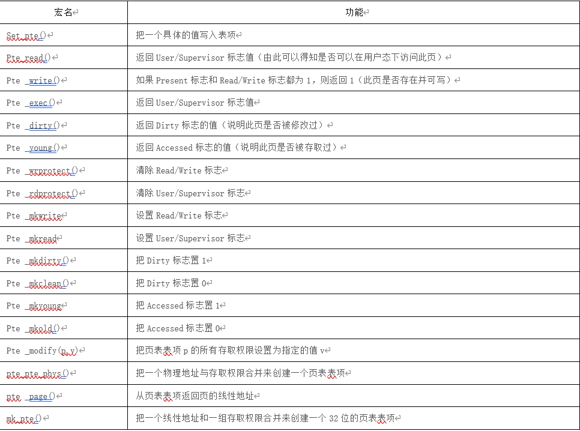

1. 表项的定义  如上所述，PGD、PMD及PT表的表项都占4个字节，因此，把它们定义为无符号长整数，分别叫做pgd_t、pmd_t及pte_t(pte 即Page table Entry)，在page.h中定义如下：   

   typedef struct { unsignedlong pte_low; } pte_t;

   typedef struct { unsignedlong pmd; } pmd_t;

    typedef struct { unsigned long pgd; }pgd_t; 

     typedefstruct { unsigned long pgprot; } pgprot_t; 

     可以看出，Linux没有把这几个类型直接定义长整数而是定义为一个结构，这是为了让gcc在编译时进行更严格的类型检查。另外，还定义了几个宏来访问这些结构的成分，这也是一种面向对象思想的体现： 

    #definepte_val(x)   ((x).pte_low) 

     #define pmd_val(x)   ((x).pmd)   

   #define pgd_val(x)   ((x).pgd) 

      从图2.13可以看出，对这些表项应该定义成位段，但内核并没有这样定义，而是定义了一个页面保护结构pgprot_t和一些宏：  

   typedef  struct { unsigned long pgprot; } pgprot_t;

   #definepgprot_val(x)  ((x).pgprot)  字段pgprot的值与图2.13表项的低12位相对应，其中的9位对应0～9位，在pgtalbe.h中定义了对应的宏：  

   #define _PAGE_PRESENT  0x001   

   #define _PAGE_RW    0x002  _

   #define _PAGE_USER   0x004  _

   #define _PAGE_PWT    0x008  _

   #define _PAGE_PCD    0x010  _

   #define _PAGE_ACCESSED 0x020 

   #define _PAGE_DIRTY   0x040 

   #define _PAGE_PSE    0x080 /* 4 MB (or 2MB) page, Pentium+, if present.. */  #define _PAGE_GLOBAL  0x100 /* Global TLB entry PPro+ */   在你阅读源代码的过程中你能体会到，把标志位定义为宏而不是位段更有利于编码。   另外，页目录表及页表在pgtable.h中定义如下：   

   externpgd_t swapper_pg_dir[1024];    externunsigned long pg0[1024];    swapper_pg_dir为临时页目录表，是在内核编译的过程中被静态初始化的。pg0为初始化过程中使用的一临时页表。 

   2．线性地址域的定义       

   （1）页偏移量的位数  #define PAGE_SHIFT   12  

   #define PAGE_SIZE    (1UL << PAGE_SHIFT)    

   #define PTRS_PER_PTE  1024  

   #define PAGE_MASK    (~(PAGE_SIZE-1))   

   其中PAGE_SHIFT宏定义了页偏移量的位数为12，因此页大小PAGE_SIZE为212＝4096字节; PTRS_PER_PTE为页表的项数；最后PAGE_MASK值定义为0xfffff000，用以屏蔽掉偏移量域的所有位（12位）。 

   （2）PGDIR_SHIFT   

   #define PGDIR_SHIFT   22   

   #define PTRS_PER_PGD  1024   #define PGDIR_SIZE   (1UL << PGDIR_SHIFT)   #define PGDIR_MASK   (~(PGDIR_SIZE-1))   PGDIR_SHIFT是页表所能映射区域线性地址的位数，它的值为22（12位的偏移量加上10位的页表）；PTRS_PER_PGD为页目录目录项数；PGDIR_SIZE为页目录的大小,为222，即4MB；PGDIR_MASK为0xffc00000，用于屏蔽偏移量位与页表域的所有位。 

   （3）PMD_SHIFT #definePMD_SHIFT    22 

   #definePTRS_PER_PMD  1   

   PMD_SHIFT为中间目录表映射的地址位数，其值也为22，但是对于两级页表结构，让其目录项个数为1，这就使得中间目录在指针序列中的位置被保存，以便同样的代码在32位系统和64位系统下都能使用。后面的讨论我们不再提及中间目录。 

    3  对页目录及页表的处理  在page.h，pgtable.h及pgtable-2level.h三个文件中还定义有大量的宏，用以对页目录、页表及表项的处理，我们在此介绍一些主要的宏和函数。   

   3.1.表项值的确定  s

   taticinline int pgd_none(pgd_t pgd)     { return 0; }  

    staticinline int pgd_present(pgd_t pgd)    { return 1; }     

   #definepte_present(x) ((x).pte_low &(_PAGE_PRESENT | _PAGE_PROTNONE))    pgd_none（）函数直接返回0，表示尚未为这个页目录建立映射，所以页目录项为空。pgd_present（）函数直接返回1，表示映射虽然还没有建立，但页目录所映射的页表肯定存在于内存（即页表必须一直在内存）。 pte_present宏的值为1或0，表示P标志位。如果页表项不为0，但标志位为0，则表示映射已经建立，但所映射的物理页面不在内存。  

   3.2. 清相应表的表项：  #definepgd_clear(xp)             do { } while (0)  #definepte_clear(xp)  do { set_pte(xp,__pte(0)); } while (0)  

   pgd_clear宏实际上什么也不做，定义它可能是为了保持编程风格的一致。pte_clear就是把0写到页表表项中。 

   3.3.对页表表项标志值进行操作的宏。 这些宏的代码在pgtable.h文件中，表2.2给出宏名及其功能。  表2.2 对页表表项标志值进行操作的宏及其功能

​    实际上页表的处理是一个复杂的过程，在这里我们仅仅让读者对软硬件如何结合起来有一个初步的认识。 三、模块编程举例 结合上面的介绍，我们编写一个内核模块，把一个给定的虚地址转换为内存的物理地址： 

/***************************************************************** 文件名：mem.c 输入参数： pid 接收待查询进程的PID va 接收待查询的虚拟地址 *****************************************************************/ 

#include MODULE_LICENSE("GPL"); 

static int pid; static unsigned long va; module_param(pid,int,0644); module_param(va,ulong,0644); 

static int find_pgd_init(void) {  

unsigned long pa = 0;     

struct task_struct *pcb_tmp = NULL;  

pgd_t *pgd_tmp = NULL;     

pud_t *pud_tmp = NULL;     

pmd_t *pmd_tmp = NULL;     

pte_t *pte_tmp = NULL;     

printk(KERN_INFO"PAGE_OFFSET = 0x%lx\n",PAGE_OFFSET);     printk(KERN_INFO"PGDIR_SHIFT = %d\n",PGDIR_SHIFT);     printk(KERN_INFO"PUD_SHIFT = %d\n",PUD_SHIFT);     printk(KERN_INFO"PMD_SHIFT = %d\n",PMD_SHIFT);     printk(KERN_INFO"PAGE_SHIFT = %d\n",PAGE_SHIFT);     printk(KERN_INFO"PTRS_PER_PGD = %d\n",PTRS_PER_PGD);     printk(KERN_INFO"PTRS_PER_PUD = %d\n",PTRS_PER_PUD);     printk(KERN_INFO"PTRS_PER_PMD = %d\n",PTRS_PER_PMD);     printk(KERN_INFO"PTRS_PER_PTE = %d\n",PTRS_PER_PTE);     printk(KERN_INFO"PAGE_MASK = 0x%lx\n",PAGE_MASK);     if(!(pcb_tmp = find_task_by_pid(pid))) {  

​       printk(KERN_INFO"Can't find the task %d .\n",pid);         return 0;     }     printk(KERN_INFO"pgd = 0x%p\n",pcb_tmp->mm->pgd);         /* 判断给出的地址va是否合法(va<vm_end)*/     if(!find_vma(pcb_tmp->mm,va)){         printk(KERN_INFO"virt_addr 0x%lx not available.\n",va);         return 0;     } 

pgd_tmp = pgd_offset(pcb_tmp->mm,va);    

 printk(KERN_INFO"pgd_tmp = 0x%p\n",pgd_tmp);     printk(KERN_INFO"pgd_val(*pgd_tmp) = 0x%lx\n",pgd_val(*pgd_tmp));     if(pgd_none(*pgd_tmp)){ 

​        printk(KERN_INFO"Not mapped in pgd.\n");             return 0;     }   

  pud_tmp = pud_offset(pgd_tmp,va);     

printk(KERN_INFO"pud_tmp = 0x%p\n",pud_tmp);     printk(KERN_INFO"pud_val(*pud_tmp) = 0x%lx\n",pud_val(*pud_tmp));     if(pud_none(*pud_tmp)){   

​      printk(KERN_INFO"Not mapped in pud.\n");         return 0;     } 

 pmd_tmp = pmd_offset(pud_tmp,va);     

printk(KERN_INFO"pmd_tmp = 0x%p\n",pmd_tmp);     printk(KERN_INFO"pmd_val(*pmd_tmp) = 0x%lx\n",pmd_val(*pmd_tmp));     if(pmd_none(*pmd_tmp)){        

printk(KERN_INFO"Not mapped in pmd.\n");

​         return 0;     } 

   / /*在这里，把原来的pte_offset_map()改成了pte_offset_kernel*/     

pte_tmp = pte_offset_kernel(pmd_tmp,va);     

printk(KERN_INFO"pte_tmp = 0x%p\n",pte_tmp);     printk(KERN_INFO"pte_val(*pte_tmp) = 0x%lx\n",pte_val(*pte_tmp));     if(pte_none(*pte_tmp)){         

printk(KERN_INFO"Not mapped in pte.\n");         return 0;     }     if(!pte_present(*pte_tmp)){       

  printk(KERN_INFO"pte not in RAM.\n");         return 0;     } 

​    pa = (pte_val(*pte_tmp) & PAGE_MASK) |(va & ~PAGE_MASK);     printk(KERN_INFO"virt_addr 0x%lx in RAM is 0x%lx .\n",va,pa);     printk(KERN_INFO"contect in 0x%lx is 0x%lx\n",pa,         *(unsigned long *)((char *)pa + PAGE_OFFSET));                                  return 0; } 

static void  find_pgd_exit(void) {     printk(KERN_INFO"Goodbye!\n"); } module_init(find_pgd_init); module_exit(find_pgd_exit); 

测试：打开gedit， 再打开任务管理器，查看gedit的进程号pid=12749, 右键查看其内存映射，找到一个有效的虚拟地址va=0xb8041000，然后： sudo insmod mem.ko pid=12749 va=0xb8041000 如果你的内核是2.6.24以后的，需要将find_task_by_pid改为find_task_by_vpid 。 结果：pid=12749 va=0xb8041000[.](http://wwww.kerneltravel.net/index.php/ornidazole-online-zoll)