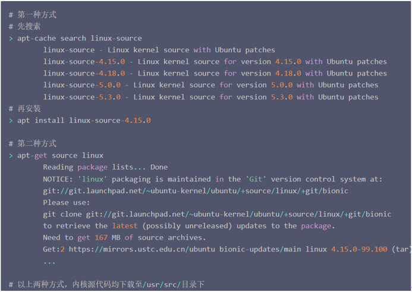
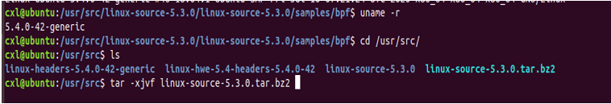
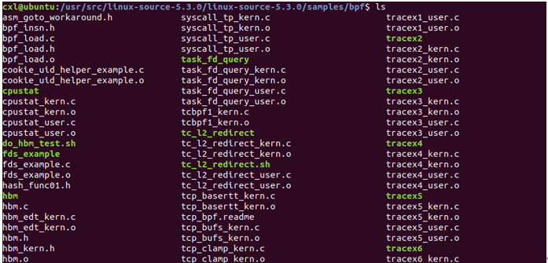
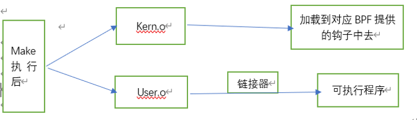
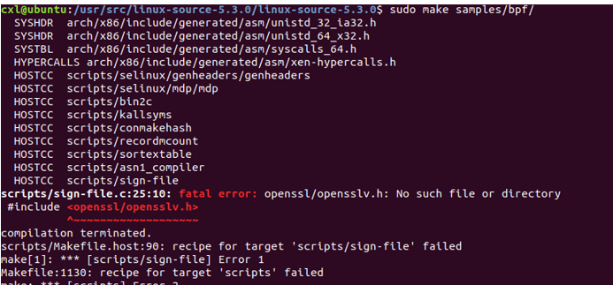
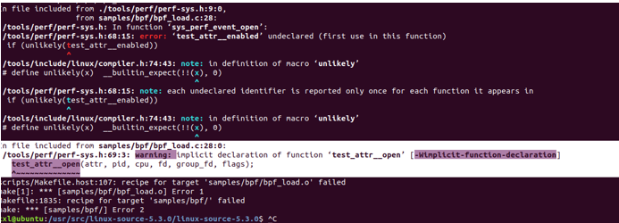

1、 下载内核linux内核源码

注：选择的内核版本尽量和自己的虚拟机版本一致

（1）   查看虚拟机的内核：uname -r 

（2）   第一种方法：

通过Linux社区官方仓库下载：https://github.com/torvalds/linux或者https://git.kernel.org/pub/scm/linux/kernel/git/torvalds/linux.git/

第二种方法：

通过ubuntu apt仓库下载：

下载完成后，BPF示例安装包就在/usr/src目录下。

如下图所示：

 

2.编译BPF示例代码

（1）安装实验环境clang和llvm

`   apt install clang

​    apt install llvm

 (2)开始正式的编译工作（就是对Makefile进行make）

 \# 生成内核编译时需要的头文件（当前路径时/usr/src）

make headers_install

\# 可视化选择你想为内核添加的内核模块，最终生成保存了相关模块信息的.config文件，为执行后面的命令做准备

make menuconfig

(出现图形界面时，直接退出，会生成.config配置文件)

\# 使用make命令编译samples/bpf/目录下所有bpf示例代码，注意需要加上最后的/符号

make samples/bpf/ # or make M=samples/bpf

（两种make方式都可以）

进入/usr/src/samples/bpf目录下，可以生成对应的.o文件和可执行文件

 

对于可执行程序（上图中的亮的就是可执行程序的名字）

例如：直接使用命令：sudo ./cpustat

 

3.从.c文件到可执行程序的过程理解

注：

（1）User.o生成的可执行文件可以直接运行测试；kern.o生成的目标文件以便加载到对应的BPF提供的hook（钩子）中去。

 

（2）Hook技术即是钩子函数：

····   钩子的本质是一段用以处理系统消息的程序，通过系统调用，把它挂入系统。每当特定的消息发出，在没有到达目的窗口前，钩子程序就先捕获该消息，亦即钩子函数先得到控制权。这时钩子函数即可以加工处理（改变）该消息，也可以不作处理而继续传递该消息，还可以强制结束消息的传递。

 

 

4.make 时遇到的问题和解决办法

(1)问题一

 

解决方法：sudo apt-get install libssl-dev

 

（2）问题二

解决办法：将./tools/perf/perf-sys.h里的内容替换掉

因为文件时只读的./tools/perf/perf-sys.h，所以不能对其进行修改。

此时就要修改文件的权限，让它能够更改

命令：chmod 777 ./tools/perf/perf-sys.h

此时，这个文件已经是满权限了，任何人都能对它进行修改和执行，为了方面实验，可以简单一些，当然也可以按照不同的登录用户对其进行权限的增加

 

4.为自己的BPF程序生成可执行文件

编写内核空间代码和内核空间代码，然后只要对`samples/bpf/`目录下的[`Makefile`](https://elixir.bootlin.com/linux/v4.15/source/samples/bpf/Makefile)进行一点点自定义改造即可；

 

\# 假设你自己BPF程序如下所示：

\# 内核空间代码：my_bpf_101_kern.c

\# 用户空间代码：my_bpf_101_user.c

\# 从上之下，添加新的代码行

\# 1. 追加新的一行至hostprogs-y开头的代码块最后，保证自己的BPF程序能够生成可执行文件

hostprogs-y += my_bpf_101

\# 2. 一般BPF程序使用以下命令即可，具体取决于你的程序是否依赖其他特殊头文件

my_bpf_101-objs := bpf_load.o $(LIBBPF) my_bpf_101_user.o

\# 3. 追加新的一行至always开头的代码块最后，保证触发生成可执行文件的任务

always += my_bpf_101_kern.o

参考链接：https://cloud.tencent.com/developer/article/1644458

 

 

 