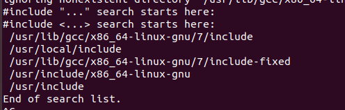

一、C/C++头文件路径

方法1：#include<...>

方法2：#include"..."

方法1、2的区别：

（1）方法1一般会优先搜索 -I 选项后的头文件路径（即用gcc编译时的-I选项），之后就是标准的系统头文件路径。  

（2）方法2是从当前的目录来搜索，若当前目录没有，就会出错，比较容易实现

例如：

#示例，会优先从/home/cxl/include路径去搜索#include <xxx.h>的头文件
gcc foo.c -I/home/cxl/include -o foo

方法3：在gcc命令或者Makefile文件中，使用 -I 来设置头文件的路径

方法4：设置环境变量。

（1）在当前用户目录下，设置环境变量，只针对当前用户有效。

vim .bash_profile 或者 .bashrc：

export C_INCLUDE_PATH=$C_INCLUDE_PATH:头文件路径  //C语言

export CPLUS_INCLUDE_PATH=$CPLUS_INCLUDE_PATH:头文件路径   //C++

（2）设置全局环境变量，对所有用户生效，需要root权限。

vim /etc/profile

注意：如果当前用户设置了同样的环境变量，那么将屏蔽掉相同名称的全局环境变量的作用域。

二、linux系统标准头文件的路径

一般为：/usr/include和/usr/local/include

再真正的使用过程中，可以使用cpp -v命令查看标准的头文件路径，

结果如下：

除了系统默认的include路径外，就是设置上面的 C_INCLUDE_PATH 和 CPLUS_INCLUDE_PATH 环境变量来添加标准系统头文件路径。

三、链接库文件的路径

1.系统默认的链接库文件的路径有：

/lib      /usr/lib    /usr/local/lib   (对于64位的库，则是以lib64开头的)

2.设置链接库文件的路径

（1）在环境变量中添加。

全局设置：/etc/profile

当前用户设置：.bash_profile或者.bashrc

动态链接库搜索路径：

export LD_LIBRARY_PATH=$LD_LIBRARY_PATH:库文件路径

静态链接库搜索路径：

export LIBRARY_PATH=$LIBRARY_PATH:库文件路径

<注意> 当通过上述环境变量指定多个动态库搜索路径时，路径之间用冒号 ":" 分隔。

以上修改可以直接在Linux命令行输入（一次性），也可以在/etc/profile中完成（对所有用户生效），也可以在~/.bash_profile或者~/.bashrc中添加（针对某个用户生效），修改完成后，使用source命令使修改立即生效。

（2）在 /etc/ld.so.conf 中添加指定的链接库搜索路径（需要root权限），然后运行 /sbin/ldconfig 命令，以达到刷新 /etc/ld.so.cache 的效果。ldconfig 命令的作用就是将 /etc/ld.so.conf 指定的路径下的库文件缓存到 /etc/ld.so.cache 。因此当安装完一些库文件(例如刚安装好glib)，或者修改ld.so.conf增加新的库路径后，需要运行一下/sbin/ldconfig 使所有的库文件都被缓存到ld.so.cache中，不然修改的内容就等于没有生效。

（3）在编译程序的链接阶段，除了上面两种设置链接库的搜索路径方式之外，还可以通过 -L 和 -l 参数显式指定。因为用 -L 设置的路径将被优先搜索，所以在链接的时候通常都会以这种方式直接指定要链接的库的路径。

例如：

#添加动态链接库搜索路径
gcc foo.c -L/home/xiaowp/lib -lfoo -o foo

#添加静态链接库搜索路径
gcc foo.c -L/home/xiaowp/lib -static -lfoo -o foo

但是如果没有-L参数，只有-I参数，例如：-lssl、-lpthread等，即没有通过 -L 参数指定链接库的搜索路径，就会按照下面的搜索顺序去查找：

<1>通过环境变量LD_LIBRARY_PATH指定动态库搜索路径

<2>配置文件/etc/ld.so.conf中指定的动态库搜索路径；

<3>默认的动态库搜索路径/lib；

<4>默认的动态库搜索路径/usr/lib。

3、链接库文件的搜索路径顺序（从上到下，依次执行）

（1） 编译目标代码时指定的动态库搜索路径，即 -L 参数后面设置的搜索路径；

（2）环境变量LD_LIBRARY_PATH指定的动态库搜索路径；

（3）配置文件 /etc/ld.so.conf 中指定的动态库搜索路径；

（4）默认的动态库搜索路径/lib；

（5）默认的动态库搜索路径/usr/lib；

（6）默认的动态库搜索路径 /usr/local/lib。

4、使用pkg-config来生成三方库的链接参数

现在很多新的开发包一般都使用 pkg-config 来生成链接参数，使用 pkg-config --list-all 命令可以列出所有支持的开发包。

//查看glib库的包名

$ pkg-config --list-all|grep glib*
glib-2.0  GLib - C Utility Library

pkg-config的用法：pkg -config <pkgName> --libs --cflags

其中pkgName是三方库的包名。使用gcc编译的时候需要使用(``)符号括起来。

例如：编译glib应用程序

方法1：

gcc -o glist_test glist_test.c -I/usr/local/include/glib-2.0 -I/usr/local/lib/glib-2.0/include -L/usr/local/lib -lglib-2.0

方法2：

gcc `pkg-config glib-2.0 --cflags --libs` glib_test.c -o glib_test