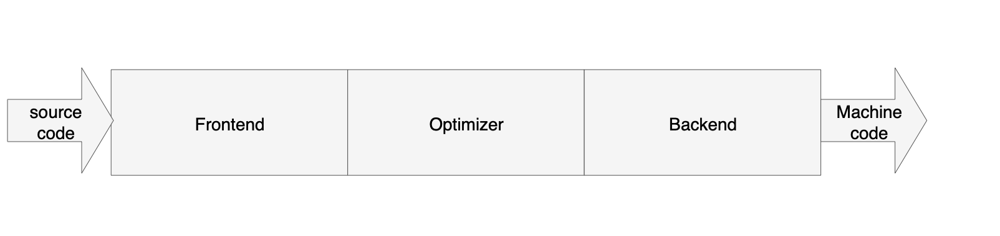
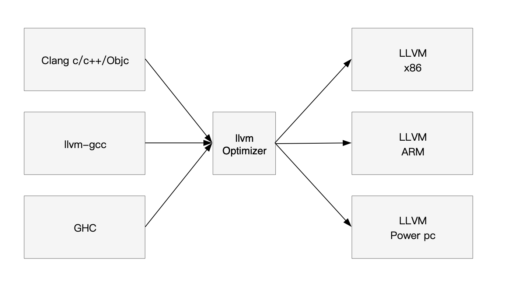
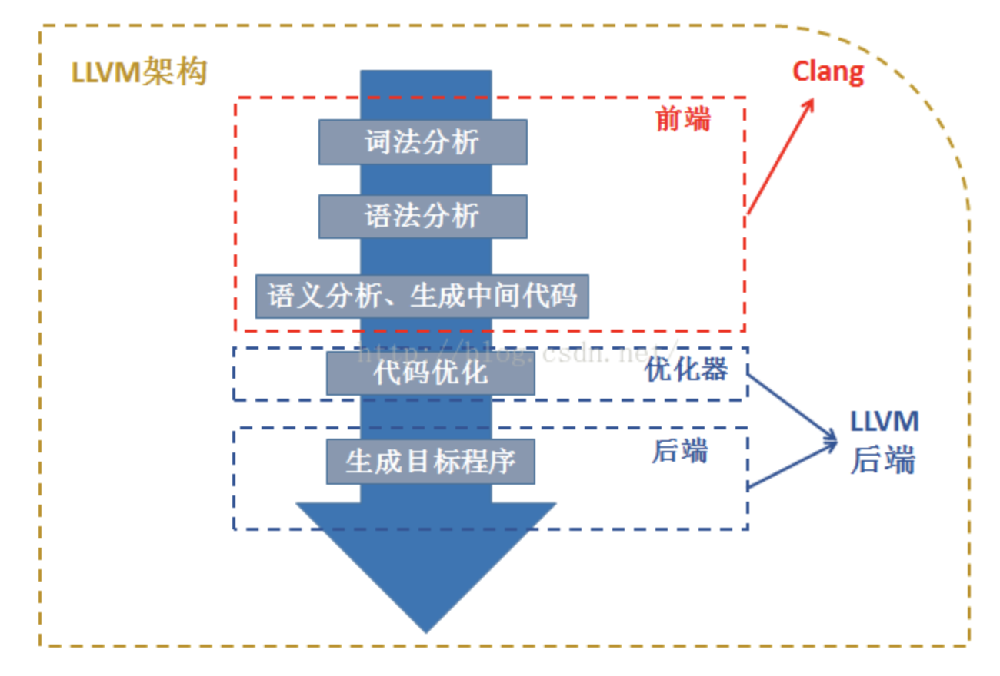
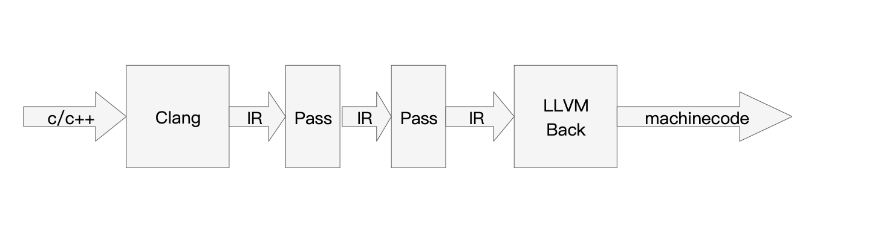

***前言：*** llvm是一款强大的编译器。
# LLVM项目
* ***什么是llvm？*** llvm是模块化、可重用的编译器以及工具链的集合。
* 常见的编译器：
GCC llvm Clang
# 编译器架构



* Frontend：前端。词法分析，语法分析，生成中间代码。
* Optimizer：优化器。中间代码优化。
* Backend：后端。生成机器码。
# LLVM架构



* 不同语言前端用的编译器不同，不同前端后端使用统一的中间代码（LLVM IR）。
* 若想支持一种新的编程语言，只需要实现一个新的前端。
* 若想支持一种新的硬件设备，只需要实现一个新的后端。

# Clang
LLVM的子项目，基于LLVM架构的c、c++、oc编译器前断。

官网：http://clang.llvm.org/

# Clang与LLVM
***下图为LLVM框架：***



如下图所示，C语言代码经过Clang编译后进行优化最终生成目标机器码：



# 搭建LLVM环境
## 1.LLVM源码下载
* 下载LLVM
```
git clone https://git.llvm.org/git/llvm.git/
```
* 下载Clang
```
cd llvm/tools
git clone https://git.llvm.org/git/clang.git/
```
## 2.源码编译
注意： 内存给8G，磁盘大小给40G以上
* 安装cmake
```
sudo apt install cmake

cd ..
mkdir build
cd build//编译的内容全在这里
```
* 编译
```
cmake .. -DLLVM_TARGETS_TO_BUILD="BPF;X86"
//交叉编译
cmake .. -DCMAKE_OSX_ARCHITECTURES="armv7;armv7s;arm64"
```
 ***注意cmake参数：*** 

变量|目的
-|-
CMAKE_C_COMPILER|告诉使用cmake哪个C编译器。默认情况下，它是/ usr / bin / cc。
CMAKE_CXX_COMPILER|告诉cmake要使用的C ++编译器。默认情况下，它是/ usr / bin / c ++
CMAKE_BUILD_TYPE|告诉cmake您要生成文件的构建类型。有效选项是Debug，Release，RelWithDebInfo和MinSizeRel。默认为调试
CMAKE_INSTALL_PREFIX|指定运行构建文件的安装操作时要定位的安装目录
PYTHON_EXECUTABLE|通过将路径传递给Python解释器，强制CMake使用特定的Python版本。默认情况下，使用PATH中解释器的Python版本
LLVM_TARGETS_TO_BUILD|以分号分隔的列表控制将构建哪些目标并将其链接到llvm中。默认列表定义为 LLVM_ALL_TARGETS，可以设置为包括树外目标。默认值包括： 。AArch64, AMDGPU, ARM, BPF, Hexagon, Mips, MSP430, NVPTX, PowerPC, Sparc, SystemZ, X86, XCore
LLVM_ENABLE_DOXYGEN|	从源代码构建基于doxygen的文档默认情况下，此功能处于禁用状态，因为它运行缓慢且会产生大量输出。
LLVM_ENABLE_PROJECTS|以分号分隔的列表，用于选择要另外构建的其他LLVM子项目。（仅在使用并行项目布局（例如通过git）时有效）。默认列表为空。可以包括：clang，libcxx，libcxxabi，libunwind，lldb，compiler-rt，lld，poly或debuginfo-tests。
LLVM_ENABLE_SPHINX|从源代码构建基于sphinx的文档。默认情况下禁用此选项，因为它速度慢并且会生成大量输出。推荐使用Sphinx 1.5或更高版本。
LLVM_BUILD_LLVM_DYLIB|生成libLLVM.so。该库包含一组默认的LLVM组件，这些组件可以用覆盖LLVM_DYLIB_COMPONENTS。默认值包含大部分LLVM，并在中定义 tools/llvm-shlib/CMakelists.txt。该选项在Windows上不可用。
LLVM_OPTIMIZED_TABLEGEN|生成在LLVM构建过程中使用的发布表gen。这可以大大加快调试速度。

* 安装
```
make -j $（getconf _NPROCESSORS_ONLN)
```
(未完待续......)
