Linux内核之旅开源社区的社区负责人梁金荣和社区项目负责人赵晨雨参与开源软件供应链点亮计划暑期 2020 项目活动的直播。

今天我为大家介绍一下Linux内核之旅开源社区。我们社区是一个完全自由和开放的Linux内核学习者的家园，致力于传播Linux内核知识和开源文化，为Linux内核学习者提供了丰富的资源，并且完全免费、没有广告。Linux内核之旅开源社区以国际开源社区的方式运作，倡导开源精神，践行开放、自由和分享，目的是让更多的人受益，所有人都可以参与到社区的共建中，您是贡献者，也是受益者。

咳咳，敲重点，让我们先康康强大的社区资源和参与方式叭！

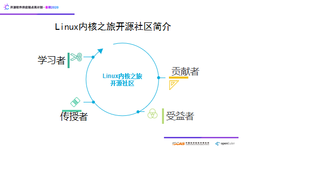

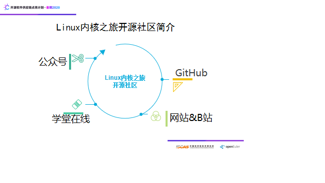

目前我们以开源社区和开源项目的方式培养学生，学生在毕业之后也会对社区有一个持续的回馈，形成一个很好的正向力量。

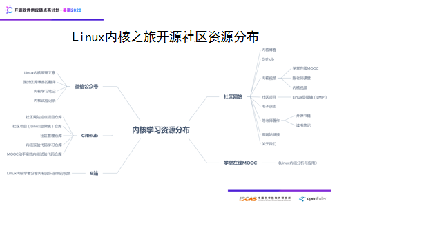

社区资源主要分布在社区网站、微信公众号、学堂在线mooc平台、Github 和 B站。

1、Linux内核之旅开源社区网站

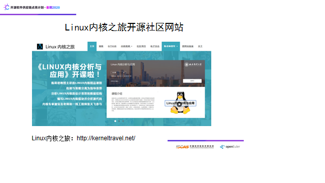

网站始建于2004年，重构于2020年，是社区资源的承载输出子平台，提供了内核博客、Github、内核视频、社区项目、电子杂志、陈老师著作、原网站链接等资源的传送门，涵盖陈莉君老师的开源书籍、读书笔记、学校课堂内核教学完整录制视频等资源。内核学习者可以在这里找到您想要的资源，您还可以进行投稿，您甚至可以优化我们的网站，详细参与方式在网站博客中可以找到。

2、Linux内核之旅微信公众号

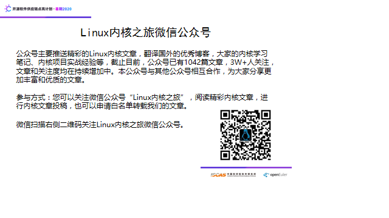

本公众号主要推送精彩Linux内核文章，翻译的国外优秀博客，大家的学习笔记等，截止目前，公众号已有1042篇文章，3W+人关注，文章和关注度均在持续增加中。本公众号与其他公众号合作，为大家分享更加丰富的优质文章。

参与方式：您可以关注微信公众号“Linux内核之旅”阅读精彩内核文章，进行内核文章投稿，也可以申请白名单转载我们的文章

3、Linux内核之旅开源社区的Github平台

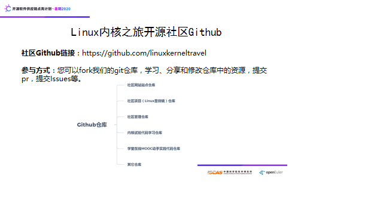

社区Github主要仓库有：社区网站站点项目仓库、社区项目（Linux显微镜）仓库、社区管理仓库、内核实验代码学习仓库、学堂在线mooc《Linux内核分析与应用》中的动手实践内核实验代码仓库

参与方式：您可以fork我们的git仓库，学习、分享和修改仓库中的资源，提交pr，提交Issues等。

4、Linux内核视频

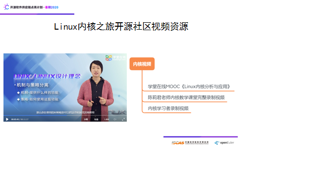

社区的内核学习视频资源主要有三部分，且完全免费，这些资源在社区网站内核视频菜单下均有链接：

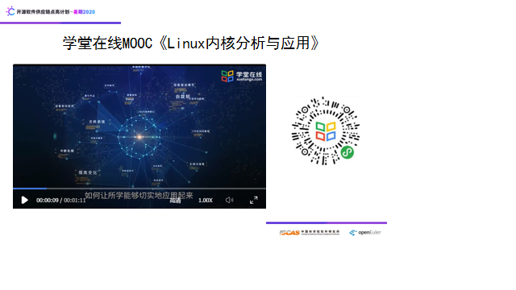

（1）学堂在线MOOC《Linux内核分析与应用》

本课程由西邮陈莉君教授主讲，陈老师以自己20年来对Linux内核的研究和教学为基础，对所讲内容进行有效的归纳，以机制与策略分离为指导思想，对Linux内核的设计思想和数据结构进行分析，让大家在每一章学习后，通过编写Linux内核模块并分析源代码，引领大家进入Linux内核的大门。同时邀请内核专家谢宝友老师和一线工程师张天飞，分享多年企业一线的内核实战经验，让你在动手实践的同时，能够一以贯之，从理论到实践，从实践到理论，打通知识之间的脉络，掌握系统级软件设计的思路和方法。

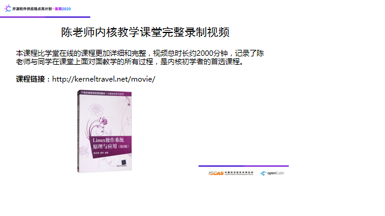

（2）陈老师内核教学课堂完整录制视频

  本课程比学堂在线的课程更加详细和完整，视频总时长约2000分钟，记录了陈老师与同学在课堂上面对面教学的所有过程，是内核初学者的首选课程。

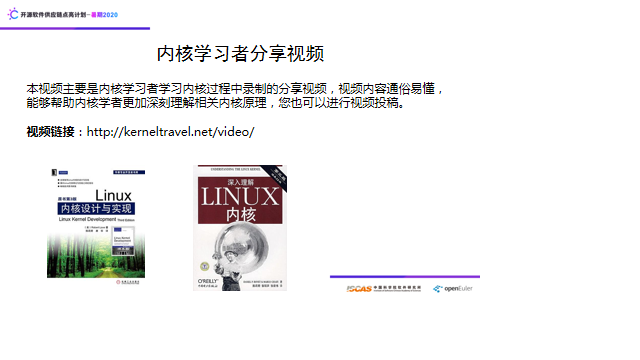

（3）内核学习者录制视频

  本视频主要是内核学习者学习内核过程中录制的分享视频，视频内容通俗易懂，能够帮助内核学者更加深刻理解相关内核原理，您也可以进行视频投稿.

下面为大家介绍社区项目。

我们Linux内核之旅社区项目名称是Linux显微镜，简称LMP，项目创立于2020年4月，是一个很年轻的项目，项目致力于推广Linux内核BPF技术，把用户态编程和内核态编程打通，为性能优化，系统安全，深入调试打造一个可视化平台。项目提供一个平台，让更多的人可以使用你自己的BPF程序；（！！！！！！！！！）

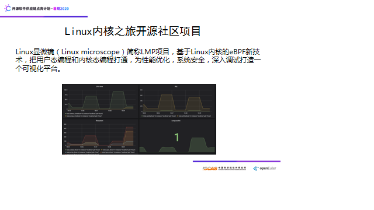

介绍BPF：什么是BPF，我做一个简要介绍，BPF是一个运行在OS内部的高性能虚拟机。自创建以来，它已被用作内核空间中的数据包过滤的标准方法，最著名的BPF客户端可能是TCPdump，BPF有两大目标，1让非内核开发人员安全和轻松地修改内核行为，2使BPF易于使用。

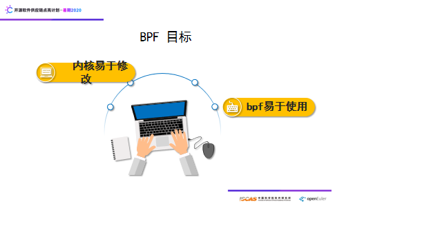

BPF还提供了在用户和内核空间之间进行通信的新方法，并调用BPF程序中的内核API。BPF maps 是在用户空间和内核空间之间共享数据的通用数据结构。典型的用法是使内核更新 maps 内部的某些值)，用户空间程序拾取该改变。BPF helper 是一个特殊的调用来桥接BPF程序和内核API。新添加的调用指令可用于触发预定义的BPF helper，通常将内核API打包用来实现不能通过BPF指令本身实现的某些功能。BPF还包括 verifier，其通过定向非循环图(DAG)来检查给定BPF程序的安全性，目的是确保BPF程序不能影响内核的完整性。

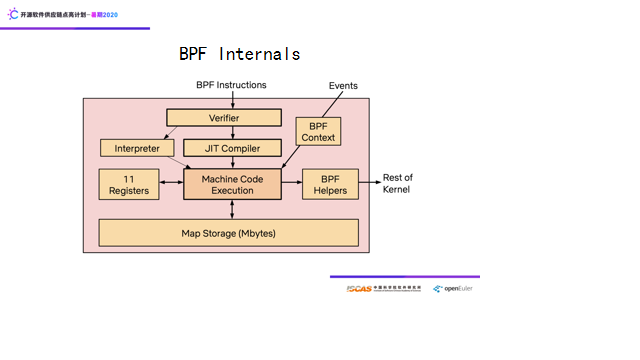

BPF使用一种新的程序状态模型，由事件触发，而不是传统的进程状态模型；基于这个状态模型，可以设计出基于事件的应用程序，BPF甚至可以使Linux内核微内核化。BPF的用途很多，例如容器安全、网络包过滤、系统可观测等等。现在也有很多BPF的开源项目，这是BPF现有的一些项目。

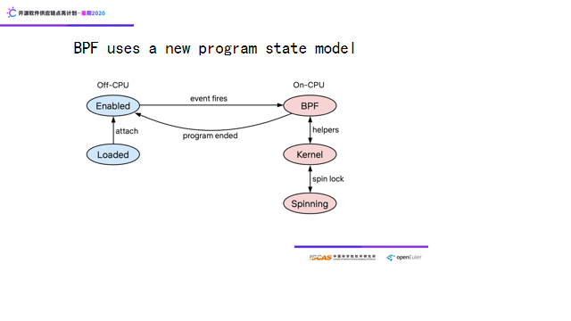

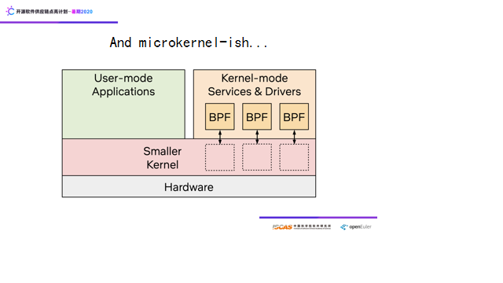

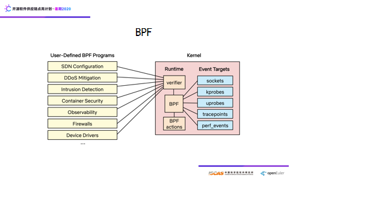

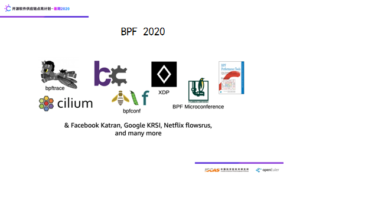

**介绍LMP：**目前LMP关注应用、系统性能数据的可观测性，基于BCC项目（BPF前端），实现云端应用、系统性能数据的提取和展示。目前LMP项目的性能数据提取中，涉及Linux内核各个子系统，例如：进程管理、文件系统，这是LMP项目目前的架构图，包括web部分和BPF部分。在参与LMP项目的过程中，可以学习到Linux内核各个子系统中关键代码的执行原理，性能的背景知识，以及web开发，体验到使用BPF来学习Linux内核的乐趣。

介绍目前的展示效果：这是目前LMP项目部分指标的展示效果，使用grafana，目前提取了Linux内核进程管理、文件系统方面的指标，我们后期也会继续努力，完善项目。

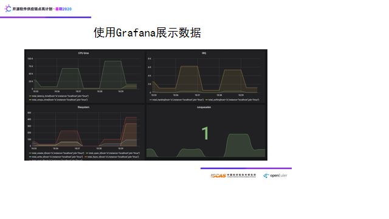

项目未来：项目的未来设想是彻底把用户态编程和内核态编程打通，为性能优化，系统安全，深入调试打造一个可视化平台

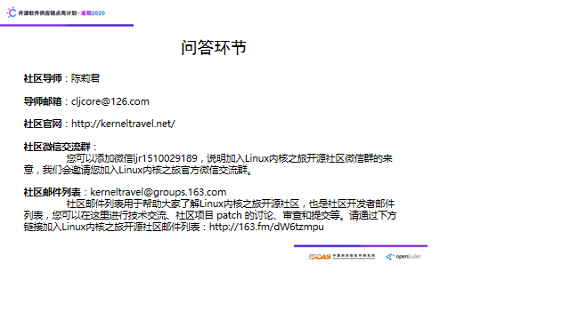

项目相关问题：

1、我应该怎么参与到Linux内核之旅开源社区中呢？

好，谢谢主持人。这个问题问得好，Linux内核之旅开源社区致力于传播Linux内核知识和开源文化，并以开源社区和开源项目的方式教授Linux内核知识，我们社区所有的学习资源都是免费的，连广告都没有。您可以访问我们的网站，那里就有所有资源的传送门，您还可以关注我们的微信公众号“Linux内核之旅”，一直在更新优质的内核文章。

参与Linux内核之旅开源社区的话，您可以参与我们的社区项目，或者给我们投稿内核文章，有问题发邮件列表，您还可以fork我们的内核学习的git仓库，添加一些内容，改一改我们的代码，然后给我们社区提交pr，提交Issues，或者在github的wiki区和我们互动。参与开源，并不一定做什么大事，你觉得这个README的这句话不通顺，你给他改一改，提交了，都可以的，也是对开源社区的贡献。更加详细的参与方式，可以在我们网站找到。好，谢谢。

2、Ebpf和传统性能观测工具的区别是什么？

传统工具的数据来源主要来自于proc文件系统，它所收集的数据是工具预先定好的，你想要的未必能得到，也就是一种粗粒度的系统数据展示，而BPF是一种技术，也是一种机制，它不是工具，你自己可以在用户态写代码修改内核或者从中抓取内核中细粒度的数据，而具体来说，使用BPF可以利用内核中现有的kprobe、tracepoint探针，我们可以自由挂载，提取到完全自定义的数据，而且对数据的输出格式也有很高的操作性，可以按照我们自己的意愿来定。

3、把LPM未来的发展空间是什么？

目前项目的想法是先把数据提取功能做好，让设想的原型跑起来，未来这个平台是一个可插拔的平台，你写的BPF代码可以放到平台，所有人都可以使用，同时通过BPF，打通用户态和内核态学习的屏障，让你在性能优化，系统安全，以及调试方面有深入钻研的余地，充分发挥你的潜力，甚至，你可以参与项目的设计，因为这个项目目前是不设边界的，其可扩展性很大，比如，针对嵌入式设备，针对云平台等等，都是可扩展的，只要社区的bpf技术发展，这个平台就跟随发展。

<u>[点击观看社区直播视频](https://www.bilibili.com/video/BV1Nk4y1z7UL?p=2)</u>

