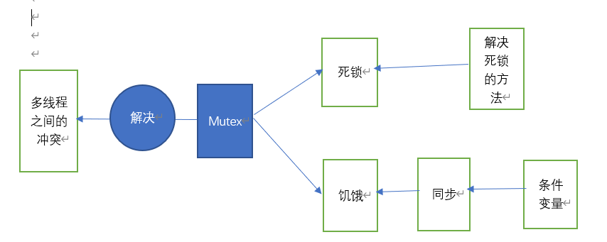
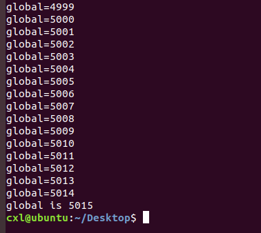
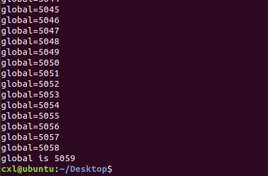
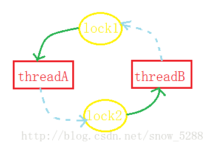

 本文章介绍的主要介绍图：

 

1.多线程举例

程序代码

\#include<stdio.h>

\#include<stdlib.h>

\#include<pthread.h>

int global=0;

void *add(void *)

{

​    int i=5000;

​    while(i--){

​        int tmp=global;

​        printf("global=%d\n",global);

​        global=tmp+1;

   }

}

 int main(){

​    pthread_t t1,t2;

​    pthread_create(&t1,NULL,add,NULL);

​     pthread_create(&t2,NULL,add,NULL);

​    pthread_join(t1,NULL);

​    pthread_join(t2,NULL);

​    printf("global is %d",global);

​    return 0;

}

实验结果一：

实验结果二：

实验结果三：

结论：3次运行结果均不一样，足以说明多线程在同步访问全局变量global时发生了冲突。

2.解决多线程的冲突问题---引入互斥锁

（1）互斥锁：(Mutex,Mutual Exclusive Lock),获得锁的线程可以完成“读-修改-写”的操作,然后释放锁给其它线程,没有获得 锁的线程只能等待而不能访问共享数据,这样“读-修改-写”三步操作组成一个原子操作，要么都执行,要么都不执行,不会执行到中间被打断,也不会在其它处理器上并行做这个操作。 

（2）互斥锁的创建和销毁

1>定义互斥锁

Pthread_mutex_t lock;

2>互斥锁的初始化

如果lock是局部变量—可用初始化函数pthread_mutex_init初始化。

int pthread_mutex_init(pthread_mutex_t *restrict mutex,const pthread_mutexattr_t *restrict attr);

参数说明：mp 互斥锁地址  mattr 属性 通常默认 null

初始化互斥锁之前，必须将其所在的内存清零。

如果互斥锁已初始化，则它会处于未锁定状态。互斥锁可以位于进程之间共享的内存中或者某个进程的专用内存中。

返回值:成功返回0,失败返回错误号。

如果lock是静态或全局变量—可用 **PTHREAD_MUTEX_INITIALIZER**初始化 ，相当于用pthread_mutex_init初始化并且attr参数为NULL。

3>加锁与解锁

int pthread_mutex_trylock(pthread_mutex_t* mutex);*//**非阻塞式加锁*

int pthread_mutex_lock(pthread_mutex_t* mutex)*//**阻塞式加锁*

int pthread_mutex_unlock(pthread_mutex_t* mutex)*//**解锁*

如果一个线程既想获得锁,又不想挂起等待,可以调用pthread_mutex_trylock；如果Mutex已经被 另一个线程获得,这个函数会失败返回EBUSY,而不会使线程挂起等待。

4>销毁锁资源（在加上锁的情况下进行，相当于没加锁资源）

int pthread_mutex_destroy(pthread_mutex_t* mutex);

返回值:成功返回0,失败返回错误号。

（3）代码实现

\#include<stdio.h>

\#include<stdlib.h>

\#include<pthread.h>

int global=0;

pthread_mutex_t lock=PTHREAD_MUTEX_INITIALIZER;

void *add(void *) //函数指针

{    pthread_mutex_lock(&lock);

​    int i=5000;

​    while(i--){

​        int tmp=global;

​        printf("global=%d\n",global);

​        global=tmp+1； }

​    pthread_mutex_unlock(&lock);

}

int main()

{    pthread_t t1,t2;

​    pthread_create(&t1,NULL,add,NULL);

​    pthread_create(&t2,NULL,add,NULL);

​      pthread_join(t1,NULL);

   pthread_join(t2,NULL);

​    printf("global is %d\n",global);

​    return 0;

}

如果没有线程的等待，则线程就不能成功执行

（4）互斥锁的加锁和解锁是原子的

加锁解锁指令必须依赖于一条汇编指令：swap和exchange（原子操作）。大多数体系结构都提供了swap或exchange指令,该指令的作用是把寄存器和内存单元的数据相交换,由于只有一条指令,保证了原子性,即使是多处理器平台,访问内存的总线周期也有先后,一个处理器上的交换指令执行时另一个处理器的交换指令只能等待总线周期。

每个互斥锁都有一个等待队列

原子操作：不可以被中断的一个或者一系列操作

注意：互斥锁的加入可能会引入“饥饿”和死锁问题

（5）死锁：

1）线程自己将自己锁住

一般情况下,如果同一个线程先后两次调用lock,在第二次调⽤用时,由于锁已经被占用,该线程会挂起等待占用锁的线程释放锁,然而锁正是被自己占用着的,该线程又被挂起而没有机会释放锁,因此 就永远处于挂起等待状态了,于是就形成了死锁(Deadlock)

2）多线程抢占锁被困

如线程A获 得了锁1,线程B获得了锁2,这时线程A调用lock试图获得锁2,结果是需要挂起等待线程B释放 锁2,而这时线程B也调用lock试图获得锁1,结果是需要挂起等待线程A释放锁1,于是线程A和B都 永远处于挂起状态了，死锁再次形成。

3）处理死锁的方法

预防死锁、避免死锁、检测死锁、解决死锁

注：可以利用银行家算法避免死锁

（6）饥饿：指一个可运行的进程尽管能继续执行，但被调度程序无限期地忽视，而不能调度执行的情形。可以利用同步机制协调多线程间的饥饿问题。

3 条件变量

（1）   概念：条件变量时描述某些资源就绪与否的状态，为了实现同步而引入。

（2）   条件变量的使用

​	1）创建条件变量

​	Pthread_cond_t condition;

​     2)条件变量的初始化

​           若条件变量是局部的，则通过pthread_mutex_init初始化。

​           int pthread_cond_init(pthread_cond_t *restrict cond,const pthread_condattr_t *restrict attr);

​           若条件变量是静态的或者是全局的使用**PTHEAD_COND_INITIALIZER**初始化。

​           返回值：返回值为0表示正确，其他的结果均为错误。人 

3）条件变量的操作

int pthread_cond_broadcast(pthread_cond_t* cond);//唤醒条件变量等待的所有线程

int pthread_cond_signal(pthread_cond_t* cond)//唤醒条件变量上等待的一个线程

int pthread_cond_wait(pthread_cond_t* cond)//解锁互斥量并等待条件变量触发

int pthread_cond_timewait(pthread_cond_t* cond，int abstime)//pthread_cond_wait，但可设定等待超时

​    注意：pthread_cond_wait 自动解锁互斥量(如同执行了 pthread_unlock_mutex)，并等待条件变量触发； pthread_cond_timedwait与pthread_cond_wait,**区别**在于，如果达到或是超过所引用的参数*abstime,它将结束并返回错误ETIMEDOUT； 当调用pthread_cond_signal时一个在相同条件变量上阻塞的线程将被解锁； pthread_cond_broadcast,则将通知阻塞在这个条件变量上的所有线程。

​       4）销毁条件变量

​       int pthread_cond_destroy(pthread_cond_t* cond);

4.信号量

1）信号量：可以使同一时间段的一个线程访问临界区，用来协调进程对共享资源的访问

2）信号量的工作原理：

由于信号量只能进行两种操作等待和发送信号，即P（vs）和V（vs）

P(sv)：如果sv的值大于零，就给它减1；如果它的值为零，就挂起该进程的执行
 V(sv)：如果有其他进程因等待sv而被挂起，就让它恢复运行，如果没有进程因等待sv而挂起，就给它加1.

3)信号量的使用

1>创建信号量: sem_t sem;

2>初始化信号量：int sem_init(sem_t *sem,int pshared,unsigned int value);

Sem为指向信号量结构的一个指针；

如果Pshared参数为0，表示信号量用于同一进程的线程间同步；

如果`pshared`参数具有非零值,则信号量在进程之间共享; 在这种情况下,任何可以访问信号量的进程都可以利用`*sem*`用于执行 `sem_wait()`,`sem_trywait()`和`sem_post()`,以及`sem_destroy()`操作.

Value给出了信号量的初始值

3>信号量的操作

P操作：

int sem_wait(sem_t *sem);//信号量的P操作

int sem_trywait(sem_t *sem);//信号量的P操作（非阻塞版本）

int sem_timedwait(sem_t *sem, const struct timespec *abs_timeout);//abs_timeout是UTC时间戳

sem_wait()可以获得资源（P操作）,使semaphore的值减1,如果调⽤sem_wait()时
 semaphore的值已经是0,则挂起等待

V操作：

Int sem_post(sem_t *sem);//信号量的V操作

调用sem_post() 可以释放资源（V操作）,使semaphore 的值加1,同时唤醒挂起等待的线程。

4>销毁信号量

Int sem_destroy(sem_t *sem);