文件系统很多操作都会涉及到路径名查找的过程，这几天把这个过程结合源码和搜集的资料大体过了一遍。

nd是一个临时性的数据结构，用来存储遍历路径的中间结果，后边会经常看见到这个结构体
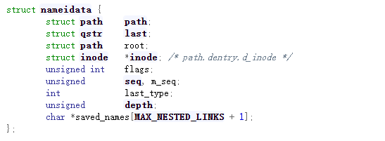

其中，path 保存当前搜索到的路径；
last 保存当前子路径名及其散列值；
root 用来保存根目录的信息；
inode 指向当前找到的目录项的 inode 结构；
flags 是一些和查找（lookup）相关的标志位；
seq 是相关目录项的顺序锁序号； 
m_seq 是相关文件系统（其实是 mount）的顺序锁序号； 
last_type 表示当前节点类型；
depth 用来记录在解析符号链接过程中的递归深度；
saved_names 用来记录相应递归深度的符号链接的路径。

下面从user_path_parent函数开始分析

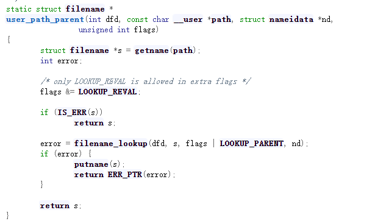

函数返回值是filename类型的，参数分别是系统调用传入的dfd参数，存储在用户空间的path，带填充的nameidata结构体，最后是一个标志位。

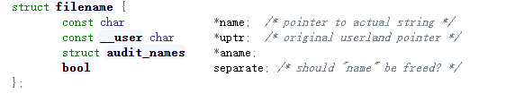

函数user_path_parent函数主要调用了getname函数和filename_loopup函数。

先看getname它调用getname_flags

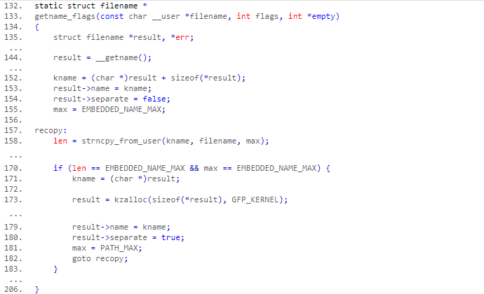

首先通过第 144 行 __getname 在内核缓冲区专用队列里申请一块内存用来放置路径名，其实这块内存就是一个 4KB 的内存页。这块内存页是这样分配的，在开始的一小块空间放置结构体 struct filename，之后的空间放置字符串。152 行初始化字符串指针 kname，使其指向这个字符串的首地址，相当于 kname = (char *)((struct filename *)result + 1)。然后就是拷贝字符串（158），返回值 len 代表了已经拷贝的字符串长度。如果这个字符串已经填满了内存页剩余空间（170），就说明该字符串的长度已经大于 4KB - sizeof(struct filename) 了，这时就需要将结构体 struct filename 从这个内存页中分离（180）并单独分配空间（173），然后用整个内存页保存该字符串（171）。

再看filename_lookup函数，它调用了path_lookupat函数

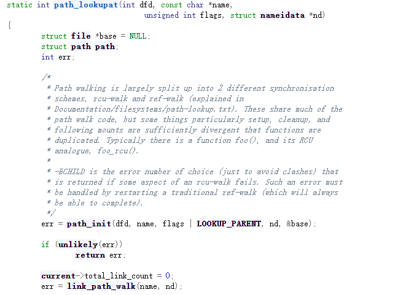

主要经历了俩函数，首先是path_init函数，就是初始化path函数，这个函数就是初始化nameidata，然后是就函数link_path_walk，这个函数是整个路径名查找过程的核心功能实现函数，经过这个函数，我们就找到了路径中的最后一个目录的dentry和inode信息了。

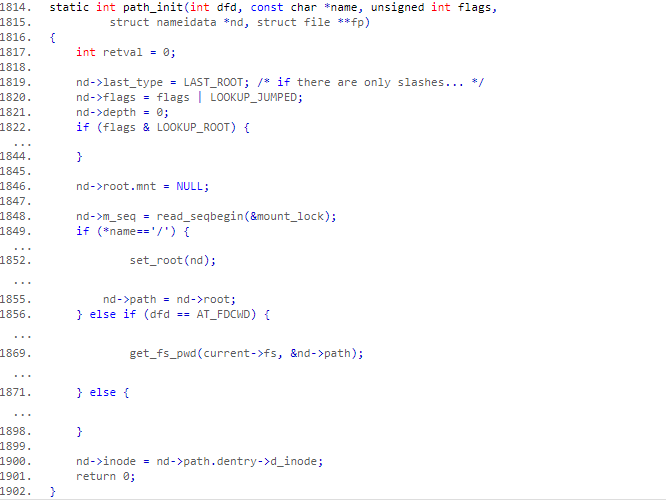

首先将 last_type 设置成 LAST_ROOT，意思就是在路径名中只有“/”。我们把一个路径名分成三部分：起点（根目录或工作目录）、子路径（以“/”分隔的一系列子字符串）和最终目标（最后一个子路径），Kernel 会一个子路径一个子路径的遍历整个路径。所以 last_type 表示的是当前子路径（不是 dentry 或 inode）的类型。

last_type 一共有五种类型：
```c enum {LAST_NORM, LAST_ROOT, LAST_DOT, LAST_DOTDOT, LAST_BIND};```

LAST_NORM 就是普通的路径名；LAST_ROOT 是 “/”；LAST_DOT 和 LAST_DOTDOT 分别代表了 “.” 和 “..”；LAST_BIND 就是符号链接。
LOOKUP_ROOT 可以提供一个路径作为根路径,然后是根据路径名设置起始位置，如果路径是绝对路径（以“/”开头）的话，就把起始路径指向进程的根目录（1849）；如果路径是相对路径，并且 dfd 是一个特殊值（AT_FDCWD），那就说明起始路径需要指向当前工作目录，也就是 pwd（1856）；如果给了一个有效的 dfd，那就需要把起始路径指向这个给定的目录（1871）。
path_init 返回之后 nd 中的 path 就已经设定为起始路径了，现在可以开始遍历路径了。

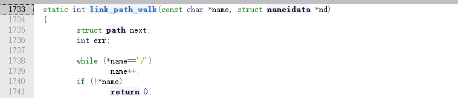

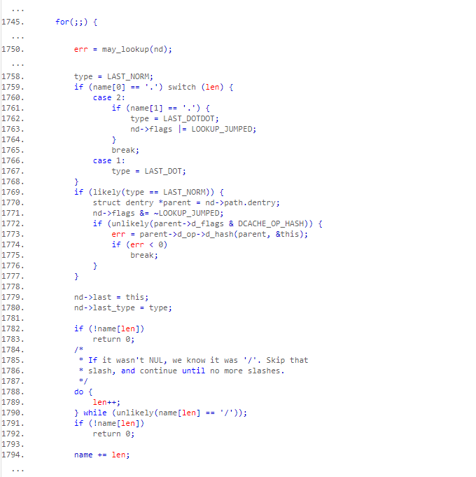

首先是例行安全检查（1750），然后就看子路径名是否是“.”或“..”并做好标记（1759-1768）。如果不是“.”或“..”那么这就是一个普通的路径名，此时还要看看这个当前目录项是否需要重新计算一下散列值（1772）。现在可以先把子路径名更新一下（1779），如果此时已经到达了最终目标，那么“路径行走”的任务就完成了（1782 和 1791）。如果路径还没到头，那么现在就一定是一个“/”，再次略过连续的“/”（1790）并让 name 指向下一个子路径（1794），为下一次循环做好了准备。

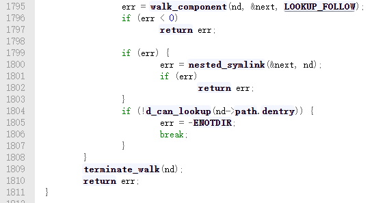

到这时候name存的是中间节点

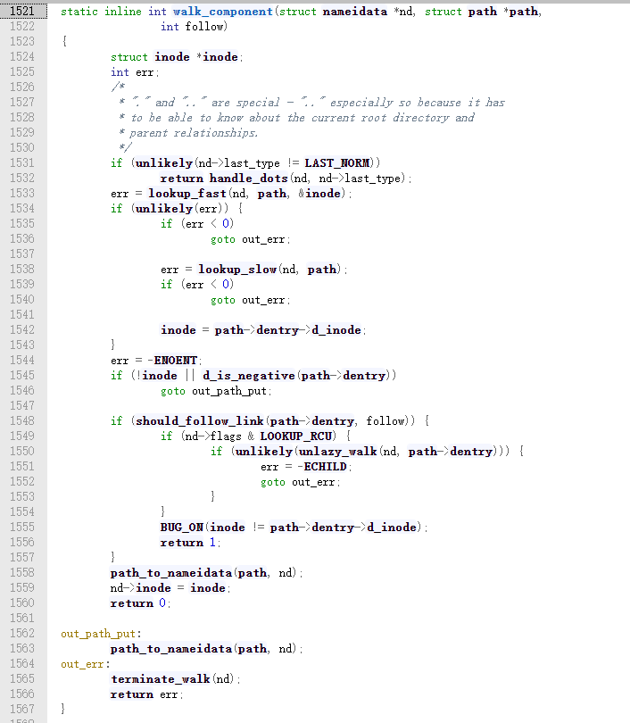

对于这个子路径可以分成三种情况，第一，它可能是“.”或“..”；第二，这就是一个普通的目录；第三，它是一个符号链接。

如果当前的目录是一个普通目录，路径行走有两个策略：先在效率高的rcu-walk模式下“行走”，如果失败了就在效率较低的ref-walk模式下“行走。lookup_fast函数应该就是指的两个查找策略，先调用lookup_fast，当返回值大于0的时候，才会调用lookup_slow函数，ref-walk模式并不是一定可以找到的，有可能也会失败。
在 ref-walk 模式下会首先在内存缓冲区查找相应的目标（lookup_fast），如果找不到就启动具体文件系统自己的 lookup 进行查找（lookup_slow）。

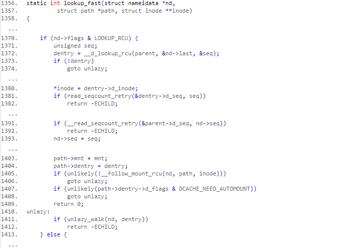

首先调用 __d_lookup_rcu 在内存中的某个散列表里通过字符串比较查找目标 dentry，如果找到了就返回该 dentry；如果没找到就需要跳转到 unlazy 标号处（1374），在这里会使用 unlazy_walk 就地将查找模式切换到 ref-walk，ref模式的fast查找还是在内核缓冲区查找相应的dentry，和上述过程类似

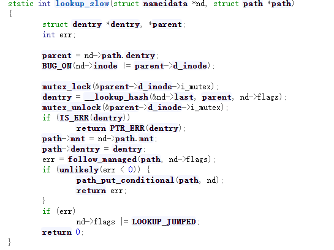

这种查找是互斥操作，进程可能会阻塞。而且_lookup_hash函数还是再会回到dcache中在找一遍，如果没有找到的话就调用文件系统自己的lookup函数从头开始找，所以这种方式比lookup_fast方式比起来慢多了。