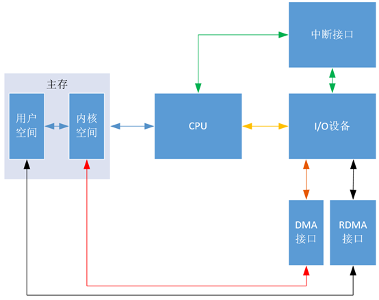

 我们先从计算机组成原理的层面介绍DMA，再简单介绍Linux网络子系统的DMA机制是如何的实现的。


##### 一、计算机组成原理中的DMA

> 以往的I/O设备和主存交换信息都要经过CPU的操作。不论是最早是轮询方式，还是我们学过的中断方式。虽然中断方式相比轮询方式已经节省了大量的CPU资源。但是在处理大量的数据事，DMA相比中断方式进一步解放了CPU。

DMA就是Direct Memory Access，意思是I/O设备直接存储器访问，几乎不消耗CPU的资源。在I/O设备和主存传递数据的时候，CPU可以处理其他事。

###### 1. I/O设备与主存信息传送的控制方式

I/O设备与主存信息传送的控制方式分为程序轮询、中断、DMA、RDMA等。

先用“图1”大体上说明几种控制方式的区别，其中黄线代表程序轮询方式，绿线代表中断方式，红线代表DMA方式，黑线代表RDMA方式，蓝线代表公用的线。可以看出DMA方式与程序轮询方式还有中断方式的区别是传输数据跳过了CPU，直接和主存交流。

“图1”中的“接口”既包括实现某一功能的硬件电路，也包括相应的控制软件，如 “DMA接口” 就是一些实现DMA机制的硬件电路和相应的控制软件。

“DMA接口”有时也叫做“DMA控制器”（DMAC）。




```
                      					图1 
```

上周分享“图1”时，刘老师说在DMA方式下， DMA控制器（即DMA接口）也是需要和CPU交流的，但是图中没有显示DMA控制器与CPU交流信息。但是这张图我是按照哈工大刘宏伟老师的《计算机组成原理》第五章的内容画出的，应该是不会有问题的。查找了相关资料，觉得两个刘老师都没有错，因为这张图强调的是数据的走向，即这里的线仅是数据线。如果要严格一点，把控制线和地址线也画出来，将是“图2”这个样子：


```
                                             图2
```

这里新增了中断方式的地址线和控制线、DMA方式的地址线和控制线。（“图2”也是自己绘制，其理论依据参考“图3”，这里不对“图3”进行具体分析，因为涉及底层的硬件知识）

“图2”对“图1”的数据线加粗，新增细实线表示地址线，细虚线表示控制线。可以看出在中断方式下，无论是传输数据、地址还是控制信息，都要经过CPU，即都要在CPU的寄存器中暂存一下，都要浪费CPU的资源；但是在DMA方式下，传输数据和地址时，I/O设备可以通过“DMA接口”直接与主存交流，只有传输控制信息时，才需要用到CPU。而传输控制信息占用的时间是极小的，可以忽略不计，所以可以认为DMA方式完全没有占用CPU资源，这等价于I/O设备和CPU可以实现真正的并行工作，这比中断方式下的并行程度要更高很多。


```
                                     图3
```

###### 2. 三种方式的CPU工作效率比较


​	在I/O准备阶段，程序轮询方式的CPU一直在查询等待，而中断方式的CPU可以继续执行现行程序，但是当I/O准备就绪，设备向CPU发出中断请求，CPU响应以实现数据的传输，这个过程会占用CPU一段时间，而且这段时间比使用程序轮询方式的CPU传输数据的时间还要长，因为CPU除了传输数据还要做一些准备工作，如把CPU寄存器中的数据都转移到栈中。

​	但是DMA方式不一样，当I/O准备就绪，设备向CPU发出DMA请求，CPU响应请求，关闭对主存的控制器，只关闭一个或者几个存取周期，在这一小段时间内，主存和设备完成数据交换。而且在这一小段时间内，CPU并不是什么都不能做，虽然CPU不能访问主存，即不能取指令，但是CPU的cache中已经保存了一些指令，CPU可以先执行这些指令，只要这些指令不涉及访存，CPU和设备还是并行执行。数据传输完成后，DMA接口向CPU发出中断请求，让CPU做后续处理。大家可能会奇怪DMA接口为什么也能发出中断请求，其实DMA接口内有一个中断机构，见“图3”,DMA技术其实是建立在中断技术之上的，它包含了中断技术。

​	总之，在同样的时间内，DMA方式下CPU执行现行程序的时间最长，即CPU的效率最高。


##### 二、Linux网络子系统中DMA机制的实现

###### 1. DMA机制在TCP/IP协议模型中的位置

> 网卡明显是一个数据流量特别大的地方，所以特别需要DMA方式和主存交换数据。

​	主存的内核空间中为接收和发送数据分别建立了两个环形缓冲区（Ring Buffer）
。分别叫接受环形缓冲区（Receive Ring Buffer）和发送环形缓冲区（Send Ring Buffer），通常也叫DMA环形缓冲区。

​	下图可以看到DMA机制位于TCP/IP协议模型中的位置数据链路层。

​	网卡通过DMA方式将数据发送到**Receive Ring Buffer**,然后**Receive Ring Buffer**把数据包传给IP协议所在的网络层，然后再由路由机制传给TCP协议所在的传输层，最终传给用户进程所在的应用层。下一节在数据链路层上分析具体分析网卡是如何处理数据包的。

 

###### 2. 数据链路层上网卡对数据包的处理

​	DMA 环形缓冲区建立在与处理器共享的内存中。每一个输入数据包被放置在环形缓冲区中下一个可用缓冲区，然后发出中断。接着驱动程序将网络数据包传给内核的其它部分处理，并在环形缓冲区中放置一个新的 DMA 缓冲区。

​	驱动程序在初始化时分配DMA缓冲区，并使用驱动程序直到停止运行。


准备工作：

系统启动时网卡（NIC）进行初始化，在内存中腾出空间给 **Ring Buffer** 。**Ring Buffer** 队列每个中的每个元素 **Packet Descriptor**指向一个**sk_buff** ，状态均为**ready**。 

上图中虚线步骤的解释：

- 1.DMA 接口将网卡（NIC）接收的数据包（packet）逐个写入 sk_buff ，被写入数据的 sk_buff 变为 used 状态。一个数据包可能占用多个 sk_buff , sk_buff读写顺序遵循先入先出（FIFO）原则。 
- 2.DMA 写完数据之后，网卡（NIC）向网卡中断控制器（NIC Interrupt Handler）触发硬件中断请求。 
- 3.NIC driver 注册 poll 函数。
- 4.poll 函数对数据进行检查，例如将几个 sk_buff 合并，因为可能同一个数据可能被分散放在多个 sk_buff 中。
- 5.poll 函数将 sk_buff 交付上层网络栈处理。

后续处理：

poll 函数清理 sk_buff，清理 Ring Buffer 上的 Descriptor 将其指向新分配的 sk_buff 并将状态设置为 ready。

###### 3.源码分析具体网卡（4.19内核）

Intel的千兆以太网卡e1000使用非常广泛，我虚拟机上的网卡就是它。


这里就以该网卡的驱动程序为例，初步分析它是怎么建立DMA机制的。

源码目录及文件：


内核模块插入函数在```e1000_main.c```文件中，它是加载驱动程序时调用的第一个函数。

```c
`/**  * e1000_init_module - Driver Registration Routine  *  * e1000_init_module is the first routine called when the driver is  * loaded. All it does is register with the PCI subsystem.  **/ static int __init e1000_init_module(void) { 	int ret; 	pr_info("%s - version %s\n", e1000_driver_string, e1000_driver_version);  	pr_info("%s\n", e1000_copyright);  	ret = pci_register_driver(&e1000_driver); 	if (copybreak != COPYBREAK_DEFAULT) { 		if (copybreak == 0) 			pr_info("copybreak disabled\n"); 		else 			pr_info("copybreak enabled for " 				   "packets <= %u bytes\n", copybreak); 	} 	return ret; }  module_init(e1000_init_module); `
```

该函数所做的只是向PCI子系统注册，这样CPU就可以访问网卡了，因为CPU和网卡是通过PCI总线相连的。

具体做法是，在第230行，通过```pci_register_driver()```函数将```e1000_driver```
这个驱动程序注册到PCI子系统。

```e1000_driver```是```struct pci_driver```类型的结构体，

```c
`static struct pci_driver e1000_driver = { 
.name     = e1000_driver_name, 	
.id_table = e1000_pci_tbl, 	
.probe    = e1000_probe, 	.remove   = e1000_remove, #ifdef CONFIG_PM 	/* Power Management Hooks */ 	.suspend  = e1000_suspend, 	.resume   = e1000_resume, #endif 	.shutdown = e1000_shutdown, 	.err_handler = &e1000_err_handler }; `
```

e1000_driver```里面初始化了设备的名字为“e1000”，


还定义了一些操作，如插入新设备、移除设备等，还包括电源管理相关的暂停操作和唤醒操作。下面是```struct pci_driver```一些主要的域。


对该驱动程序稍微了解后，先跳过其他部分，直接看DMA相关代码。
在```e1000_probe```函数，即“插入新设备”函数中，下面这段代码先对DMA缓冲区的大小进行检查

如果是64位DMA地址，则把```pci_using_dac```标记为1，表示可以使用64位硬件，挂起32位的硬件；如果是32位DMA地址，则使用32位硬件；若不是64位也不是32位，则报错“没有可用的DMA配置，中止程序”。

```c
	/* there is a workaround being applied below that limits
	 * 64-bit DMA addresses to 64-bit hardware.  There are some
	 * 32-bit adapters that Tx hang when given 64-bit DMA addresses
	 */
	pci_using_dac = 0;
	if ((hw->bus_type == e1000_bus_type_pcix) &&
	    !dma_set_mask_and_coherent(&pdev->dev, DMA_BIT_MASK(64))) {
		pci_using_dac = 1;
	} else {
		err = dma_set_mask_and_coherent(&pdev->dev, DMA_BIT_MASK(32));
		if (err) {
			pr_err("No usable DMA config, aborting\n");
			goto err_dma;
		}
	}

```

其中的函数```dma_set_mask_and_coherent()```用于对```dma_mask ```和```coherent_dma_mask```赋值。

```dma_mask```表示的是该设备通过DMA方式可寻址的物理地址范围，```coherent_dma_mask```表示所有设备通过DMA方式可寻址的公共的物理地址范围，

因为不是所有的硬件设备都能够支持64bit的地址宽度。

/include/linux/dma-mapping.h

```c
/*
 * Set both the DMA mask and the coherent DMA mask to the same thing.
 * Note that we don't check the return value from dma_set_coherent_mask()
 * as the DMA API guarantees that the coherent DMA mask can be set to
 * the same or smaller than the streaming DMA mask.
 */
static inline int dma_set_mask_and_coherent(struct device *dev, u64 mask)
{
	int rc = dma_set_mask(dev, mask);
	if (rc == 0)
		dma_set_coherent_mask(dev, mask);
	return rc;
}

```

rc==0表示该设备的```dma_mask```赋值成功，所以可以接着对```coherent_dma_mask```赋同样的值。

继续阅读```e1000_probe```函数，

```c
if (pci_using_dac) {
		netdev->features |= NETIF_F_HIGHDMA;
		netdev->vlan_features |= NETIF_F_HIGHDMA;
	}
```

​	如果```pci_using_dac```标记为1，则当前网络设备的**features域**（表示当前活动的设备功能）和**vlan_features域**（表示VLAN设备可继承的功能）都赋值为```NETIF_F_HIGHDMA```，```NETIF_F_HIGHDMA```表示当前设备可以通过DMA通道访问到高地址的内存。

​	因为前面分析过，```pci_using_dac```标记为1时，当前设备是64位的。
​	**e1000_probe**函数完成了对设备的基本初始化，接下来看如何初始化接收环形缓冲区。

```c
/**
 * e1000_setup_rx_resources - allocate Rx resources (Descriptors)
 * @adapter: board private structure
 * @rxdr:    rx descriptor ring (for a specific queue) to setup
 *
 * Returns 0 on success, negative on failure
 **/
static int e1000_setup_rx_resources(struct e1000_adapter *adapter,
				    struct e1000_rx_ring *rxdr)
{
    	'''''''
            
		rxdr->desc = dma_alloc_coherent(&pdev->dev, rxdr->size, &rxdr->dma,
					GFP_KERNEL);
    
    	''''''
		memset(rxdr->desc, 0, rxdr->size);

		rxdr->next_to_clean = 0;
		rxdr->next_to_use = 0;
		rxdr->rx_skb_top = NULL;

		return 0;
}
```

​	这里```dma_alloc_coherent()```的作用是申请一块DMA可使用的内存，它的返回值是这块内存的虚拟地址，赋值给```rxdr->desc```。
​	其实这个函数还隐式的返回了物理地址，物理地址存在第三个参数中。
​	指针rxdr指向的是```struct e1000_rx_ring```这个结构体，该结构体就是接收环形缓冲区。


​	若成功申请到DMA内存，则用```memset()```函数把申请的内存清零，rxdr的其他域也清零。

​	对于现在的多核CPU，每个CPU都有自己的接收环形缓冲区，```e1000_setup_all_rx_resources()```中调用```e1000_setup_rx_resources()```，初始化所有的接收环形缓冲区。

```c
int e1000_setup_all_rx_resources(struct e1000_adapter *adapter)
{
	int i, err = 0;

	for (i = 0; i < adapter->num_rx_queues; i++) {
		err = e1000_setup_rx_resources(adapter, &adapter->rx_ring[i]);
		if (err) {
			e_err(probe, "Allocation for Rx Queue %u failed\n", i);
			for (i-- ; i >= 0; i--)
				e1000_free_rx_resources(adapter,
							&adapter->rx_ring[i]);
			break;
		}
	}

	return err;
}

```

```e1000_setup_all_rx_resources()```
由```e1000_open()```调用，也就是说只要打开该网络设备，接收和发送环形缓冲区就会建立好。

```c
int e1000_open(struct net_device *netdev)
{
	struct e1000_adapter *adapter = netdev_priv(netdev);
	struct e1000_hw *hw = &adapter->hw;
	int err;

	/* disallow open during test */
	if (test_bit(__E1000_TESTING, &adapter->flags))
		return -EBUSY;

	netif_carrier_off(netdev);

	/* allocate transmit descriptors */
	err = e1000_setup_all_tx_resources(adapter);
	if (err)
		goto err_setup_tx;

	/* allocate receive descriptors */
	err = e1000_setup_all_rx_resources(adapter);
	if (err)
		goto err_setup_rx;
```


DMA相关内容很多，这次先分享到这里。