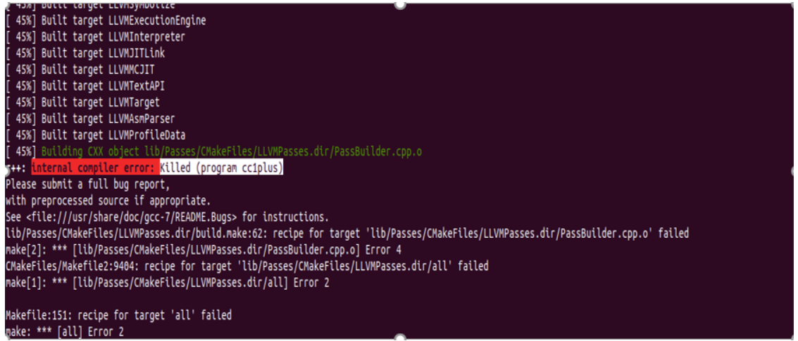

1 安装依赖的步骤

注意：使用之前必须安装 clang和llvm

（1）git clone http://llvm.org/git/llvm.git

 （2）cd llvm/tools

 （3）git clone --depth 1 http://llvm.org/git/clang.git

 （4）cd ..; mkdir build; cd build

 （5）cmake .. -DLLVM_TARGETS_TO_BUILD="BPF;X86"

 （6）make -j $(getconf _NPROCESSORS_ONLN)

2 安装依赖文件存在的问题：

```
在安装依赖的时运行命令：make -j $(getconf _NPROCESSORS_ONLN)
```



分析：


方法：将虚拟机的内存扩大到8G，如下图


先删除build文件夹下的内容，防止磁盘不够用，可能是因为再次安装依赖的时候，会占用多余的空间，最好一次性安装完成；

命令：rm -rf build;mkdir build;cd build; 

```
再次运行命令：make -j $(getconf _NPROCESSORS_ONLN)
```

 (2)可能还会再运行到80%左右，出现磁盘空间不足的情况


1）查看磁盘使用情况：


说明主磁盘分区/dev/sda1显然不够使用了，必须增加其容量

2）需要对磁盘进行扩容

虚拟机关机=》开机=》点击虚拟机=》设置


点击硬盘=》点击扩展容量=》输入总共的磁盘大小（建议50G以上）

3）下载磁盘分区工具GParted

命令：apt install gparted


再ubuntu应用中找到gparted


点击/dev/sda1 => 扩展磁盘大小(拖动或者手动输入大小都可以)


点击确定

再次查看磁盘的使用情况：df -h


 已将磁盘分区/dev/sda1扩展到54G了，可以正常使用


3 bpf系统调用

​    bpf（）函数的原型是 int bpf(int cmd, union bpf_attr *attr, unsigned int size)

（1）   cmd:被定义为枚举类型的数据，内核主要的功能，包括创建、更新、删除等

（2）   attr :结构体类型的变量

（3）   size:表示bpf_attr 的union的大小（以字节为单位）


4 eBPF 程序的类型


5 编写eBPF程序


6 eBPF的工作流程


 

参考链接：https://davidlovezoe.club/wordpress/archives/867 

