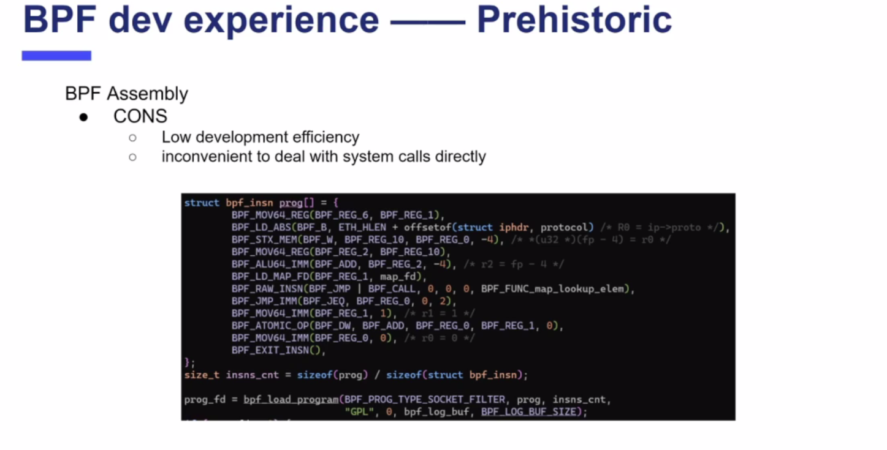
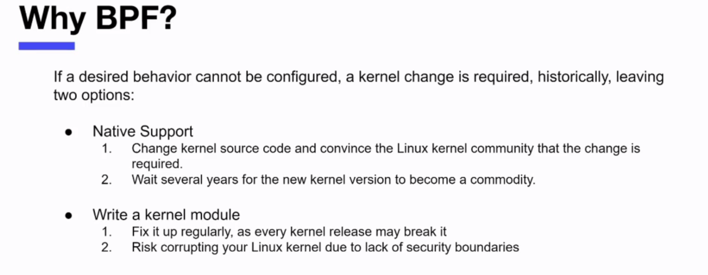
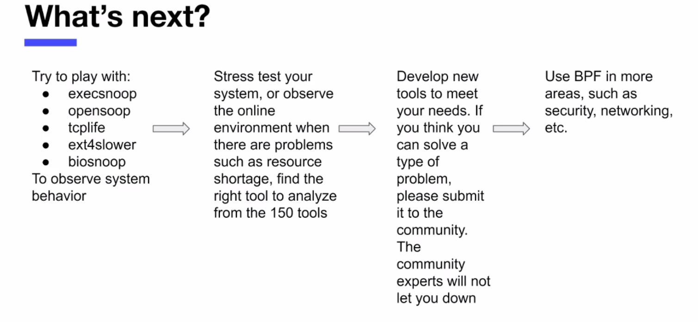
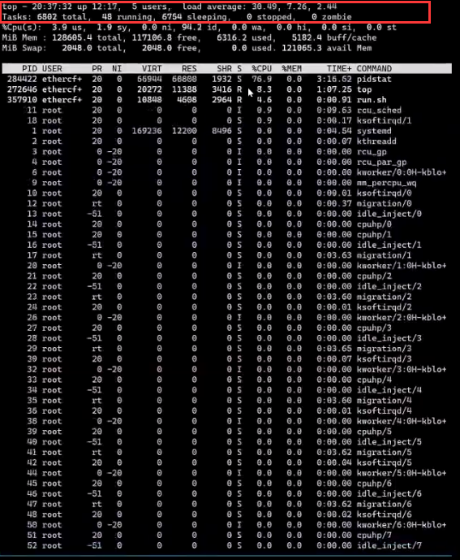
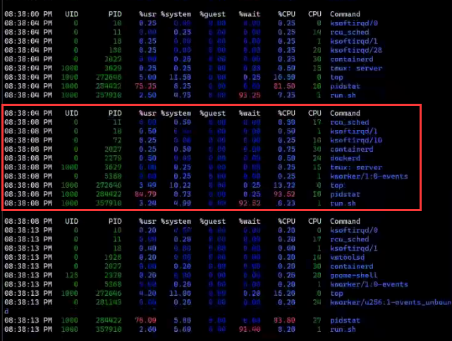
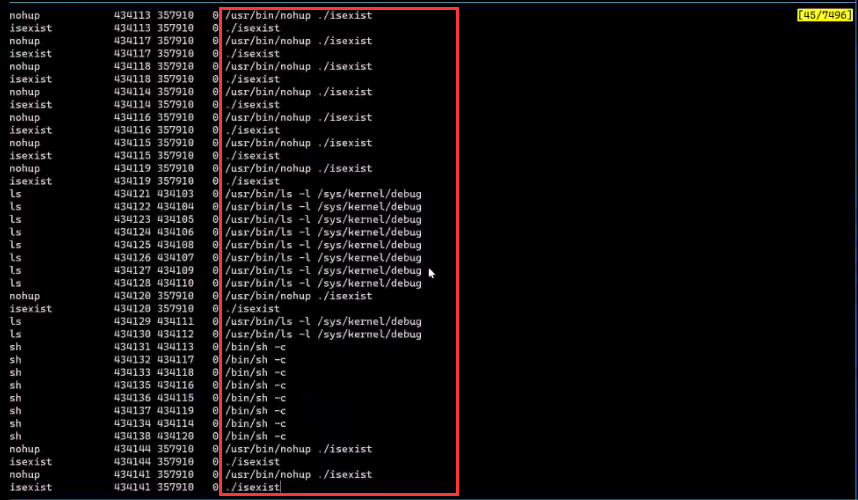

##### 直播内容

在上次的内容里，我们介绍了BPF C编程环境的搭建，使用BPF C的方式编写，编译和运行BPF程序，并通过源码分析理解BPF CALL指令调用的内核辅助函数转化为字节码的过程，使用bpftool和objdump观察BPF程序字节码。而这次分享围绕“使用BPF进行性能追踪”，将涉及以下内容：

1. BPF 的前世今生

2. 为什么选择 BPF

3. 学习 BPF 的路线图

4. 一些实际的 case
   

##### 1 BPF的前世今生

  该部分在简单介绍了BPF的由来、BPF社区、cBPF与eBPF的比较之后，主要介绍了BPF开发经验，包括从原始的字节码开发，从BCC开发，以及下一步的libbpf+BPF CO-RE（Compile Once-Run Everywhere）  ；  最后介绍了BPF当前的现状。

##### 2 为什么选择BPF

该部分主要介绍了BPF的优势。

##### 3 学习 BPF 的路线图

在这部分主要介绍了学习BPF的路线，以及演讲者对学习BPF的建议，比如先动手实践再学习、从观测系统调用入手，在对BPF有了初步认识之后，就可以开始对BPF展开深入的学习，学习路线如下图：

##### 4  一些实际的 case

在这一部分，演讲者针对在实际生产中使用BPF定位问题的案例进行了讲解，包括短命线程追踪、min_page_fault追踪、父子进程通信的追踪、写I/O延迟增大的追踪等。

以短进程追踪为例。当我们系统启动了很多短进程的时候，使用top进行性能监测：

可以看到系统负载load是非常高的，而且系统中有很多进程，我们使用pidstat查看系统有正在运行的进程：

如上图所示，系统中并没有这么多进程，但此时我们的系统负载和进程数量确实是非常高的，那这是为什么？

 我们猜测是系统存在很多的短命进程，但是由于top之类的工具因为频率的问题看不到这类进程，于是我们运行BPF程序：execsnoop.py，其输出如下图所示：

在这里我们看到有非常多的isexist进程和debug进程，因为我们之前运行了run.sh，现在我再运行exitsnoop.py，执行结果如下：

结果显示有很多ls和sh进程返回了错误码，这个时候我们就可以确定任务数的增加是由run.sh产生的，于是查看run.sh代码，检查代码发现确实存在问题，修改代码即可。至此整个问题得到了解决。

##### 直播结语

在直播的最后，演讲者对大家提出的问题进行了解答。陈莉君老师在最后结语中说道：这次直播，见证了内心一直期待的用户程序与内核代码调试的无缝切换，文博的代码演示，就像一位侦探，在应用和内核代码之间随意的畅游，也像一位演奏家在演出一场交响乐。图

##### 回放

- - 使用BPF进行性能追踪__BPF前世今生+为什么你会爱上它：
    https://www.bilibili.com/video/BV1mv411h7NU/

  - 使用BPF进行行性能追踪__学习路线+应用案例：

    https://www.bilibili.com/video/BV1kV411v7GX/

##### [点击下载ppt](bpf1.pdf)

