大家好，我是这次eBPF入门直播的讲解人，在陈老师的提议下，在这里和大家分享一下准备直播内容背后的故事。所以今天的这篇文字不讲解技术，是记录和分享。

从开始准备到直播，差不多不到4天时间，这段时间里我是属于一边学习eBPF一边准备ppt的状态，因为我自己也算是一个初学者。老师是星期三(2.3号)中午的时候，发消息问我是否可以准备一次关于eBPF的直播，并且要在3个平台进行直播，当时我又惊又喜。惊得是我之前从来没有做过直播，毫无经验可言，还有eBPF这个技术，我对它的学习只有之前写过代码BPF C代码和BCC脚本，没有深入学习过它的内部原理，而且有些概念也是模糊的，理解并不深刻，这相当于要从头开始认真的学习它。喜的是我认为这又是一次新的挑战，可以在这个过程中把eBPF原理搞懂，也锻炼一下。随后老师问我需要几天时间准备，我在脑海中大概的规划了一下，把时间拆成两块，学习eBPF原理和制作PPT，两天学习原理一天做PPT（后来实际上是在并发的执行了），所以我给老师说了需要3天时间准备。

老师中午说完直播的事情后，当天下午的时间我还没有正式开始准备。我去了解了一下高效率学习的一些方法，还有一些关于结构化思考的文章，这些对理解eBPF当然是没什么帮助的，但是我觉得高效率的学习工作应该是有一套方法论的，我也想借鉴其中的方法论来提高效率。事实上也证明，确实是有用的。

晚上时候我了解到一个日程管理软件Notion，所以我下载了它并学习如何使用它，接下来我就准备用它来规划学习。所以在晚上，我在上面写了第一个计划：了解Notion。了解也是为了后面高效的利用它。

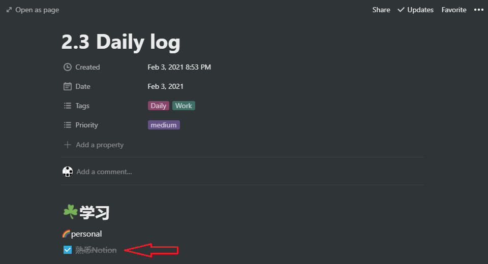

对Notion使用熟悉了以后，后面准备的这几天里我都用Notion来做日程规划，这是到今天(2.8)已经做过的规划记录。

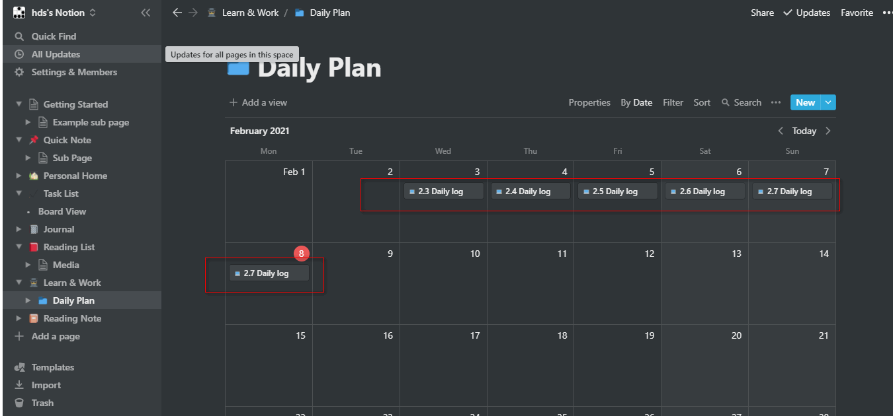

从第二天(2.4号)开始，我开始使用Notion来规划日程。今天做的事情不是很多，主要是自己的eBPF入门哈哈。

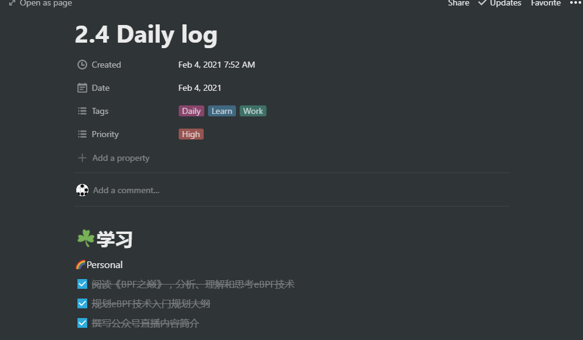

家里有一本《BPF之巅》，正好是放假回来买的。如果不是这次直播要学习eBPF，我也不知道我何时会翻开它哈哈。这本书巨厚，厚度和Linux经典巨著《深入Linux内核架构》相差无几。我想在这本书中找到入门eBPF的思路。这本书我是挑着看的，有时需要从前几页直接跳到最后的附录看。第一遍读后知道了一些BPF里面的术语概念，比如BPF程序、BPF指令集、BPF指令格式、BPF字节码、虚拟指令集规范、BPF虚拟机、BPF解释器、BPF加载器、BPF验证器等。理解了这些点，下一步就是要如何把这些点串起来，形成对BPF框架的理解。构建起框架后，再选择框架中的某个点深入。下午没有再看书，社区的公众号要推送直播消息，所以撰写了下文案，构思了下直播内容的大纲。

从三天(2.5号)开始差不多正式投入到学习eBPF。有了前面的一些eBPF技术术语后，我开始提出一些思考，我想从我最好奇的地方去理解eBPF的内部原理，比如eBPF这个词究竟代表的含义是什么，它在内核中怎么存在的，又是如何在内核中工作的？所以当天的日程规划也比较明确，就是把这3个问题搞清楚。

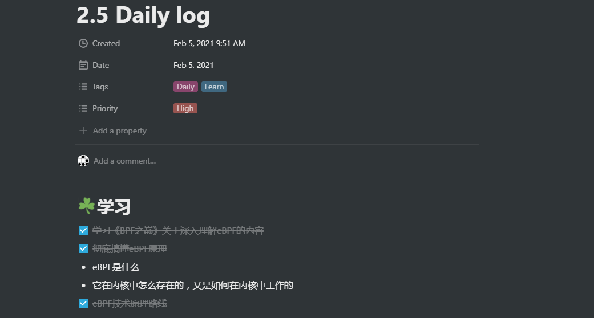

接着在搞清楚那两个问题的过程中，我也尝试把理解eBPF技术过程中的各个点梳理出来，穿成一条线，帮助新学习eBPF技术的同学可以清晰的了解学习路线。所以在随着不断查资料深入的过程中，eBPF技术原理路线也在不停的改，下面是中间不停变动的草稿。

第一版就是围绕最初的那几个问题，后面学到新的东西后不断扩充进来。

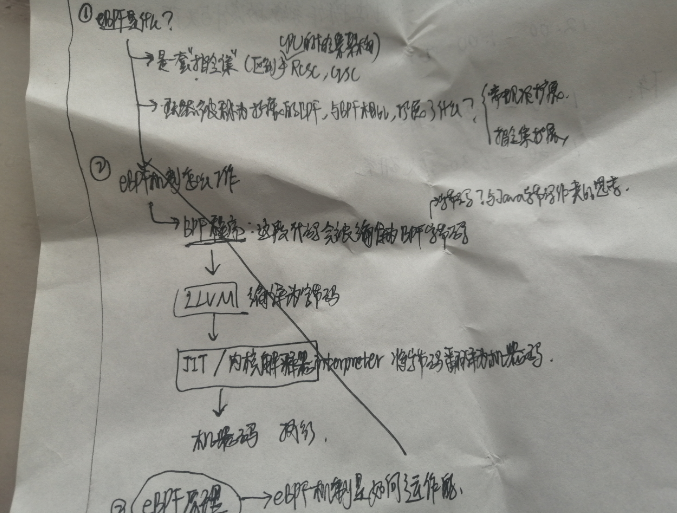

因为觉得第一版的草稿内容比较简单，所以第2版草稿中我去搜集了关于eBPF的面试题，想看看面试中有哪些问的深入的问题，跟着问题深入。但是关于eBPF的面试题很少，只找到了一个：BPF 和 eBPF 是什么原理？有什么好处？第一问正好已经包含了。然后我又把自己设想成面试官的身份，对自己提一些思考问题。

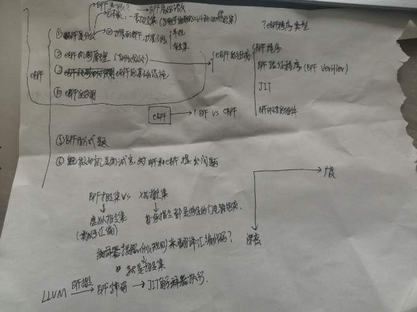

随着继续学习，我发现对于eBPF技术，有些是属于技术本身的核心原理，另外一些其实不能算是核心原理，比如eBPF的优势和局限性，起源和发展等等，如果揉在一起讲很难区分出重点。所以我想到利用二维坐标系来把它们区分开。纵轴代表深度，就是对eBPF技术原理理解越深越好；横轴代表广度，就是对eBPF技术知道越多越好，根据这样的思路，又重新制作了第3版草稿。

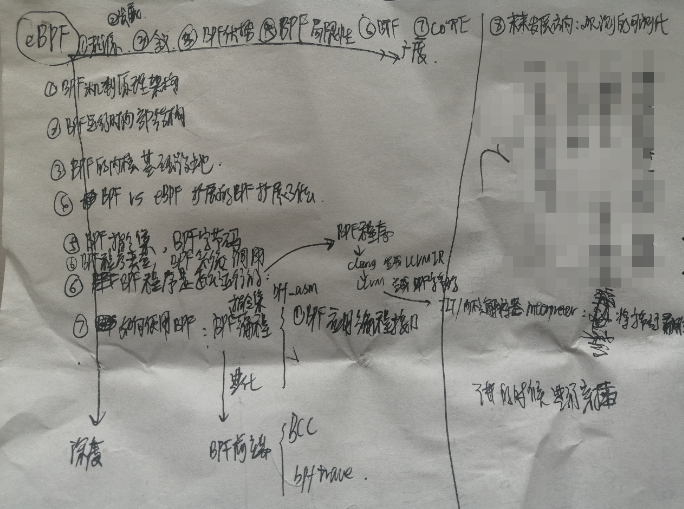

但是第3版在纵向排列上，只是把关于涉及eBPF技术的原理点罗列，更科学的逻辑应该是先有一个总体铺垫的过程，然后再逐个点深入，就像前面先了解eBPF技术的一些术语，然后搭建eBPF框架，再深入某个点一样。所以按照这个思路，重新设计了各个原理点的先后顺序，最终在第4版确定了下来。

第4版，最终版。

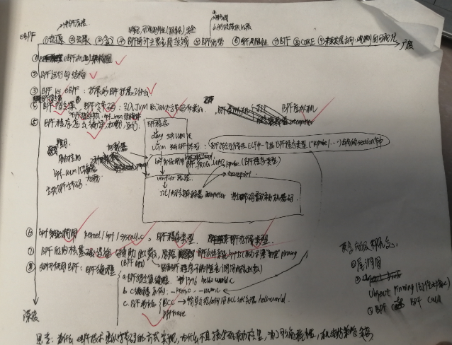

确定好了基本的eBPF讲解路线后，后面制作PPT就可以按照这个大纲来准备。

在第4天(2.6号)，差不多算全力投入。在早上规划了当天的日程。

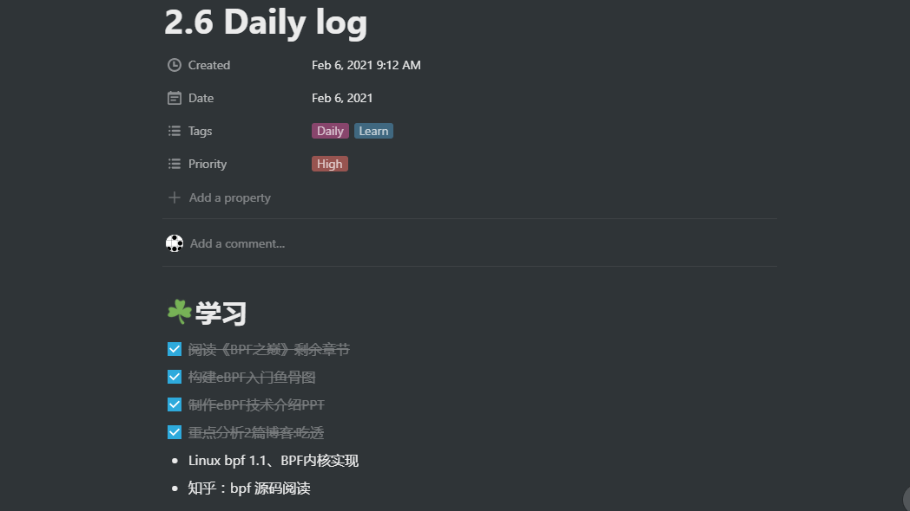

今天进行了大量思考，所以也把思考的其中一个过程记录下来。		

学习eBPF的过程中，也在不断的思考和梳理，不好理解的逻辑就触类旁通，暂时模糊的地带就靠合理的分析推理，后面时间再去求证。eBPF有些术语听着很抽象，比如BPF字节码，我去查资料字节码是什么，然后了解到java字节码，java字节码被java虚拟机执行，我又去了解java虚拟机，最后梳理了java源程序经过编译器生成字节码，然后被java虚拟机解释执行的过程，我把BPF字节码、BPF虚拟机和java字节码、java虚拟机触类旁通，我觉的它们的实现思想是一致的。通过理解java编译到解释执行的工作原理，我终于有一种恍然大悟的感觉，第一次理解了为什么BPF指令要编译成BPF字节码，也清楚了BPF虚拟机存在的意义，不再仅仅是停留在知道有BPF字节码和BPF虚拟机这两个东西，而不清楚它俩的关系纽带。从外部看，BPF程序要被编译成字节码，BPF字节码是需要被BPF虚拟机解释执行。因为BPF虚拟机做的就是解释执行的工作，所以有些BPF文档里把虚拟机称为解释器也就可以理解了，比如不开启JIT就使用内核解释器来解释执行BPF字节码，这些内容可以串起来了。

这是站在虚拟机的角度来理解，如果进一步思考，我把它与处理器和机器码来对比理解。为了与虚拟机概念符合，就把真实的处理器叫做物理机吧。物理机执行机器码，那虚拟机也要执行自己的机器码，这个“机器码”就叫做字节码，可能也是为了区别于机器码的叫法，当然字节码也有自己的特点。机器码符合一定的CPU体系结构的指令集规范的，比如x86指令集和ARM指令集，那虚拟机顺理成章也应该有指令集规范，这就是指令格式，现在理解了为什么要定义那个bpf_insn结构体了，要用它来定义BPF指令格式。但是又会有新的思考，定义好这个有什么用呢，何时会用到呢？查资料了解到java的编译器可能就是按照java字节码格式来编译生成字节码的，所以BPF指令格式是为了告诉编译器按照什么规则来编译BPF指令以生成BPF字节码？然后内核解释器也按照这个格式规范来对BPF字节码解码执行？这些都是我不太肯定的点，但是如果从逻辑上分析一下，感觉也比较合理。然后因为时间比较紧，而且这些问题都是属于BPF内部原理之外的一些东西，BPF内部原理比如BPF程序如何被加载进内核，怎么被虚拟机执行的还没有搞清楚，所以没有花时间去求证。后面的学习就是深入eBPF的内部原理，阅读了几篇篇高质量的博客，其中一篇没有全部读完，只看了对于理解有帮助的部分，这里面包括一些对BPF源码分析的博客，加深了对eBPF内部实现的理解。也是在这些大牛的技术博客的帮助下，一点一点结合之前所有零碎的点进行整合理解，最后终于对整个eBPF的运作机制有了初步的全景图式理解。学习eBPF期间也在穿插的准备直播PPT的草稿版。

最后一天(2.7号)。今天要把PPT做完。

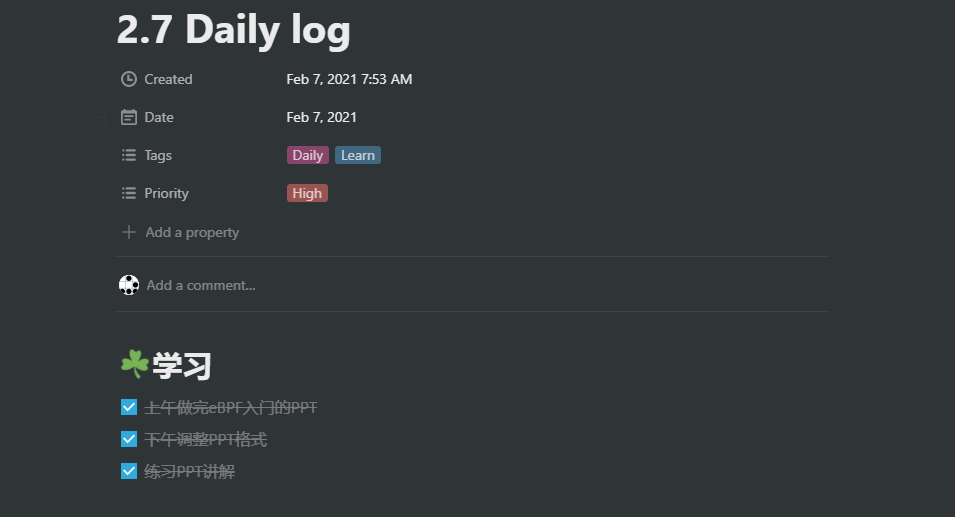

计划预计上午做完，下午修改格式。本来想着修改好PPT的格式后自己预演一下，因为第一次直播还是有点紧张，所以想排练一下。结果直到下午七点半左右才把PPT做好，距离正式开讲只剩半个小时了，所以时间依然是很紧的。

下面是制作的PPT的其中几张。

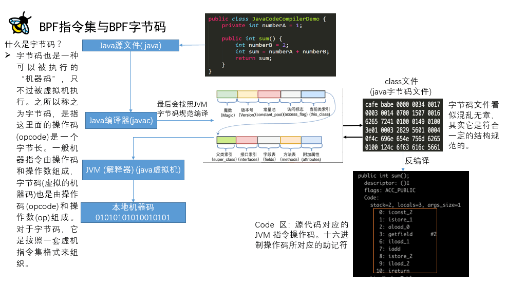

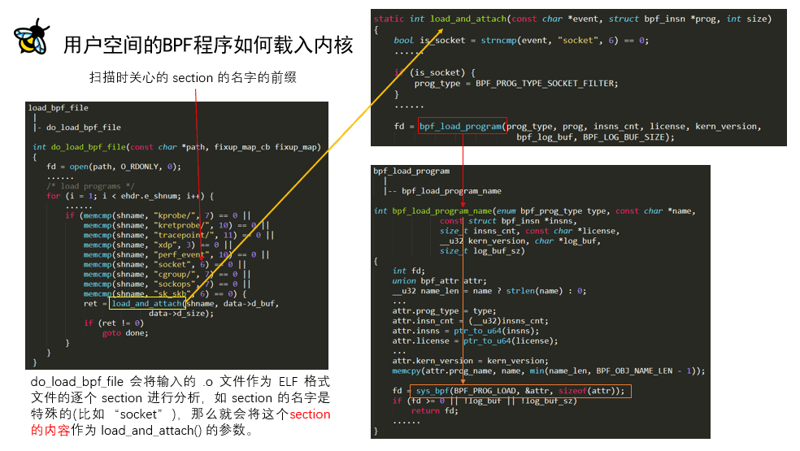	

晚上直播完以后，我又回看了录屏，思考里面有问题的地方和可以改进的点。以上就是直播准备的过程，记录在这里和大家分享。

非常感谢老师提供的机会，非常感谢为这次直播做了大量准备工作的社区工作人员，同时非常感谢观看这次直播的小伙伴们，谢谢大家！

[点击下载ppt](ebpf.pdf)

