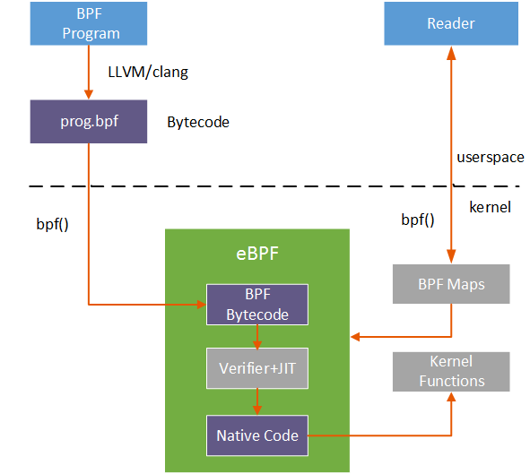
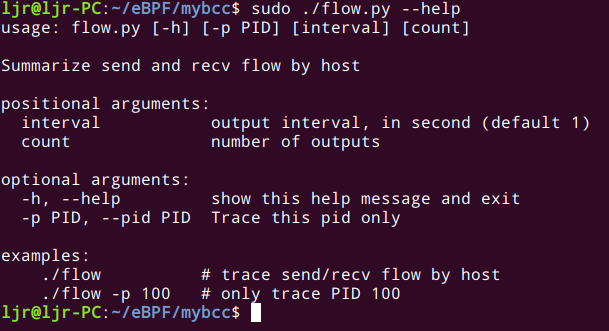
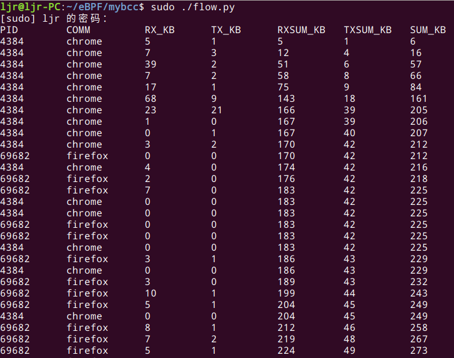

# 前言
本文将分享从0开始编写自己的bcc程序。那么开始编写bcc之前，自己一定要明确，我们要用bcc提取什么数据。本文的实例是统计内核网络中的流量，我要提取的数据关键字段为进程的PID，进程的名字，进程的收包实时流量、发包实时流量，收包流量总和，发包流量总和，总的收发流量等。

我们知道bcc是eBPF的一个工具集，是eBPF提取数据的上层封装，它的形式是python中嵌套bpf程序。python部分的作用是为用户提供友好的使用eBPF的上层接口，也用于数据处理。bpf程序会注入内核，提取数据。当bpf程序运行时，通过LLVM将bpf程序编译得到bpf指令集的elf文件，从elf文件中解析出可以注入内核的部分，用`bpf_load_program`方法完成注入。注入程序`bpf_load_program()`加入了更复杂的verifier 机制，在运行注入程序之前，先进行一系列的安全检查，最大限度的保证系统的安全。经过安全检查的bpf字节码使用内核JIT进行编译，生成本机汇编指令，附加到内核特定挂钩的程序。最终内核态与用户态通过高效的map机制进行通信，bcc在用户态是使用python进行数据处理的，一图胜千言。



# 开始编程
了解了bcc工具的工作方式，下面开始写代码，先写python部分，下面是python引入的模块和包，这部分可以在写程序过程中逐步引入，也就是在写python的过程中用到了某个函数就引入相应的模块和包。
```python
#!/usr/bin/env python
# coding=utf-8
from __future__ import print_function
from bcc import BPF
from time import sleep
import argparse
from collections import namedtuple, defaultdict
from threading import Thread, currentThread, Lock
```
下面是程序选项，可以使用--help来查看可用的选项，效果是这样的：



实现代码如下，具体功能可以看注释：

```python
# 选项参数检错
def range_check(string):
    value = int(string)
    if value < 1:
        msg = "value must be stricly positive, got %d" % (value,)
        raise argparse.ArgumentTypeError(msg)
    return value
# 帮助信息的example
examples = """examples:
    ./flow          # trace send/recv flow by host 
    ./flow -p 100   # only trace PID 100
"""
# 使用 python 中的 argparse类 定义选项
parser = argparse.ArgumentParser(
    description = "Summarize send and recv flow by host",
    formatter_class = argparse.RawDescriptionHelpFormatter,
    epilog = examples
)
parser.add_argument("-p", "--pid", 
    help = "Trace this pid only")
parser.add_argument("interval", nargs="?", default=1, type=range_check,
	help = "output interval, in second (default 1)")
parser.add_argument("count", nargs="?", default=-1, type=range_check,
	help="number of outputs")
args = parser.parse_args()
```
接下来是bcc程序中的bpf代码，在python中以这样的形式引入：
```python
bpf_program = """
BPF C 程序
"""
```
# BPF代码
本实例中用到的BPF代码如下，使用了kprobe来探测内核中与网络流量相关的`tcp_sendmsg`函数和`tcp_cleanup_rbuf`函数，代码详细作用请看注释：
```c
/*必要的头文件*/
#include <uapi/linux/ptrace.h>
#include <net/sock.h>
#include <bcc/proto.h>
/*定义BPF_HASH中的值*/
struct ipv4_key_t {
    u32 pid;
};
/*定义两个哈希表，分别以ipv4中发送和接收数据包的进程pid作为关键字*/
BPF_HASH(ipv4_send_bytes, struct ipv4_key_t);
BPF_HASH(ipv4_recv_bytes, struct ipv4_key_t);
/*探测内核中的 tcp_sendmsg 函数 */
int kprobe__tcp_sendmsg(struct pt_regs *ctx, struct sock *sk,
    struct msghdr *msg, size_t size)
{
    /*获取当前进程的pid*/
    u32 pid = bpf_get_current_pid_tgid() >> 32;
    /*此部分在python里处理，用于替换特定功能的c语句*/
    FILTER_PID
	/*获取网络协议的套接字类型*/
    u16 family = sk->__sk_common.skc_family;
	/*判断是否是IPv4*/
    if (family == AF_INET) {
    	/*将当前进程的pid放入ipv4_key结构体中
    	  作为ipv4_send_bytes哈希表的关键字*/
        struct ipv4_key_t ipv4_key = {.pid = pid};
        /*将size的值作为哈希表的值进行累加*/
        ipv4_send_bytes.increment(ipv4_key, size);
    }
    return 0;
}
/*探测内核中的 tcp_cleanup_rbuf 函数 */
int kprobe__tcp_cleanup_rbuf(struct pt_regs *ctx, struct sock *sk, int copied)
{
    /*获取当前进程的pid*/
    u32 pid = bpf_get_current_pid_tgid() >> 32;
    /*此部分在python里处理，用于替换特定功能的c语句*/
    FILTER_PID
	/*获取网络协议的套接字类型*/
    u16 family = sk->__sk_common.skc_family;
    u64 *val, zero =0;
	/*检错*/
    if (copied <= 0)
        return 0;
	/*判断是否是IPv4*/
    if (family == AF_INET) {
    	/*将当前进程的pid放入ipv4_key结构体中
    	  作为ipv4_send_bytes哈希表的关键字*/
        struct ipv4_key_t ipv4_key = {.pid = pid};
        /*将copied的值作为哈希表的值进行累加*/
        ipv4_recv_bytes.increment(ipv4_key, copied);
    }
    return 0;
}
```
几点说明：
- BPF_HASH 的用法
>- Syntax: BPF_HASH(name [, key_type [, leaf_type [, size]]])
>- Creates a hash map (associative array) named name, with optional parameters.
>- Defaults: BPF_HASH(name, key_type=u64, leaf_type=u64, size=10240)
>- For example:
>- BPF_HASH(start, struct request *);
>- This creates a hash named start where the key is a struct request *, and the value defaults to u64. This hash is used by the disksnoop.py example for saving timestamps for each I/O request, where the key is the pointer to struct request, and the value is the timestamp.
>- Methods (covered later): map.lookup(), map.lookup_or_try_init(), map.delete(), map.update(), map.insert(), map.increment().

- FILTER_PID
本示例中的 FILTER_PID 无实际意义，它是在python中使用`bpf_program.replace`来进行语句替换的，具体作用在下文中python部分会介绍到。

- ipv4_send_bytes.increment
这里使用了`map.increment()`的方法，本实例中是在哈希表`ipv4_send_bytes`中以`ipv4_key`为关键字将size作为值进行累加。
>- Syntax: map.increment(key[, increment_amount])
>- Increments the key's value by increment_amount, which defaults to 1. Used for histograms.
# 数据处理
刚刚提到`FILTER_PID`无实际意义，是在python中使用`bpf_program.replace`来进行语句替换的，现在看下它在python中的处理：
```python
if args.pid:
    bpf_program = bpf_program.replace('FILTER_PID',
        'if (pid != %s) { return 0; }' % args.pid)
else:
    bpf_program = bpf_program.replace('FILTER_PID','')
```
如果使用选项 -p 指定了pid，那么bpf程序中的`FILTER_PID`会被替换为`if (pid != %s) { return 0; }`，最终在bpf程序中起到过滤指定pid数据的作用。如果没有使用选项 -p 指定 pid，那么就会删除`FILTER_PID`。也就是说bpf程序中的`FILTER_PID`不会直接执行，直接执行了会出错，而是经过python处理后才执行。

## 自定义python函数

```python
# 获取进程名称
def pid_to_comm(pid):
    try:
        comm = open("/proc/%s/comm" % pid, "r").read().rstrip()
        return comm
    except IOError:
        return str(pid)
# 获取pid
SessionKey = namedtuple('Session',['pid'])
def get_ipv4_session_key(k):
    return SessionKey(pid=k.pid)
```

## 初始化bpf
```python
# init bpf
b = BPF(text=bpf_program)
ipv4_send_bytes = b["ipv4_send_bytes"]
ipv4_recv_bytes = b["ipv4_recv_bytes"]
```
## 打印标题
```python
# header
print("%-10s %-12s %-10s %-10s %-10s %-10s %-10s" % ("PID", "COMM", "RX_KB", "TX_KB", "RXSUM_KB", "TXSUM_KB", "SUM_KB"))
```
## 输出数据
```python
# output
#初始化变量
sumrecv = 0
sumsend = 0
sum_kb = 0
i = 0
exiting = False

while i != args.count and not exiting:
	try:
		sleep(args.interval)
	except KeyboardInterrupt:
		exiting = True

	ipv4_throughput = defaultdict(lambda:[0,0])
	for k, v in ipv4_send_bytes.items():
		key=get_ipv4_session_key(k)
		ipv4_throughput[key][0] = v.value
	ipv4_send_bytes.clear()

	for k,v in ipv4_recv_bytes.items():
		key = get_ipv4_session_key(k)
		ipv4_throughput[key][1] = v.value
	ipv4_recv_bytes.clear()
	if ipv4_throughput:
		for k, (send_bytes, recv_bytes) in sorted(ipv4_throughput.items(),
			key=lambda kv: sum(kv[1]),
			reverse=True):
			recv_bytes = int(recv_bytes / 1024)
			send_bytes = int(send_bytes / 1024)
			sumrecv += recv_bytes
			sumsend += send_bytes
			sum_kb = sumrecv + sumsend
			print("%-10d %-12.12s %-10d %-10d %-10d %-10d %-10d" % (k.pid, pid_to_comm(k.pid), recv_bytes, send_bytes, sumrecv, sumsend, sum_kb))
	i += 1
```
这部分是python处理数据的过程，需要注意的是：
`ipv4_throughput = defaultdict(lambda:[0,0])`这里创建了一个名为`ipv4_throughput `的字典，将名为`ipv4_send_bytes`和`ipv4_recv_bytes`两个哈希表中的数据分别放到了名为`ipv4_throughput `的字典中，这样使得后续的数据处理更加统一。

`for k, v in ipv4_send_bytes.items():`这里将哈希表`ipv4_send_bytes`中的关键字和值使用`.items`的方法分别存放在了k和v中。

`key=get_ipv4_session_key(k)`这里调用了`get_ipv4_session_key(k)`函数获取到了关键字，也就是pid。

到此，一个基本的MVP就写好了，可以先跑一下，运行结果如下：



可以看到，内核中的流量数据已经提取出来了。当然，本文只是分享如何编写一个bcc程序，目前这个程序还有很多升级的空间，例如：

- 本实例只统计IPv4的流量，还可以加入统计IPv6的流量
- 可以添加更多的字段，如源地址，源端口，目标地址，目标端口
- 可以加入更多的选项参数等

目前介绍到这里，我还会继续优化程序的，感谢阅读。

参考链接：
https://github.com/iovisor/bcc/blob/master/docs/reference_guide.md