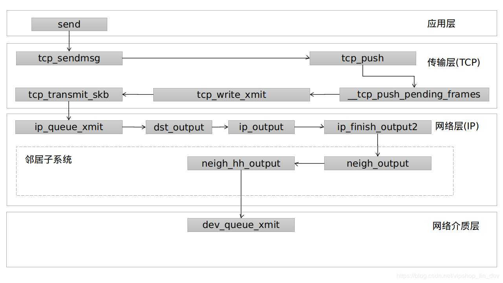
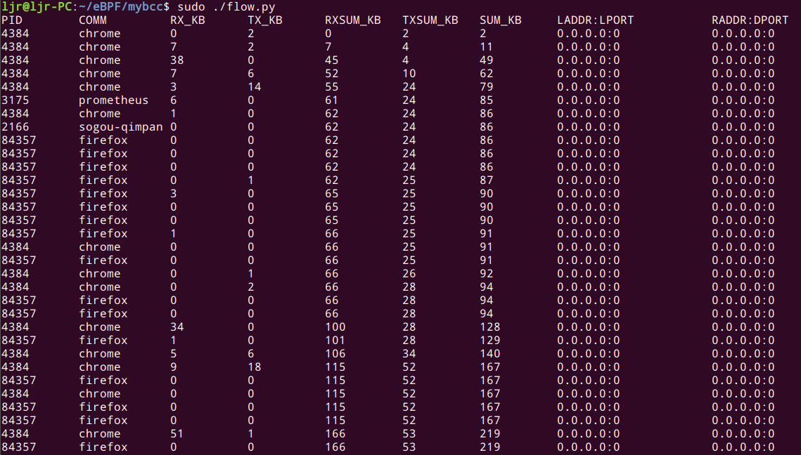
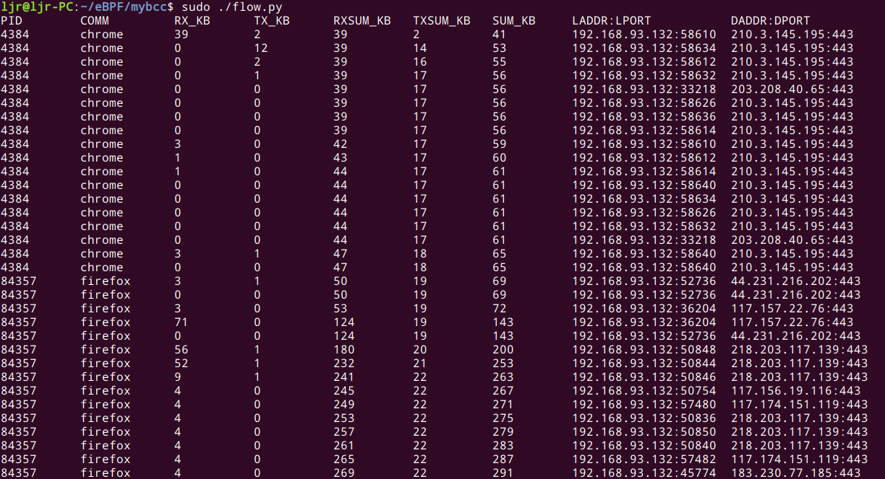

通过上篇文章[使用eBPF&bcc提取内核网络流量信息（一）](http://kerneltravel.net/blog/2020/ebpf_ljr_5/)的介绍，我们已经用编写的bcc程序提取出内核网络中数据关键字段为进程的PID，进程的名字，进程的收包实时流量、发包实时流量，收包流量总和，发包流量总和，总的收发流量等数据，今天我们通过分析内核源码，为其增加源地址、源端口、目的地址、目的端口等字段。

上次我们使用kprobe挂接了两个重要的函数，分别是`tcp_sendmsg`和`tcp_cleanup_rbuf`，下面我们结合源码进行解读。为什么要挂接`tcp_sendmsg`，我们先看这个图：



网络数据包的发送过程起始于应用层的函数调用，随后会调用`tcp_sendmsg`函数，层层调用到`tcp_transmit_skb`函数完成TCP协议处理，封闭tcp包头，最后调用ip层的`ip_queue_xmit`方法。

接下来看看在传输层报文生成的实现，只详细分析此函数，其他函数在此不一一讨论，详细过程请看代码注释：
```c
int tcp_sendmsg(struct kiocb *iocb, struct sock *sk, struct msghdr *msg,
		size_t size)
{
	struct iovec *iov;
	struct tcp_sock *tp = tcp_sk(sk);
	struct sk_buff *skb;
	int iovlen, flags;
	int mss_now;
	int err, copied;
	long timeo;

	/* 获取套接口的锁 */
	lock_sock(sk);
	TCP_CHECK_TIMER(sk);

	/* 根据标志计算阻塞超时时间 */
	flags = msg->msg_flags;
	timeo = sock_sndtimeo(sk, flags & MSG_DONTWAIT);

	/* Wait for a connection to finish. */
	if ((1 << sk->sk_state) & ~(TCPF_ESTABLISHED | TCPF_CLOSE_WAIT))/* 只有这两种状态才能发送消息 */
		if ((err = sk_stream_wait_connect(sk, &timeo)) != 0)/* 其它状态下等待连接正确建立，超时则进行错误处理 */
			goto out_err;

	/* This should be in poll */
	clear_bit(SOCK_ASYNC_NOSPACE, &sk->sk_socket->flags);

	/* 获得有效的MSS，如果支持OOB，则不能支持TSO，MSS则应当是比较小的值 */
	mss_now = tcp_current_mss(sk, !(flags&MSG_OOB));

	/* Ok commence sending. */
	/* 获取待发送数据块数及数据块指针 */
	iovlen = msg->msg_iovlen;
	iov = msg->msg_iov;
	/* copied表示从用户数据块复制到skb中的字节数。 */
	copied = 0;

	err = -EPIPE;
	/* 如果套接口存在错误，则不允许发送数据，返回EPIPE错误 */
	if (sk->sk_err || (sk->sk_shutdown & SEND_SHUTDOWN))
		goto do_error;

	while (--iovlen >= 0) {/* 处理所有待发送数据块 */
		int seglen = iov->iov_len;
		unsigned char __user *from = iov->iov_base;

		iov++;

		while (seglen > 0) {/* 处理单个数据块中的所有数据 */
			int copy;

			skb = sk->sk_write_queue.prev;

			if (!sk->sk_send_head ||/* 发送队列为空，前面取得的skb无效 */
			    (copy = mss_now - skb->len) <= 0) {/* 如果skb有效，但是它已经没有多余的空间复制新数据了 */

new_segment:
				/* Allocate new segment. If the interface is SG,
				 * allocate skb fitting to single page.
				 */
				if (!sk_stream_memory_free(sk))/* 发送队列中数据长度达到发送缓冲区的上限，等待缓冲区 */
					goto wait_for_sndbuf;

				skb = sk_stream_alloc_pskb(sk, select_size(sk, tp),
							   0, sk->sk_allocation);/* 分配新的skb */
				if (!skb)/* 分配失败，说明系统内存不足，等待 */
					goto wait_for_memory;

				/*
				 * Check whether we can use HW checksum.
				 */
				if (sk->sk_route_caps &
				    (NETIF_F_IP_CSUM | NETIF_F_NO_CSUM |
				     NETIF_F_HW_CSUM))/* 根据路由网络设备的特性，确定是否由硬件执行校验和 */
					skb->ip_summed = CHECKSUM_HW;

				skb_entail(sk, tp, skb);/* 将SKB添加到发送队列尾部 */
				copy = mss_now;/* 本次需要复制的数据量是MSS */
			}

			/* Try to append data to the end of skb. */
			if (copy > seglen)/* 要复制的数据不能大于当前段的长度 */
				copy = seglen;

			/* Where to copy to? */
			if (skb_tailroom(skb) > 0) {/* skb线性存储区底部还有空间 */
				/* We have some space in skb head. Superb! */
				if (copy > skb_tailroom(skb))/* 本次只复制skb存储区底部剩余空间大小的数据量 */
					copy = skb_tailroom(skb);
				/* 从用户空间复制指定长度的数据到skb中，如果失败，则退出 */
				if ((err = skb_add_data(skb, from, copy)) != 0)
					goto do_fault;
			} else {/* 线性存储区底部已经没有空间了，复制到分散/聚集存储区中 */
				int merge = 0;/* 是否在页中添加数据 */
				int i = skb_shinfo(skb)->nr_frags;/* 分散/聚集片断数 */
				struct page *page = TCP_PAGE(sk);/* 分片页页 */
				int off = TCP_OFF(sk);/* 分片内的偏移 */

				if (skb_can_coalesce(skb, i, page, off) &&
				    off != PAGE_SIZE) {/* 当前分片还能添加数据 */
					/* We can extend the last page
					 * fragment. */
					merge = 1;
				} else if (i == MAX_SKB_FRAGS ||/* 目前skb中的页不能添加数据，这里判断是否能再分配页 */
					   (!i &&
					   !(sk->sk_route_caps & NETIF_F_SG))) {/* 网卡不支持S/G，不能分片 */
					/* Need to add new fragment and cannot
					 * do this because interface is non-SG,
					 * or because all the page slots are
					 * busy. */
					tcp_mark_push(tp, skb);/* SKB可以提交了 */
					goto new_segment;/* 重新分配skb */
				} else if (page) {/* 分页数量未达到上限，判断当前页是否还有空间 */
					/* If page is cached, align
					 * offset to L1 cache boundary
					 */
					off = (off + L1_CACHE_BYTES - 1) &
					      ~(L1_CACHE_BYTES - 1);
					if (off == PAGE_SIZE) {/* 最后一个分页数据已经满，需要分配新页 */
						put_page(page);
						TCP_PAGE(sk) = page = NULL;
					}
				}

				if (!page) {/* 需要分配新页 */
					/* Allocate new cache page. */
					if (!(page = sk_stream_alloc_page(sk)))/* 分配新页，如果内存不足则等待内存 */
						goto wait_for_memory;
					off = 0;
				}

				if (copy > PAGE_SIZE - off)/* 待复制的数据不能大于页中剩余空间 */
					copy = PAGE_SIZE - off;

				/* Time to copy data. We are close to
				 * the end! */
				err = skb_copy_to_page(sk, from, skb, page,
						       off, copy);/* 从用户态复制数据到页中 */
				if (err) {/* 复制失败了 */
					/* If this page was new, give it to the
					 * socket so it does not get leaked.
					 */
					if (!TCP_PAGE(sk)) {/* 如果是新分配的页，则将页记录到skb中，供今后使用 */
						TCP_PAGE(sk) = page;
						TCP_OFF(sk) = 0;
					}
					goto do_error;
				}

				/* Update the skb. */
				/* 更新skb的分段信息 */
				if (merge) {/* 在最后一个页中追加数据 */
					skb_shinfo(skb)->frags[i - 1].size +=
									copy;/* 更新最后一页的数据长度 */
				} else {/* 新分配的页 */
					/* 更新skb中分片信息 */
					skb_fill_page_desc(skb, i, page, off, copy);
					if (TCP_PAGE(sk)) {
						get_page(page);
					} else if (off + copy < PAGE_SIZE) {
						get_page(page);
						TCP_PAGE(sk) = page;
					}
				}

				/* 更新页内偏移 */
				TCP_OFF(sk) = off + copy;
			}

			if (!copied)/* 如果没有复制数据，则取消PSH标志 */
				TCP_SKB_CB(skb)->flags &= ~TCPCB_FLAG_PSH;

			tp->write_seq += copy;/* 更新发送队列最后一个包的序号 */
			TCP_SKB_CB(skb)->end_seq += copy;/* 更新skb的序号 */
			skb_shinfo(skb)->tso_segs = 0;

			/* 更新数据复制的指针 */
			from += copy;
			copied += copy;
			/* 如果所有数据已经复制完毕则退出 */
			if ((seglen -= copy) == 0 && iovlen == 0)
				goto out;

			/* 如果当前skb中的数据小于mss，说明可以往里面继续复制数据。或者发送的是OOB数据，则也跳过发送过程，继续复制数据 */
			if (skb->len != mss_now || (flags & MSG_OOB))
				continue;

			if (forced_push(tp)) {/* 必须立即发送数据，即上次发送后产生的数据已经超过通告窗口值的一半 */
				/* 设置PSH标志后发送数据 */
				tcp_mark_push(tp, skb);
				__tcp_push_pending_frames(sk, tp, mss_now, TCP_NAGLE_PUSH);
			} else if (skb == sk->sk_send_head)/* 虽然不是必须发送数据，但是发送队列上只存在当前段，也将其发送出去 */
				tcp_push_one(sk, mss_now);
			continue;

wait_for_sndbuf:
			/* 由于发送队列满的原因导致等待 */
			set_bit(SOCK_NOSPACE, &sk->sk_socket->flags);
wait_for_memory:
			if (copied)/* 虽然没有内存了，但是本次调用复制了数据到缓冲区，调用tcp_push将其发送出去 */
				tcp_push(sk, tp, flags & ~MSG_MORE, mss_now, TCP_NAGLE_PUSH);

			/* 等待内存可用 */
			if ((err = sk_stream_wait_memory(sk, &timeo)) != 0)
				goto do_error;/* 确实没有内存了，超时后返回失败 */

			/* 睡眠后，MSS可能发生了变化，重新计算 */
			mss_now = tcp_current_mss(sk, !(flags&MSG_OOB));
		}
	}

out:
	if (copied)/* 从用户态复制了数据，发送它 */
		tcp_push(sk, tp, flags, mss_now, tp->nonagle);
	TCP_CHECK_TIMER(sk);
	release_sock(sk);/* 释放锁以后返回 */
	return copied;

do_fault:
	if (!skb->len) {/* 复制数据失败了，如果skb长度为0，说明是新分配的，释放它 */
		if (sk->sk_send_head == skb)/* 如果skb是发送队列头，则清空队列头 */
			sk->sk_send_head = NULL;
		__skb_unlink(skb, skb->list);
		sk_stream_free_skb(sk, skb);/* 释放skb */
	}

do_error:
	if (copied)
		goto out;
out_err:
	err = sk_stream_error(sk, flags, err);
	TCP_CHECK_TIMER(sk);
	release_sock(sk);
	return err;
}

```
可以看到，这里就有我们要提取的数据，比如我们要提取的发送的流量信息，就可以利用size_t 类型的size来进行统计，那么源地址、源端口、目的地址、目的端口，我们就可以按以下思路求出：
```c
//源地址
saddr = sk->__sk_common.skc_rcv_saddr;
//源端口
lport = sk->__sk_common.skc_num;
//目的地址
daddr = sk->__sk_common.skc_daddr;
//目的端口
dport = sk->__sk_common.skc_dport;
dport = ntohs(dport);
```
那么统计接收的数据包，我们理应使用`tcp_recvmsg()`，但是它不太合适，为了不重不漏的统计流量信息，我们选择跟踪`tcp_cleanup_rbuf()`，这样就可以统计到`tcp_read_sock()`中的流量。在此，`tcp_cleanup_rbuf()`不做过多分析，直接看修改后的bcc代码：

```python
#!/usr/bin/env python
# coding=utf-8
from __future__ import print_function
from bcc import BPF
from time import sleep
import argparse
from collections import namedtuple, defaultdict
from threading import Thread, currentThread, Lock
from socket import inet_ntop, AF_INET
from struct import pack

# lock = Lock()
# arguments
def range_check(string):
    value = int(string)
    if value < 1:
        msg = "value must be stricly positive, got %d" % (value,)
        raise argparse.ArgumentTypeError(msg)
    return value

examples = """examples:
    ./flow          # trace send/recv flow by host 
    ./flow -p 100   # only trace PID 100
"""

parser = argparse.ArgumentParser(
    description = "Summarize send and recv flow by host",
    formatter_class = argparse.RawDescriptionHelpFormatter,
    epilog = examples
)
parser.add_argument("-p", "--pid", 
    help = "Trace this pid only")
parser.add_argument("interval", nargs="?", default=1, type=range_check,
	help = "output interval, in second (default 1)")
parser.add_argument("count", nargs="?", default=-1, type=range_check,
	help="number of outputs")
args = parser.parse_args()

bpf_program = """
#include <uapi/linux/ptrace.h>
#include <net/sock.h>
#include <bcc/proto.h>

struct ipv4_key_t {
    u32 pid;
    u32 saddr;
    u32 daddr;
    u16 lport;
    u16 dport;
};

BPF_HASH(ipv4_send_bytes, struct ipv4_key_t);
BPF_HASH(ipv4_recv_bytes, struct ipv4_key_t);

int kprobe__tcp_sendmsg(struct pt_regs *ctx, struct sock *sk,
    struct msghdr *msg, size_t size)
{
    u32 pid = bpf_get_current_pid_tgid() >> 32;
    FILTER_PID

    u16 dport = 0, family = sk->__sk_common.skc_family;

    if (family == AF_INET) {
        struct ipv4_key_t ipv4_key = {.pid = pid};
        ipv4_send_bytes.increment(ipv4_key, size);
        ipv4_key.saddr = sk->__sk_common.skc_rcv_saddr;
        ipv4_key.daddr = sk->__sk_common.skc_daddr;
        ipv4_key.lport = sk->__sk_common.skc_num;
        dport = sk->__sk_common.skc_dport;
        ipv4_key.dport = ntohs(dport);
    }
    return 0;
}

int kprobe__tcp_cleanup_rbuf(struct pt_regs *ctx, struct sock *sk, int copied)
{
    u32 pid = bpf_get_current_pid_tgid() >> 32;
    FILTER_PID

    u16 dport = 0, family = sk->__sk_common.skc_family;
    u64 *val, zero =0;

    if (copied <= 0)
        return 0;

    if (family == AF_INET) {
        struct ipv4_key_t ipv4_key = {.pid = pid};
        ipv4_recv_bytes.increment(ipv4_key, copied);
        ipv4_key.saddr = sk->__sk_common.skc_rcv_saddr;
        ipv4_key.daddr = sk->__sk_common.skc_daddr;
        ipv4_key.lport = sk->__sk_common.skc_num;
        dport = sk->__sk_common.skc_dport;
        ipv4_key.dport = ntohs(dport);
    }
    return 0;
}
"""

# code substitutions
if args.pid:
    bpf_program = bpf_program.replace('FILTER_PID',
        'if (pid != %s) { return 0; }' % args.pid)
else:
    bpf_program = bpf_program.replace('FILTER_PID','')

SessionKey = namedtuple('Session',['pid', 'laddr', 'lport', 'daddr', 'dport'])

def pid_to_comm(pid):
    try:
        comm = open("/proc/%s/comm" % pid, "r").read().rstrip()
        return comm
    except IOError:
        return str(pid)

def get_ipv4_session_key(k):
	return SessionKey(pid=k.pid, laddr=inet_ntop(AF_INET, pack("I", k.saddr)),lport=k.lport, daddr=inet_ntop(AF_INET, pack("I", k.daddr)), dport=k.dport)

# init bpf
b = BPF(text=bpf_program)

ipv4_send_bytes = b["ipv4_send_bytes"]
ipv4_recv_bytes = b["ipv4_recv_bytes"]

# header
print("%-10s %-12s %-10s %-10s %-10s %-10s %-10s %-21s %-21s" % ("PID", "COMM", 
	"RX_KB", "TX_KB", "RXSUM_KB", "TXSUM_KB", "SUM_KB", "LADDR", "RADDR"))

# output
sumrecv = 0
sumsend = 0
sum_kb = 0
i = 0
exiting = False
while i != args.count and not exiting:
	try:
		sleep(args.interval)
	except KeyboardInterrupt:
		exiting = True

	ipv4_throughput = defaultdict(lambda:[0,0])
	for k, v in ipv4_send_bytes.items():
		key=get_ipv4_session_key(k)
		ipv4_throughput[key][0] = v.value
	ipv4_send_bytes.clear()

	for k,v in ipv4_recv_bytes.items():
		key = get_ipv4_session_key(k)
		ipv4_throughput[key][1] = v.value
	ipv4_recv_bytes.clear()
	#lock.acquire()
	if ipv4_throughput:
		for k, (send_bytes, recv_bytes) in sorted(ipv4_throughput.items(),
			key=lambda kv: sum(kv[1]),
			reverse=True):
			recv_bytes = int(recv_bytes / 1024)
			send_bytes = int(send_bytes / 1024)
			sumrecv += recv_bytes
			sumsend += send_bytes
			sum_kb = sumrecv + sumsend
			print("%-10d %-12.12s %-10d %-10d %-10d %-10d %-10d %-21s %-21s" % 
				(k.pid, pid_to_comm(k.pid), 
				recv_bytes, send_bytes, sumrecv, sumsend, sum_kb, 
				k.laddr + ":" + str(k.lport), 
				k.daddr + ":" + str(k.dport),))
	#lock.release()
	i += 1
```
我们来运行一下，查看运行结果：



发现统计的源地址、源端口、目的地址、目的端口均为0，这是为何？
提取失败时，不要慌，问题不大，我们检查代码，逐步排除问题。经过较长时间的排查与实践，我终于发现是数据封装时出现了问题，正确的封装关键代码如下：

```c
//bpf_probe_read(&ipv4_key.saddr, sizeof(ipv4_key.saddr), &sk->__sk_common.skc_rcv_saddr);
struct ipv4_key_t ipv4_key = {.pid = pid};
ipv4_key.saddr = sk->__sk_common.skc_rcv_saddr;
ipv4_key.daddr = sk->__sk_common.skc_daddr;
ipv4_key.lport = sk->__sk_common.skc_num;
dport = sk->__sk_common.skc_dport;
ipv4_key.dport = ntohs(dport);
ipv4_send_bytes.increment(ipv4_key, size);
```
将获取到的流量、地址和端口信息，通过bpf中的`map.increment()`这样一个方法进行封装在BPF_HASH中，然后在python部分进行数据处理，`map.increment()`的描述如下：
>Syntax: map.increment(key[, increment_amount])
Increments the key's value by increment_amount, which defaults to 1. Used for histograms.

我们再次运行bcc程序，结果如下：



可以看到，除了之前提的流量信息，我们已经成功地提取出源地址、目的地址、源端口、目的端口等信息。

参考资料：
https://github.com/iovisor/bcc/blob/master/docs/reference_guide.md
https://blog.csdn.net/vipshop_fin_dev/article/details/103931691


