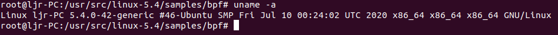
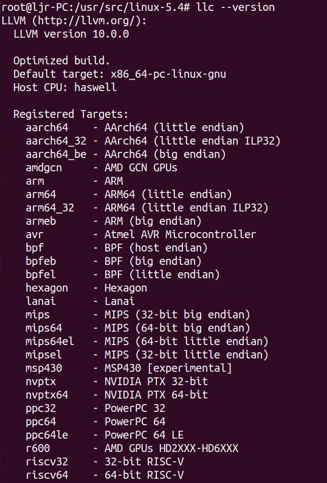
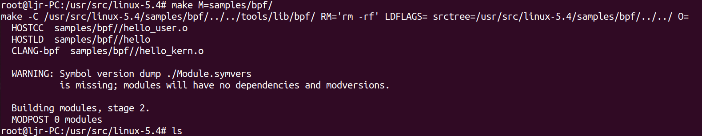
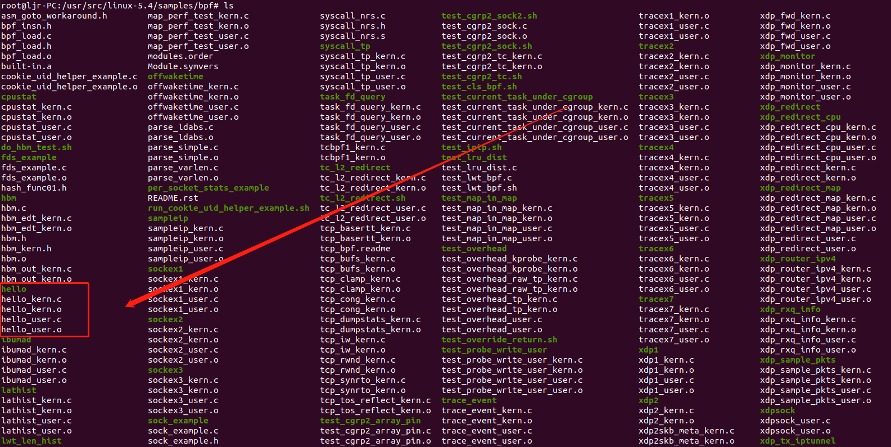
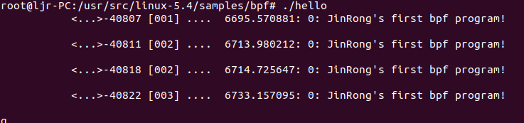

# 1. 前言

搭建bpf运行环境真的是很费时间，踩过的坑也不少，今天也是因为虚拟机扩容崩了，重新安装了最新的ubuntu，bpf运行环境得以搭建完成，也算是破而后立。现在将bpf运行环境搭建和bpf纯c代码的编写和运行过程进行分享。

# 2. 搭建bpf程序运行环境

## 2.1 下载源码

无论用什么方式下载都可以，apt下载，git clone 或者windows上下载好复制过来都可，将源码解压在`/usr/src/`目录下，我的Linux源码和系统一致，都是5.4的。



## 2.2 安装依赖

`apt install libncurses5-dev flex bison libelf-dev binutils-dev libssl-dev`

使用以下两条命令分别安装 clang 和 llvm

`apt install clang`

`apt install llvm`

安装成功的标志如下：



## 2.3 配置内核

在源码根目录下使用`make defconfig`生成.config文件，可以执行`make menuconfig`来可视化的查看内核配置选项。

## 2.4 关联内核头文件

`make headers_install`

# 3. bpf代码分析及运行

## 3.1 编译内核bpf样例

在源代码根目录下执行`make M=samples/bpf`，可以在`samples/bpf/`文件夹中看到已经生成了bpf的可执行文件

## 3.2 自己编写bpf程序

编写自己的bpf程序，只需要在samples/bpf/文件夹中编写hello_kern.c，hello_user.c以及修改Makefile即可，最后在源代码根目录下执行`make M=samples/bpf`，就可以在`samples/bpf/`文件夹中看到自己的bpf程序生成了可执行文件。

### 3.2.1 第一步，编写hello_kern.c文件

```c
#include <linux/bpf.h>
#include "bpf_helpers.h"
#define SEC(NAME) __attribute__((section(NAME), used))

SEC("tracepoint/syscalls/sys_enter_execve")
int bpf_prog(void *ctx){
	char msg[] = "JinRong's first bpf program!\n";
	bpf_trace_printk(msg, sizeof(msg));
	return 0;
}

char _license[] SEC("license") = "GPL";
```

### 3.2.2 第二步，编写hello_user.c文件

```c
#include <stdio.h>
#include "bpf_load.h"

int main(int argc, char **argv){
	if(load_bpf_file("hello_kern.o")!=0){
		printf("The kernel didn't load BPF program\n");
		return -1;
	}

	read_trace_pipe();
	return 0;
}
```

### 3.2.3 第三步，修改Makefile文件

我们修改Makefile时只需要修改三处，分别在对应的位置添加`hostprogs-y += hellohostprogs-y += hello`，`hello-objs := bpf_load.o hello_user.o`和`always += hello_kern.o`，修改后的完整的Makefile文件如下：

```shell
# SPDX-License-Identifier: GPL-2.0

BPF_SAMPLES_PATH ?= $(abspath $(srctree)/$(src))
TOOLS_PATH := $(BPF_SAMPLES_PATH)/../../tools

# List of programs to build
hostprogs-y := test_lru_dist
hostprogs-y += sock_example
hostprogs-y += fds_example
hostprogs-y += sockex1
hostprogs-y += sockex2
hostprogs-y += sockex3
hostprogs-y += tracex1
hostprogs-y += tracex2
hostprogs-y += tracex3
hostprogs-y += tracex4
hostprogs-y += tracex5
hostprogs-y += tracex6
hostprogs-y += tracex7
hostprogs-y += test_probe_write_user
hostprogs-y += trace_output
hostprogs-y += lathist
hostprogs-y += offwaketime
hostprogs-y += spintest
hostprogs-y += map_perf_test
hostprogs-y += test_overhead
hostprogs-y += test_cgrp2_array_pin
hostprogs-y += test_cgrp2_attach
hostprogs-y += test_cgrp2_sock
hostprogs-y += test_cgrp2_sock2
hostprogs-y += xdp1
hostprogs-y += xdp2
hostprogs-y += xdp_router_ipv4
hostprogs-y += test_current_task_under_cgroup
hostprogs-y += trace_event
hostprogs-y += sampleip
hostprogs-y += tc_l2_redirect
hostprogs-y += lwt_len_hist
hostprogs-y += xdp_tx_iptunnel
hostprogs-y += test_map_in_map
hostprogs-y += per_socket_stats_example
hostprogs-y += xdp_redirect
hostprogs-y += xdp_redirect_map
hostprogs-y += xdp_redirect_cpu
hostprogs-y += xdp_monitor
hostprogs-y += xdp_rxq_info
hostprogs-y += syscall_tp
hostprogs-y += cpustat
hostprogs-y += xdp_adjust_tail
hostprogs-y += xdpsock
hostprogs-y += xdp_fwd
hostprogs-y += task_fd_query
hostprogs-y += xdp_sample_pkts
hostprogs-y += ibumad
hostprogs-y += hbm
hostprogs-y += hello

# Libbpf dependencies
LIBBPF = $(TOOLS_PATH)/lib/bpf/libbpf.a

CGROUP_HELPERS := ../../tools/testing/selftests/bpf/cgroup_helpers.o
TRACE_HELPERS := ../../tools/testing/selftests/bpf/trace_helpers.o

fds_example-objs := fds_example.o
sockex1-objs := sockex1_user.o
sockex2-objs := sockex2_user.o
sockex3-objs := bpf_load.o sockex3_user.o
tracex1-objs := bpf_load.o tracex1_user.o
tracex2-objs := bpf_load.o tracex2_user.o
tracex3-objs := bpf_load.o tracex3_user.o
tracex4-objs := bpf_load.o tracex4_user.o
tracex5-objs := bpf_load.o tracex5_user.o
tracex6-objs := bpf_load.o tracex6_user.o
tracex7-objs := bpf_load.o tracex7_user.o
test_probe_write_user-objs := bpf_load.o test_probe_write_user_user.o
trace_output-objs := bpf_load.o trace_output_user.o $(TRACE_HELPERS)
lathist-objs := bpf_load.o lathist_user.o
offwaketime-objs := bpf_load.o offwaketime_user.o $(TRACE_HELPERS)
spintest-objs := bpf_load.o spintest_user.o $(TRACE_HELPERS)
map_perf_test-objs := bpf_load.o map_perf_test_user.o
test_overhead-objs := bpf_load.o test_overhead_user.o
test_cgrp2_array_pin-objs := test_cgrp2_array_pin.o
test_cgrp2_attach-objs := test_cgrp2_attach.o
test_cgrp2_sock-objs := test_cgrp2_sock.o
test_cgrp2_sock2-objs := bpf_load.o test_cgrp2_sock2.o
xdp1-objs := xdp1_user.o
# reuse xdp1 source intentionally
xdp2-objs := xdp1_user.o
xdp_router_ipv4-objs := xdp_router_ipv4_user.o
test_current_task_under_cgroup-objs := bpf_load.o $(CGROUP_HELPERS) \
				       test_current_task_under_cgroup_user.o
trace_event-objs := bpf_load.o trace_event_user.o $(TRACE_HELPERS)
sampleip-objs := bpf_load.o sampleip_user.o $(TRACE_HELPERS)
tc_l2_redirect-objs := bpf_load.o tc_l2_redirect_user.o
lwt_len_hist-objs := bpf_load.o lwt_len_hist_user.o
xdp_tx_iptunnel-objs := xdp_tx_iptunnel_user.o
test_map_in_map-objs := bpf_load.o test_map_in_map_user.o
per_socket_stats_example-objs := cookie_uid_helper_example.o
xdp_redirect-objs := xdp_redirect_user.o
xdp_redirect_map-objs := xdp_redirect_map_user.o
xdp_redirect_cpu-objs := bpf_load.o xdp_redirect_cpu_user.o
xdp_monitor-objs := bpf_load.o xdp_monitor_user.o
xdp_rxq_info-objs := xdp_rxq_info_user.o
syscall_tp-objs := bpf_load.o syscall_tp_user.o
cpustat-objs := bpf_load.o cpustat_user.o
xdp_adjust_tail-objs := xdp_adjust_tail_user.o
xdpsock-objs := xdpsock_user.o
xdp_fwd-objs := xdp_fwd_user.o
task_fd_query-objs := bpf_load.o task_fd_query_user.o $(TRACE_HELPERS)
xdp_sample_pkts-objs := xdp_sample_pkts_user.o $(TRACE_HELPERS)
ibumad-objs := bpf_load.o ibumad_user.o $(TRACE_HELPERS)
hbm-objs := bpf_load.o hbm.o $(CGROUP_HELPERS)
hello-objs := bpf_load.o hello_user.o

# Tell kbuild to always build the programs
always := $(hostprogs-y)
always += sockex1_kern.o
always += sockex2_kern.o
always += sockex3_kern.o
always += tracex1_kern.o
always += tracex2_kern.o
always += tracex3_kern.o
always += tracex4_kern.o
always += tracex5_kern.o
always += tracex6_kern.o
always += tracex7_kern.o
always += sock_flags_kern.o
always += test_probe_write_user_kern.o
always += trace_output_kern.o
always += tcbpf1_kern.o
always += tc_l2_redirect_kern.o
always += lathist_kern.o
always += offwaketime_kern.o
always += spintest_kern.o
always += map_perf_test_kern.o
always += test_overhead_tp_kern.o
always += test_overhead_raw_tp_kern.o
always += test_overhead_kprobe_kern.o
always += parse_varlen.o parse_simple.o parse_ldabs.o
always += test_cgrp2_tc_kern.o
always += xdp1_kern.o
always += xdp2_kern.o
always += xdp_router_ipv4_kern.o
always += test_current_task_under_cgroup_kern.o
always += trace_event_kern.o
always += sampleip_kern.o
always += lwt_len_hist_kern.o
always += xdp_tx_iptunnel_kern.o
always += test_map_in_map_kern.o
always += cookie_uid_helper_example.o
always += tcp_synrto_kern.o
always += tcp_rwnd_kern.o
always += tcp_bufs_kern.o
always += tcp_cong_kern.o
always += tcp_iw_kern.o
always += tcp_clamp_kern.o
always += tcp_basertt_kern.o
always += tcp_tos_reflect_kern.o
always += tcp_dumpstats_kern.o
always += xdp_redirect_kern.o
always += xdp_redirect_map_kern.o
always += xdp_redirect_cpu_kern.o
always += xdp_monitor_kern.o
always += xdp_rxq_info_kern.o
always += xdp2skb_meta_kern.o
always += syscall_tp_kern.o
always += cpustat_kern.o
always += xdp_adjust_tail_kern.o
always += xdp_fwd_kern.o
always += task_fd_query_kern.o
always += xdp_sample_pkts_kern.o
always += ibumad_kern.o
always += hbm_out_kern.o
always += hbm_edt_kern.o
always += hello_kern.o

KBUILD_HOSTCFLAGS += -I$(objtree)/usr/include
KBUILD_HOSTCFLAGS += -I$(srctree)/tools/lib/bpf/
KBUILD_HOSTCFLAGS += -I$(srctree)/tools/testing/selftests/bpf/
KBUILD_HOSTCFLAGS += -I$(srctree)/tools/lib/ -I$(srctree)/tools/include
KBUILD_HOSTCFLAGS += -I$(srctree)/tools/perf
KBUILD_HOSTCFLAGS += -DHAVE_ATTR_TEST=0

HOSTCFLAGS_bpf_load.o += -I$(objtree)/usr/include -Wno-unused-variable

KBUILD_HOSTLDLIBS		+= $(LIBBPF) -lelf
HOSTLDLIBS_tracex4		+= -lrt
HOSTLDLIBS_trace_output	+= -lrt
HOSTLDLIBS_map_perf_test	+= -lrt
HOSTLDLIBS_test_overhead	+= -lrt
HOSTLDLIBS_xdpsock		+= -pthread

# Allows pointing LLC/CLANG to a LLVM backend with bpf support, redefine on cmdline:
#  make samples/bpf/ LLC=~/git/llvm/build/bin/llc CLANG=~/git/llvm/build/bin/clang
LLC ?= llc
CLANG ?= clang
LLVM_OBJCOPY ?= llvm-objcopy
BTF_PAHOLE ?= pahole

# Detect that we're cross compiling and use the cross compiler
ifdef CROSS_COMPILE
HOSTCC = $(CROSS_COMPILE)gcc
CLANG_ARCH_ARGS = -target $(ARCH)
endif

# Don't evaluate probes and warnings if we need to run make recursively
ifneq ($(src),)
HDR_PROBE := $(shell echo "\#include <linux/types.h>\n struct list_head { int a; }; int main() { return 0; }" | \
	$(HOSTCC) $(KBUILD_HOSTCFLAGS) -x c - -o /dev/null 2>/dev/null && \
	echo okay)

ifeq ($(HDR_PROBE),)
$(warning WARNING: Detected possible issues with include path.)
$(warning WARNING: Please install kernel headers locally (make headers_install).)
endif

BTF_LLC_PROBE := $(shell $(LLC) -march=bpf -mattr=help 2>&1 | grep dwarfris)
BTF_PAHOLE_PROBE := $(shell $(BTF_PAHOLE) --help 2>&1 | grep BTF)
BTF_OBJCOPY_PROBE := $(shell $(LLVM_OBJCOPY) --help 2>&1 | grep -i 'usage.*llvm')
BTF_LLVM_PROBE := $(shell echo "int main() { return 0; }" | \
			  $(CLANG) -target bpf -O2 -g -c -x c - -o ./llvm_btf_verify.o; \
			  readelf -S ./llvm_btf_verify.o | grep BTF; \
			  /bin/rm -f ./llvm_btf_verify.o)

ifneq ($(BTF_LLVM_PROBE),)
	EXTRA_CFLAGS += -g
else
ifneq ($(and $(BTF_LLC_PROBE),$(BTF_PAHOLE_PROBE),$(BTF_OBJCOPY_PROBE)),)
	EXTRA_CFLAGS += -g
	LLC_FLAGS += -mattr=dwarfris
	DWARF2BTF = y
endif
endif
endif

# Trick to allow make to be run from this directory
all:
	$(MAKE) -C ../../ $(CURDIR)/ BPF_SAMPLES_PATH=$(CURDIR)

clean:
	$(MAKE) -C ../../ M=$(CURDIR) clean
	@rm -f *~

$(LIBBPF): FORCE
# Fix up variables inherited from Kbuild that tools/ build system won't like
	$(MAKE) -C $(dir $@) RM='rm -rf' LDFLAGS= srctree=$(BPF_SAMPLES_PATH)/../../ O=

$(obj)/syscall_nrs.h:	$(obj)/syscall_nrs.s FORCE
	$(call filechk,offsets,__SYSCALL_NRS_H__)

targets += syscall_nrs.s
clean-files += syscall_nrs.h

FORCE:


# Verify LLVM compiler tools are available and bpf target is supported by llc
.PHONY: verify_cmds verify_target_bpf $(CLANG) $(LLC)

verify_cmds: $(CLANG) $(LLC)
	@for TOOL in $^ ; do \
		if ! (which -- "$${TOOL}" > /dev/null 2>&1); then \
			echo "*** ERROR: Cannot find LLVM tool $${TOOL}" ;\
			exit 1; \
		else true; fi; \
	done

verify_target_bpf: verify_cmds
	@if ! (${LLC} -march=bpf -mattr=help > /dev/null 2>&1); then \
		echo "*** ERROR: LLVM (${LLC}) does not support 'bpf' target" ;\
		echo "   NOTICE: LLVM version >= 3.7.1 required" ;\
		exit 2; \
	else true; fi

$(BPF_SAMPLES_PATH)/*.c: verify_target_bpf $(LIBBPF)
$(src)/*.c: verify_target_bpf $(LIBBPF)

$(obj)/tracex5_kern.o: $(obj)/syscall_nrs.h
$(obj)/hbm_out_kern.o: $(src)/hbm.h $(src)/hbm_kern.h
$(obj)/hbm.o: $(src)/hbm.h
$(obj)/hbm_edt_kern.o: $(src)/hbm.h $(src)/hbm_kern.h

# asm/sysreg.h - inline assembly used by it is incompatible with llvm.
# But, there is no easy way to fix it, so just exclude it since it is
# useless for BPF samples.
$(obj)/%.o: $(src)/%.c
	@echo "  CLANG-bpf " $@
	$(Q)$(CLANG) $(NOSTDINC_FLAGS) $(LINUXINCLUDE) $(EXTRA_CFLAGS) -I$(obj) \
		-I$(srctree)/tools/testing/selftests/bpf/ \
		-D__KERNEL__ -D__BPF_TRACING__ -Wno-unused-value -Wno-pointer-sign \
		-D__TARGET_ARCH_$(SRCARCH) -Wno-compare-distinct-pointer-types \
		-Wno-gnu-variable-sized-type-not-at-end \
		-Wno-address-of-packed-member -Wno-tautological-compare \
		-Wno-unknown-warning-option $(CLANG_ARCH_ARGS) \
		-I$(srctree)/samples/bpf/ -include asm_goto_workaround.h \
		-O2 -emit-llvm -c $< -o -| $(LLC) -march=bpf $(LLC_FLAGS) -filetype=obj -o $@
ifeq ($(DWARF2BTF),y)
	$(BTF_PAHOLE) -J $@
endif

```

- 关于变量hostprogs-y
Makefile的第一段是初始化变量hostprogs-y，官方的注释是List of programs to build，直译过来是「准备构建的程序清单」，通过查询官方文档，发现一个概念叫Host Program support，意思是在编译阶段就构建出可以在本机直接运行的可执行文件，为了实现这个目的，需要经过两个步骤： 
  - 第一步告诉 kbuild 需要生成哪些可执行文件，这个就是通过变量hostprogs-y来指定。看源码中的这一行：
 程序test_lru_dist就是一个被指定的可执行程序名称，kbuild默认会去同一个目录下查找名为test_lru_dist.c作为构建这个可执行文件的源文件，类似代码也是同样的意义。
  - 第二步是将显式依赖关系添加到可执行文件中。这可以通过两种方式来完成，一种为Makefile中某个target添加这个可执行文件，作为prerequisites，形成依赖关系，这样就可以触发这个可执行文件的构建任务，另一种是直接利用变量 always，即无需指定第一种方式中的依赖关系，只要Makefile被执行，变量always中包含的可执行文件都会被构建。来看源码中的相关片段： 可以看到它使用上文提到的第二种方式，保证这些可执行文件一定会被执行构建任务。

- 关于变量<executeable>-objs
第一二行是声明并初始化了两个变量LIBBPF和CGROUP_HELPERS，以便后续复用。后面的几行是有共性的，:= 符号左边是个有规律的变量：<executeable>-objs，右边是多个.o文件，看上去的意义像是右边的多个文件会合并成一个指定文件。通过查询文档可知，可执行文件可以由多个其他文件复合组成，通过<executeable>-objs这样的语法，可以列出并指定所有用于生成最终可执行文件（命名为executeable）的文件清单。以如上代码为例，可执行文件sockex1是由bpf_load.o、bpf.o和sockex1_usr.o链接生成的。

- 关于变量HOSTCFLAGS和HOSTLOADLIBES
  - 变量HOSTCFLAGS顾名思义，它是在编译host program（即可执行文件）时，为编译操作指定的特殊选项，如上面代码中使用-I参数指定依赖的头文件所在目录。默认情况下，这个变量的配置会作用到当前Makefile涉及的所有host program。如果你想为某个host program单独指定一个编译选项，可以像上文的这行代码： 只为bpf_load.o这个object文件指定特殊选项。
  - 变量HOSTLOADLIBES是用于链接（link）操作时指定的特殊选项，如下面代码中使用两个library（因为代码中使用了相关的函数），通过选项-l加到最终生成的可执行文件中：
libelf，这个库用来管理elf格式的文件，bpf程序一般都会使用elf作为最终格式，因此需要加载这个library。
  - librt，这个库其实很常用，一般含有#include<time.h>头文件的代码，都需要加载这个library，用来支持real time相关功能。

- 最后一段是关于如何编译BPF程序源文件，它定义了很多target，其中包括默认的入口target，最后make命令的本质，就是把所有.c源代码文件，通过clang全部编译成.o目标文件。

# 4. 运行bpf程序并查看结果

在源代码根目录下执行`make M=samples/bpf`



在`samples/bpf/`文件夹中查看自己的bpf程序生成的可执行文件



执行此bpf程序



# 5. 总结

编写纯c的bpf程序主要编写或修改三个文件。第一个是bpfname_kern.c文件，这是需要被llvm编译为目标码而注入内核的代码。第二个是bpfname_user.c文件，它主要用来将目标码安全的注入内核，并通过bpf的map机制来做数据处理，是和bpfname_kern.c文件成对出现的。第三个就是修改Makefile文件，具体一般要修改三处，详细可见上文。最后编译生成可执行文件，就可在用户态下安全和高效的提取和处理很多内核数据。

参考链接：https://cloud.tencent.com/developer/article/1644458
