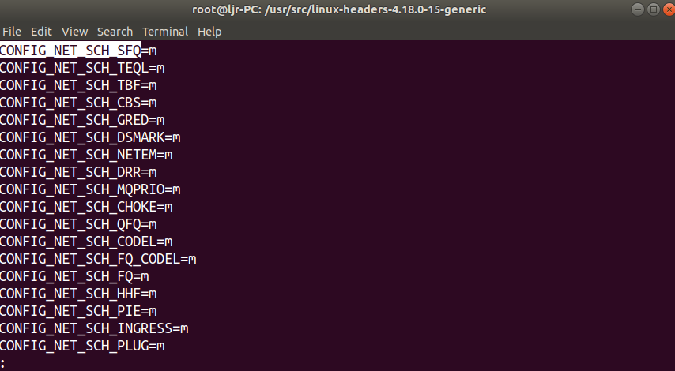
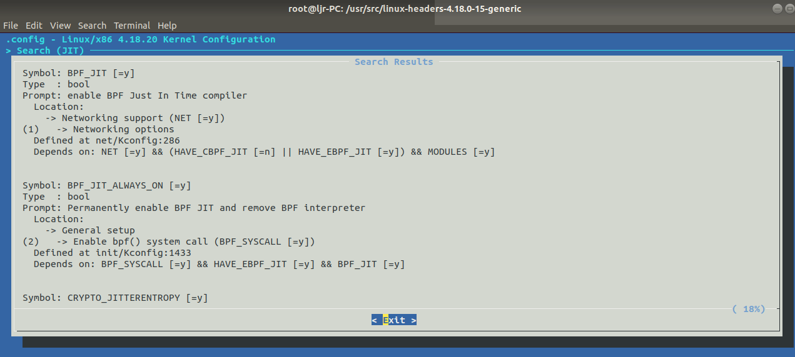
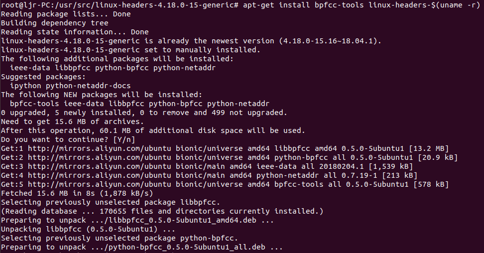
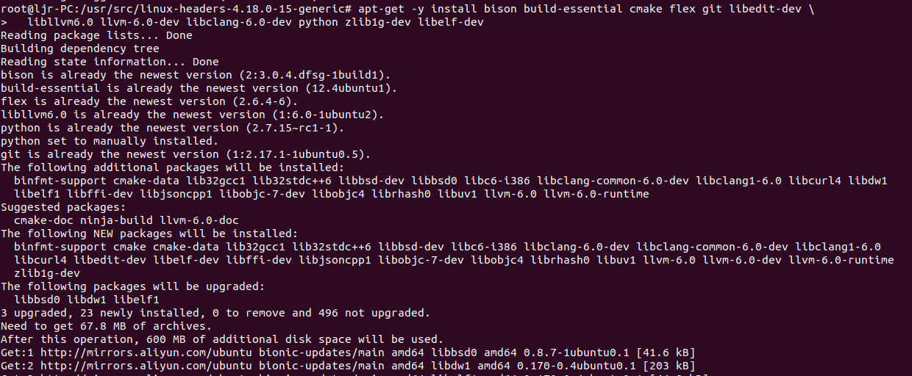
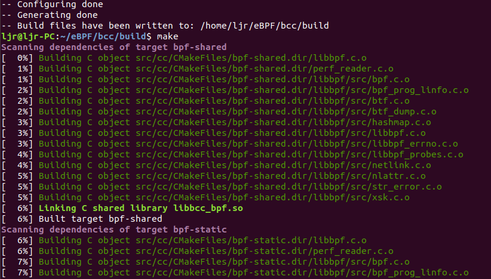
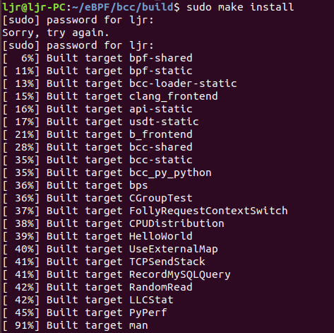
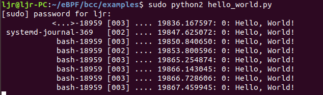
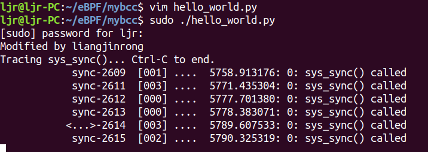
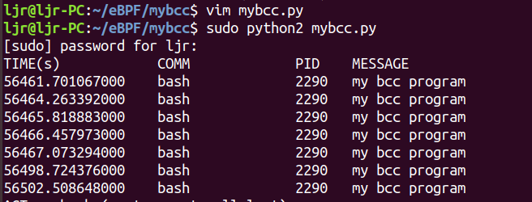

---

title: "eBPF学习——eBPF简介、安装和简单示例"
date: 2020-05-30T14:30:45+08:00
author: "梁金荣"
keywords: ["eBPF"]
categories : ["eBPF"]
banner : "img/blogimg/eBPF.png"
summary : "本文将简单介绍eBPF，并分享安装过程和bcc程序实例。eBPF是将原先的BPF发展成一个指令集更复杂、应用范围更广的“内核虚拟机”。eBPF支持在用户态将C语言编写的一小段“内核代码”注入到内核中运行，注入时要先用llvm编译得到使用BPF指令集的elf文件，然后从elf文件中解析出可以注入内核的部分，最后用 bpf_load_program 方法完成注入。"
---


# 1. eBPF简介
eBPF是将原先的BPF发展成一个指令集更复杂、应用范围更广的“内核虚拟机”。eBPF支持在用户态将C语言编写的一小段“内核代码”注入到内核中运行，注入时要先用llvm编译得到使用BPF指令集的elf文件，然后从elf文件中解析出可以注入内核的部分，最后用`bpf_load_program`方法完成注入。 用户态程序和注入到内核中的程序通过共用一个位于内核中map实现通信。为了防止注入的代码导致内核崩溃，eBPF会对注入的代码进行严格检查，拒绝不合格的代码的注入。

注入程序`bpf_load_program()`加入了更复杂的verifier 机制，在运行注入程序之前，先进行一系列的安全检查，最大限度的保证系统的安全。具体来说，verifier机制会对注入的程序做两轮检查：

- 首轮检查(First pass，实现于`check_cfg()`)可以被认为是一次深度优先搜索，主要目的是对注入代码进行一次 DAG(Directed Acyclic Graph，有向无环图)检测，以保证其中没有循环存在，除此之外，一旦在代码中发现以下特征，verifier 也会拒绝注入：
 >1. 代码长度超过上限；
 >2. 存在可能会跳出 eBPF 代码范围的 JMP，这主要是为了防止恶意代码故意让程序跑飞；
 >3. 存在永远无法运行(unreachable)的 eBPF 指令，例如位于 exit 之后的指令；

- 次轮检查(Second pass，实现于`do_check()`)较之于首轮则要细致很多：在本轮检测中注入代码的所有逻辑分支从头到尾都会被完全跑上一遍，所有指令的参数（寄存器）、访问的内存、调用的函数都会被仔细的捋一遍，任何的错误都会导致注入程序失败。

# 2. bcc的安装和Hello World

目前可以用 C 来实现 BPF，但编译出来的却仍然是 ELF 文件，无法直接注入内核，bcc实现了一步到位的生成出 BPF 代码。bcc 是一个 python 库，其中有很大一部分的实现是基于 C 和 C++的，python 是实现对 bcc 应用层接口的封装。使用 BCC 进行 BPF 的开发仍然需要我们自行利用 C 来设计 BPF 程序，但编译、解析 ELF、加载 BPF 代码块以及创建 map 等可以由 bcc框架实现。
## 2.1 安装bcc
### 2.1.1 检查内核配置选项
在使用bcc之前需要检查Linux系统内核配置选项，可以通过`less`命令查看内核配置选项
`/proc/config.gz`
或 
 `/boot/config-<kernel-version>`

```bash
less /boot/config-4.18.0-15-generic
```



BPF检查项如下：

```bash
CONFIG_BPF=y
CONFIG_BPF_SYSCALL=y
# [optional, for tc filters]
CONFIG_NET_CLS_BPF=m
# [optional, for tc actions]
CONFIG_NET_ACT_BPF=m
CONFIG_BPF_JIT=y
# [for Linux kernel versions 4.1 through 4.6]
CONFIG_HAVE_BPF_JIT=y
# [for Linux kernel versions 4.7 and later]
CONFIG_HAVE_EBPF_JIT=y
# [optional, for kprobes]
CONFIG_BPF_EVENTS=y
```
bcc 框架检查项：
```
CONFIG_NET_SCH_SFQ=m
CONFIG_NET_ACT_POLICE=m
CONFIG_NET_ACT_GACT=m
CONFIG_DUMMY=m
CONFIG_VXLAN=m
```
### 2.1.2 设置内核配置选项
若检查内核配置选项与上述检查项不符，在```/usr/src```目录下使用 ```make menuconfig```命令设置内核配置选项：




设置完成后需要编译内核。

### 2.1.3 安装bcc
设置好内核配置选项后，开始安装bcc，使用如下命令：
**第一步，安装 bcc 软件包**
```bash
sudo apt-get install bpfcc-tools linux-headers-$(uname -r)
```


**第二步，Ubuntu下构建依赖关系**

```bash
sudo apt-get -y install bison build-essential cmake flex git libedit-dev \
  libllvm6.0 llvm-6.0-dev libclang-6.0-dev python zlib1g-dev libelf-dev
```


**第三步，安装并编译bcc**

```bash
git clone https://github.com/iovisor/bcc.git
mkdir bcc/build; cd bcc/build
cmake .. -DCMAKE_INSTALL_PREFIX=/usr
```


```bash
make
```


```bash
sudo make install
```


到此，eBPF & bcc 已经安装完成。

## 2.2 Hello World
下面介绍一个简单的例子，代码如下：
```python
from bcc import BPF
BPF(text='int kprobe__sys_clone(void *ctx) { bpf_trace_printk("Hello, World!\\n"); return 0; }').trace_print()
```
可以看到，这段代码是在 python 中内嵌 C 语言程序的，请注意六点：
1. `text='...'` 这里定义了一个内联的、C 语言写的 BPF 程序。
2. `kprobe__sys_clone()` 这是一个通过内核探针（kprobe）进行内核动态跟踪的快捷方式。如果一个 C 函数名开头为 kprobe__ ，则后面的部分实际为设备的内核函数名，这里是 sys_clone() 。
3. void *ctx 这里的 ctx 实际上有一些参数，不过这里我们用不到，暂时转为 void * 。
4. `bpf_trace_printk()`这是一个简单的内核工具，用于 printf() 到 trace_pipe（译者注：可以理解为 BPF C 代码中的 printf()）。它一般来快速调试一些东西，不过有一些限制：最多有三个参数，一个%s ，并且 trace_pipe 是全局共享的，所以会导致并发程序的输出冲突，因而 BPF_PERF_OUTPUT() 是一个更棒的方案，我们后面会提到。
5. return 0 这是一个必须的部分。
6. `trace_print()` 一个 bcc 实例会通过这个读取 trace_pipe 并打印出来。

使用如下命令运行此示例：
```bash
sudo python2 hello_world.py
```
切换终端输入ls做测试时，运行结果如下图：


可以看到有新进程被创建，程序打印出“Hello, World!”。

# 3. bcc实例

动手写 bcc 程序，先来一个简单的bcc 程序，程序功能为探测 `sys_sync` ，检测到 sync 时打印出`“sys_sync() called”`。`sys_sync`系统调用被用户空间函数调用，用来将内核文件系统缓冲区的所有数据写入存储介质，`sys_sync`系统调用将buffer、inode和super在缓存中的数据写入设备。

## 3.1 程序代码

```python
#!/usr/bin/python
from bcc import BPF
print("Modified by liangjinrong")
print("Tracing sys_sync()... Ctrl-C to end.")
BPF(text='int kprobe__sys_sync(void *ctx) { bpf_trace_printk("sys_sync() called\\n"); return 0; }').trace_print()
```
此程序作用是检测到 sync 时打印出“sys_sync() called”，运行此程序，打开另一终端，多次输入sync 回车后，运行结果如下：




## 3.2 实例升级

本例程通过 `sys_clone()` 跟踪新进程的创建。
```python
from bcc import BPF

# define BPF program
prog = """
int hello(void *ctx) {
    bpf_trace_printk("my bcc program\\n");
    return 0;
}
"""

# load BPF program
b = BPF(text=prog)
b.attach_kprobe(event=b.get_syscall_fnname("clone"), fn_name="hello")

# header
print("%-18s %-16s %-6s %s" % ("TIME(s)", "COMM", "PID", "MESSAGE"))

# format output
while 1:
    try:
        (task, pid, cpu, flags, ts, msg) = b.trace_fields()
    except ValueError:
        continue
    print("%-18.9f %-16s %-6d %s" % (ts, task, pid, msg))

```

程序分析：
1. `prog = """ xxx ""`此处通过变量声明了一个 C 程序源码，其中xxx是可以换行的 C 程序。
2. `int hello() { xxx }` 声明了一个 C 语言函数，未使用上个例子中 kprobe__ 开头的快捷方式。BPF 程序中的任何 C 函数都需要在一个探针上执行，因此我们必须将 pt_reg* ctx 这样的 ctx 变量放在第一个参数。如果需要声明一些不在探针上执行的辅助函数，则需要定义成 static inline 以便编译器内联编译。有时候可能需要添加 _always_inline 函数属性。
3. `b.attach_kprobe(event=b.get_syscall_fnname("clone"), fn_name="hello")` 这里建立了一个内核探针，内核系统出现 clone 操作时执行 hello() 这个函数。可以多次调用 `attch_kprobe()` ，这样就可以用 C 语言函数跟踪多个内核函数。
4. `b.trace_fields()` 这里从 `trace_pipe` 返回一个混合数据，这对于黑客测试很方便，但是实际工具开发中需要使用 `BPF_PERF_OUTPUT()` 。

运行程序后，打开另一终端多次输入 ls ，可以看到程序与进行结果如下：

