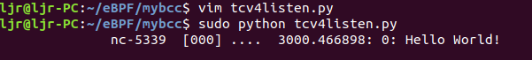
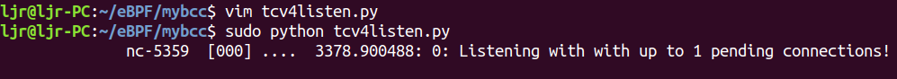
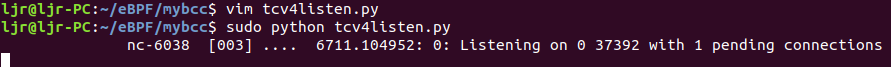

eBPF 简介及bcc的安装和实例请看此文：[EBPF学习——EBPF简介、安装和简单示例](http://kerneltravel.net/blog/2020/ebpf_ljr_no1/)

本文将使用 bcc工具抓取内核网络中的数据，包括抓取 backlog 信息、port 和 IP 信息、网络命名空间信息等。bcc 是基于 LLVM 的工具集，用 Python 封装了底层机器相关的细节，bcc工具使得 eBPF 的使用更加方便，使用时内核探测代码用 C 写， 数据处理用 Python 。

eBPF 可以将任何内核函数调用转换成可带任何数据的用户空间事件。每当有程序监听 TCP socket，就得到一个事件通知。当在 `AF_INET` 和 `SOCK_STREAM` 类型的 socket 上调用系统调用 listen() 时，底层负责处理的内核函数就是 `inet_listen()`。我们可以用 kprobe 在它的入口做 hook，从打印一个 `Hello, World`开始。

# 1. bcc程序代码：

```c
from bcc import BPF

# Hello BPF Program
bpf_text = """
#include <net/inet_sock.h>
#include <bcc/proto.h>

// 1. Attach kprobe to "inet_listen"
int kprobe__inet_listen(struct pt_regs *ctx, struct socket *sock, int backlog)
{
    bpf_trace_printk("Hello World!\\n");
    return 0;
};
"""

# 2. Build and Inject program
b = BPF(text=bpf_text)

# 3. Print debug output
while True:
    print b.trace_readline()

```
这个程序做了 3 件事情：

- 依据命名规则，将探测点 attach 到 `inet_listen` 函数；
- 使用 LLVM eBPF 编译，将生成的字节码用 bpf() 系统调用注入（inject）内核，并自动根据命名规则 attach 到 probe 点；
- 从内核管道读取原始格式的输出，`bpf_trace_printk()` 可以将 tracing 信息打印到 `/sys/kernel/debug/tracing/trace_pipe` 下面的一个特殊管道。

# 2. 运行结果
运行此bcc程序，在另一个终端输入`nc -l 0 4242`，可以看到此bcc程序运行结果如下：

>nc 是个单连接的小工具。




# 3. 获取 backlog 信息
>“backlog” 是 TCP socket 允许建立的最大连接的数量(等待被 accept())。

将程序中的 `bpf_trace_printk` 修改为如下：
```c
bpf_trace_printk("Listening with with up to %d pending connections!\\n", backlog);
```
重新运行程序，在另一个终端输入`nc -l 0 4242`，因为 nc 是一个单链接的小工具，所以 backlog 是 1，运行结果如下：


# 4. 获取 port 和 IP 信息
阅读内核 `inet_listen` 源码发现，我们需要从 socket 对象中拿到 `inet_sock` 字段 。从内核直接拷贝这两行代码，放到我们 tracing 程序的开始处：
```c
// cast types. Intermediate cast not needed, kept for readability
struct sock *sk = sock->sk;
struct inet_sock *inet = inet_sk(sk);
```
port 可以从 `inet->inet_sport` 中获得，注意是网络序（大端）。IP 从 inet->inet_rcv_saddr 读取。现在将程序中的 `bpf_trace_printk` 修改为如下：
```c
bpf_trace_printk("Listening on %x %d with %d pending connections\\n", inet->inet_rcv_saddr, inet->inet_sport, backlog);
```
重新运行程序，在另一个终端输入`nc -l 0 4242`，运行结果如下：


# 5. 获取网络空间命名信息
在用户空间，可以在` /proc/PID/ns/net `查看网络命名空间，格式类似于 `net:[4026531957]`。中括号中的数字是网络命名空间的 inode。这意味着，想获取命名空间，我们可以直接去读 proc 。但是，这种方式只适用于运行时间比较短的进程，而且还存在竞争。下面我们使用 eBPF 从 kernel 直接读取 inode 值，添加获取网络命名空间功能后的完整bcc程序如下：
```c
from bcc import BPF

# Hello BPF Program
bpf_text = """
#include <net/inet_sock.h>
#include <bcc/proto.h>
#include <net/sock.h>
// 1. Attach kprobe to "inet_listen"
int kprobe__inet_listen(struct pt_regs *ctx, struct socket *sock, int backlog)
{
    // cast types. Intermediate cast not needed, kept for readability
    struct sock *sk = sock->sk;
    struct inet_sock *inet = (struct inet_sock *)sk;
    // Create an populate the variable
	u32 netns = 0;

	// Read the netns inode number, like /proc does
	netns = sk->__sk_common.skc_net.net->ns.inum;

    bpf_trace_printk("Listening on %x %d with %d pending connections in container %d \\n", inet->inet_rcv_saddr, inet->inet_sport, backlog, netns);
    return 0;
};
"""

# 2. Build and Inject program
b = BPF(text=bpf_text)

# 3. Print debug output
while True:
    print b.trace_readline()


```
运行时出现了这样的错误：
```
error: <unknown>:0:0: in function kprobe__inet_listen i32 (%struct.pt_regs*): too many args to 0x55a83e8f8320: i64 = Constant<6>
```
Clang 想告诉我们：`bpf_trace_printk` 带的参数太多了，这是 BPF 的限制。解决这个问题的办法就是使用 perf，它支持传递任意大小的结构体到用户空间。（注意需要 Linux 4.4 以上内核）

今天先分享到这里，下篇文章继续分享具体解决办法以及在eBPF内核探测中如何将任意系统调用转换成事件。

参考文章：https://blog.yadutaf.fr/2016/03/30/turn-any-syscall-into-event-introducing-ebpf-kernel-probes/

