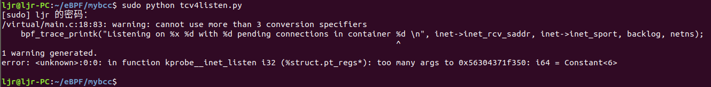
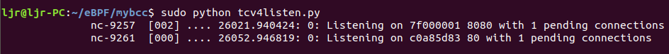
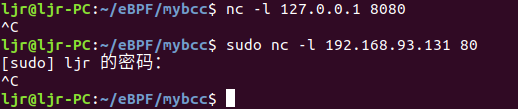
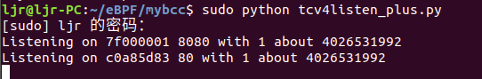

相关文章：

[EBPF简介、安装和简单示例](http://kerneltravel.net/blog/2020/ebpf_ljr_no1/)

[获取内核网络中的SOCKET信息](http://kerneltravel.net/blog/2020/ebpf_ljr_no2/)

Linux 4.4 以上内核基于 eBPF 可以将任何内核函数调用转换成可带任何数据的用户空间事件。上回，我们说到`bpf_trace_printk` 带的参数太多了，会出现`error: <unknown>:0:0: in function kprobe__inet_listen i32 (%struct.pt_regs*): too many args to 0x55a83e8f8320: i64 = Constant<6> `这样的错误，这是 BPF 的限制。解决这个问题的办法就是使用 perf，它支持传递任意大小的结构体到用户空间。

我们对比原来的代码进行修改，原代码如下：

```c
from bcc import BPF

# Hello BPF Program
bpf_text = """
#include <net/inet_sock.h>
#include <bcc/proto.h>
#include <net/sock.h>
// 1. Attach kprobe to "inet_listen"
int kprobe__inet_listen(struct pt_regs *ctx, struct socket *sock, int backlog)
{
    // cast types. Intermediate cast not needed, kept for readability
    struct sock *sk = sock->sk;
    struct inet_sock *inet = (struct inet_sock *)sk;
    // Create an populate the variable
	u32 netns = 0;

	// Read the netns inode number, like /proc does
	netns = sk->__sk_common.skc_net.net->ns.inum;

    bpf_trace_printk("Listening on %x %d with %d pending connections in container %d \\n", inet->inet_rcv_saddr, inet->inet_sport, backlog, netns);
    return 0;
};
"""

# 2. Build and Inject program
b = BPF(text=bpf_text)

# 3. Print debug output
while True:
    print b.trace_readline()

```


运行时会出现如下错误：





要使用 perf，我们需要：

- 定义一个结构体
- 声明一个事件
- 推送（push）事件
- Python 端再定义一遍这个事件（将来这一步就不需要了）
- 消费并格式化输出事件

为了使内核检测器验证这个程序的内存访问是合法的，我们让内存访问变得更加显式，使用受信任的 `bpf_probe_read` 函数，可以用它读取任何内存地址。

为了使得程序可以正常运行，`bpf_trace_printk` 先使用三个参数，只获取IP信息，端口和 backlog 信息，将程序改为：
```c
from bcc import BPF

# BPF Program
bpf_text = """
#include <net/sock.h>
#include <net/inet_sock.h>
#include <bcc/proto.h>

// Send an event for each IPv4 listen with PID, bound address and port
int kprobe__inet_listen(struct pt_regs *ctx, struct socket *sock, int backlog)
{
    // Cast types. Intermediate cast not needed, kept for readability
    struct sock *sk = sock->sk;
    struct inet_sock *inet = inet_sk(sk);

    // Working values. You *need* to initialize them to give them "life" on the stack and use them afterward
    u32 laddr = 0;
    u16 lport = 0;

    // Pull in details. As 'inet_sk' is internally a type cast, we need to use 'bpf_probe_read'
    // read: load into 'laddr' 'sizeof(laddr)' bytes from address 'inet->inet_rcv_saddr'
    bpf_probe_read(&laddr, sizeof(laddr), &(inet->inet_rcv_saddr));
    bpf_probe_read(&lport, sizeof(lport), &(inet->inet_sport));

    // Push event
    bpf_trace_printk("Listening on %x %d with %d pending connections\\n", ntohl(laddr), ntohs(lport), backlog);
    return 0;
};
"""

# Build and Inject BPF
b = BPF(text=bpf_text)

# Print debug output
while True:
  print b.trace_readline()
```
运行程序，在另一终端使用nc小工具建立单连接，结果如下：





可以看到，我们已经成功地使用`bpf_probe_read`读取到了相应变量的地址，获取了IP信息，端口和 backlog 信息。接下来我们使用perf，修改程序，使得`bpf_trace_printk` 带的参数超过三个。

在bcc程序的c程序中加入以下代码：
```c
struct listen_evt_t {
    u64 laddr;
    u64 lport;
    u64 netns;
    u64 backlog;
};
BPF_PERF_OUTPUT(listen_evt);
```
在`kprobe__inet_listen`函数中使用以下代码代替`bpf_trace_printk`：
```c
struct listen_evt_t evt = {
    .laddr = ntohl(laddr),
    .lport = ntohs(lport),
    .netns = netns,
    .backlog = backlog,
};
listen_evt.perf_submit(ctx, &evt, sizeof(evt));
```
在python中加入以下代码：
```python
# We need ctypes to parse the event structure
import ctypes

# Declare data format
class ListenEvt(ctypes.Structure):
    _fields_ = [
        ("laddr",   ctypes.c_ulonglong),
        ("lport",   ctypes.c_ulonglong),
        ("netns",   ctypes.c_ulonglong),
        ("backlog", ctypes.c_ulonglong),
    ]

# Declare event printer
def print_event(cpu, data, size):
    event = ctypes.cast(data, ctypes.POINTER(ListenEvt)).contents
    print("Listening on %x %d with %d about %d" % (
        event.laddr,
        event.lport,
        event.backlog,
        event.netns,
    ))
```
使用以下代码代替python中的循环输出：
```python
b["listen_evt"].open_perf_buffer(print_event)
while True:
    b.kprobe_poll()
```
最终修改后的代码如下：
```c
from bcc import BPF

# We need ctypes to parse the event structure
import ctypes

# Declare data format
class ListenEvt(ctypes.Structure):
    _fields_ = [
        ("laddr",   ctypes.c_ulonglong),
        ("lport",   ctypes.c_ulonglong),
        ("netns",   ctypes.c_ulonglong),
        ("backlog", ctypes.c_ulonglong),
    ]

# Declare event printer
def print_event(cpu, data, size):
    event = ctypes.cast(data, ctypes.POINTER(ListenEvt)).contents
    print("Listening on %x %d with %d about process %d" % (
        event.laddr,
        event.lport,
        event.backlog,
        event.netns,
    ))

# BPF Program
bpf_text = """
#include <net/sock.h>
#include <net/inet_sock.h>
#include <bcc/proto.h>

struct listen_evt_t {
    u64 laddr;
    u64 lport;
    u64 netns;
    u64 backlog;
};
BPF_PERF_OUTPUT(listen_evt);

// Send an event for each IPv4 listen with PID, bound address and port
int kprobe__inet_listen(struct pt_regs *ctx, struct socket *sock, int backlog)
{
    // Cast types. Intermediate cast not needed, kept for readability
    struct sock *sk = sock->sk;
    struct inet_sock *inet = inet_sk(sk);

    // Working values. You *need* to initialize them to give them "life" on the stack and use them afterward
    u32 laddr = 0;
    u16 lport = 0;

    // Create an populate the variable
    u32 netns = 0;

    // Read the netns inode number, like /proc does
    netns = sk->__sk_common.skc_net.net->ns.inum;

    // Pull in details. As 'inet_sk' is internally a type cast, we need to use 'bpf_probe_read'
    // read: load into 'laddr' 'sizeof(laddr)' bytes from address 'inet->inet_rcv_saddr'
    bpf_probe_read(&laddr, sizeof(laddr), &(inet->inet_rcv_saddr));
    bpf_probe_read(&lport, sizeof(lport), &(inet->inet_sport));

    // Push event
    struct listen_evt_t evt = {
        .laddr = ntohl(laddr),
        .lport = ntohs(lport),
        .netns = netns,
        .backlog = backlog,
    };
    listen_evt.perf_submit(ctx, &evt, sizeof(evt));

    //bpf_trace_printk("Listening on %x %d with %d pending connections\\n", ntohl(laddr), ntohs(lport), backlog);
    return 0;
};
"""

# Build and Inject BPF
b = BPF(text=bpf_text)

# Print debug output
b["listen_evt"].open_perf_buffer(print_event)
while True:
    b.kprobe_poll()
```
运行程序，在另一终端使用nc小工具建立单连接：




程序结果如下：





可以看到，我们已经成功地使用`bpf_probe_read`读取到了相应变量的地址，使用perf使得`bpf_trace_printk` 带了四个参数，获取了IP信息，端口、backlog 信息和网络命名空间。

参考链接：https://blog.yadutaf.fr/2016/03/30/turn-any-syscall-into-event-introducing-ebpf-kernel-probes/

