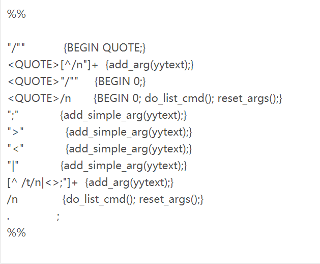

## **Shell解释器DIY**


##### **本文适合的读者对象**

- 对linux环境上的c语言开发有一定经验；

- 对linux环境编程（比如进程、管道）有一点了解。

#### **一、概述：**

本章的目的是让大家了解shell的基本原理，并且自己动手做一个shell解释器。为此：

首先，我们解释什么是shell解释器；

其次，我们要大致了解shell解释器具有哪些功能；

最后，我们具体讲解如何实现一个简单的 shell 解释器，并对需要用到的一些 linux环境编程的知识做一定讲解，并提醒你如果想深入掌握，应该去看哪些资料。

#### **二、SHELL解释器是什么？**

Shell解释器是一个程序。对，是一个程序，而且，它就在我们的身边。在linux系统中，当我们输入用户名和密码登录之后，我们就开始执行一个shell解释器程序，通常是 /bin/bash，当然也可以是别的，比如/bin/sh。（详细概念请看第一期中的shell有关部分）

> 提示：在 /etc/passwd 文件中，每个用户对应的最后一项，就指定了该用户登陆之后，要执行哪个shell解释器程序。

在 linux 字符界面下，输入

```
man bash
```

调出 bash 的帮助页面
帮助的最开始就对bash下了一个定义：

**bash是一个兼容于 sh的命令语言解释器，它从标准输入或者文件中读取命令并执行。它的意图是实现 IEEE POSIX标准中对 shell和工具所规范的内容。**

#### **三、SHELL解释器的作用**

在登录 linux 系统之后，屏幕上就会出现一行提示符，在我的机器上，是这样的：

**[root@stevens root]#**


这行提示符就是由bash解释器打印出来的，这说明，现在已经处于 bash 的控制之下了，也同时提示用户，可以输入命令。用户输入命令，并回车确认后，bash分析用户的命令，如果用户的命令格式正确，那么bash就按照用户的意思去做一些事情。

比如，用户输入：
```
[root@stevens root]# echo “hello, world”
```
那么，bash就负责在屏幕上打印一行“hello world”。


如果，用户输入：
```
[root@stevens root]# cd /tmp
```
那么，bash就把用户的当前目录改变为 /tmp。

 

所以，shell解释器的作用就是对用户输入的命令进行“解释”，有了它，用户才可以在 linux 系统中任意挥洒。没有它的帮助，你纵然十八般本领在身，也施展不出。

 

bash每次在“解释”完用户命令之后，又打印出一行提示符，然后继续等待用户的下一个命令。这种循环式的设计，使得用户可以始终处于 bash 的控制之下。除非你输入 exit、logout明确表示要退出bash。

#### **四、SHELL语法梗概**

我们不停地命令 bash 做这做那，一般情况下它都很听话，按你的吩咐去做。可有时候，它会对你说：“嗨，老兄，你的命令我理解不了，无法执行”。例如，你输入这样的命令：


**[root@stevesn root]# aaaaaa**


bash会告诉你：

**bash: aaaaaa: command not found**


是的，你必须说得让它能听懂，否则它就给你这么一句抱怨，当然也还会有其它的牢骚。

那么，什么样格式的命令，它才能正确理解执行了？这就要引出shell 的语言规范了。

 

Shell作为一个命令语言解释器，有一套自己的语言规范，凡是符合这个规范的命令，它就可以正确执行，否则就会报错。这个语言规范是在 IEEE POSIX的第二部分：“shell和tools规范”中定义的。关于这份规范，可以在这里看到。

官方的东西，总是冗长而且晦涩，因为它要做到面面俱到且不能有破绽。如果读者有兴趣，可以仔细研究这份规范。而我们的目的只是理解shell的实现思想，然后去实现一个简单的 shell 解释器，所以没必要陷入枯燥的概念之中。

现在请继续在 linux 字符界面下输入 man bash，调出 bash 的帮助页面，然后找到 “shell语法”那一部分，我们就是以这里的描述作为实现的依据。

 

在 bash帮助的“shell 语法”一节，是这样来定义shell 语法的：

- **简单命令**


  简单命令是(可选的)一系列变量赋值, 紧接着是空白字符分隔的词和重定向符号, 最后以一个控制操作符结束. 第一个词指明了要执行的命令, 它被作为第 0 个参数. 其余词被作为这个命令的参数.

  这个定义可以这样来理解：

1. 可以有变量赋值，例如

	 **a=10 b=20 export a b**

2.  “词”是以空白字符分隔开的，空白字符包括制表符（tab）和空格，例如：

     **ls /tmp**

     就是两个词，一个 ls，一个 /tmp

3. 可以出现重定向符号，重定向符号是“>”和“<”，例如：

     **echo “hello world” > /tmp/log**


4. 简单命令结束于控制操作符，控制操作符包括：
    **|| &  &&   ;  ;; ( )  | **
    例如，用户输入：
    **ls /tmp**
    用户最后敲的回车键就是控制操作符 newline，表示要结束这个简单命令。
    
    如果用户输入：
    **echo “100” ; echo “200”**
    那么这是两个简单命令，第一个结束于“;”，第二个结束于newline。
    
5. 简单命令的第一个词是要执行的命令，其余的词都是这个命令的参数，例如：

   **echo “hello world” echo**

   第一个echo 是命令，第二个词“hello world”是参数1，第三个词 echo 是参数2，而不再作为一个命令了。
       

   简单命令是 shell 语法中最小的命令，通过简单命令的组合，又可以得到管道命令和列表命令。


​     

- **管道（命令）**

  管道是一个或多个简单命令的序列，两个简单命令之间通过管道符号（“|”）来分隔

   

  例如

  **echo “hello world”** **|** **wc** **–l**

  就是一个管道，它由两个简单命令组成，两个简单命令之间用管道符号分隔开。

  我们可以看到，管道符号“|”也是属于上面提到的控制操作符。

   

  根据这个定义，一个简单命令也同时是一个管道。

  

  管道的作用是把它前面的那个简单命令的输出作为后面那个简单命令的输入，就上面这个例子来说：

  echo “hello world” 本来是要在标准输出（屏幕）上打印 “hello world” 的，但是管道现在不让结果输出到屏幕上，而是“流”到 wc –l 这个简单命令，wc –l 就把“流”过来的数据作为它的标准输入进行计算，从而统计出结果是 1 行。

  

  关于管道更详细的内容，我们在后面具体实现管道的时候再说明。

 

- **列表（命令）：**

  列表是一个或多个管道组成的序列，两个管道之间用操作符 ;, &, &&, 或 || 分隔。我们看到，这几个操作符都属于控制操作符。

  例如

  **echo “hello world” | wc –l ;** **echo “nice to meet you”**

  就是一个列表，它由两个管道组成，管道之间用分号（;）隔开

  分号这种控制操作符仅仅表示一种执行上的先后顺序。

 

- **复合命令**


  ​    这个定义比较复杂，实现起来也有相当难度，在咱们这个示例程序中，就不实现了。

  ​	以上是 shell 语法规范的定义，我们的 shell 程序就是要以此规范为依据，实现对简单命令、管道和列表的解释。对于列表中的控制操作符，我们只支持分号（;），其它的留给读者自己来实现。

 

接下来，我们具体介绍如何实现一个简单的 shell解释器。

#### **五、具体实现**

##### 5.1、程序主框架

主程序很简单，它在做一些必要的初始化工作之后，进入这样一个循环：

- 打印提示符并等待用户输入

- 获取用户输入

- 分析用户输入

- 解释执行；


如果用户输入 logout或者 exit 之后，才退出这个循环。

 

用类似伪代码的形式表示如下：

```
while(1) {
       print_prompt();
       get_input();
       parse_input();
       if(“logout” || “exit”)
              break;
       do_cmd();
}
```

######  5.1.1 读取用户输入

如何获取用户输入？一种方法是通过 getchar() 从标准输入每次读一个字符，如果读到的字符是 ‘\n’，说明用户键入了回车键，那么就把此前读到的字符串作为用户输入的命令。

代码如下：

```
int len = 0;
int ch;
char buf[300];
ch = getchar();
while(len < BUFSIZ && ch != '\n') {
       buf[len++] = ch;
       ch = getchar();
}
if(len == BUFSIZ) {
       printf("command is too long\n");
       break;
}
buf[len] = '\n';
len++;
buf[len] = 0;
```

但是，我们注意到，在 bash 中，可以用“<-”和“->”键在命令行中左右移动，可以用上下键调用以前使用的命令，可以用退格键来删除一个字符，还可以用 tab 键来进行命令行补全。我们的shell如果也要支持这些功能，那么就必须对这些键进行处理。这样仅仅对用户输入的读取就非常麻烦了。

实际上，任何需要一个获取用户输入的程序，都会涉及到同样的问题，如何象bash 那样处理键盘？GNU readline 库就是专门解决这个问题的，它把对键盘的操作完全封装起来，对外只提供一个简单的调用接口。有了它，对键盘的处理就不再让人头疼了。

关于 readline 库的详细信息，可以通过 man readline 来看它的帮助页面。在我们的 shell 程序中，我是这样来使用 readline的。

```
char* line;
char prompt[200];
while(1) {
       set_prompt(prompt);
       if(!(line = readline(prompt)))
              break;
       ......
}
```

首先通过 set_prompt() 来设置要输出的提示符，然后以提示符作为参数调用 readline()，这个函数等待用户输入，并动态创建一块内存来保存用户输入的数据，可以通过返回的指针 line 得到这块内存。在每次处理完用户输入的命令之后，我们必须自己负责来释放这块内存。

有了 readline 之后，我们就可以象 bash 那样使用键盘了。

在通过 readline 获取用户输入之后，下一步就是对用户输入的命令进行分析。

######  5.1.2 命令行分析

对命令行的分析，实际上是一个词法分析过程。学过编译原理的朋友，都听说过 lex 和yacc 的大名，它们分别是词法分析和语法分析工具。Lex 和 yacc 都有GNU的版本（open source 的思想实在是太伟大了，什么好东东都有免费的用），分别是 flex 和 bison。

所谓“工欲善其事，必先利其器”，既然有这么好的工具，那我们就不必辛辛苦苦自己进行词法分析了。对，我们要用 lex 来完成枯燥的命令行词法分析工作。

“老大，不是吧，我不会 lex ，怎么玩啊？”

呵呵，这没办法，不会就学啊， lex 很简单的 ：）去买本《lex与yacc》（中国电力出版社）来看吧。第一次学当然稍微有点难度，不过一旦掌握了，以后再碰到类似问题，就可以多一个利器，可以节省劳动力了。

 

在我们的这个 shell 程序中，用 flex 来完成词法分析工作。相对语法分析来说，词法分析要简单得多。由于我们只是做一个简单的 shell，因此并没有用到语法分析，而实际上在 bash 的实现代码中，就用到了语法分析和 yacc。

 

关于 lex 的细节，在这里我就不能多说了。Lex程序，通常分为三个部分，其中进行语法分析工作的就是它的第二部分： “规则”。规则定义了在词法分析过程中，遇到什么样的情况，应该如何处理。

 

词法分析的思路，就是根据前面定义的“shell语法规范”来把用户输入的命令行拆解成一个一个的参数。


首先，我们要把用户输入的命令，以**空白字符（tab键或者空格）**分隔成一个个的参数，并把这些参数保存到一个参数数组中。但是，这其中有几种特殊情况。

一、如果遇到的字符是**“;”、“>”、“<”**或**“|”**，由于这些符号是管道或者列表中所用到的分隔符，因此必须把它们当作一个单独的参数。

二、以**双引号（”）**括起来的字符串要作为一个单独的参数，即使其中出现了空白字符、“;”、“>”、“<”、“|”。其实，在POSIX标准中，对引号的处理相当复杂，不仅包括双引号（”），还有单引号（’）、反引号（`），在什么情况下，应该用什么样的引号以及对引号中的字符串应该如何解释，都有一大堆的条款。我们这里只是处理一种极简单的情况。

 

其次，如果我们遇到换行符（’\n’），那么就结束本次命令行分析。根据前面定义的 shell 语法规范，最上层的是列表命令，因此下一步是把所有的参数作为一个列表命令来处理。

 

根据这个思路，我们来看对应的 lex 规则。



我们对这些规则逐条解释：

 

1－4这4条规则，目的是为了在命令行中支持引号，它们用到了 lex 规则的状态特性。

1、"\\""      {BEGIN QUOTE;}

2、<QUOTE>[^\n"]+ {add_arg(yytext);}

3、<QUOTE>"\\""   {BEGIN 0;}

4、<QUOTE>\n    {BEGIN 0; do_list_cmd(); reset_args();}

 

1、  如果扫描到引号（ “），那么进入 QUOTE 状态。在这个状态下，即使扫描到空白字符或“;”、“>”、“<”、“|”，也要当作普通的字符。

2、  如果处于 QUOTE状态，扫描到除引号和回车以外的字符，那么调用 add_arg()函数，把整个字符串加入到参数数组中。

3、  如果处于QUOTE状态，扫描到引号，那么表示匹配了前面的引号，于是恢复到默认状态。

4、  如果处于QUOTE状态，扫描到回车，那么结束了本次扫描，恢复到默认状态，并执行 do_list_cmd()，来执行对列表命令的处理。

 

 

以下几条规则，是在处于默认状态的情况下的处理。

5、";"             {add_simple_arg(yytext);}

6、">"             {add_simple_arg(yytext);}

7、"<"             {add_simple_arg(yytext);}

8、"|"             {add_simple_arg(yytext);}

9、[^ \t\n|<>;"]+  {add_arg(yytext);}

10、\n              {do_list_cmd(); reset_args();}

11、.               ;

 

 

5、  如果遇到分号（;），因为这是一个列表命令结束的操作符，所以作为一个单独的参数，执行 add_simple_arg()，将它加入参数数组。

6、  如果遇到 >，因为这是一个简单命令结束的操作符，所以作为一个单独的参数，执行 add_simple_arg()，将它加入参数数组。

7、  如果遇到 <，因为这是一个简单命令结束的操作符，所以作为一个单独的参数，执行 add_simple_arg()，将它加入参数数组。

8、  如果遇到管道符号（|），因为这是一个管道命令结束的操作符，所以作为一个单独的参数，执行 add_simple_arg()，将它加入参数数组。

9、  对于不是制表符（tab）、换行符（’\n’）、| 、<、>和分号（;）以外的字符序列，作为一个普通的参数，加入参数数组。

10、如果遇到换行符，那么结束本次扫描，执行 do_list_cmd()，来执行对列表命令的处理。

11、 对于任意其它字符，忽略


通过 lex 的“规则”把用户输入的命令行分解成一个个的参数之后，都要执行 do_list_cmd() 来处理列表命令。

##### 5.2、程序主框架
首先是对处于“shell语法规范”中最上层的列表命令的处理。

 

-  列表命令的处理过程：

  依次检查参数数组中的每一个参数，如果是分号（;），那么就认为分号前面的所有参数组成了一个管道命令，调用 do_pipe_cmd() 来执行对管道命令的处理。如果扫描到最后，不再有分号出现，那么把剩下的所有参数作为一个管道命令处理。

 

代码很简单：

```
static void do_list_cmd(){
    int i = 0;
    int j = 0;
    char *p;
    while(argbuf[i]){
        if(strcmp(argbuf[i],",")==0){
            p=argbuf[i];
            argbuf[i] = 0;
            do_pipe_cmd(i-j,argbuf+1);
            argbuf[i]=p;
            j=++i;
        }
        else
            i++;
    }do_pipe_cmd(i-j,argbuf+j);
}
```

接下来是对管道命令的处理。

 

- **管道命令的处理：**

管道是进程间通信（IPC）的一种形式，关于管道的详细解释在《unix高级环境编程》第14章：“进程间通信”以及《unix网络编程：第2卷：进程间通信》第4章：“管道和FIFO”中可以看到。

 

我们还是来看一个管道的例子：

 

**[root@stevens root]# echo “hello world”|wc –c |wc –l**

 

在这个例子中，有三个简单命令和两个管道。

第一个命令是 echo “hello world”，它在屏幕上输出 hello world。由于它后面是一个管道，因此，它并不在屏幕上输出结果，而是把它的输出重定向到管道的写入端。

第二个命令是 wc –c，它本来需要指定输入源，由于它前面是一个管道，因此它就从这个管道的读出端读数据。也就是说读到的是 hello world，wc –c 是统计读到的字符数，结果应该是12。由于它后面又出现一个管道，因此这个结果不能输出到屏幕上，而是重定向到第二个管道的写入端。

第三个命令是 wc –l。它同样从第二个管道的读出端读数据，读到的是12，然后它统计读到了几行数据，结果是1行，于是在屏幕上输出的最终结果是1。

 

在这个例子中，第一个命令只有一个“后”管道，第三个命令只有一个“前”管道，而第二个命令既有“前”管道，又有“后”管道。

 

在我们处理管道命令的do_pipe_cmd()函数中，它的处理过程是：

 

首先定义两个管道 prefd 和 postfd，它们分别用来保存“前”管道和“后”管道。此外，还有一个变量 prepipe 来指示“前”管道是否有效。

然后依次检查参数数组中每一个参数，如果是管道符号（|），那么就认为管道符号前面所有的参数组成了一个简单命令，并创建一个“后”管道。如果没有“前”管道（管道中第一个简单命令是没有“前”管道的），那么只传递“后”管道来调用do_simple_cmd()，否则，同时传递“前”管道和“后”管道来调用 do_simple_cmd()。

执行完以后，用“前”管道来保存当前的“后”管道，并设置“前”管道有效标识prepipe，继续往后扫描。如果扫描到最后，不再有管道符号出现，那么只传递“前”管道来调用do_simple_cmd()。

 

代码如下：

```
int i = 0, j = 0, prepipe = 0;
int prefd[2], postfd[2];
char* p;
while(argv[i]) {
       if(strcmp(argv[i], "|") == 0) { // pipe
              p = argv[i];
              argv[i] = 0;
              pipe(postfd);         //create the post pipe
              if(prepipe)     
                     do_simple_cmd(i-j, argv+j, prefd, postfd);
              else
                     do_simple_cmd(i-j, argv+j, 0, postfd);
              argv[i] = p;
              prepipe = 1;
              prefd[0] = postfd[0];
              prefd[1] = postfd[1];
              j = ++i;
       } else
              i++;
}
if(prepipe)
       do_simple_cmd(i-j, argv+j, prefd, 0);
else
       do_simple_cmd(i-j, argv+j, 0, 0);
```

最后，我们分析简单命令的处理过程。

 

- 简单命令处理过程


我们已经看到，对列表命令和管道命令的处理，实际只是一个分解过程，最终命令的执行还是要由简单命令来完成。

在简单命令的处理过程中，必须考虑以下情况：

 

1、区分内部命令和外部命令

根据简单命令的定义，它的第一个参数是要执行的命令，后面的参数作为该命令的参数。要执行的命令有两种情况：

一种是外部命令，也就是对应着磁盘上的某个程序，例如 wc、ls等等。对这种外部命令，我们首先要到指定的路径下找到它，然后再执行它。

二是内部命令，内部命令并不对应磁盘上的程序，例如cd、echo等等，它需要shell自己来决定该如何执行。例如对 cd 命令，shell就应该根据它后面的参数改变当前路径。

 

对于外部命令，需要创建一个子进程来执行它，而对于内部命令，则没有这个必要。

外部命令的执行，是通过 exec 函数来完成的。有六种不同形式的 exec 函数，它们可以统称为 exec 函数。我们使用的是 execv()。关于 exec的细节，请看《unix环境高级编程》第8章：进程控制。

对于内部命令，我们目前支持五种，分别是：

exit：退出shell解释器

cd：改变目录

echo：回显

export：导入或显示环境变量

history：显示命令历史信息

 

这几个内部命令分别由 do_exit()、do_cd()、do_echo()、do_export()、do_history()来实现。

 

2、处理重定向

在简单命令的定义中，包括了对重定向的支持。重定向有多种情况，最简单的是输入重定向和输出重定向，分别对应着 “<” 和 “>”。

输入重定向，就是把“<” 后面指定的文件作为标准输入，例如：

wc < xxx
表示把 xxx 这个文件的内容作为 wc 命令的输入。

 


输出重定向，就是把“>”后面指定的文件作为标准输出，例如：

echo “hello world” > xxx

表示把 echo “hello world” 的结果输入到 xxx 文件中，而不是屏幕上。

 

为了支持重定向，我们首先对简单命令的参数进行扫描，如果遇到“<” 或者 “>”那么就认为遇到了重定向，并把“<” 或者 “>”符号后面的参数作为重定向的文件名称。

对于输入重定向，首先是以只读方式打开“<”后面的文件，并获得文件描述符，然后将该文件描述符复制给标准输入。

对于输出重定向，首先是以写方式打开“>”后面的文件，并获得文件描述符，然后将该文件描述符复制给标准输出。

具体实现在 predo_for_redirect() 函数中：

 

3、管道的实现

管道的实现实际上也是一种重定向的处理。对于“前”管道，类似于输入重定向，不同的是，它是把一个指定的描述符（“前”管道的输出端）复制给标准输入。对于“后”管道，类似于输出重定向，不同的是，它把一个指定的描述符（“后”管道的输入端）复制给标准输出。

在对管道的处理上，还必须要注意管道和输入或输出重定向同时出现的情况，如果是一个“前”管道和一个输入重定向同时出现，那么优先处理输入重定向，不再从“前”管道中读取数据了。同样，如果一个“后”管道和一个输出重定向同时出现，那么优先处理输出重定向，不再把数据输出到“后”管道中。

 


至此，我们已经描述了实现一个简单的 shell 解释器的全部过程，相应的代码和 makefile 在我们的网站上可以下载。希望大家能够结合代码和这篇文章，亲自动手做一次，以加深对shell 解释器的理解。

---

[实验源码下载](img/msh.tgz)

