# 前言

Git 是一个开源的分布式版本控制系统，用于敏捷高效地处理任何项目。本文通过介绍常见的git命令，分享Ubuntu下如何快速使用Git管理项目，话不多说，直接开始用git。

# 1、准备工作
## （1）安装git
话说要使用GitHub，总得有个GitHub账号吧，所以第一步就是去GitHub官网注册一个GitHub账号，注册的时候会让你输入用户名、邮箱、密码，那么请牢记你的GitHub账号的所有信息，因为以后配置、登录和提交代码都会用到。然后嘞，你需要在Linux中安装git工具，很简单，在terminal中输入以下命令:
```shell
sudo apt-get install git
```

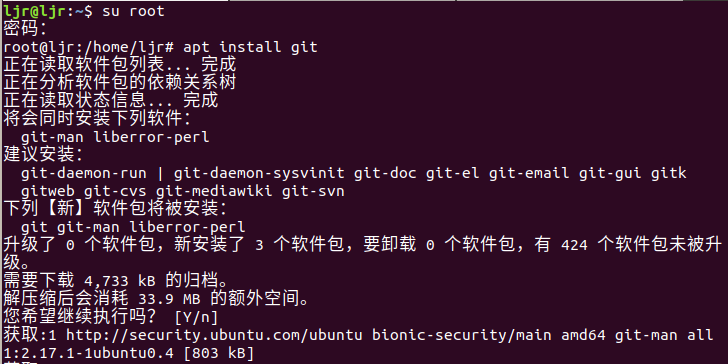


如上图，一路回车，即可安装成功，如果不放心，还可以输入以下命令:

```shell
git --version
```
如果能显示git版本信息，说明你确实安装成功了。


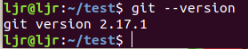


## （2）配置用户信息
Git 自带一个 git config 的工具来帮助设置控制 Git 外观和行为的配置变量。 这些变量存储在三个不同的位置：

- /etc/gitconfig 文件: 包含系统上每一个用户及他们仓库的通用配置。 如果使用带有 --system 选项的 git config 时，它会从此文件读写配置变量。
- ~/.gitconfig 或 ~/.config/git/config 文件：只针对当前用户。 可以传递 --global 选项让 Git 读写此文件。
- 当前使用仓库的 Git 目录中的 config 文件（就是 .git/config）：针对该仓库。

以当前用户配置为例，在使用git之前呢，我们需要配置用户信息，如用户名和邮箱，使用如下命令:
```shell
git config --global user.name "你的用户名"
git config --global user.email "你的邮箱"
```
查看配置信息，可用如下命令:
```shell
git config --list
```


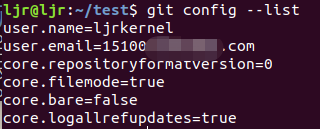


用户信息已经设置完毕，我们可以配置默认文本编辑器了，当 Git 需要你输入信息时会调用它。 如果未配置，Git 会使用操作系统默认的文本编辑器，通常是 Vim。 如果你想使用不同的文本编辑器，例如 Emacs，可以这样做：

```shell
git config --global core.editor emacs
```
## （3）添加SSH key
由于本地仓库和GitHub远程仓库之间的传输是通过SSH加密的，所以我们需要配置验证信息，创建SSH key，是为了更安全的管理我们在远程仓库的代码，只有在GitHub网站上添加了SSH key，我们才能在顺利将本地代码提交到远程仓库，直接看操作：
```shell 
cd ~/.ssh
ls
```


是的，就是id_rsa.pub文件，打开以后长这样子:


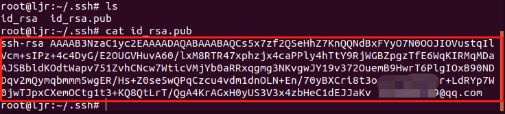

把它复制，粘贴到GitHub网站上这里:

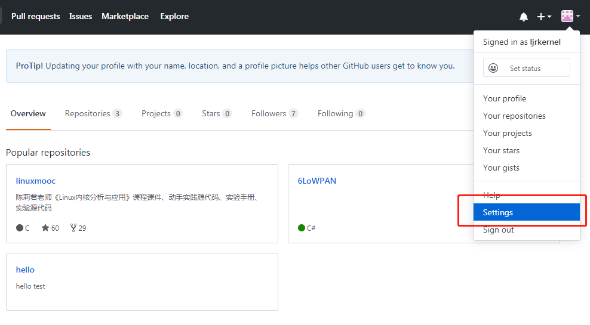


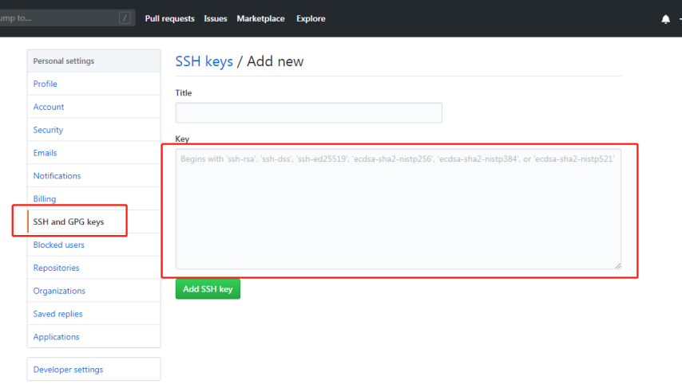


添加成功后会显示出来:


有同学说，我的.ssh文件夹里没有SSH key文件呀，问题依旧不大，请输入以下命令:

```shell
ssh-keygen -t rsa -C "你的邮箱"
```
此时生成秘钥，使用cat命令查看，然后添加到GitHub网站即可。
# 2、仓库管理
## （1）远程仓库管理
在GitHub上新建一个仓库，在这里开始创建。

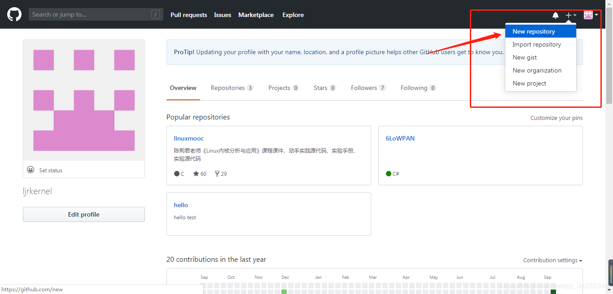


输入仓库名、描述信息、勾选公开仓库，创建README文件，点击Create repository创建仓库即可。

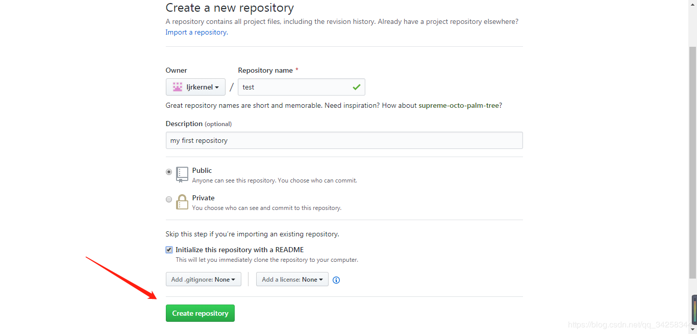


创建成功后，我们GitHub上就有了一个远程空仓库啦，如下图。

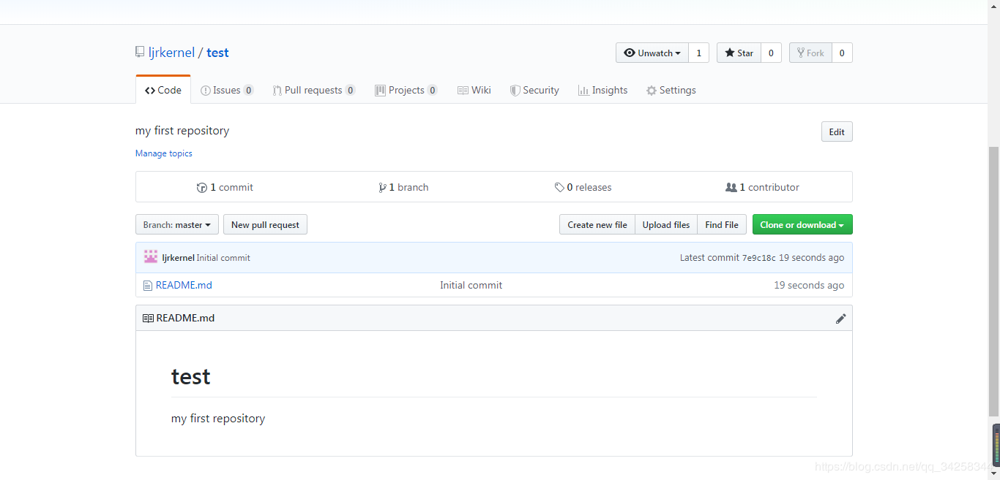


## （2）本地仓库管理

三种方法创建本地仓库：
1. 我们可以在本地mkdir新建一个文件夹，然后`git pull`我们的远程仓库；
2. 我们可以使用`git clone`克隆一个别人公开的项目到本地；
3. 我们在本地新建文件夹，然后`git init`。

# 3、提交项目到GitHub
**基本的 Git 工作流程如下：**
1. 在工作区修改文件（add， rm等）；
2. 暂存文件，将文件的快照放入暂存区域（commit）；
3. 提交更新，找到暂存区域的文件，将快照永久性存储到 Git 远程仓库（push）。

- （1）起始化仓库
```shell 
git init
```
- （2）设置远程仓库
```shell
#shortname是自己起的仓库名，url是GitHub地址
git remote add shortname url
```
- （3）然后添加新文件
```shell 
git add .
```
- （4）提交到本地仓库
```shell 
git commit -m "first update"
```
当我们修改了很多文件，而不想每一个都add，想commit自动来提交本地修改，我们可以使用-a标识。
```shell 
git commit -a -m "add one file"
```
> - git commit 命令的-a选项可将所有被修改或者已删除的且已经被git管理的文档提交到仓库中，引号里的是描述信息，可根据自己代码的情况修改。
> - 当使用 git commit 进行提交操作时，Git 会先计算每一个子目录的校验和，然后在 Git 仓库中把这些校验和保存为树对象。 随后，Git 便会创建一个提交对象，它除了包含上面提到的那些信息外，还包含指向这个树对象（项目根目录）的指针。如此一来，Git 就可以在需要的时候重现此次保存的快照。


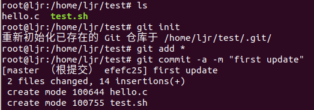


- （5）提交到远程仓库
```shell
#url指远程仓库地址，后面是分支名
git push url master
```


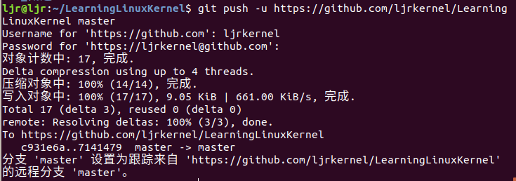


看一下远程仓库，我们的代码已经上传到GitHub远程仓库了。

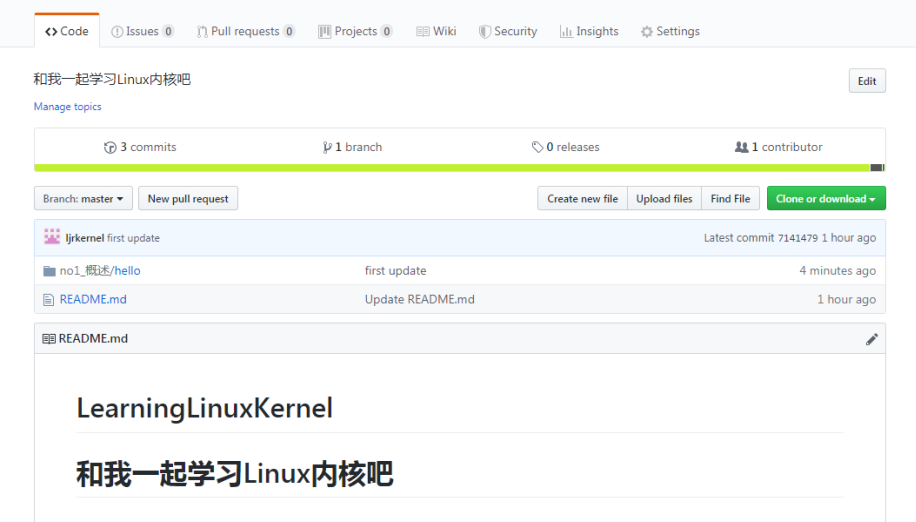


# 4、git常用操作
## （1）克隆项目
克隆项目是指将远程仓库里别人的公开项目或自己仓库的项目下载到本地用如下命令。
```shell
#url指远程仓库地址，如git clone https://github.com/ljrkernel/linuxmooc
git clone url
```
## （2）删除文件
删除仓库中的文件用如下命令：
```shell
git rm filename
```
## （3）查看状态
查看在你上次提交之后是否有修改用如下命令：
```shell
git status
#加-s参数可获得简短的结果
```
## （4）查看改动
查看已写入缓存与已修改但尚未写入缓存的改动的区别：
```shell 
git diff
```
> - 尚未缓存的改动：git diff
> - 查看已缓存的改动： git diff --cached
> - 查看已缓存的与未缓存的所有改动：git diff HEAD
> - 显示摘要而非整个 diff：git diff --stat
# 5、分支管理
Git 的分支，其实本质上仅仅是指向提交对象的可变指针。 Git 的默认分支名字是 master。 在多次提交操作之后，你其实已经有一个指向最后那个提交对象的 master 分支。 它会在每次的提交操作中自动向前移动。
## （1）创建分支
分支在本地完成，速度很快，要创建一个新的分支，我们使用如下命令：
```shell
git branch test
```
## （2）切换分支
branch命令不会将我们带入分支，只是创建一个新分支，如果我们要进入新的test分支,使用如下命令：
```shell
git checkout test
```
## （3）合并分支
我们对其他分支的更改不会反映在主分支上，如果想将更改提交到主分支，则需切换回master分支，然后使用合并：
```shell
git checkout master
git merge test
```
## （4）删除分支
如果我们想删除分支，使用-d标识：
```shell
git branch -d test
```
