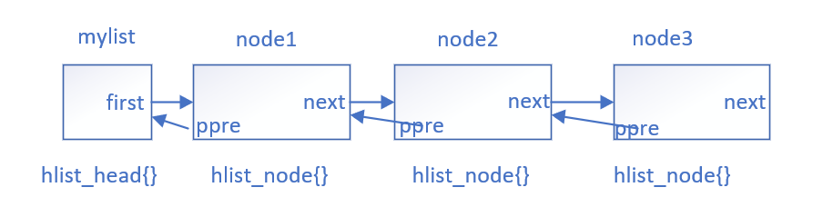
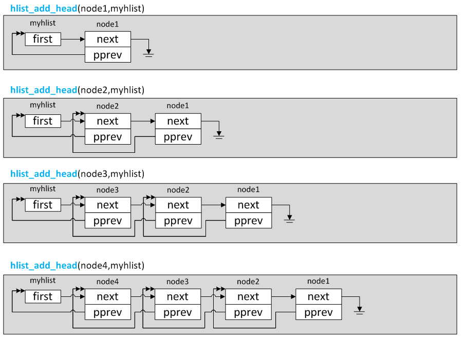
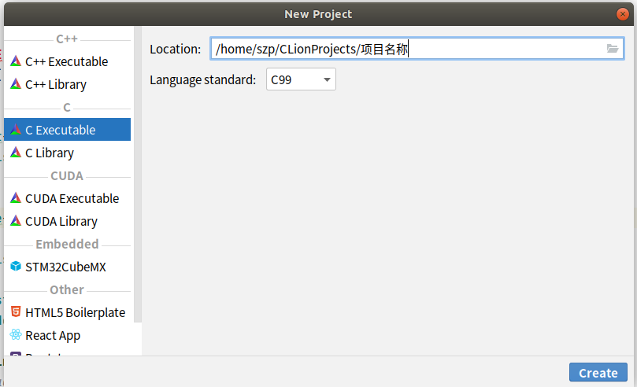
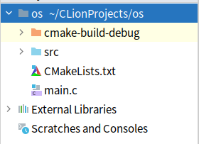

# 1. 前言

Linux内核中选取双向链表作为其基本的数据结构，并将其嵌入到其他的数据结构中，使得其他的数据结构不必再一一实现其各自的双链表结构。实现了双链表结构的统一，同时可以演化出其他复杂数据结构。本文对linux中基于双链表实现的哈希表进行分析，并编写内核模块，调用其中的函数和宏，实现哈希表的建立和查找。

# 2. 哈希表的定义

散列表（Hash table，也叫哈希表），是根据键（Key）而直接访问在内存储存位置的数据结构。也就是说，它通过计算一个关于键值的函数，将所需查询的数据映射到表中一个位置来访问记录，这加快了查找速度。这个映射函数称做散列函数，存放记录的数组称做散列表。

通过哈希函数使用关键字计算存储地址的时候，不可避免的会产生冲突，通常处理冲突的方法有：开放定地址法（线性探测、平方探测）、单独链表法、双散列、再散列。linux中使用了其中的单独链表法，即利用了我们上面介绍的双向链表实现，将散列到同一个存储位置的所有元素保存在一个链表中。
linux中关于哈希表结构体的定义可以从/usr/src/linux-headers-5.4.0-48-generic/include/linux/types.h文件中找到。
```c

struct hlist_head {
	struct hlist_node *first;
};
struct hlist_node {
	struct hlist_node *next, **pprev;
};
```
可以看到哈希表包含两个数据结构，一个是哈希链表节点hlist_node，另一个是哈希表头hlist_head。可以看到哈希节点hlist_node和内核普通双向链表的节点唯一的区别就在于，前向节点pprev是个两级指针。同时并没有使用hlist_node作为哈希表头，而是重新定义了hlist_head结构体，这是因为哈希链表并不需要双向循环，为了节省空间使用一个指针first指向该哈希表的第一个节点就可以了。整个哈希表结构如下图所示，其中ppre是个二级指针，它指向前一个节点的第一个指针变量，例如node1的ppre指向mylist的first指针，node2的ppre指向node1的next指针。

之所以使用ppre二级指针是为了避免在首节点之后插入删除节点和在其他位置插入删除节点实现逻辑的不同，读者可以将ppre改成一级指针指向前一个节点，就可以发现实现逻辑的不同。



# 3. 哈希表的声明和初始化宏

Linux的链表和散列表的操作函数的定义在/usr/src/linux-headers-5.4.0-48-generic/include/linux/list.h文件中，接下来就打开这个文件看一下hlist数据结构的操作函数和宏。

```C

#define HLIST_HEAD_INIT { .first = NULL }
#define HLIST_HEAD(name) struct hlist_head name = {  .first = NULL }
#define INIT_HLIST_HEAD(ptr) ((ptr)->first = NULL)

```

这三个初始化宏都是建立一个hlist_head结构体，并把first成员设置为NULL。

初始化hlist_node结构体，把两个成员变量赋值为NULL。

```C

static inline void INIT_HLIST_NODE(struct hlist_node *h)
{
	h->next = NULL;
	h->pprev = NULL;
}

```

# 4. 在哈希表中增加节点

在内核代码list.h中增加节点的函数为：
```c

static inline void hlist_add_head(struct hlist_node *n, struct hlist_head *h)

static inline void hlist_add_before(struct hlist_node *n,
					struct hlist_node *next)

static inline void hlist_add_behind(struct hlist_node *n,
				    struct hlist_node *prev)

static inline void hlist_add_fake(struct hlist_node *n)
```

hlist_add_head是把一个哈希链表的节点插入到哈希链表的头节点的后边，也就是头插法。传入了哈希表头h和待插入的节点n，首先得到hlist_head的first成员，就是后边的节点的指针，这个节点可能是NULL，然后新插入的节点的next指向first后边的节点，如果first不为空，也就是后边有节点存在，head的后边的节点的pprev成员就指向新插入的节点的next成员的地址，head的first就指向新插入的节点，新插入节点的pprev成员指向head的first成员的地址。

```c

static inline void hlist_add_head(struct hlist_node *n, struct hlist_head *h)
{
	struct hlist_node *first = h->first;
	n->next = first;
	if (first)
		first->pprev = &n->next;
	h->first = n;
	n->pprev = &h->first;
}

```
每次插入一个节点后，哈希表的存储情况如下图所示。



hlist_add_before作用是把一个节点插入到一个哈希链表的节点的前边，首先把将要插入的节点的pprev成员变量指向next的前边的节点，要插入的节点的next指向下一个节点，然后next节点的pprev就要指向已经插入的节点的next节点的地址，已经插入的节点的pprev指向的前一个节点的值就要变成已经插入节点的地址。


```c

static inline void hlist_add_before(struct hlist_node *n,
					struct hlist_node *next)
{
	n->pprev = next->pprev;
	n->next = next;
	next->pprev = &n->next;
	*(n->pprev) = n;
}


```

# 5. 遍历哈希表

list.h中定义了如下遍历链表的宏，\代表换行：

```c
#define hlist_for_each(pos, head) \
	for (pos = (head)->first; pos && ({ prefetch(pos->next); 1; }); \
	     pos = pos->next)
```
这个宏是对哈希链表进行遍历的宏，pos代表一个hlist_node结构体指针，head代表hlist_head结构体，就是哈洗链表的头。得到pos后，在宏展开后就可以在循环体中取到结构体具体的数值。

# 6. 哈希表的应用

## 6.1 搭建Clion内核模块开发环境

Clion用CMake构建C或者C++工程（20版本的CLion也支持自定义Makefile），利用CMake的配置文件创建编辑器本身的代码环境，比如子项目，比如预处理宏等，这跟IntelliJ Idea利用Maven、Gradle构建项目管理依赖库是同样的道理。

在Ubuntu系统下启动Clion新建工程，选择C executable项目，C语言标准选择99。



项目新建后会有一个CMakeLists.txt文件，main.c文件，我们可以新建一个src文件夹存放linux模块代码。同时将src文件夹Mark Directory as Project sources and Headers。



接下来我们在CMake配置文件中引入我们开发所需要的内核头文件。

```python
# 设置Cmake版本需要和系统中的Cmake版本保持一致
cmake_minimum_required(VERSION 3.10)
# 工程名称
project(os C)
# 设置编译选项
set(CMAKE_C_FLAGS "${CMAKE_C_FLAGS} -std=c99 -nostdinc") # C 编译器设置
add_definitions(-D__KERNEL__=1) #手动添加预处理宏

# 设置内核路径
set(KERNEL_ROOT /usr/src/linux-headers-5.4.0-48-generic)

# 添加需要的内核文件
include_directories(
        # kernel headers
        "${KERNEL_ROOT}/include"
        #"${KERNEL_ROOT}/arch/arm/include"
        #"${KERNEL_ROOT}/arch/arm64/include"
        # kernel source
        #"${KERNEL_ROOT}/mm"
)

set(SOURCE_FILES main.c)
add_executable(os ${SOURCE_FILES})


```
如何不通过add_definitions(-D__KERNEL__=1)手动添加__KERNEL__宏，有很多宏，CLion将无法识别。

kernel为了保护其代码，故意设置了这么一个
宏，只有在编译kernel的时候才会在命令行传递这个宏进去，像libc等C runtime编译时要用到kernel
的部分代码，但是它不会设置__KERNEL__这个宏，于是被这个宏保护的kernel代码它是看不到的。
自然，我们的Clion没有定义这个宏，那些kernel代码(大部分代码)它也是看不到的，于是parser在
解析头文件时，很多符号是解析不出来的。

配置完成后就可以使用CLion进行开发了。


## 6.2 哈希表的使用
下面编写一个linux内核模块，用以创建、增加、删除和遍历一个哈希表。

```c

// hashlist.c
// Created by linux on 2020/9/25.
//
#include <linux/kernel.h>
#include <linux/module.h>
#include <linux/slab.h>
#include <linux/list.h>

MODULE_LICENSE("GPL");
MODULE_AUTHOR("linux");
#define N 10
//数字链表
struct numlist{
    struct hlist_head hlistHead;
};
//数字链表节点
struct numnode{
    int num;
    struct hlist_node hlistNode;
};
struct  numlist nhead;
struct  numnode nnode;

static int __init hlist_init(void){
    //init head node
    struct hlist_node *pos;
    struct numnode *listnode;
    int i;

    printk("hashlist is starting...\n");
    //初始化头节点
    INIT_HLIST_HEAD(&nhead.hlistHead);

    for ( i = 0; i < N; ++i) {
        listnode = (struct numnode *)kmalloc(sizeof(struct numnode),GFP_KERNEL);
        listnode->num = i+1;
        //添加节点在头节点之前
        hlist_add_head(&(listnode->hlistNode),&nhead.hlistHead);

        printk("Node %d has added to the hash list...\n",i+1);

    }
    //遍历链表
    i = 1;
    struct numnode *p;

    hlist_for_each(pos,&nhead.hlistHead){
        //取得数字节点的数据域
        p =   hlist_entry(pos,struct numnode,hlistNode);
        printk("Node %d data:%d\n",i,p->num);
        i++;
    }
    return 0;
}

static void __exit hashlist_exit(void){
    struct hlist_node *pos,*n;
    struct numnode *p;
    int i;

    i =1;
    //遍历数字链表
    hlist_for_each_safe(pos,n,&nhead.hlistHead){
        //删除哈希节点
        hlist_del(pos);
        //取得删除节点的数据域值
        p =   hlist_entry(pos,struct numnode,hlistNode);
        kfree(p);
        printk("Node %d has removed from the hashlist ...\n",i++);

    }
    printk("hash list is exiting...\n");
}

module_init(hlist_init);
module_exit(hashlist_exit);

```

对应的Makefile文件如下：

```
obj-m := hashlist.o
CURRENT_PATH := $(shell pwd)
LINUX_KERNEL := $(shell uname -r)
LINUX_KERNEL_PATH :=/usr/src/linux-headers-$(LINUX_KERNEL)

all:
	make -C $(LINUX_KERNEL_PATH) M=$(CURRENT_PATH) modules
clean:
	make -C $(LINUX_KERNEL_PATH) M=$(CURRENT_PATH) clean

```

参考资料：

Linux操作系统原理与应用（第二版）

https://zh.wikipedia.org/wiki/%E5%93%88%E5%B8%8C%E8%A1%A8

https://developer.aliyun.com/article/515874

https://blog.csdn.net/sanwenyublog/article/details/50747219

http://ybin.cc/tools/clion-for-linux-driver-developer/