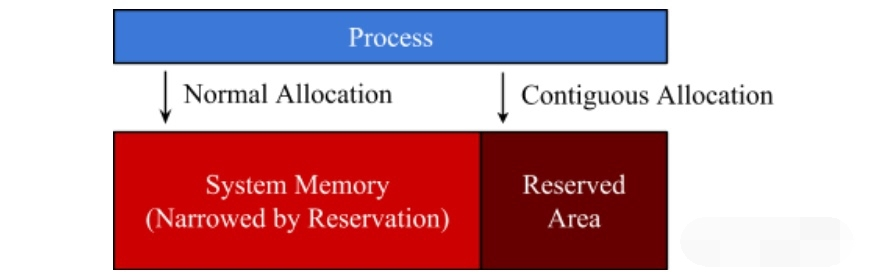
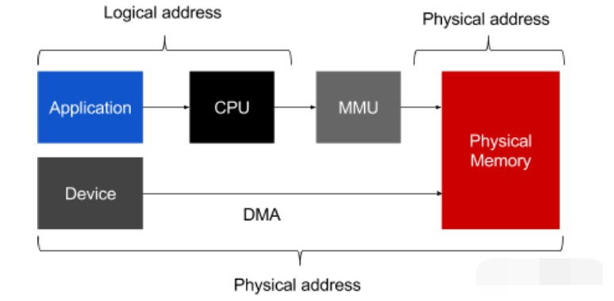
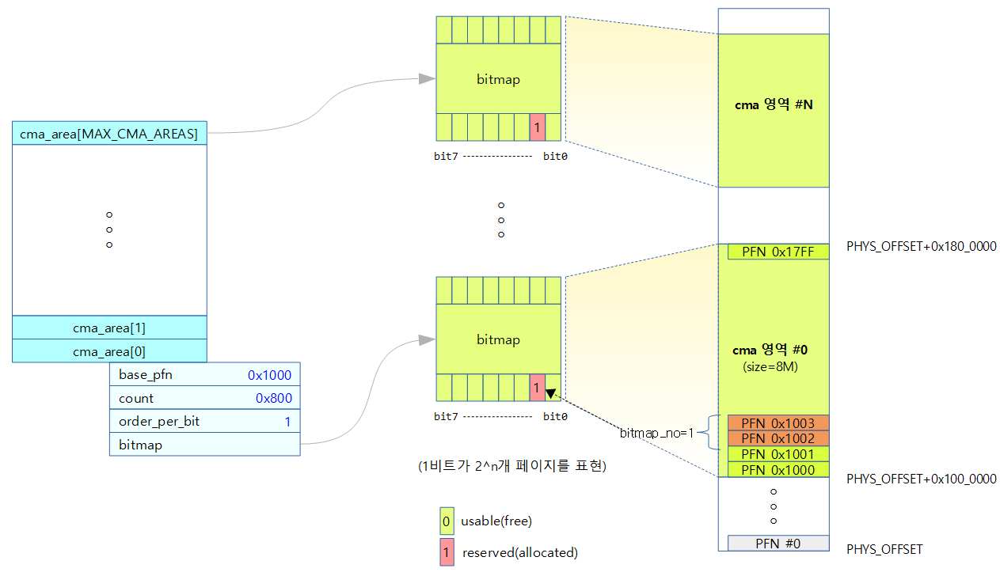

#### CMA与DMA的关系

Linux kernel中的CMA即连续内存区管理，其提供配置为CONFIG_CMA和CONFIG_CMA_DEBUG ，其管理的是一块块连续内存块。这个在物理地址上是连续的。这点跟我们使用的伙伴算法 以及虚拟地址有点不一样。尽管伙伴算法中使用kmalloc申请连续物理内存也可以，但是在长时间 测试环境下，连续物理内存可能申请不到。因此，内核设计者设计了CMA，即连续物理内存管理。 其定制了一块连续物理内存，专门用于需要连续物理内存的场景，比如DMA。


#### CMA分配器需求

在嵌入式设备中，很多设备都没有支持 scatter-getter 和 IO map，都需要连续 内存块的操作。如设备: 摄像机，硬件视频解码器，编码器等。这些设备往往需要 较大的内存缓冲区（如: 一个200万像素的高清帧摄像机，需要超过 6M 的内存)， kmalloc 内存分配机制对于这么大的内存是没有效果的。一些嵌入式设备对缓冲区 有一些额外的要求，比如： 在含有多个内存 bank 的设备中，要求只能在特定的 bank 中分配内存; 而还有一些要定内存边界对齐的缓存区。CMA 框架采用统一的连续内存分 配机制，并为这些设备驱动提供简单的 API，而且是可以定制化和模块化的。


#### CMA机制

CMA的全称叫做contiguous memory allocator，它是为了便于进行连续物理内存申请的一块区域，一般我们把这块区域定义为reserved-memory。



早期的Linux内核中没有cma的实现，如果驱动想要申请一个大块的物理连续内存，那么只能通过预留专属内存的形式，然后在驱动中使用ioremap来映射后作为私有内存使用。这样带来的后果就是有一部分内存将被预留出来不能作为系统中的通用内存来使用，比如camera、audio设备，它们在工作时是需要大块连续内存进行DMA操作的，而当这些设备不工作时，预留的内存也无法被其他模块所使用。

在数据方向是从外设到内存的DMA传输中，如果外设本身不支持scatter-gather形式的DMA，或者CPU不具备使用虚拟地址作为目标地址的IOMMU/SMMU机制（通常较高端的芯片才具有），那么则要求DMA的目标地址必须在物理内存上是连续的。



比如当一些设备需要使用大块连续物理内存时，可以比较容易的申请到，而当这些设备不工作时，这些内存又可以当做普通的内存那样被系统其他模块申请使用。引入CMA就是为了解决这个问题的，定义为cma区域的内存，也是由操作系统来管理的，当一个驱动模块想要申请大块连续内存时，通过内存管理子系统把CMA区域的内存进行迁移，空出连续内存给驱动使用；而当驱动模块释放这块连续内存后，它又被归还给操作系统管理，可以给其他申请者分配使用。


#### CMA数据结构

一个CMA区域在内核中用struct cma结构体表示（定义在"/mm/cma.h"），多个CMA区域由"cma_areas[]"数组管理和索引：

```c
struct cma {
    unsigned long  base_pfn;
    unsigned long  count;
    unsigned long *bitmap;
    unsigned int   order_per_bit; /* Order of pages represented by one bit */
    ...
}
struct cma cma_areas[MAX_CMA_AREAS];
```

其中，"base_pfn"指定了这个CMA区域的起始物理页面的地址，"count"为page frame的数量。页面空闲与否，由"bitmap"进行位图标记，但标记的最小粒度不是一个page frame，而是"order_per_bit"。



#### CMA内存分配和释放

当一个内核模块要使用CMA内存时，使用的接口依然是dma的接口：

```c
extern void *
dma_alloc_coherent(struct device *dev, size_t size, dma_addr_t *dma_handle,
           gfp_t flag);

extern void
dma_free_coherent(struct device *dev, size_t size, void *cpu_addr,
            dma_addr_t dma_handle);
```

使能了CMA的平台上述的两个接口都会最终运行到如下的实现中来：

```c
struct page *dma_alloc_from_contiguous(struct device *dev, size_t count,
                       unsigned int align, bool no_warn)
{
    if (align > CONFIG_CMA_ALIGNMENT)
        align = CONFIG_CMA_ALIGNMENT;

    return cma_alloc(dev_get_cma_area(dev), count, align, no_warn);
}

bool dma_release_from_contiguous(struct device *dev, struct page *pages,
                 int count)
{
    return cma_release(dev_get_cma_area(dev), pages, count);
}
```

这里最终使用到的是CMA中的实现来分配和释放内存。我们正常使用时，可以调用函数cma_alloc()分配CMA内存或者cma_release()对申请的CMA内存释放。