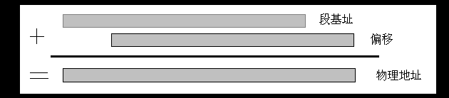
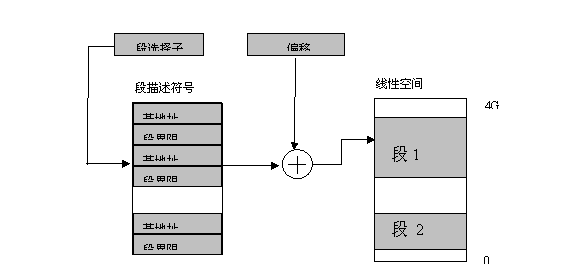
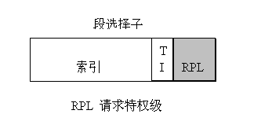
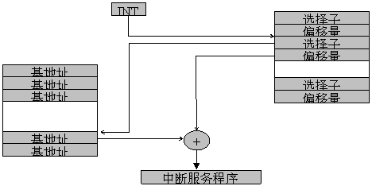

## 第1章 内存寻址

曾经有一个叫“阿兰.图灵”的天才，他设想出了一种简单但运算能力几乎无限发达的理想机器――这可不是一个具体的机械玩艺，而是一个思想模型――用来计算能想象得到的所有可计算函数。这个有趣的机器由一个控制器、一个读写头和一条假设两端无限长的带子组成。工作带好比存储器，被划分成大小相同的格子，每格上可写一个字母，读写头可以在工作带上随意移动，而控制器可以要求读写头读取其下方工作带上的字母。

你可千万别觉得这个机器傻得可爱，它可是当代冯.诺依曼体系计算机的理论鼻祖。它带来的“数据连续存储和选择读取思想”正是目前我们使用的几乎所有机器运行背后的灵魂。计算机体系结构中的核心问题之一就是如何有效地进行内存寻址，因为所有运算的前提都是先要从内存中取得数据，所以内存寻址技术从某种程度上代表了计算机技术。

下面就开始一起聊聊关于寻址的故事。

冯.诺依曼体系计算机系统由运算器、存储器、控制器、输入设备、输出设备五大部件组成。运算器就是我们熟知的CPU中的ALU（算术逻辑单元）,存储器是内存，控制器是CPU中的控制单元；输入设备就是我们的鼠标键盘等；输出设备就是显示器，打印机等。

### 1.1历史回顾

计算机的内存寻址技术和世界上的其它事物一样都经历了由简单到复杂，由笨拙到优雅的过程。自我听说计算机到今天，内存寻址方法发生了几次决定性的变革（“史前”的内存寻址方法我连资料都没有找到，真是无据可查了！），而每次变革都带来了软件技术的发展，注入了新鲜血液。

让我们沿着Intel公司的脚步来回顾一下历史吧！（我实在没机会接触除Intel以外的处理器!!!）

#### 1.1.1石器时代

20年前intel推出了一款8位处理器――8080，它有1个主累加器（寄存器A）和6个次累加器（寄存器B,C,D,E,H和L）,几个次累加器可以配对（如组成BC, DE或HL）使用来访问16位的内存地址，也就是说8080可访问到64K内的地址空间。另外那时还没有段的概念，访问内存都要通过绝对地址，因此程序中的地址必须进行硬编码，而且也难以重定位，故当时的软件大都是些可控性弱、结构简陋、数据处理量小的工控程序。

人类从来都是不断前进的，很快，几年后intel就开发出了16位的新处理器――8086，这便是内存寻址的第一次飞跃。

#### 1.1.2 青铜时代

8086处理器引入了一个重要概念――*段*。段描述了一块有限的内存区域，区域的起始位置存在专门的寄存器（段寄存器）中。另外8086处理器可以寻址到1M大的内存空间，因为它的地址线扩展到了20位。可是制造20位的寄存器来存放内存地址在当时显然要比制造20位的地址线难得多。为了克服困难，intel的工程师们想出了个好办法：将内存分为数个64k大小的段，然后利用两个16位值――一个是段地址，另一个是段内偏移量――巧妙组合产生20位的内存地址。换句话说就是把1M大的空间分成数个64k的段来管理（化整为零了）。

系统所需要做的仅仅是：把16位的段地址左移动4位后，再与16位的偏移量相加便可获得一个20位的内存地址，见图1

图 1

Intel内存地址的描述形式也很贴近上图，采用了“段地址：偏移量”的形式来描述内存地址，比如A815：CF2D就代表段首地址在A815，段内偏移位CF2D。

为了支持段机制，8086为程序使用的代码段，数据段，堆栈段分别提供了专门的16位寄存器CS，DS和SS，此外还给内存和字符串拷贝操作留下了一个目的段寄存器：ES。

段式内存管理带来了显而易见的优势――程序的地址不再需要硬编码了，调试错误也更容易定位了，更可贵的是支持更大的内存地址。程序员开始获得了自由。

#### 1.1.3白银时代

人们的欲望在继续膨胀。intel的80286处理器于1982年问世了，它的地址总线位数增加到了24位，因此可以访问到16M的内存空间。更重要的是从此开始引进了一个全新理念――保护模式。这种模式下内存段的访问受到了限制。访问内存时不能直接从段寄存器中获得段的起始地址了，而需要经过额外转换和检查（从此你不能再随意执行数据段,或向代码段里写东西了,其具体保护和实现我们将在后面讲述）。

为了和过去兼容，80286内存寻址可以以两种方式进行，一种是先进的保护模式，另一种是老式的8086方式，被称为实模式。启动时处理器处于实模式，只能访问1M空间，经过处理可进入保护模式，访问空间扩大到16M，但是要想从保护模式返回到实模式，你只有重新启动机器。还有一个致命的缺陷是：80286虽然扩大了访问空间，但是每个段的大小还是64k，这太糟糕了，程序规模仍然受到压制。因此这个先天低能儿注定命不久也。很快它就被其天资卓越的兄弟――80386代替了。

#### 1.1.4 黄金时代

真正的第二次内存寻址飞跃发生在80386身上，它近乎完美的设计将计算机技术推向了一个新高度。

80386的地址总线扩展到了32位,可寻址空间一下扩充为4G，更为先进的是：在保护模式下,它的段范围不再受限于可怜的64K，可以达到4k-4G。这一下可真正解放了软件工程师，他们不必再费尽心思去压缩程序规模，软件功能也因此迅速提升，一切都走向了繁荣.。

 

## 第2章 保护模式

保护模式真得是太精妙了,我恨不得专门用一本书来讨论它,但即使那样我也担心不能真正触其精华。不过还是借用那句老话”简单就是美丽”,我争取用最小的篇幅揭示保护模式的真实面目。

### 2.1实模式和保护模式

保护模式和实模式好比一对孪生兄弟,它们外貌很像,从程序角度来看几乎看不出什么区别,它们都是通过段寄存器去访问内存地址,都通过中断和设备驱动程序来操作硬件,表面上能感觉得到的差异就是保护模式能访问的空间是4G,而实模式只能访问到1M的地址空间。

但实际上保护模式和实模式采用了两种截然不同的思路,保护模式带来的最可贵的优点不是单纯的扩大了内存寻址范围,而是对内存寻址从机制上提供了保护,将系统的执行空间按权限进行了划分。 

这种划分到底会带来哪些好处? 我们来推敲一下吧。

### 2.2 为什么需要保护?

如果你的机器只允许一个任务使用系统资源，比如说系统内存，那么你完全不需要保护资源，因为系统中再没有什么值得你去偷窥的东西了，更别说去破坏什么了。

可惜那样的时代已经一去不复返了，如今的系统需要支持多个用户同时运行多个任务。为了防止你去偷看别人的任务，或恶意或由于你的荒唐行为而破坏别人的任务，系统有责任将每个任务隔离开来，让大家各自运行在不同的空间，免受干扰。这就是保护的第一个方面――任务间保护。要做到任务间保护需要借助虚拟内存技术（我们后面分析它），其基础之一就是保护模式。

除了任务间保护外，另一个必须保护的东西就是操作系统本身，它可是资源调配的首脑呀！绝不能让你有机可趁，擅自进入。必须有一道铁丝网，将你和操作系统隔离开，使你不得越雷池一步。要想拉起这道铁丝网，就需要借助保护模式中的特权级机制。操作系统放在高特权级里，你的任务被放在低特权级里。你没有权利去偷看操作系统的内容。有什么要求只能请示“领导”（就是保护机制），获得批准后才能给你提供服务。这点可谓是保护模式的最直接应用。

### 2.3 谁赋予它保护能力？

80386之所以能有变化多端的保护手段，追其根本源自保护模式下内存寻址方式发生的革命。传统上我们知道段方式寻址时，是直接从段寄存器中取得的段的首地址，但是在保护模式中是要多经过一次检查手续才能获得想要的段地址。

这里可千万别再说“简单就是美了”，多了这一次中间倒手过程可是保护模式下寻址的关键技术所在呀。倒手的原因我想大概是因为，虽然80386有的通用寄存器（EAX,EDI等等）被扩充倒了32位，但是其中的段寄存器（DS,ES等）仍然只有16位，显然不可能再用16位的段寄存器直接存放4G空间需要的32位地址了，所以必须引入了一种间接办法――将段寄存器中存放的地址换成一个索引指针，寻址时不再是从段寄存器中去寻址，而是先取指针，再通过该指针搜索一个系统维护的“查找表”读出所需段的具体信息。剩下的动作和传统行为没什么区别，将刚刚取得的段的基地址加上偏移量便构成了一个32位地址(即，线性地址)。

图 2

线性地址属于中间地址，它还需要一次转换才能映射到实际的物理地址上（下面会看到）。线性地址组成的空间称为线性空间，它和物理地址空间结构相同，都为32位，最大可达4G。

这个索引指针被称作是段选择子(见图2)，它共有16位，其中14位用来作为索引，另外2位（RPL）用来作描述请求特权级。通过索引从表中获得的信息，被称为段描述符，它含有段的相关地址信息等。

改变寻址方法的另一个原因主要是为了完成保护使命。多用户多任务环境下，内存寻地工作不再是简单地取得32位的内存地址就可以直接不假思索地放到地址总线上去读写内存了，此刻必须先要对需访问的地址进行合法性检查，看看访问者是不是有权利去访问它要求的地址。如果发现有非法访问企图，则立刻阻止(CPU会产生一个异常)这种危险行为。读到这里，多数的朋友一定要问，靠什么进行检查请求的合法性呢？更细心的朋友还会继续问，检查需要什么信息？这些信息放在那里？

考虑到寻址过程和合法性检测过程需要在同一现场一起进行，所以最理想的办法是能把段地址信息和检测合法性用到的属性信息放在一起(需要的空间更大了)，于是系统设计师们便把属性信息、段的基地址和界限都糅合在一起，形成了一个新的信息单元――段描述符号，它整整占用了8个字节。显然，寄存器太小，不够存放段描述符，所以段描述符都被统一存在专门的系统段描述符号表中（GTD或LDT）保存。

说到这里，聪明的朋友可能已经能大概猜出段描述符表中的内容是什么了。内容里一定包含了段基地址、段的大小信息、段的属性信息，而且在属性信息里还包含了和访问权限有关的信息。的确如此，下面图示描述了段描述符的详细信息，其中和保护关系最大的信息要数RPL了(见图3)。

图3 

这种间接寻址方式不仅体现在普通任务寻址上，而且对于中断处理同样适用。传统上中断处理查询方法是在中断产生后，CPU会在中断向量表中搜索中断服务例程(ISR)的地址,地址形式还是段+偏移量。在保护模式中中断产生后，CPU会从中断描述符表（IDT）中根据中断号取得中断服务例程的段选择子和偏移量，然后通过段选择子从段描述符表（GDT）中获得ISR的段信息，再结合偏移量得到需要的实际物理地址。

中断寻址过程如图4所示。

  

图 4

### 2.4 特权等级

​       计算机世界和人类世界一样，最初是没有等级之分的，但当人类社会物质文明逐步发达后，等级也随之而来了；同样，当计算机上的应用软件越来越丰富后，这个虚拟世界也逐渐形成了级别和等级。我们不去评价人类社会的等级制度，只来看看计算机世界中的等级制度，而且只限于保护模式中的等级制度。

​    80386中共规定有4个特权级，由0到3。0级别权限最高，3级最小。标准的做法是将操作系统核心运行在0级，应用程序运行在其它几个低级别。不过为了简化操作，往往只会用到0和3两个级别。80386中的每个段描述符号中都有DPL字段，它规定了访问该段的最低特权级，只有高于或等于此特权级别的程序能有权访问它。所以在访问内存地址时要将当前特权级(CPL，一般来说就是当前代码段的特权级别)和被访问段的特权级别比较，如果大于等于才允许访问。

​    除了处理当前特权级别和段的特权级别外，有时还需要使用请求特权级别(RPL)，这个子段出自段选择子，主要用来辅助特权保护。比如可以在访问某个段时，指定其请求特权级，那么特权检查时，规则变为将RPL和CPL中特权更高的那个和被访问段的DPL比较。例如，操作系统中的某个例程会把一些资料写到用户段中。若没有特别检查，那么用户可以把一个 DPL为 0 的 段（用户程序不能存取它）传到操作系统处理例程中，因为系统例程有全权写入DPL为0的段，因此用户程序就可以破坏该段中的资料了。