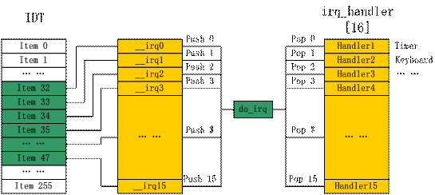
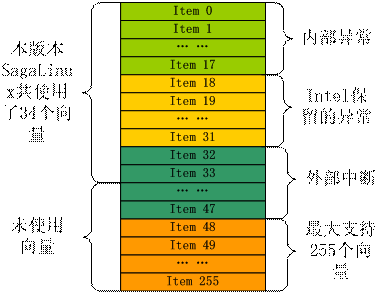

# 一、中断机制的实现
在这个部分，我将为大家详细介绍SagaLinux中是如何处理中断的。为了更好地演示软硬件交互实现中断机制的过程，我将在前期实现的SagaLinux上加入对一个新中断­——定时中断——的支持。

首先，让我介绍一下SagaLinux中涉及中断的各部分代码。这些代码主要包含在kernel目录下，包括idt.c，irq.c，i8259.s，boot目录下的setup.s也和中断相关，下面将对他们进行讨论。

1、boot/setup.s

setup.s中和中断相关的部分主要集中在pic_init小节，该部分完成了对中断控制器的初始化。对8259A的编程是通过向其相应的端口发送一系列的ICW（初始化命令字）完成的。总共需要发送四个ICW，它们都分别有自己独特的格式，而且必须按次序发送，并且必须发送到相应的端口，具体细节请查阅参考资料1。

```
pic_init:
    cli
    mov al, 0x11            ; initialize PICs
; 给中断寄存器编程
; 发送ICW1:使用ICW4，级联工作
    out 0x20, al            ; 8259_MASTER
    out 0xA0, al            ; 8259_SLAVE
    ; 发送 ICW2，中断起始号从 0x20 开始（第一片）及 0x28开始（第二片）
    mov al,   0x20          ; interrupt start 32
    out 0x21, al
    mov al,   0x28          ; interrupt start 40
    out 0xA1, al
; 发送 ICW3
    mov al,   0x04          ; IRQ 2 of 8259_MASTER
    out 0x21, al        
; 发送 ICW4
    mov al,   0x02          ; to 8259_SLAVE
    out 0xA1, al
; 工作在80x86架构下
    mov al,   0x01          ; 8086 Mode
    out 0x21, al
    out 0xA1, al
; 设置中断屏蔽位 OCW1 ，屏蔽所有中断请求
    mov al,   0xFF          ; mask all
    out 0x21, al
    out 0xA1, al
    sti
```

2、kernel/irq.c

	irq.c提供了三个函数enable_irq、disable_irq和request_irq，函数原型如下：
```
	void enable_irq(int irq)
	void disable_irq(int irq)
	void request_irq(int irq, void (*handler)())
```

enable_irq和disable_irq用来开启和关闭右参数irq指定的中断，这两个函数直接对8259的寄存器进行操作，因此irq对应的是实实在在的中断号，比如说X86下时钟中断一般为0号中断，那么启动时钟中断就需要调用enable_irq（1），而键盘一般占用2号中断，那么关闭键盘中断就需要调用disable_irq（2）。irq对应的不是中断向量。

request_irq用来将中断号和中断服务程序绑定起来，绑定完成后，命令8259开始接受中断请求。下面是request_irq的实现代码：
```
void request_irq(int irq, void (*handler)())
{
  irq_handler[irq] = handler;
  enable_irq(irq);
}
```

其中irq_handler是一个拥有16个元素的数组，数组项是指向函数的指针，每个指针可以指向一个中断服务程序。irq_handler[irq] = handler 就是一个给数组项赋值的过程，其中隐藏了中断号向中断向量映射的过程，在初始化IDT表的部分，我会介绍相关内容。

3、kernel/i8259.s注3

i8259.c负责对外部中断的支持。我们已经讨论过了，8259芯片负责接收外部设备——如定时器、键盘、声卡等——的中断，两块8259共支持16个中断。

我们也曾讨论过，在编写操作系统的时候，我们不可能知道每个中断到底对应的是哪个中断服务程序。实际上，通常在这个时候，中断服务程序压根还没有被编写出来。可是，X86体系规定，在初始化中断向量表的时候，必须提供每个向量对应的服务程序的偏移地址，以便CPU在接收到中断时调用相应的服务程序，这该如何是好呢？

巧妇难为无米之炊，此时此刻，我们只有创造所有中断对应的服务程序，才能完成初始化IDT的工作，于是我们制造出16个函数——```__irq0```到```__irq15```，在注册中断服务程序的时候，我们就把它们填写到IDT的描述符中去。（在SagaLinux中当前的实现里，我并没有填写完整的IDT表，为了让读者看得较为清楚，我只加入了定时器和键盘对应的```__irq```和```__irq1```。但这样一来就带来一个恶果，读者会发现在加入新的中断支持时，需要改动idt.c中的trap_init函数，用set_int_gate对新中断进行支持。完全背离了我们强调的分隔变化的原则。实际上，只要我们在这里填写完整，并提供一个缺省的中断服务函数就可以解决这个问题。我再强调一遍，这不是设计问题，只是为了便于读者观察而做的简化。）

可是，这16个函数怎么能对未知的中断进行有针对性的个性化服务呢？当然不能，这16个函数只是一个接口，我们可以在其中留下后门，当新的中断需要被系统支持时，它实际的中断服务程序就能被这些函数调用。具体调用关系请参考图2

图2：中断服务程序调用关系

如图2所示，```__irq0```到```__irq15```会被填充到IDT从32到47（之所以映射到这个区间是为了模仿Linux的做法，其实这部分的整个实现都是在模仿Linux）这16个条目的中断描述符中去，这样中断到来的时候就会调用相应的```__irq```函数。所有irq函数所作的工作基本相同，把中断号压入栈中，再调用do_irq函数；它们之间唯一区别的地方就在于不同的irq函数压入的中断号不同。

 do_irq首先会从栈中取出中断号，然后根据中断号计算该中断对应的中断服务程序在irq_handler数组中的位置，并跳到该位置上去执行相应的服务程序。

 还记得irq.c中介绍的request_irq函数吗，该函数绑定中断号和中断服务程序的实现，其实就是把指向中断服务程序的指针填写到中断号对应的irq_handler数组中去。现在，你应该明白我们是怎样把一个中断服务程序加入到SagaLinux中的了吧——通过一个中间层，我们可以做任何事情。

在上图的实现中，IDT表格中墨绿色的部分——外部中断对应的部分——可以浮动，也就是说，我们可以任意选择映射的起始位置，比如说，我们让```__irq0```映射到IDT的第128项，只要后续的映射保持连续就可以了。

4、kernel/idt.c

idt.c当然是用来初始化IDT表的了。

在i8259.s中我们介绍了操作系统是如何支持中断服务程序的添加的，但是，有两个部分的内容没有涉及：一是如何把irq函数填写到IDT表中，另外一个就是中断支持了，那异常怎么支持呢？idt.c负责解决这两方面的问题。

idt.c提供了trap_init函数来填充IDT表。
```
 void trap_init()
{
  int i;
  idtr_t idtr;
  // 填入系统默认的异常，共17个
  set_trap_gate(0, (unsigned int)&divide_error);
  set_trap_gate(1, (unsigned int)&debug);
  set_trap_gate(2, (unsigned int)&nmi);
  set_trap_gate(3, (unsigned int)&int3);
  set_trap_gate(4, (unsigned int)&overflow);
  set_trap_gate(5, (unsigned int)&bounds);
  set_trap_gate(6, (unsigned int)&invalid_op);
  set_trap_gate(7, (unsigned int)&device_not_available);
  set_trap_gate(8, (unsigned int)&double_fault);
  set_trap_gate(9, (unsigned int)&coprocessor_segment_overrun);
  set_trap_gate(10,(unsigned int) &invalid_TSS);
  set_trap_gate(11, (unsigned int)&segment_not_present);
  set_trap_gate(12, (unsigned int)&stack_segment);
  set_trap_gate(13, (unsigned int)&general_protection);
  set_trap_gate(14, (unsigned int)&page_fault);
  set_trap_gate(15, (unsigned int)&coprocessor_error);
  set_trap_gate(16, (unsigned int)&alignment_check);

  // 17到31这15个异常是intel保留的，最好不要占用
  for (i = 17;i<32;i++)
    set_trap_gate(i, (unsigned int)&reserved);

  // 我们只在IDT中填入定时器和键盘要用到的两个中断
  set_int_gate(32, (unsigned int)&__irq0); 
  set_int_gate(33, (unsigned int)&__irq1);

// 一共有34个中断和异常需要支持
  idtr.limit = 34*8;
  idtr.lowerbase = 0x0000;
  idtr.higherbase = 0x0000;
  cli();
  
// 载入IDT表，新的中断可以用了
  __asm__ __volatile__ ("lidt (%0)"
            ::"p" (&idtr));
  sti();
}
```
首先我们来看看set_trap_gate和set_int_gate函数，下面是它们两个的实现
```
void set_trap_gate(int vector, unsigned int handler_offset)
{
  trapgd_t* trapgd = (trapgd_t*) IDT_BASE + vector;
  trapgd->loffset = handler_offset & 0x0000FFFF;
  trapgd->segment_s = CODESEGMENT;
  trapgd->reserved = 0x00;
  trapgd->options =  0x0F | PRESENT | KERNEL_LEVEL;
  trapgd->hoffset = ((handler_offset & 0xFFFF0000) >> 16);
}

void set_int_gate(int vector,  unsigned int handler_offset)
{
  intgd_t* intgd = (intgd_t*) IDT_BASE + vector;
  intgd->loffset =  handler_offset & 0x0000FFFF;
  intgd->segment_s = CODESEGMENT;
  intgd->reserved = 0x0;
  intgd->options =  0x0E | PRESENT | KERNEL_LEVEL;
  intgd->hoffset = ((handler_offset & 0xFFFF0000) >> 16); 
}
```
我们可以发现，它们所作的工作就是根据中断向量号计算出应该把指向中断或异常服务程序的指针放在什么IDT表中的什么位置，然后把该指针和中断描述符设置好就行了。同样，中断描述符的格式请查阅参考资料一。

现在，来关注一下set_trap_gate的参数，又是指向函数的指针。在这里，我们看到每个这样的指针指向一个异常处理函数，如divide_error、debug等：
```
void divide_error(void)
{
  sleep("divide error");
}
void debug(void)
{
  sleep("debug");
}
```
每个函数都调用了sleep，那么sleep是有何作用？是不是像——do_irq一样调用具体异常的中断服务函数呢？
```
// Nooooo ... just sleep :)
void sleep(char* message)
{
  printk("%s",message);
  while(1);
}
```

看样子不是，这个函数就是休眠而已！实际上，我们这里进行了简化，对于Intel定义好的前17个内部异常，目前SagaLinux还不能做有针对性的处理，因此我们直接让系统无限制地进入休眠——跟死机区别不大。因此，当然也不用担心恢复“现场”的问题了，不用考虑栈的影响，所以直接用C函数实现。

此外，由于这17个异常如何处理在这个时候我们已经确定下来了——sleep，既然没有什么变化，我们也就不用耗尽心思的考虑去如何支持变化了，直接把函数硬编码就可以了。

Intel规定中断描述符表的第17-31项保留，为硬件将来可能的扩展用，因此我们这里将它闲置起来。
```
void reserved(void)
{
sleep("reserved");
}
```

下面的部分是对外部中断的初始化，放在trap_init中是否有些名不正言不顺呢？确实如此，这个版本暂时把它放在这里，以后重构的时候再调整吧。注意，这个部分解释了我们是如何把中断服务程序放置到IDT中的。此外，可以看出，我们使用手工方式对中断向量号进行了映射，```__irq0```对应32号中断，而```__irq1```对应33号中断。能不能映射成别的向量呢？当然可以，可是别忘了修改setup.s中的pic_init部分，要知道，我们初始化8259的时候定义好了外部中断对应的向量，如果你希望从8259发来的中断信号能正确的触发相应的中断服务程序，当然要把所有的接收——处理链条上的每个映射关系都改过来。



我们只填充了34个表项，每个表项8字节长，因此我们把IDT表的长度上限设为34x8，把IDT表放置在逻辑地址起始的地方（如果我们没有启用分页机制，那么就是在线性空间起始的地方，也就是物理地址的0位置处）。

最后，调用ldtr指令启用新的中断处理机制，SagaLinux的初步中断支持机制就完成了。

# 二、扩展新的中断
下面，我们以定时器（timer）设备为例，展示如何通过SagaLinux目前提供的中断服务程序接口来支持设备的中断。

IBM PC兼容机包含了一种时间测量设备，叫做可编程间隔定时器（PIT）。PIT的作用类似于闹钟，在设定的时间点到来的时候发出中断信号。这种中断叫做定时中断（timer interrupt）。在Linux操作系统中，就是它来通知内核又一个时间片断过去了。与闹钟不同，PIT以某一固定的频率（编程控制）不停地发出中断。每个IBM PC兼容机至少都会包含一个PIT，一般来说，它就是一个使用0x40~0x43 I/O端口的8254CMOS芯片。

SagaLinux目前的版本还不支持进程调度，因此定时中断的作用还不明显，不过，作为一个做常见的中断源，我们可以让它每隔一定时间发送一个中断信号，而我们在定时中断的中断服务程序中计算流逝过去的时间数，然后打印出结果，充分体现中断的效果。

我们在kernel目录下编写了timer.c文件，也在include目录下加入了相应的timer.h，下面就是具体的实现。
```
// 流逝的时间
static volatile ulong_t counter;
// 中断服务程序
void timer_handler()
{
  // 中断每10毫秒一次
  counter += 10;
}
// 初始化硬件和技术器，启用中断

void timer_init()
{
  ushort_t pit_counter = CLOCK_RATE * INTERVAL / SECOND;
  counter = 0;
  outb (SEL_CNTR0|RW_LSB_MSB|MODE2|BINARY_STYLE, CONTROL_REG);
  outb (pit_counter & 0xFF, COUNTER0_REG);
  outb (pit_counter >> 8, COUNTER0_REG);
  // 申请0号中断，TIMER定义为0
  request_irq(TIMER, timer_handler);
}

// 返回流逝过去的时间
ulong_t uptime()
{
  return counter;
}
```

timer_init函数是核心函数，负责硬件的初始化和中断的申请，对8254的初始化就不多做纠缠了，请查阅参考资料2。我们可以看到，申请中断确实跟预想中的一样容易，调用request_irq，一行语句就完成了中断的注册。

而中断服务程序非常简单，由于把8254设置为每10毫秒发送一次中断，因此每次中断到来时都在服务程序中对counter加10，所以counter表示的就是流逝的时间。

在kernel.c中，我们调用timer_init进行初始化，此时定时中断就被激活了，如果我们的中断机制运转顺利，那么流逝时间会不断增加。为了显示出这样的结果，我们编写一个循环不断的调uptime函数，并把返回的结果打印在屏幕上。如果打印出的数值越来越大，那就说明我们的中断机制确确实实发挥了作用，定时中断被驱动起来了。

在kernel.c中:
```
// 初始化
int i = 0;
timer_init();
i = uptime();
while(1)
{
	int temp = uptime();
	// 发生变化才打印，否则看不清楚
	if (temp != i)
	{
		printk(" %d ", temp);
		i = temp;
	}
}
```
当SagaLinux引导后，你会发现屏幕上开始不停的打印逐渐增大的数字，系统对定时中断的支持，确实成功了。

为了验证中断支持的一般性，我们又加入了对键盘的支持。这样还可以充分体现中断对并发执行任务带来的帮助，在你按下键盘的时候，定时中断依然不断触发，屏幕上会打印出时间，当然，也会打印出你按下的字符。不过，这里就不对此做进一步描述了，请参考keyboard.c源代码，此外，参考资料3，同样出自谢煜波，能帮助你对键盘拥有一个全新的认识。
