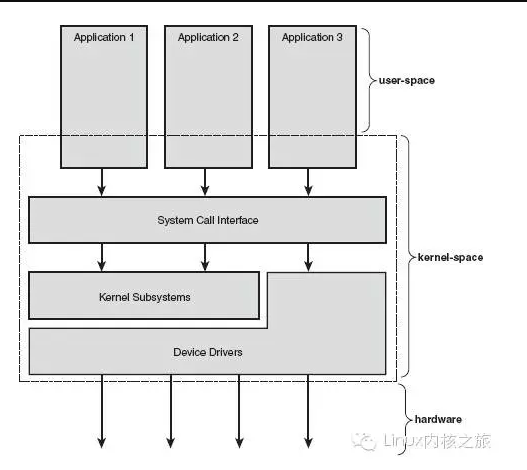

题记：《Linux内核设计与实现》是Robert Love的力作，我们有幸将其翻译成中文，关于他的趣事和他对Linux内核的看法，参阅《人物专访：核心黑客系统之一 Robert Love》。

阅读一本书，先了解一下作者的经历和最初的想法，或许也是打开阅读之门的钥匙。 由于现行一些商业操作系统日趋庞杂及设计上的缺陷，操作系统这个概念被弄得含混不清。

许多用户把他们在显示器屏幕上看到的东西理所当然的认为就是操作系统。
通常，当然在本书中也这么认为，操作系统是指在整个系统中负责完成最基本功能和系统管理的那些部分。

这些部分应该包括内核、设备驱动程序、启动引导程序、命令行shell或者其他种类的用户界面、基本的文件管理工具和系统工具。

这些都是必不可少的东西－别以为只要有浏览器和播放器就行了。系统这个词其实包含了操作系统和所有运行在它之上的应用程序。 

当然，本书的“操作系统”是关于内核的。用户界面是操作系统的外在表象，内核才是操作系统的内在核心。系统其他部分必须依靠内核这部分软件提供的服务，像管理硬件设备，分配系统资源等等。

内核有时候被称作是超级管理者或者是操作系统核心。通常一个内核由负责响应中断的中断服务程序，负责管理多个进程从而分享处理器时间的调度程序，负责管理进程地址空间的内存管理程序和网络、进程间通信等系统服务程序共同组成。

对于提供保护机制的现代系统来说，内核独立于普通应用程序，它一般处于系统态，拥有受保护的内存空间和访问硬件设备的所有权限。

这种系统态和被保护起来的内存空间，统称为内核空间。相对的，应用程序在用户空间执行。它们只能看到允许它们使用的部分系统资源，并且只使用某些特定的系统功能，不能直接访问硬件，也不能访问内核划给别人的内存范围。

当内核运行的时候，系统以内核态进入内核空间执行。而执行一个普通用户程序时，系统将以用户态进入以用户空间执行。应用程序通过系统调用和内核通信来运行（参见图1-1）。

应用程序通常调用库函数—比如说C库函数—再由库函数通过系统调用界面让内核代其完成各种不同任务。

许多库函数提供的功能并没有单独的系统调用可以替代，在那些较为复杂的函数中，调用内核的操作通常只是整个工作的一个步骤而已。举个例子，拿printf()函数来说，它提供了数据的缓存和格式化等操作，调用write()系统调用将数据写在终端上只不过是其中的一个动作罢了。

不过，也有一些库函数和系统调用就是一一对应的关系，比如open()库函数除了调用open()系统调用，几乎什么也不做。还有一些C库函数，象strcpy()，根本就不需要直接调用系统级的操作。

当一个应用程序请求执行一条系统调用，我们说内核正在代其执行。如果进一步解释，在这种情况下，应用程序被称为通过系统调用在内核空间运行，而内核被称为运行于进程上下文中。

这种交互关系—应用程序通过系统调用陷入内核—是应用程序完成其工作的基本行为方式。 内核还要负责管理系统的硬件设备。现有的几乎所有的体系结构，包括全部Linux支持的体系结构，都提供了中断机制。

当硬件设备想和系统通信的时候，它首先要发出一个异步的中断信号去打断处理器的执行，继而打断内核的执行。中断通常对应着一个中断号，内核通过这个中断号查找相应的中断服务程序，并调用这个程序响应和处理中断。

举个例子，当你敲击键盘的时候，键盘控制器发送一个中断信号，告知系统键盘缓冲区有数据到来。内核注意到这个中断对应的中断号，调用相应的中断服务程序。该服务程序处理键盘数据然后通知键盘控制器可以继续输入数据了。

为了保证同步，内核可以停用中止—既可以停止所有的中断也可以有选择的停止某个中断号对应的中断。许多操作系统的中断服务程序都不在进程上下文中执行。它们在一个与所有进程都无关的、专门的中断上下文中运行。

之所以存在这样一个专门的执行环境，就是为了保证中断服务程序能够在第一时间响应和处理中断请求，然后快速的退出这些上下文代表着内核活动的范围。

实际上我们可以将处理器在任何指定时间点上的活动范围必然概括为下列三者之一： * 运行于用户空间，执行用户进程。 * 运行于内核空间，处于进程上下文，代表某个特定的进程执行。 * 运行于内核空间，处于中断上下文，与任何进程无关，处理某个特定的中断。

以上所列几乎包括所有情况。即使边边角角的情况也不例外，例如，当CPU空闲时，内核就运行一个空进程，处于进程上下文，但运行于内核空间。