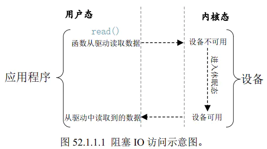
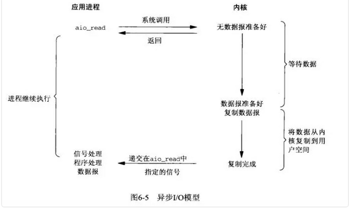
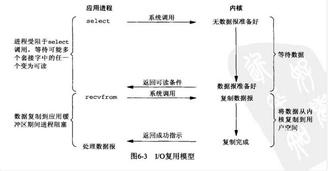

# 同步IO
## 缓冲IO与非缓冲IO

这个区别是在于调用write和read的api是调用的是标准库的库函数，还是调用的操作系统层面的api。
用非缓冲I/O函数每次读写都要进内核，调一个系统调用比调一个用户空间的函数要慢很多，所以在用户空间开辟I/O缓冲区还是必要的，用C标准I/O库函数就比较方便，省去了自己管理I/O缓冲区的麻烦。用C标准I/O库函数要时刻注意I/O缓冲区和实际文件有可能不一致，在必要时需调用fflush()。
## 直接IO与间接IO
直接 I/O，是指跳过操作系统的页缓存，直接跟文件系统交互来访问文件。非直接 I/O 正好相反，文件读写时，先要经过系统的页缓存，然后再由内核或额外的系统调用，真正写入磁盘。想要实现直接 I/O，需要你在系统调用中，指定 O_DIRECT 标志。如果没有设置过，默认的是非直接 I/O。

### page cache

文件系统中页缓存，以页为单位，通常包含多个物理上不连续的磁盘块，缓存文件的逻辑内容，加速对文件内容的访问，缓存inode，相关结构体struct address_space。

### buffer cache
缓冲区缓冲对一个磁盘块进行缓存，减少程序多次访问同一磁盘块的时间。相关结构体struct buffer_head。

## 阻塞IO和非阻塞IO

阻塞 I/O，是指应用程序执行 I/O 操作后，如果没有获得响应，就会阻塞当前线程，自然就不能执行其他任务。
非阻塞 I/O，是指应用程序执行 I/O 操作后，不会阻塞当前的线程，可以继续执行其他的任务，随后再通过轮询或者事件通知的形式，获取调用的结果。

采用**轮询方式**的非阻塞IO

进程轮询（重复）调用，消耗CPU的资源，所以又有了**事件通知**的形式。

当进程发起一个IO操作，会向内核注册一个信号处理函数，然后进程返回不阻塞；当内核数据就绪时会发送一个信号给进程，进程便在信号处理函数中调用IO读取数据。也就是在数据到达内核缓冲这段时间，进程是不需要阻塞的，也是异步的，但是收到数据准备好的事件通知后，进程需要主动发起将数据从内核拷贝到用户空间的操作，这段过程还是需要等待的，是同步的。

# 异步IO
当进程发起一个IO操作，进程返回（不阻塞），但也不能返回结果；内核把整个IO处理完后（包括数据拷贝到用户空间），会通知进程结果。如果IO操作成功则进程直接获取到数据。

用户进程发起aio_read操作之后，给内核传递描述符、缓冲区指针、缓冲区大小等，告诉内核当整个操作完成时，如何通知进程，然后就立刻去做其他事情了。当内核收到aio_read后，会立刻返回，然后内核开始等待数据准备，数据准备好以后，直接把数据拷贝到用户控件，然后再通知进程本次IO已经完成。

事件通知的方式难道不是异步的么？ 事件通知，内核是在数据准备好之后通知进程，然后进程再通过recvfrom操作进行数据拷贝。我们可以认为数据准备阶段是异步的，但是，数据拷贝操作是同步的。所以，整个IO过程也不能认为是异步的。

# IO复用模型-生产常用

多个的进程的IO可以注册到一个复用器（select）上，然后用一个进程调用该select， select会监听所有注册进来的IO；
如果select没有监听的IO在内核缓冲区都没有可读数据，select调用进程会被阻塞；而当任一IO在内核缓冲区中有可数据时，select调用就会返回；
而后select调用进程可以自己或通知另外的进程（注册进程）来再次发起读取IO，读取内核中准备好的数据。
可以看到，多个进程注册IO后，只有另一个select调用进程被阻塞。

典型应用：Linux中的select、poll、epoll三种方案，Java NIO;