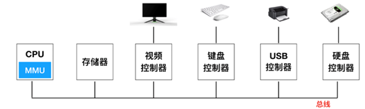
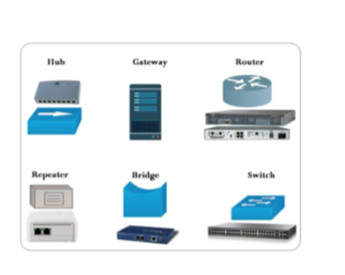
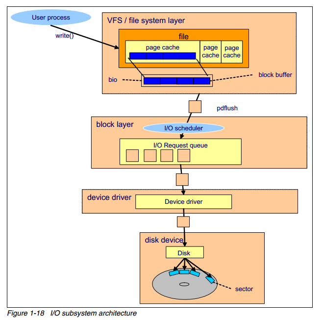
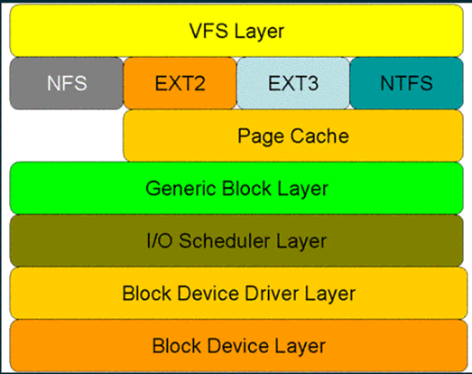
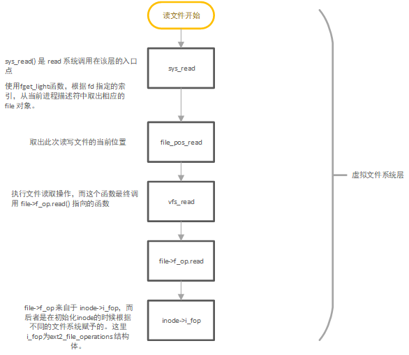
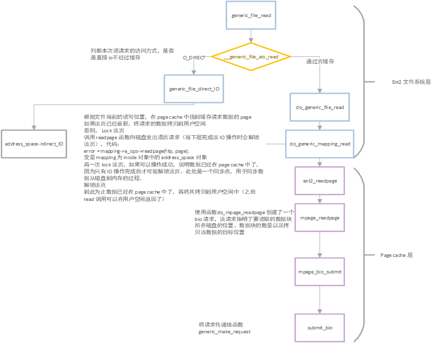
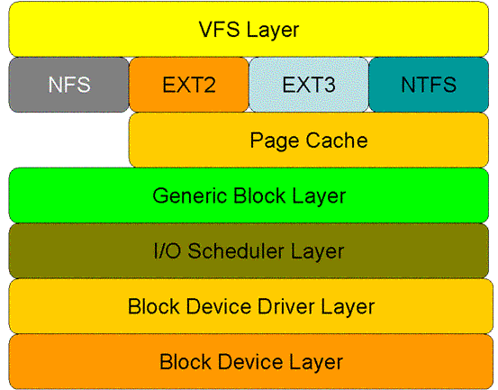

# 什么是I/O？
I/O 的概念，从字义来理解就是输入输出。操作系统从上层到底层，各个层次之间均存在 I/O。比如，CPU 有 I/O，内存有 I/O, VMM 有 I/O, 底层磁盘上也有 I/O，这是广义上的 I/O。通常来讲，一个上层的 I/O 可能会产生针对磁盘的多个 I/O，也就是说，上层的 I/O 是稀疏的，下层的 I/O 是密集的。我们通常所说的IO都是指磁盘等设备IO。


## 什么是IO设备？

I/O设备一般包括机械部件和电子部件两个部分:电子部件-设备控制器（适配器）和机械部件-设备本身。控制器是插在电路板上的一块芯片或一组芯片，这块电路板物理地控制设备。它从操作系统接收命令，例如，从设备读数据，并且完成数据的处理。

I/O设备的另一个部分是实际设备的自身。设备本身有个相对简单的接口，这是因为接口既不能做很多工作，又已经被标准化了。例如，标准化后任何一个SATA磁盘控制器就可以适配任一种SATA磁盘。

现在SATA是很多计算机的标准硬盘接口。由于实际的设备接口隐藏在控制器中，所以，操作系统看到的是对控制器的接口，这个接口可能和设备接口有很大的差别。



每类设备控制器都是不同的，所以，需要不同的软件进行控制。专门与控制器对话，发出命令并接收响应的软件，称为设备驱动程序(device driver)。每个控制器厂家必须为所支持的操作系统提供相应的设备驱动程序。例如，一台扫描仪会配有用于OSX、Windows 7、Windows 8以及Linux的设备驱动程序。

为了能够使用设备驱动程序，必须把设备驱动程序装人操作系统中，这样它可在核心态运行。


# I/O设备常见分类

## 字符设备

字符设备指能够像字节流串行顺序依次进行访问的设备，对它的读写是以字节为单位。字符设备的上层没有磁盘文件系统，所以字符设备的file_operations成员函数就直接由字符设备驱动提供（一般字符设备都会实现相应的fops集），因此file_operations 也就成为了字符设备驱动的核心。

特点：

+ 一个字节一个字节读写的设备

+ 读取数据需要按照先后数据（顺序读取） 

+ 每个字符设备在/dev目录下对应一个设备文件，linux用户程序通过设备文件（或称设备节点）来使用驱动程序操作字符设备。

+ 常见的字符设备有鼠标、键盘、串口、控制台等

 

## 块设备

块设备以数据块的形式存放数据，如NAND Flash以页为单位存储数据，并采用mount方式挂载块设备。

块设备必须能够随机存取(random access)，字符设备则没有这个要求。

块设备除了给内核提供和字符设备一样的接口外，还提供了专门面向块设备的接口，块设备的接口必须支持挂装文件系统，通过此接口，块设备能够容纳文件系统，因此应用程序一般通过文件系统来访问块设备上的内容，而不是直接和设备打交道。

对于块设备而言，上层ext2,jiffs2,fat等文件系统会 实现针对VFS的file_opertations成员函数，所以设备驱动层将看不到file_opeations的存在。磁盘文件系统和设备驱动会将对磁盘上文件的访问转换成对磁盘上柱面和扇区的访问。

特点：

+ 数据以固定长度进行传输，比如512K

+ 从设备的任意位置（可跳）读取，但实际上，块设备会读一定长度的内容，而只返回用户要求访问的内容，所以随机访问实际上还是读了全部内容。

+ 块设备包括硬盘、磁盘、U盘和SD卡等

+ 每个块设备在/dev目录下对应一个设备文件，linux用户程序可以通过设备文件（或称设备节点）来使用驱动程序操作块设备。

+ 块设备可以容纳文件系统，所以一般都通过文件系统来访问，而不是/dev设备节点。
  


## 网络设备

虽然在Linux系统存在一句话叫一切皆文件，无论是各种文本文件还是具体的硬件设备（硬件由设备文件来实现相应）。但是网络设备在Linux内核中却是唯一不体现一切皆设备思想的驱动架构，因为网络设备使用套接字来实现网数据的接受和发送。

网络设备驱动不同于字符设备和块设备，不在/dev下以文件节点代表，而是通过单独的网络接口来代表。

特点：

+ 网络接口没有像字符设备和块设备一样的设备号和/dev设备节点，只有接口名，如eth0,eth1 

+ 通过socket操作，而不是open read write




# I/O子系统架构



上图概括了一次磁盘 write 操作的过程，假设文件已经被从磁盘中读入了 page cache 中

1. 一个用户进程通过 write() 系统调用发起写请求

2. 内核更新对应的 page cache

3. pdflush 内核线程将 page cache 写入至磁盘中

4. 文件系统层将每一个 block buffer 存放为一个 bio 结构体，并向块设备层提交一个写请求

5. 块设备层从上层接受到请求，执行 IO 调度操作，并将请求放入IO 请求队列中

6. 设备驱动（如 SCSI 或其他设备驱动）完成写操作

7. 磁盘设备固件执行对应的硬件操作，如磁盘的旋转，寻道等，数据被写入到磁盘扇区中

## Block Layer

Block layer 处理所有和块设备相关的操作。block layer 最关键是数据结构是 bio 结构体。bio 结构体是 file system layer 到 block layer 的接口。 当执行一个写操作时，文件系统层将数据写入 page cache（由 block buffer 组成），将连续的块放到一起，组成 bio 结构体，然后将 bio 送至 block layer。

block layer 处理 bio 请求，并将这些请求链接成一个队列，称作 IO 请求队列，这个连接的操作就称作 IO 调度（也叫 IO elevator 即电梯算法）.

## IO scheduler
IO 调度器的总体目标是减少磁盘的寻道时间（因此调度器都是针对机械硬盘进行优化的），IO 调度器通过两种方式来减少磁盘寻道：合并和排序。

合并即当两个或多个 IO 请求的是相邻的磁盘扇区，那么就将这些请求合并为一个请求。通过合并请求，多个 IO 请求只需要向磁盘发送一个请求指令，减少了磁盘的开销。

排序就是将不能合并的 IO 请求，根据请求磁盘扇区的顺序，在请求队列中进行排序，使得磁头可以按照磁盘的旋转顺序的完成 IO 操作，可以减小磁盘的寻道次数。

调度器的算法和电梯运行的策略相似，因此 IO 调度器也被称作 IO 电梯( IO Elevator )。由于对请求进行了重排，一部分的请求可能会被延迟，以提升整体的性能。

Linux 2.4 只使用了一种通用的 IO 算法。到 Linux 2.6 实现了 4 种 IO 调度模型，其中 anticipatory 在 2.6.33 中被移除。

## 读文件函数调用流程（Linux2.6）

以经过页缓存读取一个ext2文件系统上的普通文件的流程为例，看一看IO子系统的各个层级都实现了什么功能。IO系统架构分层如下：



首先是应用程序发起系统调用，进入虚拟文件系统层。




+ dentry ： 联系了文件名和文件的 i 节点
+ inode ： 文件 i 节点，保存文件标识、权限和内容等信息
+ file ： 保存文件的相关信息和各种操作文件的函数指针集合
+ file_operations ：操作文件的函数接口集合
+ address_space ：描述文件的 page cache 结构以及相关信息，并包含有操作 page cache 的函数指针集合
+ address_space_operations ：操作 page cache 的函数接口集合
+ bio ： IO 请求的描述





# I/O性能评价指标
## IOPS
每秒的输入输出量(或读写次数)，也就是在一秒内，磁盘进行多少次 I/O 读写。是衡量磁盘性能的主要指标之一。
## 吞吐量
指单位时间内可以成功传输的数据数量。即磁盘写入加上读出的数据的大小。吞吐量等于IOPS乘以每次IO大小。
## 使用率
使用率，是指磁盘处理I/O的时间百分比，也就是一个时间段内磁盘用于处理IO的时间占这段时间的比例。过高的使用率(比如超过80% ) , 通常意味着磁盘I/O存在性能瓶颈。
## 饱和度
饱和度，是指磁盘处理I/O的繁忙程度，也就是能否接受新的IO请求。过高的饱和度,意味着磁盘存在严重的性能瓶颈。当饱和度为100%时,磁盘无法接受新的I/O请求。

## 响应时间
响应时间,是指I/O请求从发出到收到响应的间隔时间。

## 性能监测工具提供的指标

<table>
  <thead>
    <tr>
      <th>性能工具</th>
      <th>性能指标</th>
    </tr>
  </thead>
  <tbody>
    <tr>
      <td>iostat</td>
      <td>磁盘I/O使用率、IOPS、 吞吐量、响应时间、I/O平均大小以及等待队列长度</td>
    </tr>
    <tr>
      <td>pidstat</td>
      <td>进程I/O大小以及I/O延迟</td>
    </tr>
    <tr>
      <td>sar</td>
      <td>磁盘I/O使用率、IOPS 、吞吐量以及响应时间</td>
    </tr>
    <tr>
      <td>dstat</td>
      <td>磁盘I/O使用率、IOPS以及吞吐量</td>
    </tr>
    <tr>
      <td>iotop</td>
      <td>按I/O大小对进程排序</td>
    </tr>
    <tr>
      <td>slabtop</td>
      <td>目录项、索引节点以及文件系统的缓存</td>
    </tr>
    <tr>
      <td>/proc/slabinfo</td>
      <td>目录项、索引节点以及文件系统的缓存</td>
    </tr>
    <tr>
      <td>/proc/meminfo</td>
      <td>页缓存和可回收Slab缓存</td>
    </tr>
    <tr>
      <td>/proc/diskstats</td>
      <td>磁盘的IOPS、吞吐量以及延迟!</td>
    </tr>
    <tr>
      <td>/proc/pid/io</td>
      <td>进程IOPS、IO大小以及IO延迟</td>
    </tr>
    <tr>
      <td>vmstat</td>
      <td>缓存和缓冲区用量汇总</td>
    </tr>
    <tr>
      <td>blktrace</td>
      <td>跟踪块设备I/O事件</td>
    </tr>
    <tr>
      <td>biosnoop</td>
      <td>跟踪进程的块设备I/O大小</td>
    </tr>
    <tr>
      <td>biotop</td>
      <td>跟踪进程块I/O并按I/O大小排序</td>
    </tr>
    <tr>
      <td>strace</td>
      <td>跟踪进程的I/O系统调用</td>
    </tr>
    <tr>
      <td>perf</td>
      <td>跟踪内核中的I/O事件</td>
    </tr>
    <tr>
      <td>df</td>
      <td>磁盘空间和索引节点使用量和剩余量</td>
    </tr>
    <tr>
      <td>mount</td>
      <td>文件系统的挂载路径以及挂载参数</td>
    </tr>
    <tr>
      <td>du</td>
      <td>目录占用的磁盘空间大小</td>
    </tr>
    <tr>
      <td>tune2fs</td>
      <td>显示和设置文件系统参数</td>
    </tr>
    <tr>
      <td>hdparam</td>
      <td>显示和设置磁盘参数</td>
    </tr>
  </tbody>
</table>

# 磁盘I/O

iostat是I/O statistics（输入/输出统计）的缩写，iostat工具将对系统的磁盘操作活动进行监视。它的特点是汇报磁盘活动统计情况，同时也会汇报出CPU使用情况。这些指标实际上来自 /proc/diskstats。
<pre><font color="#55FF55"><b>szp@szp-pc</b></font>:<font color="#5555FF"><b>~</b></font>$ iostat -d -x
Linux 5.4.0-42-generic (szp-pc) 	2020年08月01日 	_x86_64_	(4 CPU)

Device            r/s     w/s     rkB/s     wkB/s   rrqm/s   wrqm/s  %rrqm  %wrqm r_await w_await aqu-sz rareq-sz wareq-sz  svctm  %util
<font color="#00AA00">loop0        </font><font color="#0000AA">    0.00    0.00      0.00      0.00     0.00     0.00   0.00   0.00</font><font color="#5555FF"><b>    0.80</b></font><font color="#0000AA">    0.00   0.00</font><font color="#5555FF"><b>     2.35</b></font><font color="#0000AA">     0.00</font><font color="#5555FF"><b>   1.40</b></font><font color="#0000AA">   0.00</font>
<font color="#00AA00">loop1        </font><font color="#5555FF"><b>    0.01</b></font><font color="#0000AA">    0.00</font><font color="#5555FF"><b>      0.05</b></font><font color="#0000AA">      0.00     0.00     0.00   0.00   0.00</font><font color="#5555FF"><b>    0.49</b></font><font color="#0000AA">    0.00   0.00</font><font color="#5555FF"><b>     4.46</b></font><font color="#0000AA">     0.00</font><font color=a"#5555FF"><b>   0.41</b></font><font color="#0000AA">   0.00</font>
<font color="#00AA00">loop2        </font><font color="#0000AA">    0.00    0.00</font><font color="#5555FF"><b>      0.04</b></font><font color="#0000AA">      0.00     0.00     0.00   0.00   0.00</font><font color="#5555FF"><b>    0.65</b></font><font color="#0000AA">    0.00   0.00</font><font color="#5555FF"><b>    10.64</b></font><font color="#0000AA">     0.00</font><font color="#5555FF"><b>   1.14</b></font><font color="#0000AA">   0.00</font>
<font color="#00AA00">loop3        </font><font color="#5555FF"><b>    0.05</b></font><font color="#0000AA">    0.00</font><font color="#5555FF"><b>      0.08</b></font><font color="#0000AA">      0.00     0.00     0.00   0.00   0.00</font><font color="#5555FF"><b>    2.17</b></font><font color="#0000AA">    0.00   0.00</font><font color="#5555FF"><b>     1.65</b></font><font color="#0000AA">     0.00</font><font color="#5555FF"><b>   0.23</b></font><font color="#0000AA">   0.00</font>
<font color="#00AA00">loop4        </font><font color="#0000AA">    0.00    0.00</font><font color="#5555FF"><b>      0.01</b></font><font color="#0000AA">      0.00     0.00     0.00   0.00   0.00</font><font color="#5555FF"><b>    0.49</b></font><font color="#0000AA">    0.00   0.00</font><font color="#5555FF"><b>     8.00</b></font><font color="#0000AA">     0.00</font><font color="#5555FF"><b>   1.66</b></font><font color="#0000AA">   0.00</font>
<font color="#00AA00">loop5        </font><font color="#0000AA">    0.00    0.00      0.00      0.00     0.00     0.00   0.00   0.00</font><font color="#5555FF"><b>    0.40</b></font><font color="#0000AA">    0.00   0.00</font><font color="#5555FF"><b>     2.47</b></font><font color="#0000AA">     0.00</font><font color="#5555FF"><b>   1.02</b></font><font color="#0000AA">   0.00</font>
<font color="#00AA00">loop6        </font><font color="#5555FF"><b>    0.01</b></font><font color="#0000AA">    0.00</font><font color="#5555FF"><b>      0.02</b></font><font color="#0000AA">      0.00     0.00     0.00   0.00   0.00</font><font color="#5555FF"><b>    0.22</b></font><font color="#0000AA">    0.00   0.00</font><font color="#5555FF"><b>     2.44</b></font><font color="#0000AA">     0.00</font><font color="#5555FF"><b>   0.49</b></font><font color="#0000AA">   0.00</font>
<font color="#00AA00">loop7        </font><font color="#5555FF"><b>    0.01</b></font><font color="#0000AA">    0.00</font><font color="#5555FF"><b>      0.02</b></font><font color="#0000AA">      0.00     0.00     0.00   0.00   0.00</font><font color="#5555FF"><b>    0.28</b></font><font color="#0000AA">    0.00   0.00</font><font color="#5555FF"><b>     2.34</b></font><font color="#0000AA">     0.00</font><font color="#5555FF"><b>   0.59</b></font><font color="#0000AA"> </font></pre>
以上指标的含义如下：
<table>
  <thead>
    <tr>
      <th>性能指标</th>
      <th>含义</th>
      <th>提示</th>
    </tr>
  </thead>
  <tbody>
    <tr>
      <td>r/s</td>
      <td>每秒发送给磁盘的读请求数</td>
      <td>合并后的请求数</td>
    </tr>
    <tr>
      <td>w/s</td>
      <td>每秒发送给磁盘的写请求数</td>
      <td>合并后的请求数</td>
    </tr>
    <tr>
      <td>rkB/s</td>
      <td>每秒从磁盘读取的数据量</td>
      <td>单位为kB</td>
    </tr>
    <tr>
      <td>wkB/s</td>
      <td>每秒向磁盘写入的数据量</td>
      <td>单位为kB</td>
    </tr>
    <tr>
      <td>rrqm/s</td>
      <td>每秒合并的读请求数</td>
      <td>%rrqm表示合并读请求的百分比</td>
    </tr>
    <tr>
      <td>wrqm/s</td>
      <td>每秒合并的写请求数</td>
      <td>%wrqm表示合并写请求的百分比</td>
    </tr>
    <tr>
      <td>r_await</td>
      <td>读请求处理完成等待时间</td>
      <td>包括队列中的等待时间和设备实际处理的时间，单位为毫秒</td>
    </tr>
    <tr>
      <td>w_await</td>
      <td>写请求处理完成等待时间</td>
      <td>包括队列中的等待时间和设备实际处理的时间，单位为毫秒</td>
    </tr>
    <tr>
      <td>aqu-sz</td>
      <td>平均请求队列长度</td>
      <td>旧版中为avgqu-sz</td>
    </tr>
    <tr>
      <td>rareq-sz</td>
      <td>平均读请求大小</td>
      <td>单位为kB</td>
    </tr>
    <tr>
      <td>wareq-sz</td>
      <td>平均写请求大小</td>
      <td>单位为kB</td>
    </tr>
    <tr>
      <td>svctm</td>
      <td>处理I/O请求所需的平均时间(不包括等待时间)</td>
      <td>单位为毫秒。注意这是推断的数据，并不保证完全准确</td>
    </tr>
    <tr>
      <td>%util</td>
      <td>磁盘处理I/O的时间百分比</td>
      <td>即使用率，由于可能存在并行I/O，100%并不一定表明磁盘I/O饱和</td>
    </tr>
  </tbody>
</table>

关于%util，举个简单的例子，某硬盘处理单个I/O需要0.1秒，有能力同时处理10个I/O请求，那么当10个I/O请求依次顺序提交的时候，需要1秒才能全部完成，在1秒的采样周期里%util达到100%；而如果10个I/O请求一次性提交的话，0.1秒就全部完成，在1秒的采样周期里%util只有10%。可见，即使%util高达100%，硬盘也仍然有可能还有余力处理更多的I/O请求，即没有达到饱和状态。

+ %util，就是磁盘 I/O 使用率；
+ r/s+ w/s ，就是磁盘IOPS；
+ rkB/s+wkB/s ，就是磁盘吞吐量；
+ r_await，w_await ，就是磁盘响应时间。

# 进程I/O
iostat只提供磁盘整体的I/O性能数据，缺点在于 ,并不能知道具体是哪些进程在进行磁盘读写。要观察进程的I/O情况,你还可以使用**pidstat和iotop**这两个工具。

<pre><font color="#55FF55"><b>szp@szp-pc</b></font>:<font color="#5555FF"><b>~</b></font>$ pidstat -d
Linux 5.4.0-42-generic (szp-pc) 	2020年08月01日 	_x86_64_	(4 CPU)

16时26分59秒   UID       PID   kB_rd/s   kB_wr/s kB_ccwr/s iodelay  Command
16时26分59秒<font color="#00AA00">     0         1</font><font color="#0000AA">     -1.00     -1.00     -1.00</font><font color="#5555FF"><b>      25  systemd</b></font>
16时26分59秒<font color="#00AA00">     0       395</font><font color="#0000AA">     -1.00     -1.00     -1.00</font><font color="#5555FF"><b>    3244  jbd2/sda1-8</b></font>
16时26分59秒<font color="#00AA00">     0       446</font><font color="#0000AA">     -1.00     -1.00     -1.00</font><font color="#5555FF"><b>      46  systemd-journal</b></font>
</pre>

从pidstat的输出你能看到,它可以实时查看每个进程的I/O情况,包括下面这些内容。
```
用户ID (UID)和进程ID( PID)。

每秒读取的数据大小( kB_rd/s),单位是 KB。

每秒发出的写请求数据大小( kB_wr/s )，单位是KB。

每秒取消的写请求数据大小( kB_ ccwr/s ),单位是 KB。

块I/O延迟(iodelay) ,包括等待同步块I/O和换入块I/O结束的时间,单位是时钟周期。
```
kB_rd/s+kB_wr/s = 进程吞吐量


除了可以用pidstat实时查看,iotop可以按照I/O
大小对进程排序,然后找到I/O较大的那些进程。

<pre>Total DISK READ :       0.00 B/s | Total DISK WRITE :       3.36 M/s
Actual DISK READ:       0.00 B/s | Actual DISK WRITE:       4.70 M/s
<span style="background-color:#00FF00"><font color="#000000">  TID  PRIO  USER     DISK READ</font></span><span style="background-color:#00FF00"><font color="#000000"><b> DISK WRITE&gt;</b></font></span><span style="background-color:#00FF00"><font color="#000000">  SWAPIN      IO    COMMAND               </font></span>
 4116 be/4 root        0.00 B/s 1146.13 K/s  0.00 %  2.50 % snapd
 4109 be/4 root        0.00 B/s  764.09 K/s  0.00 %  0.80 % snapd
 4117 be/4 root        0.00 B/s  764.09 K/s  0.00 %  1.31 % snapd
 4206 be/4 root        0.00 B/s  764.09 K/s  0.00 %  1.31 % snapd
    1 be/4 root        0.00 B/s    0.00 B/s  0.00 %  0.00 % init splash
    2 be/4 root        0.00 B/s    0.00 B/s  0.00 %  0.00 % [kthreadd]
</pre>

上图为按照磁盘写速度进行排序的情况。

从这个输出,你可以看到,前两行分别表示,进程的磁盘读写大小总数和磁盘真实的读写大小总数。因为缓存、缓冲区、I/O 合并等因素的影响，它们可能并不相等。

剩下的部分,则是从各个角度来分别表示进程的1/O情况,包括线程ID、I/O优先级、每秒读磁盘的大小、每秒写磁盘的大小、换入和等待I/O的时钟百分比等。

# IO延迟

任何一个系统都有两个指标和性能紧密联系：响应时间和吞吐量。两个很关键的指标则是系统的IO延迟(响应时间)与IO吞吐量。

## 什么是IO延迟？
1个完整的I/O传输，可能会经过以下路径：  
CPU ->内存->硬盘   
细分一下如下：   
进程->虚拟文件系统->具体文件系统（页缓存）->通用块层（加入请求队列）->IO调度层->块设备驱动层->块设备层(操作磁盘)->磁盘 



在上述I/O传输途径中消耗的时间就是IO延迟。我们习惯性的把IO的延迟分为以下几部分：
1. 系统OS等软件配置产生的延迟：异步IO的情况下整个系统的延迟就会比同步IO下好很多。
   

2. 硬件延迟：存储的延迟则是自身主控器+硬盘的延迟。存储主控上的缓存都比较大，加上存储厂家对命中率算法持续改进，以往单个硬盘因寻址、旋转产生的IO延迟时间都可以在一定比例上规避。
   
可以对io延迟做这样的划分：IO延迟时间=常量延迟+变量延迟

常量就是操作系统和数据库参数配置完毕后，那些硬件上的固定延迟加上一定存储命中率下软硬件共同作用产生的延迟时间，变量延迟就是io压力变大时，特别是海量随机小IO请求，导致的延迟变大。


# BCC中提供的IO延迟监测工具

## biotop

biotop是跟踪块设备I/O事件，并按照总的传输字节大小进行排序的工具，biotop总结了哪些事件执行了磁盘I / O，并打印出在一定时间间隔内，事件发送的进程id,平均等待时间，磁盘设备号等信息。

```bash

# ./biotop
Tracing... Output every 1 secs. Hit Ctrl-C to end

08:04:11 loadavg: 1.48 0.87 0.45 1/287 14547

PID    COMM             D MAJ MIN DISK       I/O  Kbytes  AVGms
14501  cksum            R 202 1   xvda1      361   28832   3.39
6961   dd               R 202 1   xvda1     1628   13024   0.59
13855  dd               R 202 1   xvda1     1627   13016   0.59

```
默认情况下，屏幕每1秒刷新一次，并显示前20个磁盘
消费者，按总KB排序。 打印的第一行是标题，其中包含时间，然后包含/proc/loadavg的内容。
其他bcc工具可用于获取更多详细的内容，例如biolatency 和 biosnoop。


## biolatency

该工具跟踪块设备IO(磁盘IO)的延迟分布情况：
```bash
# ./biolatency
Tracing block device I/O... Hit Ctrl-C to end.
^C
     usecs           : count     distribution
       0 -> 1        : 0        |                                      |
       2 -> 3        : 0        |                                      |
       4 -> 7        : 0        |                                      |
       8 -> 15       : 0        |                                      |
      16 -> 31       : 0        |                                      |
      32 -> 63       : 0        |                                      |
      64 -> 127      : 1        |                                      |
     128 -> 255      : 12       |********                              |
     256 -> 511      : 15       |**********                            |
     512 -> 1023     : 43       |*******************************       |
    1024 -> 2047     : 52       |**************************************|
    2048 -> 4095     : 47       |**********************************    |
    4096 -> 8191     : 52       |**************************************|
    8192 -> 16383    : 36       |**************************            |
   16384 -> 32767    : 15       |**********                            |
   32768 -> 65535    : 2        |*                                     |
   65536 -> 131071   : 2        |*                                     |


```

第一列表示延迟的时间范围，单位是微秒；第二列表示有多少事件属于该延迟时间段；第三列表示直方图。

## ext4dist

我们通常在块设备层（ block device layer）研究存储I/O延迟问题，如上面的biolatency和biotop工具，但是对文件系统进行检测可以提供更多相关的指标来了解应用程序如何受到影响。ext4dist工具针对ext4文件系统，跟踪读取（reads），写入（writes），打开（opens）和同步（fsync），并将其延迟汇总为直方图。
```bash

# ext4dist
Tracing ext4 operation latency... Hit Ctrl-C to end.
^C

operation = 'read'
     usecs               : count     distribution
         0 -> 1          : 1210     |****************************************|
         2 -> 3          : 126      |****                                    |
         4 -> 7          : 376      |************                            |
         8 -> 15         : 86       |**                                      |
        16 -> 31         : 9        |                                        |
        32 -> 63         : 47       |*                                       |
        64 -> 127        : 6        |                                        |
       128 -> 255        : 24       |                                        |
       256 -> 511        : 137      |****                                    |
       512 -> 1023       : 66       |**                                      |
      1024 -> 2047       : 13       |                                        |
      2048 -> 4095       : 7        |                                        |
      4096 -> 8191       : 13       |                                        |
      8192 -> 16383      : 3        |                                        |

operation = 'write'
     usecs               : count     distribution
         0 -> 1          : 0        |                                        |
         2 -> 3          : 0        |                                        |
         4 -> 7          : 0        |                                        |
         8 -> 15         : 75       |****************************************|
        16 -> 31         : 5        |**                                      |

operation = 'open'
     usecs               : count     distribution
         0 -> 1          : 1278     |****************************************|
         2 -> 3          : 40       |*                                       |
         4 -> 7          : 4        |                                        |
         8 -> 15         : 1        |                                        |
        16 -> 31         : 1        |          

```

此输出显示读取延迟的双峰分布，其中分别为延迟小于7微秒的较快事件和256至1023微秒之间的较慢事件。 计数列显示有多少事件属于该延迟范围。 较快的事件可能是内存中文件系统高速缓存命中的原因，较慢的事件是从存储设备（磁盘）中读取的。

主要代码实现：

``` C
// time operation 给内核函数创建一个kprobe
int trace_entry(struct pt_regs *ctx)
{
    //获取当前进程pid
    u32 pid = bpf_get_current_pid_tgid();

    //FILTER_PID是为过滤pid设置的占位符，根据后面的python程序可知，
    //如果用户没有在参数里面指定pid，FILTER_PID替换为0；否则，FILTER_PID替换为“pid != 用户输入的pid”
    //即如果当前进程pid不是用户指定的进程pid，函数返回，不进行监测。
    if (FILTER_PID)
        return 0;

    //用户没有指定pid，或者用户指定的pid等于当前进程pid，执行下面的函数获取当前的时间，以纳秒为单位。
    u64 ts = bpf_ktime_get_ns();

    //将当前进程pid地址作为key，以及当前时间ts地址作为value，更新保存到hash map。
    start.update(&pid, &ts);

    return 0;
}

```

该函数在文件系统执行读写函数的时候，例如：ext4_file_read_iter,ext4_file_write_iter，加入kprobe，用以记录本次读写开始的时间。

```C
// 按照操作名称，统计操作执行的延迟，pt_regs保存寄存器信息和bpf上下文，op为操作名称，例如read，write
static int trace_return(struct pt_regs *ctx, const char *op)
{
    //定义变量存储开始追踪的时间
    u64 *tsp;
    u32 pid = bpf_get_current_pid_tgid();

    // fetch timestamp and calculate delta 从hash map中取出保存的开始时间
    tsp = start.lookup(&pid);
    if (tsp == 0) {
        return 0;   // missed start or filtered 当前进程没有记录，函数返回。
    }
    //获取当前系统时间，并且计算出与开始时间的时间增量，保存到delta。
    u64 delta = bpf_ktime_get_ns() - *tsp;

    //删除hash map中当前进程的开始监测时间。
    start.delete(&pid);

    // Skip entries with backwards time: temp workaround for #728 舍弃时间增量为负值的情况，函数返回
    if ((s64) delta < 0)
        return 0;
    //时间单位转换，FACTOR占位符表示进制，将纳秒转换为微妙或者毫秒
    delta /= FACTOR;

    // store as histogram  函数bpf_log2l构造直方图索引
    dist_key_t key = {.slot = bpf_log2l(delta)};
    //操作名称保存到结构体变量
    __builtin_memcpy(&key.op, op, sizeof(key.op));
    //根据key值累加
    dist.increment(key);

    return 0;
}

```
该函数为在读写函数执行完成，返回的时候，加入的kprobe，结合函数开始执行时记录下的时间与当前的时间，计算出时间差，即本次读写所用的时间。

## ext4slower

ext4slower显示ext4的读取，写入，打开和同步操作，其速度低于阈值的所有事件。
该工具与上一个工具不同之处在于，该工具提供了一个延迟时间阈值参数，可以监测到所有延迟低于某个阈值的事件，并打印输出。当然这仅能跟踪常见文件系统操作，
其他文件系统操作（例如，inode操作，getattr()）
不会跟踪。
```bash

# ./ext4slower
Tracing ext4 operations slower than 10 ms
TIME     COMM           PID    T BYTES   OFF_KB   LAT(ms) FILENAME
06:35:01 cron           16464  R 1249    0          16.05 common-auth
06:35:01 cron           16463  R 1249    0          16.04 common-auth
06:35:01 cron           16465  R 1249    0          16.03 common-auth
06:35:01 cron           16465  R 4096    0          10.62 login.defs
06:35:01 cron           16464  R 4096    0          10.61 login.defs
06:35:01 cron           16463  R 4096    0          10.63 login.defs
06:35:01 cron           16465  R 2972    0          18.52 pam_env.conf
06:35:01 cron           16464  R 2972    0          18.51 pam_env.conf
06:35:01 cron           16463  R 2972    0          18.49 pam_env.conf
06:35:01 dumpsystemstat 16473  R 128     0          12.58 date
06:35:01 debian-sa1     16474  R 283     0          12.66 sysstat
06:35:01 debian-sa1     16474  R 128     0          10.39 sa1
06:35:01 dumpsystemstat 16491  R 128     0          13.22 ifconfig
06:35:01 DumpThreads    16534  R 128     0          12.78 cut
06:35:01 cron           16545  R 128     0          14.76 sendmail
06:35:01 sendmail       16545  R 274     0          10.88 dynamicmaps.cf
06:35:02 postdrop       16546  R 118     0          32.94 Universal
06:35:02 pickup         9574   R 118     0          21.02 localtime
[...]

```
以上是所有延迟时间大于10毫秒的事件。

此“延迟时间”是从虚拟文件系统（VFS）向文件系统的接口发起操作时算起的，直到完成。 这涵盖了所有内容：
块设备I/O（磁盘I/O），文件系统CPU周期，文件系统锁，请求队列等待时间等。这是对延迟时间的更好衡量。因为应用程序从文件系统读取，而不是通过块设备层接口读取。
