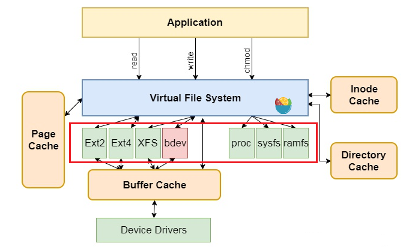
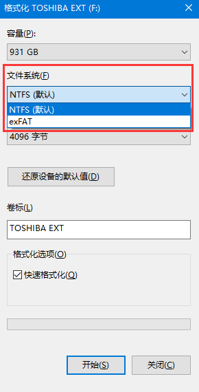
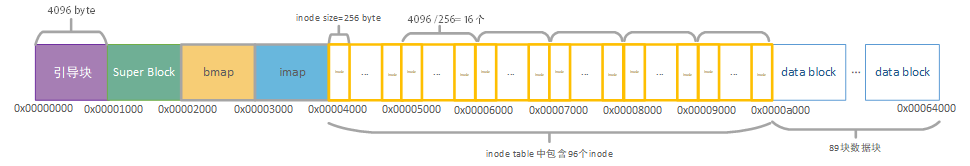

为了加深对Linux操作系统中文件系统的理解，本篇文章将详细介绍编写一个简单文件系统的第一步，如何实现磁盘的格式化。好了，那就从准备工作开始吧

# 准备工作

准备工作主要对文件系统的概念，格式化的概念，磁盘的准备，文件系统逻辑结构设计，重要数据结构进行介绍。

## 文件系统的概念

文件系统是操作系统向用户提供一套存取数据的抽象数据结构，方便用户管理一组数据。文件系统在Linux操作系统中的位置在下图红框中标出，如Ext2、Ext4等。而在windows中现在常用的文件系统为NTFS、exFAT等，想必大家在格式化U盘、硬盘的时候就经常见到了。



为什么要用文件系统来存取数据呢？是为了图个方便。试想如果没有文件系统，放置在存储介质（硬盘）中的数据将是一个庞大的数据主体，无法分辨一个数据从哪里停止，下一个数据又从哪里开始。既然是在逻辑上划分，那总得有个依据，将划分的结果落实下来，不能凭空的，今天我这样划分，明儿个他那样划分，就乱套了。这时候我们就需要创建一系列的数据结构（包含数据和对此数据的一系列操作），来表示我们划分的逻辑。

## 格式化的概念

如果将硬盘比作一张空白A4纸，那么将其格式化为某种文件系统（如下图所示，格式化的时候会让我们选择一个文件系统），就类似在纸上面印上田字格，页码，为其加上目录，用来练习书法；有的人想练习英文，那就印上四线三格。这样一张纸根据不同的用途，就有了不同的结构划分。言而总之，通过定义一系列数据结构，用于划分硬盘存储的结构和管理数据，就是文件系统。

。

我们顺便把格式化也给说完了，如果还不清楚，后面还会有介绍。

# 磁盘的准备

因为我们是实验是编写简单文件系统，为了方便和简化，我们将创建一个名字为image的文件，来代替真正的物理磁盘。我们对该文件进行格式化，查看文件的内容，来检验我们的成果。
下面我们将使用linux中dd命令来创建一个指定块大小的文件。我们的image包含100个块，并且每个块的大小为4096字节，全部用0填充。
```

dd bs=4096 count=100 if=/dev/zero of=image

```
> dd命令：用指定大小的块拷贝一个文件，并在拷贝的同时进行指定的转换。
> 
> if=文件名：输入文件名，缺省为标准输入。即指定源文件。
> 
> of=文件名：输出文件名，缺省为标准输出。
> 
>count=blocks：只拷贝blocks个块，即拷贝块的个数。
> 
>bs=bytes：同时设置读入/输出的块大小为bytes个字节。
>
>/dev/zero 是类 Unix 系统中一个特殊的文件，当读取该文件时，它会提供无限的空字符 null或者0。


可以使用hexdump命令，查看image里面的数据全都为0。这就是一个未格式化磁盘的样子。它的地址从0x00000000-0x00064000(409600)，也就是文件大小为409600 byte。

<pre><font color="#55FF55"><b>szp@szp-pc</b></font>:<font color="#5555FF"><b>~/code/myfs</b></font>$ dd bs=4096 count=100 if=/dev/zero of=image
记录了100+0 的读入
记录了100+0 的写出
409600 bytes (410 kB, 400 KiB) copied, 0.00192153 s, 213 MB/s
<font color="#55FF55"><b>szp@szp-pc</b></font>:<font color="#5555FF"><b>~/code/myfs</b></font>$ hexdump -C image
00000000  00 00 00 00 00 00 00 00  00 00 00 00 00 00 00 00  |................|
*
00064000
</pre>

## 文件系统逻辑结构设计

磁盘准备好了，下面就应该考虑如何进行逻辑上的划分了。磁盘都是以块为单位，我们上面创建的磁盘一共包含100块，每一块的大小为4k。参考现有的文件系统，一个文件系统必须包含以下逻辑结构划分。



将100块，分为6大部分，现做简要介绍。

+ 0-1块：引导块，用于引导操作系统启动，必须保留。
+ 1-2块：Super Block(超级块)，包含了文件系统布局的重要信息，一旦破坏，将导致磁盘不可读。包括inode节点的个数、磁盘块数以及空闲块链表的起始位置。

+ 2-3块：block map(块位图)，记录磁盘中所有块的使用情况，即这100个块哪个是被使用了，哪个没有被使用。
+ 3-4块：inode map(inode位图)，与块位图同理，存储的是inode节点的占用情况。
+ 4-10块：inode table（inode节点），每个inode节点表示一个确切的文件。
+ 10-99块：data block(数据块)，存放文件具体内容的块。

inode用于描述一个具体的文件的元信息，例如该文件的创建时间，是目录还是具体文件等等。需要注意的是它并不存储文件内部具体的数据，文件中具体数据是存放在数据块（data block）中的，那我们怎么知道当前inode对应那几个数据块呢，毕竟我们这里数据块就有89个。inode中设置一个block数组，block数组存储着每个块的索引，用于定位文件。

位图或位向量（块位图和inode位图）是一系列位或位的集合，其中每个位对应一个磁盘块，该位可以采用两个值: 0和1, 1表
示已分配该块，而0表示一个空闲块。如1111 0000表示前四块已分配，后四块空闲。


>uint64_t block[MISER_N_BLOCKS];

MISER_N_BLOCKS设置为10，也就是一个文件最大也就能用10个块来存储，因为一个块的大小为4k，那么一个文件最大也就40k。这也太小了，真正的文件系统中inode会有多级索引，可以支持更多的块索引，我们这里只用10个一级索引，所以小了一些。


## 重要数据结构

磁盘逻辑结构既然划分好了，就要定义一系列数据结构来进行表示、存储和操作。

### super block

超级块代表了整个文件系统，超级块是文件系统的控制块，有整个文件系统信息。

```C
struct MISER_fs_super_block {
	//版本
	uint64_t version;
	//区别于其他文件系统的标识
	uint64_t magic;
	//块大小
	uint64_t block_size;
	//inode节点总数
	uint64_t inodes_count;
	//空闲块数
	uint64_t free_blocks;
	//总块数
	uint64_t blocks_count;

    //bmap开始的块索引
	uint64_t bmap_block;
	//imap开始的块索引
	uint64_t imap_block;
	//inode开始的块索引
	uint64_t inode_table_block;
	//data block开始的块索引
	uint64_t data_block_number;
	//填充，让super block结构体大小正好占满一个块（4096 byte），方便计算
	char padding[4016];
};

```
+ 超级块中的char padding[4016]，是为了使超级块的大小为4096bytes，以简化计算；
+ magic为1314522，用以区别其他文件系统；
+ inodes_count记录文件系统所支持的inode个数，在格式化的时候写入。
+ bmap_block记录着bmap开始的块索引，我们这里根据上面的逻辑划分，取值为2。
+ imap_block记录imap开始的块索引，取值为3。
+ inode_table_block记录inode开始的块索引，取值为4。
+ data_block_number记录数据部分开始的块索引，这里为10，记录索引是为了简化文件块的定位操作。

### MISER_inode

MISER_inode对应磁盘中的inode。

```C
struct MISER_inode {
	mode_t mode;//4byte
	uint64_t inode_no;
	uint64_t blocks;
	uint64_t block[MISER_N_BLOCKS];
	union {
		uint64_t file_size;
		uint64_t dir_children_count;
	};
    int32_t i_uid; 
    int32_t i_gid; 
    int32_t i_nlink;
    
    int64_t i_atime;
    int64_t i_mtime;
    int64_t i_ctime;
    char padding[112];
};

```
+ mode表示当前文件是目录（目录也是文件）还是一个常规文件
+ inode_no表示节点号码
+ blocks表示该inode自身所占块的数目
+ block[MISER_N_BLOCKS]表示文件中数据存储位置的数据块索引
+ file_size如果该inode是常规文件，表示文件大小
+ dir_children_count如果该inode是目录，表示子目录数
+ i_uid、i_gid表示用户id，组id
  
### 目录项

文件只有打开后才能够被读取。在文件打开后，操作系统会使用用户提供的路径名来定位磁盘中的目录。目录项提供了查找文件磁盘块所需要的信息。
如果使用相对路径，则从当前进程的当前目录开始查找，否则就从根目录开始。
在以上两种情况中，第一个目录的i节点很容易定位:在进程描述符中有指向它的指针，或者在使用根目录的情况下，它存储在磁盘上预定的块上。

```c

struct MISER_dir_record
{
	char filename[MISER_FILENAME_MAX_LEN];
	uint64_t inode_no;
};

```
+ filename字符数组，存储文件的名称，MISER_FILENAME_MAX_LEN是256，文件名称最长为256
+ inode_no存储对应的inode节点号码

# 功能实现

为了实现我们设计的文件系统，我们需要创建一个mkfs格式化程序，使用该程序，将image磁盘改写成我们划分好的结构。
mkfs程序依次向image写入超级块（引导块保留）、block map、inode map、inode，在data block创建一个根目录，根目录中创建一个测试文件。

我们将按照如下顺序依次写入文件：

```c
    //初始化superblock
    init_disk(fd, argv[1]);
    //写入引导块
	write_dummy(fd);
    //写入超级块
	write_sb(fd);
    //写入块位图
	write_bmap(fd);
	//写入inode位图
	write_imap(fd);
	//创建根目录，测试文件
	write_itable(fd);
```

## 初始化超级块和块位图
超级块包含了文件系统的基本信息，其信息在上文中有详细描述。写入超级块信息，需要计算整个磁盘的大小，然后计算imap，bmap以及inode table的大小，这样才能确定各个区域在磁盘中的位置。这些工作都是在init_disk这个函数中完成的。

```c

static int init_disk(int fd, const char* path)
{
	disk_size = get_file_size(path);
	if (disk_size == -1) {
		perror("Error: can not get disk size!\n");
		return -1;
	}
	printf("Disk size id %lu\n", disk_size);
	super_block.version = 1;
	super_block.block_size = MISER_BLOCKSIZE;
	super_block.magic = MAGIC_NUM;
	super_block.blocks_count = disk_size/MISER_BLOCKSIZE;
	printf("blocks count is %llu\n", super_block.blocks_count);
	super_block.inodes_count = super_block.blocks_count;
	super_block.free_blocks = 0;
	//计算bmap，8*MISER_BLOCKSIZE表示1B=8位，4kb=4096*8=32768位二进制，因为是位图，用一位表示一个数据块，一个4k的块存储位图，共可以表示32768个数据块。
	//super_block.blocks_count/(8*MISER_BLOCKSIZE)表示，该磁盘总的块数整除用一个块存储该磁盘位图可以表示的磁盘块数，就可以得到该磁盘应该用多少个块来存放块位图，
	//这里bmap_size等于0，表示存储磁盘块位图，一块磁盘都用不了，因为我们的磁盘一共100块，而用一个4k的块来存储位图就可以表示32768块，所以表示100块绰绰有余。
	bmap_size = super_block.blocks_count/(8*MISER_BLOCKSIZE);
	super_block.bmap_block = RESERVE_BLOCKS;

//当计算出存储位图的块数不是整数时，要对块位图块数做+1操作，以免不够用。
	if (super_block.blocks_count%(8*MISER_BLOCKSIZE) != 0) {
		bmap_size += 1;
	}
	bmap = (uint8_t *)malloc(bmap_size*MISER_BLOCKSIZE);
	//将申请的4k大小的bmap初始化为0
	memset(bmap,0,bmap_size*MISER_BLOCKSIZE);

	//计算imap
	imap_size = super_block.inodes_count/(8*MISER_BLOCKSIZE);
	super_block.imap_block = super_block.bmap_block + bmap_size;

	if(super_block.inodes_count%(8*MISER_BLOCKSIZE) != 0) {
		imap_size += 1;
	}
	imap = (uint8_t *)malloc(imap_size*MISER_BLOCKSIZE);
	memset(imap,0,imap_size*MISER_BLOCKSIZE);

	//计算inode_table，表示需要多少个数据块来存储,(MISER_BLOCKSIZE/MISER_INODE_SIZE)代表一个块能够存放几个inode,inodes_count代表inode总数
	inode_table_size = super_block.inodes_count/(MISER_BLOCKSIZE/MISER_INODE_SIZE);
	//计算inode_table的数据块索引
	super_block.inode_table_block = super_block.imap_block + imap_size;
	//计算数据块的块索引
	super_block.data_block_number = RESERVE_BLOCKS + bmap_size + imap_size + inode_table_size;
	//计算空闲块数
	super_block.free_blocks = super_block.blocks_count - super_block.data_block_number - 1;

	//设置bmap
	int idx;
	// plus one becase of the root dir
	for (idx = 0; idx < super_block.data_block_number + 1; ++idx) {
		if (set_bmap(idx, 1)) {
			return -1;
		}
	}

	
	return 0;
}

```
主要流程为，获取磁盘大小（image文件），计算bmap，imap的大小，需要用几个块存储；计算inode总共占用几个块，分别计算出6个部分逻辑划分的起始块索引。计算出了磁盘元数据占用的块数，就可以使用set_bmap修改bmap了。根据逻辑划分可以知道，引导块，超级块，bmap，imap,inode总共使用了10个块，然后我们还需要创建一个根目录和一个文件，会占用一个data block。因此image中前11个块都会被占用。set_bmap函数执行完成后，使用gdb单步调试可以看到bmap数组前11位被置为1。该数组会在后面直接写入到文件。


设置bmap函数如下：

```c

static int set_bmap(uint64_t idx, int value)
{
	if(!bmap) {
		return -1;
	}
	//sizeof(char)的值为1，bmap数组中的元素类型为8位无符号整型，因为磁盘的前11块已经被使用，所以这里将数组的前11位置为1
	//因为数组把每八位二进制作为一个元素，这里对8整除得到数组元素的索引
	uint64_t array_idx = idx/(sizeof(char)*8);

	//对8取余，得到在对应数组元素中的偏移量
	uint64_t off = idx%(sizeof(char)*8);

	//数组下标超过了位图的数据大小
	if(array_idx > bmap_size*MISER_BLOCKSIZE) {
		printf("Set bmap error and idx is %llu\n", idx);
		return -1;
	}
	if(value)//对应块位图置1
		bmap[array_idx] |= (1<<off);
	else//对应块位图置0
		bmap[array_idx] &= ~(1<<off);
	return 0;
}

```
## 写入引导块
初始化超级块（struct MISER_fs_super_block super_block）和块位图(uint8_t* bmap)以后，首先写入第一个块，也就是引导块的数据。引导块全部置0。
```c

static int write_dummy(int fd)
{
	char dummy[MISER_BLOCKSIZE] = {0};
	ssize_t res = write(fd, dummy, MISER_BLOCKSIZE);
	if (res != MISER_BLOCKSIZE) {
		perror("write_dummy error!");
		return -1;
	}
	return 0;
}


```

使用hexdump命令查看写入的情况，是否正确。
第0块，0x00000000-0x00001000，其中的数据全部为0，*省略了重复的内容。

<pre><font color="#55FF55"><b>szp@szp-pc</b></font>:<font color="#5555FF"><b>~/code/myfs</b></font>$ hexdump -C image 
00000000  00 00 00 00 00 00 00 00  00 00 00 00 00 00 00 00  |................|
*
00001000  01 00 00 00 00 00 00 00  da 0e 14 00 00 00 00 00  |................|
</pre>

## 写入超级块

紧接着在引导块之后，写入刚才初始化好的超级块。
```c

static int write_sb(int fd) 
{
	ssize_t ret;
	ret = write(fd, &super_block, sizeof(super_block));
	if(ret != MISER_BLOCKSIZE) {
		perror("Write super block error!\n");
		return -1;
	}
	printf("Super block written succesfully!\n");
	return 0;
}

```
第1块，0x00001000-0x00002000，可以看到版本号占8个字节为值为01，0x140eda代表magic，转换为十进制值为1314522，往下依次类推，都符合我们的设置。
<pre>00001000  01 00 00 00 00 00 00 00  da 0e 14 00 00 00 00 00  |................|
00001010  00 10 00 00 00 00 00 00  64 00 00 00 00 00 00 00  |........d.......|
00001020  59 00 00 00 00 00 00 00  64 00 00 00 00 00 00 00  |Y.......d.......|
00001030  02 00 00 00 00 00 00 00  03 00 00 00 00 00 00 00  |................|
00001040  04 00 00 00 00 00 00 00  0a 00 00 00 00 00 00 00  |................|
00001050  00 00 00 00 00 00 00 00  00 00 00 00 00 00 00 00  |................|
*
00002000  ff 07 00 00 00 00 00 00  00 00 00 00 00 00 00 00  |................|
</pre>


## 写入块位图

块位图即上面我们构建好的bmap数据，依次写入。
```c

static int write_bmap(int fd) 
{
	ssize_t ret = -1;

	ret = write(fd, bmap, bmap_size*MISER_BLOCKSIZE);
	if (ret != bmap_size*MISER_BLOCKSIZE) {
		perror("Write_bmap() error!\n");
		return -1;
	}
	return 0;

}

```
写入后的数据为0xff07，二进制为11111111 111，与bmap数组中的数据相同。


<pre>00002000  ff 07 00 00 00 00 00 00  00 00 00 00 00 00 00 00  |................|
00002010  00 00 00 00 00 00 00 00  00 00 00 00 00 00 00 00  |................|
*
</pre>

## 写入inode位图

根目录需要三个目录项，一个是代表当前目录的‘.’，一个是代表父目录的‘..’，还有一个是我们创建的测试文件。所以需要使用三个inode，在inode位图上对应位，设置前三个位为占用。

```c

static int write_imap(int fd)
{
	memset(imap, 0, imap_size*MISER_BLOCKSIZE);
	//根目录需要一个inode,测试文件需要一个inode，所以写入两个inode被占用。
	imap[0] |= 0x3;

	ssize_t res = write(fd, imap, imap_size*MISER_BLOCKSIZE);
	if (res != imap_size*MISER_BLOCKSIZE) {
		perror("write_imap() erroe!");
		return -1;
	}
	return 0;
}

```
如下图0x03，二进制为11，表示inode table中前两个inode已被使用。

<pre>00003000  03 00 00 00 00 00 00 00  00 00 00 00 00 00 00 00  |................|
00003010  00 00 00 00 00 00 00 00  00 00 00 00 00 00 00 00  |................|
*
</pre>

## 创建根目录

创建两个inode，一个表示根目录文件，一个表示测试文件。依次写入到inode table中。然后在data block中写入三个目录项。并与前面创建的两个inode，通过其中的block数组进行关联。

```c

static int write_itable(int fd)
{
    uint32_t _uid = getuid();
    uint32_t _gid = getgid();
    //初始化根目录的inode
	ssize_t ret;
	struct MISER_inode root_dir_inode;
	//设置该inode是目录还是文件
	root_dir_inode.mode = S_IFDIR;
	//节点号
	root_dir_inode.inode_no = MISER_ROOT_INODE_NUM;
	//inode所占块数
	root_dir_inode.blocks = 1;
	//block数组存储着每个块的索引，用于定位文件数据块。最大10个块，所以单个文件最大为40KB
	root_dir_inode.block[0] = super_block.data_block_number;
	//三个子文件或目录
	root_dir_inode.dir_children_count = 3;
    root_dir_inode.i_gid = _gid;
    root_dir_inode.i_uid = _uid;
    root_dir_inode.i_nlink = 2; 
    root_dir_inode.i_atime = root_dir_inode.i_mtime = root_dir_inode.i_ctime = ((int64_t)time(NULL));
    
	ret = write(fd, &root_dir_inode, sizeof(root_dir_inode));
	if (ret != sizeof(root_dir_inode)) {
		perror("write_itable error!\n");
		return -1;
	}

	//创建根目录下file测试文件的inode节点
	struct MISER_inode onefile_inode;
	onefile_inode.mode = S_IFREG;
	onefile_inode.inode_no = 1;
	onefile_inode.blocks = 0;
	onefile_inode.block[0] = 0;
	onefile_inode.file_size = 0;
    onefile_inode.i_gid = _gid;
    onefile_inode.i_uid = _uid;
    onefile_inode.i_nlink = 1; 
    onefile_inode.i_atime = onefile_inode.i_mtime = onefile_inode.i_ctime = ((int64_t)time(NULL));

	ret = write(fd, &onefile_inode, sizeof(onefile_inode));
	if (ret != sizeof(onefile_inode)) {
		perror("write_itable error!\n");
		return -1;
	}

//创建当前目录项
	struct MISER_dir_record root_dir_c;
	const char* cur_dir = ".";
	const char* parent_dir = "..";
	
	
	memcpy(root_dir_c.filename, cur_dir, strlen(cur_dir) + 1);
	root_dir_c.inode_no = MISER_ROOT_INODE_NUM;
	//创建父目录项
	struct MISER_dir_record root_dir_p;
	memcpy(root_dir_p.filename, parent_dir, strlen(parent_dir) + 1);
	root_dir_p.inode_no = MISER_ROOT_INODE_NUM;

//创建file文件目录项
	struct MISER_dir_record file_record;
	const char* onefile = "file";
	memcpy(file_record.filename, onefile, strlen(onefile) + 1);
	file_record.inode_no = 1;

//从当前文件读写位置增加0个偏移量
	off_t current_off = lseek(fd, 0L, SEEK_CUR);
	printf("Current seek is %lu and rootdir at %lu\n", current_off
			, super_block.data_block_number*MISER_BLOCKSIZE);

//设置新的读写位置为super_block.data_block_number*MISER_BLOCKSIZE，即10*4096byte
	if(-1 == lseek(fd, super_block.data_block_number*MISER_BLOCKSIZE, SEEK_SET)) {
		perror("lseek error\n");
		return -1;
	}
	ret = write(fd, &root_dir_c, sizeof(root_dir_c));
	ret = write(fd, &root_dir_p, sizeof(root_dir_p));
	ret = write(fd, &file_record, sizeof(file_record));
	if (ret != sizeof(root_dir_c)) {
		perror("Write error!\n");
		return -1;
	}
	printf("Create root dir successfully!\n");
	return 0;
}

```

对于根目录来讲，写入的数据为三个目录项，目录项的内容为文件（目录）名以及对应的inode编号。第一个目录项为当前目录和对应的inode编号0，第二个目录项为上一级目录和对应的inode编号0，第三个目录项为欢迎文件，内容为文件名“file”和对应的inode编号1。

# 编译执行

编写完成后，就可以进行编译执行。

```bash
gcc mkfs.c -o mkfs

./mkfs ./image
```
至此，磁盘image中就格式化了我们设计的文件系统，接下来就该实现文件系统的挂载与卸载。