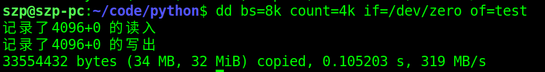
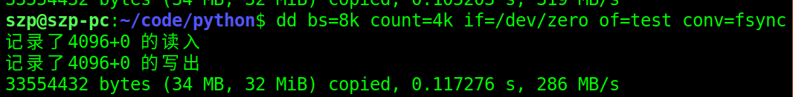
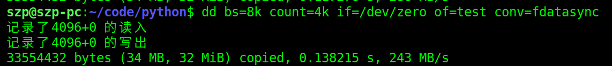
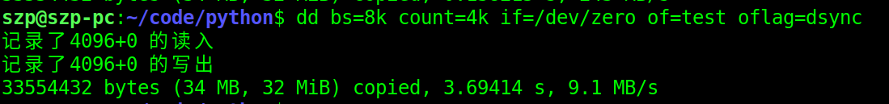

# 前言
dd是一个Unix和类Unix系统上的命令，主要功能为转换和复制文件。在Unix上，硬件的设备驱动（如硬盘）和特殊设备文件（如/dev/zero和/dev/random）就像普通文件一样，出现在文件系统中；只要在各自的驱动程序中实现了对应的功能，dd也可以读取自和/或写入到这些文件。这样，dd也可以用在备份硬件的引导扇区、获取一定数量的随机数据等任务中。dd程序也可以在复制时处理数据，例如转换字节序、或在ASCII与EBCDIC编码间互换。
本文将对dd命令的简单使用做一个介绍。

# 1. 测试工具
## 1.1 Linux dd命令

Linux dd命令用于读取、转换并输出数据。
dd可从标准输入或文件中读取数据，根据指定的格式来转换数据，再输出到文件、设备或标准输出。

 __参数说明:__ 

- if=文件名：输入文件名，默认为标准输入。即指定源文件。
- of=文件名：输出文件名，默认为标准输出。即指定目的文件。
- ibs=bytes：一次读入bytes个字节，即指定一个块大小为bytes个字节。
obs=bytes：一次输出bytes个字节，即指定一个块大小为bytes个字节。
bs=bytes：同时设置读入/输出的块大小为bytes个字节。
- cbs=bytes：一次转换bytes个字节，即指定转换缓冲区大小。
- skip=blocks：从输入文件开头跳过blocks个块后再开始复制。
- seek=blocks：从输出文件开头跳过blocks个块后再开始复制。
- count=blocks：仅拷贝blocks个块，块大小等于ibs指定的字节数。
- conv=&lt;关键字&gt;，关键字可以有以下11种：
	- conversion：用指定的参数转换文件。
	- ascii：转换ebcdic为ascii
	- ebcdic：转换ascii为ebcdic
	- ibm：转换ascii为alternate ebcdic
	- block：把每一行转换为长度为cbs，不足部分用空格填充
	- unblock：使每一行的长度都为cbs，不足部分用空格填充
	- lcase：把大写字符转换为小写字符
	- ucase：把小写字符转换为大写字符
	- swab：交换输入的每对字节
	- noerror：出错时不停止
	- notrunc：不截短输出文件
	- sync：将每个输入块填充到ibs个字节，不足部分用空（NUL）字符补齐。
- --help：显示帮助信息
- --version：显示版本信息

## 1.2 /dev/zero

/dev/zero，是一个输入设备，可用它来初始化文件。该设备无穷尽地提供0，可以使用任何需要的数目——设备提供的要多的多。它可以用于向设备或文件写入字符串0。
## 1.3 /dev/null

/dev/null 是一个特殊的文件，写入到它的内容都会被丢弃；如果尝试从该文件读取内容，那么什么也读不到。但是 /dev/null 文件非常有用，将命令的输出重定向到它，会起到"禁止输出"的效果。

# 2. 测试命令
## 2.1 异步缓存方式
> dd bs=8k count=4k if=/dev/zero of=test

该命令表示，每次从/dev/zero中读或者写8k，一共执行4k次，输出到test文件中。

没有任何参数，dd默认的方式不包括“同步(sync)”命令（没加关于操作系统“写缓存”的参数，默认“写缓存”启作用），也就是说，dd命令完成前并没有让系统真正把文件写到磁盘上。dd先把数据写到操作系统“写缓存”，就完成了写操作。所以以上命令只是单纯地把数据读到内存缓冲当中（写缓存[write cache]）。通常称为update的系统守护进程会周期性地（一般每隔30秒）调用sync函数，把“写缓存”中的数据刷入磁盘。
因为“写缓存”起作用，会测试出一个超快的性能。因为dd给的只是读取速度，直到dd完成后系统才开始真正往磁盘上写数据，但这个速度是看不到了。

dd命令执行结果如下，可以看到向test文件中成功写入了约34MB数据。

## 2.2 一次同步
### 2.2.1同步包含文件元数据

> dd bs=8k count=4k if=/dev/zero of=test conv=fsync 

加入fsync 参数后，dd命令执行到最后会真正执行一次“同步(sync)”操作，，这样算出来的时间才是比较符合实际使用结果的。conv=fsync表示把文件的“数据”和“metadata”都写入磁盘（metadata包括size、访问时间st_atime &amp; st_mtime等等），因为文件的数据和metadata通常存在硬盘的不同地方，因此fsync至少需要两次IO写操作，fsync 与fdatasync相差不大。

### 2.2.2 同步不含文件元数据

> dd bs=8k count=4k if=/dev/zero of=test conv=fdatasync

加入fdatasync参数后，dd命令执行到最后会真正执行一次“同步(sync)”操作，conv=fdatasync表示只把文件的“数据”写入磁盘，而不写入文件的元数据。

## 2.3 每次同步

> dd bs=8k count=4k if=/dev/zero of=test oflag=dsync

加入dsync参数后，dd在执行时每次都会进行同步写入操作。每次读取8k后就要先把这8k写入磁盘，然后再读取下面一个8k，一共重复4K次，生成一个34M文件。这是最慢的一种方式，基本上没有用到写缓存(write cache)。

conv=fdatasync与oflag=dsync的区别在于：fdatasync只是将所有修改过的块缓冲区排入写队列，然后就返回，它并不等待实际写磁盘操作结束。dsync函数只对由文件描述符filedes指定的单一文件起作用，并且等待写磁盘操作结束，然后返回。所以看到的fdatasync速度比dsync好。

# 总结
本文对dd命令在对磁盘的三种不同类型的操作，即异步、一次同步（是否包含元数据）、每次同步的情况下如何使用做了介绍，对于测试磁盘性能，或者测试进程读写数据情况有一定的帮助。