# 1. 前言
块设备也和字符设备一样可以通过/dev目录下的设备文件来访问。此外块设备(例如磁盘）上能够容纳文件系统。
我们来看一下/dev目录下的一些成员。

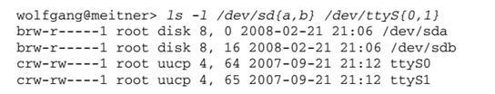

访问权限之前的字母是b或c，分别表示块设备和字符设备。
设备文件没有文件长度，而增加了主设备号和从设备号。二者共同形成一个唯一的号码，内核可由此查找对应的设备驱动程序。

驱动程序则负责将用户的一组功能调用映射作用于实际硬件设备的特有操作上，是系统软件与硬件设备沟通的桥梁。

编写简单驱动程序主要包含以下步骤。

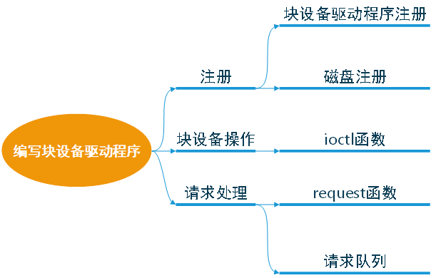


# 2. 注册

# 2.1 块设备驱动程序注册

块设备要想被内核知道其存在，必须使用内核提供的一系列注册函数进行注册。驱动程序的第一步就是向内核注册自己，提供该功能的函数是

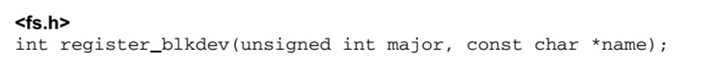


+ 参数是该设备使用的主设备号及其名字，name通常与设备文件名称相同，但也可以是任意有效的字符串。
+ 如果传递的主设备号是0,内核将分派一个新的主设备号给设备，并将该设备号返回给调用者。
+ 使用该函数，块设备将会显示在/proc/devices。

对应的注销函数为

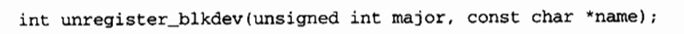

# 2.2 磁盘注册

通过注册驱动程序我们获得了主设备号，但是现在还不能对磁盘进行操作。内核对于磁盘的表示是使用的gendisk结构体， gendisk结构中的许多成员必须由驱动程序进行初始化。

gendisk结构是一个动态分配的结构，它需要一些内核的特殊处理来进行初始化;驱动程序不能自己动态分配该结构，而是必须调用

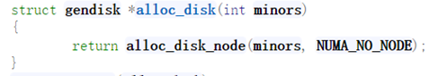

参数是该磁盘使用的次设备号数目。
当不再需要一个磁盘时，调用下面的函数卸载磁盘

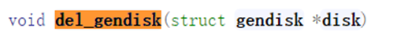


分配一个gendisk结构并不能使磁盘对系统可用。为达到这个目的，必须初始化结构，并调用add_disk。Gendisk中包含了一个指针struct block_ device_ operations * fops ;指向对应的块设备操作函数，接下来看一下block_ device_ operations都有哪些函数需要驱动程序来实现。

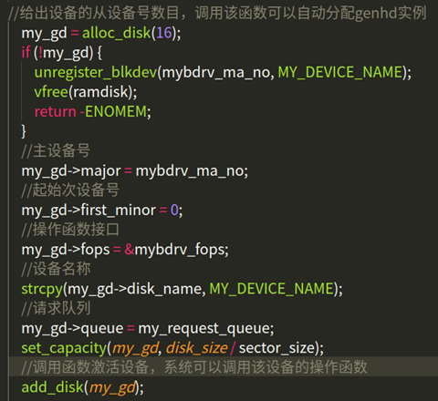


# 3. 块设备操作

字符设备使用file__operations结构告诉系统对它们的操作接口。块设备使用类似的数据结构，在<linux/fs.h>中声明了结构block_ device_ operations。同时块设备在VFS层也提供了统一的标准操作结构file_ operations。

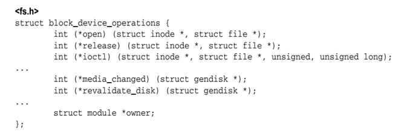


open、release和ioctl 与file_ operations中 等价函数的语义相同，
分别用于打开、关闭文件以及向块设备发送特殊命令（查询设备物理信息，扇区，磁头数）。

file_ _operations 与block_ _device_ operations的结构类似，但不能混淆二者。file_ operations由VFS层用来与用户空间通信，其中的例程会调用block_ device_operations中的函数，以实现与块设备的通信。block_ device_ operations必须针对各种块设备分别实现，对设备的属性加以抽象，而在此之上建立的file_ operations, 使用同样的操作即可处理所有的块设备。

# 3.1 请求队列

块设备的读写请求放置在一个队列上，称之为请求队列。gendisk结构包括了一个指针，指向这个特定于设备的队列，由以下数据类型表示。

queue_ head是该数据结构的主要成员，是一个表头，用于构建一个I/O请求的双链表。 链表每个元素的数据类型都是request,代表向块设备读取数据的一个请求。

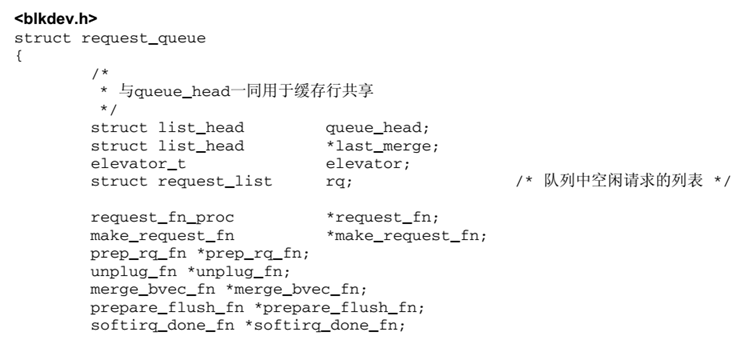

我们需要为gendisk创建并初始化对应的请求队列，函数如下：

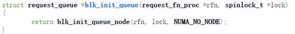

该函数的参数是一个需要驱动实现的函数，用来处理该队列中的request和控制访问队列权限的自旋锁。

# 3.2 请求处理

请求队列创建初始化如下所示：

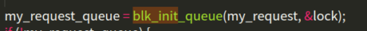

其中request的处理函数my_request编写如下：
主要实现的功能有：
+ 使用blk_fetch_request函数获取队列中的request，循环处理队列中的request。
+ 获取请求的起始地址与读写扇区数。
+ 根据读写的请求不同，分别处理。（因为是用内存模拟的设备，使用memcpy函数直接拷贝数据）
  
# 4. 编译加载驱动

编写对应的Makefile文件，使用make命令，编译生成.ko文件。

```
ifneq ($(KERNELRELEASE),)
obj-m := ramdisk_driver.o
 
else
PWD  := $(shell pwd)
KVER := $(shell uname -r)
KDIR := /lib/modules/$(KVER)/build
all:
	$(MAKE) -C $(KDIR) M=$(PWD) modules
clean:
	rm -rf .*.cmd *.o *.mod.c *.ko .tmp_versions modules.*  Module.*
endif

```
编译结果：

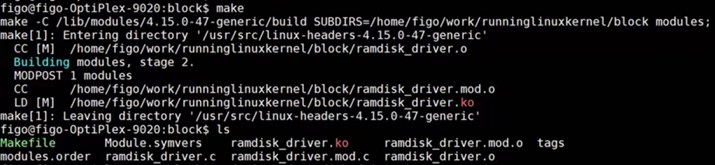

使用insmod命令加载驱动程序。使用dmesg命令查看系统日志信息，可以看到在自定义request处理函数中打印的日志信息。同时在设备文件列表中可以看到设备myramdisk。

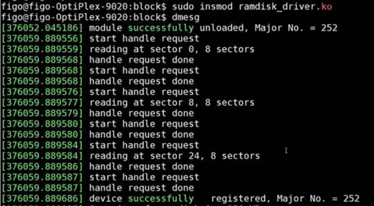

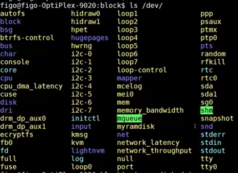

# 5. 格式化磁盘
使用ext4文件系统格式化设备myramdisk，格式化的过程中可以看到打印出的每一次request处理的信息。

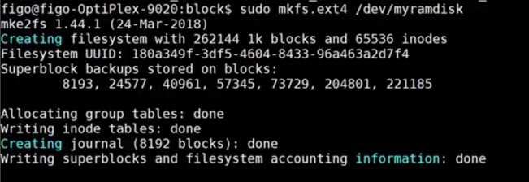


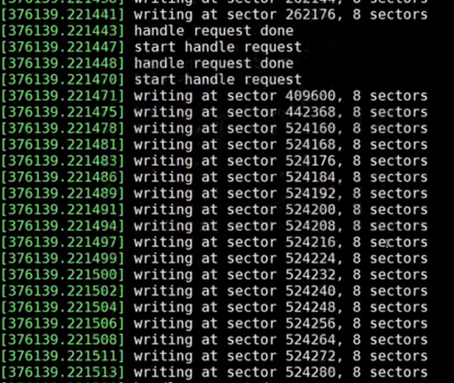

# 6. 挂载设备

最后使用mount命令将设备挂载到/mnt目录下，就可以像其他设备一样进行数据的读写操作。
为什么一个设备已经被系统识别在/dev下，为什么不能直接访问，而需要继续mount。
原因在于，设备文件只能读取设备自身的一些基本信息。
如果读取内部数据的话，由于块设备支持文件系统，很多设备的文件系统并不一样没法直接读取。
必须得按照一定的格式去解析设备里的文件。而mount就按照你指定的格式去读取设备里的数据。


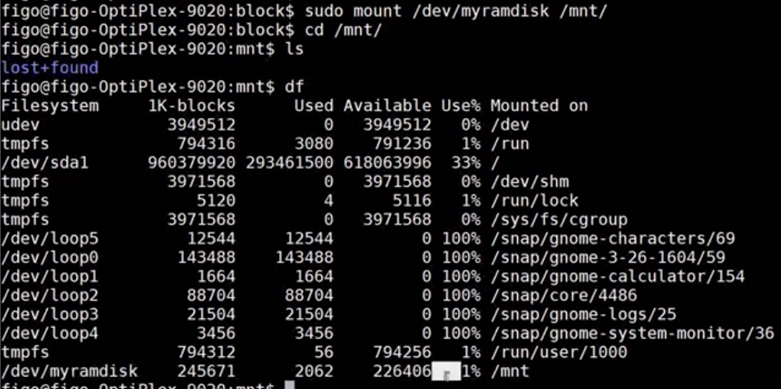

# 7. 总结

本文基于内核版本2.6简单介绍了，一个块设备驱动程序编写所需的步骤。其中的大多数api在内核版本5.0以后已经不再使用，后面将对新的api进行总结。

参考资料：
《LINUX设备驱动程序》
《深入LINUX内核架构》
[参考源码](https://gitee.com/ljrcore/linuxmooc/tree/master/%E3%80%8ALinux%E5%86%85%E6%A0%B8%E5%88%86%E6%9E%90%E4%B8%8E%E5%BA%94%E7%94%A8%E3%80%8B%E5%8A%A8%E6%89%8B%E5%AE%9E%E8%B7%B5%E6%BA%90%E7%A0%81/9.7%E5%B7%A5%E7%A8%8B%E5%AE%9E%E8%B7%B5-%E5%9D%97%E8%AE%BE%E5%A4%87%E9%A9%B1%E5%8A%A8)