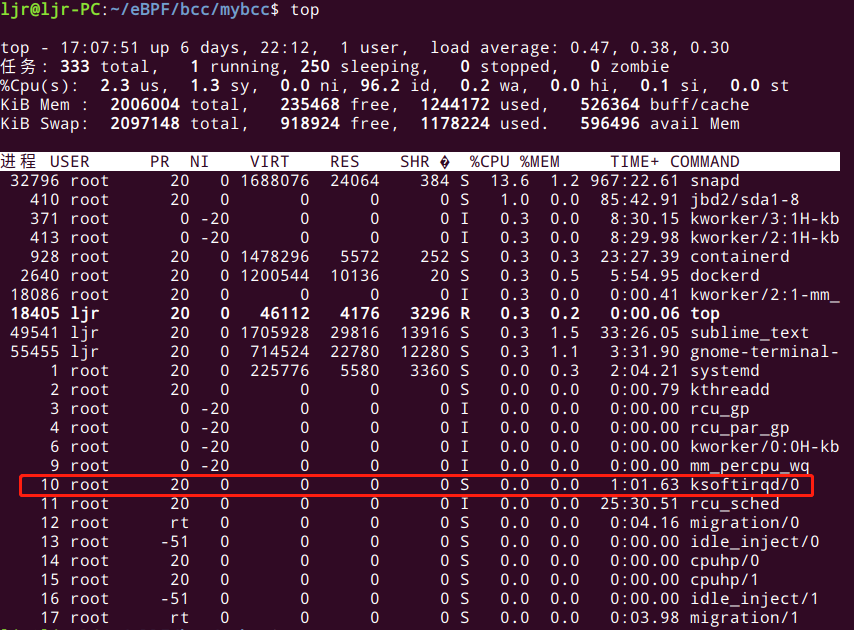
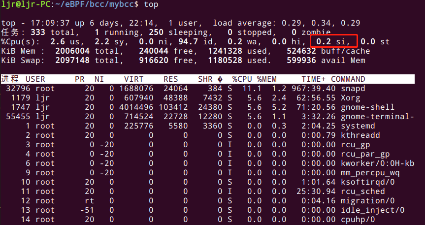
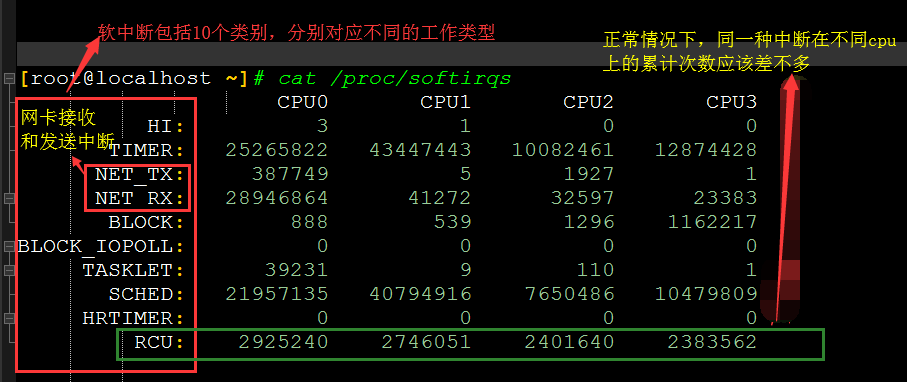

## 1. 前言
之前分享过Linux内核网络数据包的接收过程，当执行到网卡通过硬件中断（IRQ）通知CPU，告诉它有数据来了，CPU会根据中断表，调用已经注册的中断函数，这个中断函数会调到驱动程序（NIC Driver）中相应的函数。驱动先禁用网卡的中断，表示驱动程序已经知道内存中有数据了，告诉网卡下次再收到数据包直接写内存就可以了，不要再通知CPU了，这样可以提高效率，避免CPU不停的被中断。

由于硬中断处理程序执行的过程中不能被中断，所以如果它执行时间过长，会导致CPU没法响应其它硬件的中断，于是内核引入软中断，这样可以将硬中断处理函数中耗时的部分移到软中断处理函数里面来慢慢处理。内核中的ksoftirqd进程专门负责软中断的处理，当它收到软中断后，就会调用相应软中断所对应的处理函数，网卡驱动模块抛出的软中断，ksoftirqd会调用网络模块的`net_rx_action`函数。

那么接下来，我们先宏观上回顾一下数据包接收的过程，以了解软中断在此过程中的位置，然后介绍一下内核中的软中断。

## 2. 数据包接收宏观过程

- 加载网卡驱动，初始化
- 数据包从外部网络进入网卡
- 网卡（通过DMA）将包拷贝到内核内存中的ring buffer
- 产生硬件中断，通知系统收到了一个包
- 驱动调用 NAPI ，如果轮询（poll）还没有开始，就开始轮询
- ksoftirqd软中断调用 NAPI 的poll函数从ring buffer收包（poll 函数是网卡驱动在初始化阶段注册的；每个cpu上都运行着一个ksoftirqd进程，在系统启动期间就注册了）
- ring buffer里面对应的内存区域解除映射（unmapped）
- 如果 packet steering 功能打开，或者网卡有多队列，网卡收到的数据包会被分发到多个cpu
- 数据包从队列进入协议层
- 协议层处理数据包
- 数据包从协议层进入相应 socket 的接收队列
## 3. 软中断
内核的软中断系统是一种在硬中断处理上下文（驱动中）之外执行代码的机制。硬中断处理函数（handler）执行时，会屏蔽部分或全部（新的）硬中断。中断被屏蔽的时间越长，丢失事件的可能性也就越大。所以，所有耗时的操作都应该从硬中断处理逻辑中剥离出来，硬中断因此能尽可能快地执行，然后再重新打开硬中断。

内核中也有其他机制将耗时操作转移出去，不过对于网络栈，我们接下来只看软中断ksoftirqd。可以把软中断系统想象成一系列内核线程（每个 CPU 一个），这些线程执行针对不同事件注册的处理函数（handler），内核子系统（比如网络）能通过` open_softirq()` 注册软中断处理函数。通过 top 命令，会注意到 ksoftirqd/0 这个内核线程，其表示这个软中断线程跑在 CPU 0 上，如下图所示。



## 4. ksoftirqd
软中断对分担硬中断的工作量至关重要，因此软中断线程在内核启动的很早阶段就 spawn 出来了。

`kernel/softirq.c` 中对 ksoftirqd 系统进行了初始化：
```c
static struct smp_hotplug_thread softirq_threads = {
      .store              = &ksoftirqd,
      .thread_should_run  = ksoftirqd_should_run,
      .thread_fn          = run_ksoftirqd,
      .thread_comm        = "ksoftirqd/%u",
};

static __init int spawn_ksoftirqd(void)
{
      register_cpu_notifier(&cpu_nfb);

      BUG_ON(smpboot_register_percpu_thread(&softirq_threads));

      return 0;
}
early_initcall(spawn_ksoftirqd);
```
看到注册了两个回调函数： `ksoftirqd_should_run` 和` run_ksoftirqd`。这两个函数都会从 `kernel/smpboot.c` 里调用，作为事件处理循环的一部分。

`kernel/smpboot.c` 里面的代码首先调用 `ksoftirqd_should_run` 判断是否有 pending 的软中断，如果有，就执行 `run_ksoftirqd`，后者做一些 bookeeping 工作，然后调用 `__do_softirq`。

`__do_softirq` 做的几件事情：

- 判断哪个 softirq 被 pending
- 计算 softirq 时间，用于统计
- 更新 softirq 执行相关的统计数据
- 执行 pending softirq 的处理函数

```c
asmlinkage __visible void __do_softirq(void)
{
    unsigned long end = jiffies + MAX_SOFTIRQ_TIME;
    unsigned long old_flags = current->flags;
    int max_restart = MAX_SOFTIRQ_RESTART;
    struct softirq_action *h;
    bool in_hardirq;
    __u32 pending;
    int softirq_bit;

    /*
     * Mask out PF_MEMALLOC s current task context is borrowed for the
     * softirq. A softirq handled such as network RX might set PF_MEMALLOC
     * again if the socket is related to swap
     */
    current->flags &= ~PF_MEMALLOC;

    pending = local_softirq_pending();	//获取当前CPU的软中断寄存器__softirq_pending值到局部变量pending。
    account_irq_enter_time(current);

    __local_bh_disable_ip(_RET_IP_, SOFTIRQ_OFFSET);	//增加preempt_count中的softirq域计数，表明当前在软中断上下文中。
    in_hardirq = lockdep_softirq_start();

restart:
    /* Reset the pending bitmask before enabling irqs */
    set_softirq_pending(0);	//清除软中断寄存器__softirq_pending。

    local_irq_enable();	//打开本地中断

    h = softirq_vec;	//指向softirq_vec第一个元素，即软中断HI_SOFTIRQ对应的处理函数。

    while ((softirq_bit = ffs(pending))) {	//ffs()找到pending中第一个置位的比特位，返回值是第一个为1的位序号。这里的位是从低位开始，这也和优先级相吻合，低位优先得到执行。如果没有则返回0，退出循环。
        unsigned int vec_nr;
        int prev_count;

        h += softirq_bit - 1;	//根据sofrirq_bit找到对应的软中断描述符，即软中断处理函数。

        vec_nr = h - softirq_vec;	//软中断序号
        prev_count = preempt_count();

        kstat_incr_softirqs_this_cpu(vec_nr);

        trace_softirq_entry(vec_nr);
        h->action(h);	//执行对应软中断函数
        trace_softirq_exit(vec_nr);
        if (unlikely(prev_count != preempt_count())) {
            pr_err("huh, entered softirq %u %s %p with preempt_count %08x, exited with %08x?\n",
                   vec_nr, softirq_to_name[vec_nr], h->action,
                   prev_count, preempt_count());
            preempt_count_set(prev_count);
        }
        h++;	//h递增，指向下一个软中断
        pending >>= softirq_bit;	//pending右移softirq_bit位
    }

    rcu_bh_qs();
    local_irq_disable();	//关闭本地中断

    pending = local_softirq_pending();	//再次检查是否有软中断产生，在上一次检查至此这段时间有新软中断产生。
    if (pending) {
        if (time_before(jiffies, end) && !need_resched() && max_restart)	//再次触发软中断执行的三个条件：1.软中断处理时间不超过2jiffies，200Hz的系统对应10ms；2.当前没有有进程需要调度，即!need_resched()；3.这种循环不超过10次。
            goto restart;

        wakeup_softirqd();	//如果上面的条件不满足，则唤醒ksoftirq内核线程来处理软中断。
    }

    lockdep_softirq_end(in_hardirq);
    account_irq_exit_time(current);
    __local_bh_enable(SOFTIRQ_OFFSET);	//减少preempt_count的softirq域计数,和前面增加计数呼应。表示这段代码处于软中断上下文。
    WARN_ON_ONCE(in_interrupt());
    tsk_restore_flags(current, old_flags, PF_MEMALLOC);
}
```
查看 CPU 利用率时，si 字段对应的就是 softirq，度量（从硬中断转移过来的）软中断的 CPU 使用量。



## 5. 监测
软中断的信息可以从 `/proc/softirqs` 读取：



## 6. 总结
中断是一种异步的事件处理机制，用来提高系统的并发处理能力。中断事件发生，会触发执行中断处理程序，而中断处理程序被分为上半部和下半部这两个部分。上半部对应硬中断，用来快速处理中断；下半部对应软中断，用来异步处理上半部未完成的工作。Linux 中的软中断包括网络收发、定时、调度、RCU 锁等各种类型，我们可以查看 proc 文件系统中的 `/proc/softirqs`  ，观察软中断的运行情况。在 Linux 中，每个 CPU 都对应一个软中断内核线程，名字是 `ksoftirqd/CPU `编号。当软中断事件的频率过高时，内核线程也会因为 CPU 使用率过高而导致软中断处理不及时，进而引发网络收发延迟、调度缓慢等性能问题。

参考资料：

https://blog.packagecloud.io/eng/2016/06/22/monitoring-tuning-linux-networking-stack-receiving-data/

https://www.cnblogs.com/luoahong/p/10815283.html
