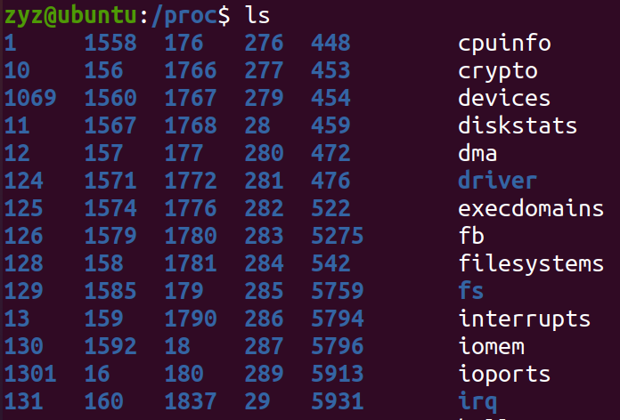
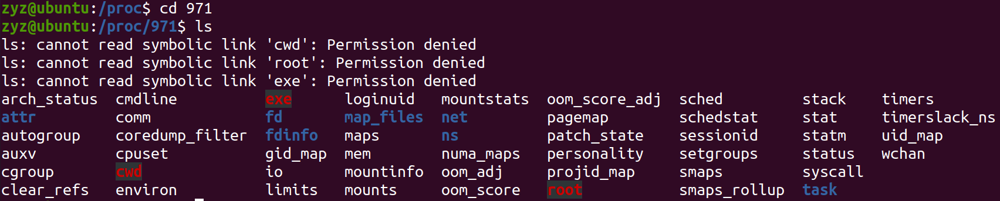
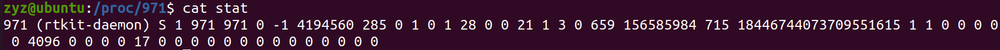
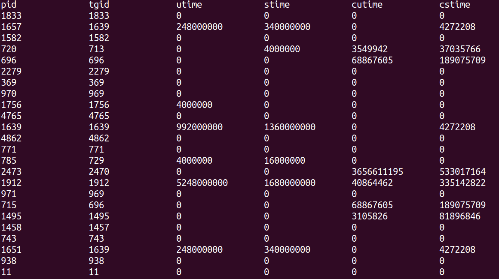

# 获取进程的时间信息
## 实验目的
为方便计算某进程的CPU占有率，根据CPU占有率计算公式：`pc%=(pc2-pc1)/(cpu2-cpu1)`和进程执行总时间的计算公式：`pc=utime+stime+cutime+cstime`，可以确定本次实验的基本目的是获取进程的`utime`、`stime`、`cutime`、`cstime`这几个信息。
 > `%pc`指某进程的CPU占有率，`pc2`、`pc1`分别指该进程在统计的结束时刻和统计的起始时刻下的执行总时间，`cpu2`、`cpu1`分别指CPU在统计结束时刻和统计的起始时刻下的执行总时间。
 > `utime`指进程在用户态的运行时间；`stime`指进程在内核态的运行时间；`cutime`指所有层次子进程在用户态的运行时间总和；`cstime`指所有层次子进程在核心态的运行时间总和。

## 实验原理
### /proc/pid/stat
我们在进入/proc目录，使用`ls`命令，如下图所示。



在/proc下，每一个进程都有一个相应的文件，该文件的名字就是进程的pid。我们随意进入一个数字命名的文件，使用`ls`命令，如下图所示。




进入/proc/pid/，可以看到里面有许多文件，下面简单介绍一下该目录下的一些重要文件：
/proc/pid/cmdline：包括了用于开始进程的命令；
/proc/pid/cwd：包括了当前进程工作目录的一个链接；
/proc/pid/environ：包括了可用进程环境变量的列表；
/proc/pid/exe：包括正在进程中运行的程序链接；
/proc/pid/fd/：这个目录包含了进程打开的每一个文件的链接；
/proc/pid/mem：包含了进程在内存中的内容；
/proc/pid/stat：包含了进程的状态信息；
/proc/pid/statm：包含了进程的内存使用信息。
我们本次实验的目的是为了获取进程的时间信息，而这部分信息是属于进程的状态信息，我们使用`cat stat`命令打印出stat文件中的内容，如下图所示。



stat文件打印出来的字段中第14——17位分别为该进程的`utime`、`stime`、`cutime`、`cstime`。
既然通过/proc/pid/stat这个文件可以查询到该进程的时间信息，那么我们通过寻找到往该文件输入数据函数就能找到进程的时间信息的来源了。
### do_task_stat()
/proc/pid/stat文件对应到内核中的函数是`do_task_stat()`。
我们先来看`do_task_stat()`函数中向文件中输入时间信息的部分。
```cpp
	seq_put_decimal_ull(m, " ", nsec_to_clock_t(utime));
	seq_put_decimal_ull(m, " ", nsec_to_clock_t(stime));
	seq_put_decimal_ll(m, " ", nsec_to_clock_t(cutime));
	seq_put_decimal_ll(m, " ", nsec_to_clock_t(cstime));
```
可以看到在该函数中已经获取到了这四个时间信息，在该部分只对它们需要进行简单的处理就可以直接输入到文件中了。我们接下来寻找这四个时间信息是如何在输入到文件前被赋值处理的。
先来看一下`do_task_stat()`的参数定义。
```cpp
static int do_task_stat(struct seq_file *m, struct pid_namespace *ns,
			struct pid *pid, struct task_struct *task, int whole)
```
接下来我们再来看一下`do_task_stat()`函数中是如何对这四个时间信息的变量进行初始化和赋值的。
```cpp
	......
    u64 cutime, cstime, utime, stime;//初始化
    unsigned long flags;
    ......
	cutime = cstime = utime = stime = 0;//初始化后首先四个时间信息变量皆是赋值为0
    ......
	if (lock_task_sighand(task, &flags)) {
		struct signal_struct *sig = task->signal;
        ......
		cutime = sig->cutime;//只有当lock_task_sighand()函数执行返回非0时
		cstime = sig->cstime;//赋值cutime、cstime，数据来源task->signal
        ......
		/* add up live thread stats at the group level */
		if (whole) {
            ......
			thread_group_cputime_adjusted(task, &utime, &stime);
		}//whole非0且lock_task_sighand()非0，调用thread_group_cputime_adjusted()更新utime、stime
		......
		unlock_task_sighand(task, &flags);
	}
	......
	if (!whole) {//只需要whole为0便可调用task_cputime_adjusted()更新utime、stime
		.......
		task_cputime_adjusted(task, &utime, &stime);
		.......
	}
    ......
```
函数`lock_task_sighand()`和`unlock_task_sighand()`的作用分别是对`task_struct`中的成员`sighand`上锁和解锁(sighand：指向进程的信号处理程序描述符)，也就是说在这段时间内`task_struct`中的成员`sighand`指向的信号处理程序描述符暂时不会处理来自其他地方的信号处理要求。
`task_struct`中还有一个成员`signal`(signal：指向进程的信号描述符)。
由上面`do_task_stat()`的代码可知，**cutime**、**cstime**可以直接从`task_struct`的成员`signal`所指向的信号描述符中的成员`cutime`还有`cstime`中得到。
接下来，我们注意到`whole`是否为0，`do_task_stat`选择调用了两个不同的函数`thread_group_cputime_adjusted()`和`task_cputime_adjusted()`来更新`utime`和`stime`。
**问题**：`whole`在什么时候等于0或者其他值呢？
```cpp
int proc_tid_stat(struct seq_file *m, struct pid_namespace *ns,
			struct pid *pid, struct task_struct *task)
{
	return do_task_stat(m, ns, pid, task, 0);
}

int proc_tgid_stat(struct seq_file *m, struct pid_namespace *ns,
			struct pid *pid, struct task_struct *task)
{
	return do_task_stat(m, ns, pid, task, 1);
}
```
由上面`do_task_stat()`的参数定义，可知最后一个参数就是`whole`。并且由上面的函数`proc_tid_stat()`和`proc_tgid_stat()`可以得出结论，当`do_task_stat()`要输出的进程的`pid`等于该组进程的`tgid`的时候，`whole`为1；反之，`whole`为0。
### thread_group_cputime_adjusted()
在`whole`为1的情况下，`do_task_stat()`选择调用的函数是`thread_group_cputime_stat()`。
```cpp
#ifdef CONFIG_VIRT_CPU_ACCOUNTING_NATIVE
......
void thread_group_cputime_adjusted(struct task_struct *p, u64 *ut, u64 *st)
{
	struct task_cputime cputime;

	thread_group_cputime(p, &cputime);

	*ut = cputime.utime;
	*st = cputime.stime;
}
#else
......
#endif
```
`CONFIG_VIRT_CPU_ACCOUNTING_NATIVE`可以在3.9及以上的Linux内核中找到。选择此选项可启用更准确的任务和CPU时间统计。通过在每个内核入口和出口以及系统内的softirq和hardirq状态之间的内核转换上读取CPU计数器来完成此操作，因此对性能的影响很小。
```cpp
struct task_cputime {
	u64				stime;
	u64				utime;
	unsigned long long		sum_exec_runtime;
};
```
```cpp
void thread_group_cputime(struct task_struct *tsk, struct task_cputime *times)
{
	struct signal_struct *sig = tsk->signal;
	u64 utime, stime;
	struct task_struct *t;
	unsigned int seq, nextseq;
	unsigned long flags;
	//如果当前要查询的进程正在运行，那么更新其sum_sched_runtime。
	if (same_thread_group(current, tsk))
		(void) task_sched_runtime(current);

	rcu_read_lock();
	/* Attempt a lockless read on the first round. */
	nextseq = 0;
	do {
		seq = nextseq;
		flags = read_seqbegin_or_lock_irqsave(&sig->stats_lock, &seq);
		times->utime = sig->utime;
		times->stime = sig->stime;
		times->sum_exec_runtime = sig->sum_sched_runtime;

		for_each_thread(tsk, t) {
			task_cputime(t, &utime, &stime);
			times->utime += utime;
			times->stime += stime;
			times->sum_exec_runtime += read_sum_exec_runtime(t);
		}
		/* If lockless access failed, take the lock. */
		nextseq = 1;
	} while (need_seqretry(&sig->stats_lock, seq));
	done_seqretry_irqrestore(&sig->stats_lock, seq, flags);
	rcu_read_unlock();
}
```
首先，我们看到先取到`pid`为`tgid`的进程的`task_struct`的成员`signal`指向的进程信号描述符中的成员`utime`和`stime`，然后访问该线程组中每一个线程，调用`task_cputime()`获取其线程的`utime`和`stime`，用于更新最后要取出的数据。
```cpp
#ifdef CONFIG_VIRT_CPU_ACCOUNTING_GEN
extern void task_cputime(struct task_struct *t,
			 u64 *utime, u64 *stime);
......
#else
......
```
`CONFIG_VIRT_CPU_ACCOUNTING_GEN`可以在3.9及以上的Linux内核中找到。选择此选项可在完整的dynticks系统上启用任务和CPU时间统计。通过使用上下文跟踪子系统监视每个内核用户边界来实现此计费。因此，以一定的大量开销为代价执行计费。
```cpp
void task_cputime(struct task_struct *t, u64 *utime, u64 *stime)
{
	struct vtime *vtime = &t->vtime;
	unsigned int seq;
	u64 delta;

	if (!vtime_accounting_enabled()) {
		*utime = t->utime;
		*stime = t->stime;
		return;
	}

	do {
		seq = read_seqcount_begin(&vtime->seqcount);

		*utime = t->utime;
		*stime = t->stime;

		/* Task is sleeping or idle, nothing to add */
		if (vtime->state < VTIME_SYS)
			continue;

		delta = vtime_delta(vtime);

		/*
		 * Task runs either in user (including guest) or kernel space,
		 * add pending nohz time to the right place.
		 */
		if (vtime->state == VTIME_SYS)
			*stime += vtime->stime + delta;
		else
			*utime += vtime->utime + delta;
	} while (read_seqcount_retry(&vtime->seqcount, seq));
}
```
这部分的代码，我们可以看到首先是对`utime`和`stime`分别赋值`task_struct`中的`utime`和`stime`，然后会增加一个`task_struct`中成员`vtime`的成员`state`与`VTIME_SYS`的一个比较关系，在等于的情况下，会在`stime`中增加一个差值；在大于的情况下，会在`utime`中增加一个差值；否则，不变。
```cpp
#ifdef CONFIG_VIRT_CPU_ACCOUNTING_GEN
static u64 vtime_delta(struct vtime *vtime)
{
	unsigned long long clock;

	clock = sched_clock();
	if (clock < vtime->starttime)
		return 0;

	return clock - vtime->starttime;
}
```
### task_cputime_adjusted()
在`whole`为0的情况下，`do_task_stat()`选择调用的函数是`task_cputime_stat()`。
```cpp
#ifdef CONFIG_VIRT_CPU_ACCOUNTING_NATIVE
......
void task_cputime_adjusted(struct task_struct *p, u64 *ut, u64 *st)
{
	*ut = p->utime;
	*st = p->stime;
}
......
#else
......
```
对于单独的一个线程，它的`utime`和`stime`都是直接从`task_struct`中的成员`utime`和`stime`中获取。
## 代码思路
目前遇到的问题及思路(暂时)：
 - 是否要在获取某一进程的时间信息的时候对其`task_struct`中的成员`sighand`上锁？我的选择是**不用**，有两方面的原因是：1.上锁的目的是为了屏蔽获取信息期间进程调度而带来的时间信息的变化。在初次设计中，这部分的误差并不算很大，可以留到后面去优化。2.该部分涉及到信号部分的处理函数，该部分头文件无法导入到BPF的C代码中，也就是无法使用内核中定义好的信号处理函数，具体在实现上遇到了困难。
 - 在处理`pid`等于`tgid`的时间信息的情况中，是否要沿用/proc/pid/stat的处理方法？我的选择是**不用**，原因主要是：这部分在最后的差值的计算中会涉及到一个函数`scahed_clock()`，该函数也是无法在BPF的C代码中运行的，也就是在实现上遇到了困难。
 - 当`pid`等于`tgid`的时候，怎么进行`thread_group`的遍历？因为在BPF的C代码中，遍历`thread`的函数无法使用，所以我的解决方法是设立`pid`和`tgid`，然后**把数据放到python代码里面处理**。

**代码构架**：先获得当前的`task_struct`和`pid`以及`tgid`。然后通过访问`task_struct`里面的`signal`所指向的信号描述符来获取所以线程的时间信息。最后把数据交给python代码中，再对同一个`thread_group`中的线程的`utime`和`stime`进行合并处理。
## 具体代码
```python
#!/usr/bin/python

from __future__ import print_function
from bcc import BPF
from time import sleep, strftime
import argparse

parser = argparse.ArgumentParser()
parser.add_argument("interval", nargs="?", default=99999999,
        help="output interval, inseconds")
parser.add_argument("count", nargs="?", default=99999999,
        help="number of outputs")
args = parser.parse_args()
countdown = int(args.count)

bpf_text = """
#include <uapi/linux/ptrace.h>
#include <linux/sched.h>
#include <linux/sched/signal.h>
#include <linux/types.h>


struct inform_time {
    u32 pid;
    u32 tgid;
    u64 utime;
    u64 stime;
    u64 cutime;
    u64 cstime;
};


BPF_HASH(table, u32, struct inform_time);

int do_event(struct pt_regs *ctx)
{
    u32 pid = 0, tgid = 0;
    struct task_struct *task = NULL;
    struct inform_time my_time = {};

    task = (struct task_struct *)bpf_get_current_task();
    my_time.pid = pid = task->pid;
    my_time.tgid = tgid = task->tgid;
    my_time.cutime = task->signal->cutime;
    my_time.cstime = task->signal->cstime;
    my_time.utime = task->signal->utime;
    my_time.stime = task->signal->stime;

    table.update(&pid, &my_time);

    return 0;
}
"""

b = BPF(text=bpf_text)
b.attach_kprobe(event="schedule", fn_name="do_event");

print("Hit Ctrl-C to end.")

exiting = 0 if args.interval else 1
table = b.get_table("table")

while (1):
    try:
        sleep(int(args.interval))
    except KeyboardInterrupt:
        exiting = 1

    add_utime = {}
    add_stime = {}
    for k, v in table.items():
        if v.pid != v.tgid:
            if (v.tgid in add_utime) and (v.tgid in add_stime):
                add_utime[v.tgid] += v.utime
                add_stime[v.tgid] += v.stime
            else:
                add_utime[v.tgid] = v.utime
                add_stime[v.tgid] = v.stime
        else:
            if (v.tgid not in add_utime) or (v.tgid not in add_stime):
                add_utime[v.pid] = 0
                add_stime[v.pid] = 0
    print("%-16s %-16s %-16s %-16s %-16s %-16s" % ("pid", "tgid", "utime", "stime", "cutime", "cstime"))
    for k, v in table.items():
        if v.pid != v.tgid:
            print("%-16d %-16d %-16d %-16d %-16d %-16d" % (v.pid, v.tgid, v.utime, v.stime, v.cutime, v.cstime))
        else:
            print("%-16d %-16d %-16d %-16d %-16d %-16d" % (v.pid, v.tgid, v.utime + int(add_utime[v.pid]), v.stime + int(add_stime[v.pid]), v.cutime, v.cstime))

    print("--" * 20)
    add_utime.clear()
    add_stime.clear()

    countdown -= 1

    if exiting or countdown <= 0:
        exit()
```
## 结果分析
运行该代码的结果如下：

问题主要集中在一下几点：
 - **没有信号屏蔽**，导致有可能拿到的一个进程的时间信息是一个变化中的值，而不是都在同一时刻的。
 - 对`tgid`和`pid`相等的情况，因为**没有在C中对`thread_group`进行遍历**，导致我们拿出来的线程数量少于整个线程组的数量，所以一定会有误差。

## 改进思路
 - 对于没有实现信号屏蔽的问题，因为一个正在运行的进程的时间信息是变化的，我们接下来可以更换每次的访问对象为`prev`，而不是现在的`current`，这是我目前的一个思路。
 - 对于遍历线程组的问题，这一部分我的思路是从两个方向出发，一个方向是想办法找到在BPF中C程序中遍历一个`thread_group`的实现路径；一个是在程序的一开始打开top或者/proc目录下的文件，形成一个基值，然后通过BPF程序形成一个变量(也就是以top命令或者/proc目录中文件的数据为基础，我们的BPF程序用来更新)。