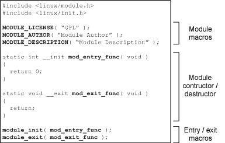
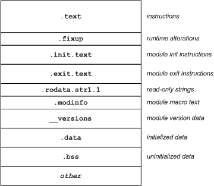
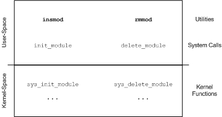
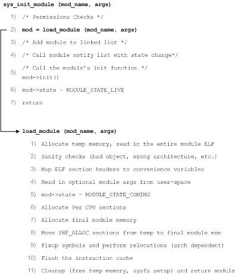

Linux 可加载内核模块剖析

2.6 内核透视图

Linux® 可加载内核模块（从内核的 1.2 版本开始引入）是 Linux 内核的最重要创新之一。它们提供了可伸缩的、动态的内核。探索隐藏在可加载模块后面的原理，并学习这些独立的对象如何动态地转换成 Linux 内核的一部分。Linux 就是通常所说的*单内核（monolithic kernel）*，即操作系统的大部分功能都被称为*内核*，并在特权模式下运行。它与*微型内核* 不同，后者只把基本的功能（进程间通信 [IPC]、调度、基本的输入/输出 [I/O] 和内存管理）当作内核运行，而把其他功能（驱动程序、网络堆栈和文件系统）排除在特权空间之外。因此，您可能认为 Linux 是一个完全静态的内核，但事实恰恰相反。通过 Linux 内核模块（LKM）可以在运行时动态地更改 Linux。

 [Linux flash 文件系统剖析](http://www.ibm.com/developerworks/cn/linux/l-flash-filesystems/)[Security-Enhanced Linux（SELinux）剖析](http://www.ibm.com/developerworks/cn/linux/l-selinux/)[实时 Linux 架构剖析](http://www.ibm.com/developerworks/cn/linux/l-real-time-linux/)[Linux SCSI 子系统剖析](http://www.ibm.com/developerworks/cn/linux/l-scsi-subsystem/)[Linux 文件系统剖析](http://www.ibm.com/developerworks/cn/linux/l-linux-filesystem/)[Linux 网络栈剖析](http://www.ibm.com/developerworks/cn/linux/l-linux-networking-stack/)[Linux 内核剖析](http://www.ibm.com/developerworks/cn/linux/l-linux-kernel/)[Linux slab 分配器剖析](http://www.ibm.com/developerworks/cn/linux/l-linux-slab-allocator)[Linux 同步方法剖析](http://www.ibm.com/developerworks/cn/linux/l-linux-synchronization.html) [Tim 所著的所有*剖析……* 系列文章](http://www.ibm.com/developerworks/cn/views/linux/libraryview.jsp?search_by=Linux+剖析)*可动态更改* 是指可以将新的功能加载到内核、从内核去除某个功能，甚至添加使用其他 LKM 的新 LKM。LKM 的优点是可以最小化内核的内存占用，只加载需要的元素（这是嵌入式系统的重要特性）。 Linux 不是可以进行动态更改的惟一（也不是第一个）单内核。Berkeley Software Distribution（BSD）的变体、Sun Solaris、更老的内核（比如 OpenVMS），以及其他流行的操作系统（比如 Microsoft® Windows® 和 Apple Mac OS X）都支持可加载模块。 LKM 与直接编译到内核或典型程序的元素有根本区别。典型的程序有一个 main 函数，其中 LKM 包含 entry 和 exit 函数（在 2.6 版本，您可以任意命名这些函数）。当向内核插入模块时，调用 entry 函数，从内核删除模块时则调用 exit 函数。因为 entry 和 exit 函数是用户定义的，所以存在 `module_init` 和 `module_exit` 宏，用于定义这些函数属于哪种函数。LKM 还包含一组必要的宏和一组可选的宏，用于定义模块的许可证、模块的作者、模块的描述等等。图 1 提供了一个非常简单的 LKM 的视图。 

2.6 版本的 Linux 内核提供了一个新的更简单的方法，用于构建 LKM。构建 LKM 时，可以使用典型的用户工具管理模块（尽管内部已经改变）：标准`insmod`（安装 LKM），`rmmod` （删除 LKM），`modprobe`（`insmod` 和 `rmmod` 的包装器），`depmod`（用于创建模块依赖项），以及 `modinfo`（用于为模块宏查找值）。更多关于为 2.6 版本内核构建 LKM 的信息，请查看 [参考资料](http://www.ibm.com/developerworks/cn/linux/l-lkm/#resources)。

  [**回页首**](http://www.ibm.com/developerworks/cn/linux/l-lkm/#main)LKM 只不过是一个特殊的可执行可链接格式（Executable and Linkable Format，ELF）对象文件。通常，必须链接对象文件才能在可执行文件中解析它们的符号和结果。由于必须将 LKM 加载到内核后 LKM 才能解析符号，所以 LKM 仍然是一个 ELF 对象。您可以在 LKM 上使用标准对象工具（在 2.6 版本中，内核对象带有后缀 *.ko,*）。例如，如果在 LKM 上使用 `objdump` 实用工具，您将发现一些熟悉的区段（section），比如 *.text*（说明）、*.data*（已初始化数据）和 *.bss*（块开始符号或未初始化数据）。 您还可以在模块中找到其他支持动态特性的区段。.init.text 区段包含 `module_init` 代码，.exit.text 区段包含 `module_exit` 代码（参见图 2）。.modinfo 区段包含各种表示模块许可证、作者和描述等的宏文本。 

了解 LKM 的基础知识之后，现在我们进一步探索模块是如何进入内核的，以及在内核内部是如何管理模块的。

[**回页首**](http://www.ibm.com/developerworks/cn/linux/l-lkm/#main)在用户空间中，`insmod`（插入模块）启动模块加载过程。`insmod` 命令定义需要加载的模块，并调用 `init_module` 用户空间系统调用，开始加载过程。2.6 版本内核的 `insmod` 命令经过修改后变得非常简单（70 行代码），可以在内核中执行更多工作。`insmod` 并不进行所有必要的符号解析（处理`kerneld`），它只是通过 `init_module` 函数将模块二进制文件复制到内核，然后由内核完成剩余的任务。 `init_module` 函数通过系统调用层，进入内核到达内核函数 `sys_init_module`（参见图 3）。这是加载模块的主要函数，它利用许多其他函数完成困难的工作。类似地，`rmmod` 命令会使 `delete_module` 执行 `system call` 调用，而 `delete_module` 最终会进入内核，并调用 `sys_delete_module` 将模块从内核删除。

在模块的加载和卸载期间，模块子系统维护了一组简单的状态变量，用于表示模块的操作。加载模块时，状态为 `MODULE_STATE_COMING`。如果模块已经加载并且可用，状态为 `MODULE_STATE_LIVE`。此外，卸载模块时，状态为 `MODULE_STATE_GOING`。 

  [**回页首**](http://www.ibm.com/developerworks/cn/linux/l-lkm/#main)现在，我们看看加载模块时的内部函数（参见图 4）。当调用内核函数 `sys_init_module` 时，会开始一个许可检查，查明调用者是否有权执行这个操作（通过 `capable` 函数完成）。然后，调用 `load_module` 函数，这个函数负责将模块加载到内核并执行必要的调试（后面还会讨论这点）。`load_module`函数返回一个指向最新加载模块的模块引用。这个模块加载到系统内具有双重链接的所有模块的列表上，并且通过 notifier 列表通知正在等待模块状态改变的线程。最后，调用模块的 `init()` 函数，更新模块状态，表明模块已经加载并且可用。

当调用内核函数 `sys_delete_module`（将要删除的模块的名称作为参数传入）之后，第一步便是确保调用方具有权限。接下来会检查一个列表，查看是否存在依赖于这个模块的其他模块。这里有一个名为 `modules_which_use_me` 的列表，它包含每个依赖模块的一个元素。如果这个列表为空，就不存在任何模块依赖项，因此这个模块就是要删除的模块（否则会返回一个错误）。接下来还要测试模块是否加载。用户可以在当前安装的模块上调用`rmmod`，因此这个检查确保模块已经加载。在几个维护检查之后，倒数第二个步骤是调用模块的 exit 函数（模块内部自带）。最后，调用 `free_module`函数。 调用 `free_module` 函数之后，您将发现模块将被安全删除。该模块不存在依赖项，因此可以开始模块的内核清理过程。首先，从安装期间添加的各种列表中（系统文件、模块列表等）删除模块。其次，调用一个与架构相关的清理例程（可以在 ./linux/arch/<arch>/kernel/module.c 中找到）。然后迭代具有依赖性的模块，并将这个模块从这些列表中删除。最后，从内核的角度而言，清理已经完成，为模块分配的各种内存已被释放，包括参数内存、per-CPU 内存和模块的 ELF 内存（`core` 和 `init`）。 

[**回页首**](http://www.ibm.com/developerworks/cn/linux/l-lkm/#main)这一直是内核里面模块管理过程的高级视图。要获得模块管理的细节，源代码本身就是最佳的文档。关于在模块管理中调用的主要函数，请查看 ./linux/kernel/module.c（以及 ./linux/include/linux/module.h 中的头文件）。您还可以在 ./linux/arch/<arch>/kernel/module.c 中找到几个与架构相关的函数。最后，可以在 ./linux/kernel/kmod.c 中找到内核自动加载函数（可以根据需要从内核自动加载模块）。这个功能可以通过`CONFIG_KMOD` 配置选项启用。 **学习**您可以参阅本文在 developerWorks 全球站点上的 [英文原文](http://www.ibm.com/developerworks/linux/library/l-lkm/?S_TACT=105AGX52&S_CMP=cn-a-l)。查看 Rusty Russell 的博客 “[Bleeding Edge](http://ozlabs.org/~rusty/)”，了解他当前的 Linux 内核开发。Rusty 是新的 Linux 模块架构的主要开发人员。[Linux Kernel Module Programming Guide](http://tldp.org/LDP/lkmpg/2.6/html/lkmpg.html) 虽然有点过时，但提供了大量关于 LKM 及其开发的详细信息。查看 “[使用 /proc 文件系统来访问 Linux 内核的内容](http://www.ibm.com/developerworks/cn/linux/l-proc.html)”（developerWorks，2006 年 3 月），详细了解在 /proc 文件系统上进行 LKM 编程。

通过 “[使用 Linux 系统调用的内核命令](http://www.ibm.com/developerworks/cn/linux/l-system-calls/)”（developerWorks，2007 年 3 月）学习有关系统调用的细节。要更多地了解 Linux 内核，请阅读 Tim 的 “[Linux 内核剖析](http://www.ibm.com/developerworks/cn/linux/l-linux-kernel/)”（developerWorks，2007 年 6 月），它是本系列的第一篇文章，从较高层次介绍了 Linux 内核以及一些有趣的内容。“[Standards and specs: An unsung hero: the hardworking ELF](http://www.ibm.com/developerworks/power/library/pa-spec12/index.html)”（developerWorks，2005 年 12 月）是有关 ELF 的出色介绍。ELF 是 Linux 的标准对象格式。ELF 是一种灵活的文件格式，它涵盖了可执行映像、对象、共享库，甚至内核转储等。您还可以在 [格式参考资料](http://www.skyfree.org/linux/references/ELF_Format.pdf)（PDF 文档）和 [有关 ELF 格式的书籍](http://www.linuxfoundation.org/spec/book/ELF-generic/ELF-generic/book1.html) 中找到更加详细的信息。 [Captain's Universe](http://www.captain.at/programming/kernel-2.6/) 通过示例生成文件提供了关于 LKM 构建的出色介绍。在 2.6 版本内核中，构建 LKM 的过程有了变化（变得更好）。这里有一些用于插入、删除和管理模块的模块实用程序。可以通过 [`insmod` ](http://node1.yo-linux.com/cgi-bin/man2html?cgi_command=insmod)命令将模块插入内核，通过 [`rmmod` ](http://node1.yo-linux.com/cgi-bin/man2html?cgi_command=rmmod)命令删除模块。要查询内核中当前的模块，使用 [`lsmod` ](http://node1.yo-linux.com/cgi-bin/man2html?cgi_command=lsmod)命令。因为模块可以依赖于其他模块，所以可以用 [`depmod` ](http://node1.yo-linux.com/cgi-bin/man2html?cgi_command=depmod)命令构建一个依赖项文件。要在感兴趣的模块之前自动加载依赖模块，可以使用 [`modprobe` ](http://node1.yo-linux.com/cgi-bin/man2html?cgi_command=modprobe)命令（`insmod` 的包装器）。最后，您可以使用 [`modinfo` ](http://node1.yo-linux.com/cgi-bin/man2html?cgi_command=modinfo)命令读取 LKM 的模块信息 。*Linux Journal* 上的文章 “[Linkers and Loaders](http://www.linuxjournal.com/article/6463)”（2002 年 11 月） 大量介绍了使用 ELF 文件（包括符号解析和重定位）的链接器和加载器的目的。 [developerWorks Linux 专区](http://www.ibm.com/developerworks/cn/linux/) 提供了更多针对 Linux 开发人员的资源，同时请浏览我们的 [最受欢迎的文章和教程](http://www.ibm.com/developerworks/cn/linux/top10/index.html)。 查看 developerWorks 上所有 [Linux 技巧](http://www.ibm.com/developerworks/cn/views/linux/libraryview.jsp?search_by=Linux+技巧) 和 [Linux 教程](http://www-128.ibm.com/developerworks/cn/views/linux/libraryview.jsp?type_by=教程)。 随时关注 [developerWorks 技术活动和网络广播](http://www.ibm.com/developerworks/offers/techbriefings/)。 **获得产品和技术**[订购 SEK for Linux](http://www.ibm.com/developerworks/offers/sek/)，共包含两张 DVD，其中有用于 Linux 的最新 IBM 试用软件，包括 DB2®、Lotus®、Rational®、Tivoli® 和 rWorks 社区](http://www.ibm.com/developerworks/community)。M. Tim Jones 是一名嵌入式固件架构师，同时也是 *Artificial Intelligence: A Systems Approach, GNU/Linux Application Programming*（第二版）、*AI Application Programming*（第二版）和 *BSD Sockets Programming from a Multilanguage Perspective* 等书的作者。他的工程背景非常广泛，从同步宇宙飞船的内核开发到嵌入式架构设计，再到网络协议的开发。Tim 是位于科罗拉多州 Longmont 的 Emulex Corp. 的一名顾问工程师。转自：http://www.ibm.com/developerworks/cn/linux/l-lkm/  

[.](http://wwww.kerneltravel.net/index.php/site-serieux-pour-commander-adalat)