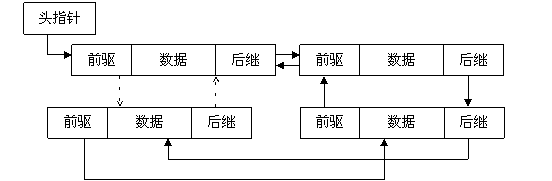

作为实现Linux内核代码的主体语言C，它是朴素的、直接的，直接到你可以对硬件寄存器的某一位进行操作，C语言又是原始的，基本的，基本的就像构建大厦的一块块砖，运用它，你可以随意地建造自己梦想中的大厦。

但是，与其他语言不同，C语言标准库中并没有对数据结构的支持函数，比如，没有对链表、队、栈、树等数据结构操作的函数集合，但在Linux内核代码中，随处都可以觅见这些数据结构的踪影。 现实世界中数据的组织形式逃脱不出数据结构课程所涵盖的那些结构，相对于其他数据结构而言，链表这种组织方式更常用和灵活，或者说，其他数据结构，都可以从链表衍生而来。 在Linux内核源代码树中，`include/linux/list.h`  文件中用C语言实现了封装好的、易用的双向链表函数集合，这种实现是高效和可移植的--否则，这些代码也进不了内核，同时，这种实现又是巧妙和可见的，赏析这些代码，让我们领悟代码设计之美妙。 一、链表及衍生 为什么链表是数据组织的根本形式？ 最简单的数组组织形式是数组，它在内存顺序存放，其存取效率无疑是高效的，但除非你存放的数据是静态的，否则，增加和删除一个元素的代价是不可小估的。而 链表，在建立之初，无需知晓其节点是多少，在构建过程中，增加和删除一个节点与链表的长度无关，主要开销为访问的顺序性和链表节点所占的空间。 尽管链表可以分类为单链表、双链表和循环链表，但在此，以分析双链表为基点，从而退化或者衍生出其他数据结构。 在C 语言中，一个基本的双向链表定义如下：

```c
struct my_list{ 
	void *mydata; 
	struct my_list *next;
	struct my_list *prev;
	}; 
```




图1 双链表 通过前趋（prev）和后继（next）两个指针字段，就可以从两个方向遍历双链表，这使得遍历链表的代价减少。如果打乱前驱、后继的依赖关系，就可以构  成"二叉树"；如果再让首节点的前趋指向链表尾节点、尾节点的后继指向首节点（如图1中虚线部分），就构成了循环链表；如果设计更多的指针字段，就可以构 成各种复杂的树状数据结构。 如果减少一个指针域，就退化成单链表，如果只能对链表的首尾进行插入或删除操作，就演变为队结构，如果只能对链表的头进行插入或删除操作，就退化为栈结构。 如此看来，双链表，是演化各种数据结构的基石。 参考文献： [深入分析Linux内核链表](http://www.ibm.com/developerworks/cn/linux/kernel/l-chain/index.html) 一文中的双向链表图[.](http://wwww.kerneltravel.net/index.php/adalat-online-vipps)

##### 版权声明

本文仅代表作者观点，不代表本站立场。
本文系作者授权发表，未经许可，不得转载。