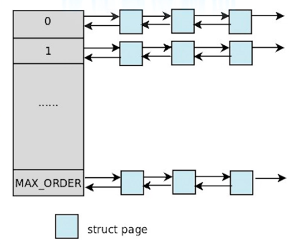

# 伙伴系统

## 1.前言

Linux内核内存管理的一项重要工作就是如何在频繁申请释放内存的情况下，避免碎片的产生。Linux采用伙伴系统解决外部碎片的问题，采用slab解决内部碎片的问题，在这里我们先讨论外部碎片问题。避免外部碎片的方法有两种：一种是之前介绍过的利用非连续内存的分配；另外一种则是用一种有效的方法来监视内存，保证在内核只要申请一小块内存的情况下，不会从大块的连续空闲内存中截取一段过来，从而保证了大块内存的连续性和完整性。显然，前者不能成为解决问题的普遍方法，一来用来映射非连续内存线性地址空间有限，二来每次映射都要改写内核的页表，进而就要刷新TLB，这使得分配的速度大打折扣，这对于要频繁申请内存的内核显然是无法忍受的。因此Linux采用后者来解决外部碎片的问题，也就是著名的伙伴系统。

## 2.伙伴系统

### 伙伴算法的分配原理

大小相同，物理地址连续的两个两个页框就被称为伙伴。Linux的伙伴算法把所有的空闲页面分成多个块链表（链表个数默认为11个），每个链表中的一个块含有2的幂次个页面，即页块或简称块。每个链表中的页块的大小是不一样的。如果分配阶为n的页框块,那么先从第n条页框块链表中查找是否存在这么大小的空闲页块。如果有则分配，否则在第n+1条链表中继续查找，直到找到为止。
伙伴系统的宗旨就是用最小的内存块来满足内核的对于内存的请求。在最初，只有一个块，也就是整个内存，假如为1M大小，而允许的最小块为64K，那么当我们申请一块200K大小的内存时，就要先将1M的块分裂成两等分，各为512K，这两分之间的关系就称为伙伴，然后再将第一个512K的内存块分裂成两等分，各位256K，将第一个256K的内存块分配给内存，这样就是一个分配的过程。



## 3.数据结构

### zone

struct zone 定义在 inlcude/linux/mmzone.h

```c
struct zone {
	/* Fields commonly accessed by the page allocator */

/* zone watermarks, access with *_wmark_pages(zone) macros */
unsigned long watermark[NR_WMARK];

 /*

  * 每个 zone 在系统启动时会计算出 3 个水位值, 分别为 WMAKR_MIN, WMARK_LOW, WMARK_HIGH 水位, 这在
    * 页面分配器和 kswapd 页面回收中会用到
      */
      /*
     * When free pages are below this point, additional steps are taken
     * when reading the number of free pages to avoid per-cpu counter
     * drift allowing watermarks to be breached
       */
       unsigned long percpu_drift_mark;

/*

 * We don't know if the memory that we're going to allocate will be freeable
 * or/and it will be released eventually, so to avoid totally wasting several
 * GB of ram we must reserve some of the lower zone memory (otherwise we risk
 * to run OOM on the lower zones despite there's tons of freeable ram
 * on the higher zones). This array is recalculated at runtime if the
 * sysctl_lowmem_reserve_ratio sysctl changes.
   */
   unsigned long		lowmem_reserve[MAX_NR_ZONES];

 //zone 中预留的内存, 为了防止一些代码必须运行在低地址区域，所以事先保留一些低地址区域的内存

#ifdef CONFIG_NUMA
	int node;
	/*

  * zone reclaim becomes active if more unmapped pages exist.
    */
    unsigned long		min_unmapped_pages;
    unsigned long		min_slab_pages;
    #endif
    struct per_cpu_pageset __percpu *pageset;
      /*
     * page管理的数据结构对象，内部有一个page的列表(list)来管理。每个CPU维护一个page list，避免
     * 自旋锁的冲突。这个数组的大小和NR_CPUS(CPU的数量）有关，这个值是编译的时候确定的
       */
       /*
     * free areas of different sizes
       */
       spinlock_t		lock;
        //对zone并发访问的保护的自旋锁
       int                     all_unreclaimable; /* All pages pinned */
       #ifdef CONFIG_MEMORY_HOTPLUG
       /* see spanned/present_pages for more description */
       seqlock_t		span_seqlock;
       #endif
       struct free_area	free_area[MAX_ORDER];
        //页面使用状态的信息，以每个bit标识对应的page是否可以分配

#ifndef CONFIG_SPARSEMEM
	/*

  * Flags for a pageblock_nr_pages block. See pageblock-flags.h.
    * In SPARSEMEM, this map is stored in struct mem_section
      */
      unsigned long		*pageblock_flags;
      #endif /* CONFIG_SPARSEMEM */

#ifdef CONFIG_COMPACTION
	/*

  * On compaction failure, 1<<compact_defer_shift compactions
    * are skipped before trying again. The number attempted since
     * last failure is tracked with compact_considered.
       */
       unsigned int		compact_considered;
       unsigned int		compact_defer_shift;
       #endif

ZONE_PADDING(_pad1_)

/* Fields commonly accessed by the page reclaim scanner */
spinlock_t		lru_lock;	

 //LRU(最近最少使用算法)的自旋锁
	struct zone_lru {
		struct list_head list;
	} lru[NR_LRU_LISTS];

struct zone_reclaim_stat reclaim_stat;

unsigned long		pages_scanned;	   /* since last reclaim */
unsigned long		flags;		   /* zone flags, see below */

/* Zone statistics */
atomic_long_t		vm_stat[NR_VM_ZONE_STAT_ITEMS];

//zone 计数
	/*

  * The target ratio of ACTIVE_ANON to INACTIVE_ANON pages on
    * this zone's LRU.  Maintained by the pageout code.
      */
      unsigned int inactive_ratio;

ZONE_PADDING(_pad2_)
/* Rarely used or read-mostly fields */

/*

 * wait_table		-- the array holding the hash table
 * wait_table_hash_nr_entries	-- the size of the hash table array
 * wait_table_bits	-- wait_table_size == (1 << wait_table_bits)
   *
 * The purpose of all these is to keep track of the people
 * waiting for a page to become available and make them
 * runnable again when possible. The trouble is that this
 * consumes a lot of space, especially when so few things
 * wait on pages at a given time. So instead of using
 * per-page waitqueues, we use a waitqueue hash table.
   *
 * The bucket discipline is to sleep on the same queue when
 * colliding and wake all in that wait queue when removing.
 * When something wakes, it must check to be sure its page is
 * truly available, a la thundering herd. The cost of a
 * collision is great, but given the expected load of the
 * table, they should be so rare as to be outweighed by the
 * benefits from the saved space.
   *
 * __wait_on_page_locked() and unlock_page() in mm/filemap.c, are the
 * primary users of these fields, and in mm/page_alloc.c
 * free_area_init_core() performs the initialization of them.
   */
   wait_queue_head_t	* wait_table;

 //待一个page释放的等待队列哈希表。它会被wait_on_page()，unlock_page()函数使用. 用
 //哈希表，而不用一个等待队列的原因，防止进程长期等待资源
	unsigned long		wait_table_hash_nr_entries;
 //哈希表中的等待队列的数量
	unsigned long		wait_table_bits;

/*

 * Discontig memory support fields.
   */
   struct pglist_data	*zone_pgdat;

 //指向这个zone所在的pglist_data对象
	/* zone_start_pfn == zone_start_paddr >> PAGE_SHIFT */
	unsigned long		zone_start_pfn;
//和node_start_pfn的含义一样。这个成员是用于表示zone中的开始那个page在物理内存中的位置
//的present_pages， spanned_pages: 和node中的类似的成员含义一样
	/*

  * zone_start_pfn, spanned_pages and present_pages are all
    * protected by span_seqlock.  It is a seqlock because it has
     * to be read outside of zone->lock, and it is done in the main
     * allocator path.  But, it is written quite infrequently.
       *
     * The lock is declared along with zone->lock because it is
     * frequently read in proximity to zone->lock.  It's good to
     * give them a chance of being in the same cacheline.
       */
       unsigned long		spanned_pages;	/* total size, including holes */
        //zone 中包含的页面数量
       unsigned long		present_pages;	/* amount of memory (excluding holes) */
       //zone 中实际管理的页面数量. 对一些体系结构来说, 其值和 spanned_pages 相等
       /*
     * rarely used fields:
       */
       const char		*name;
        //
       }
```

每个物理页框对应一个struct page实例（页框的描述数据结构）。每个内存区关联了一个struct zone实例，该结构中使用free_area数组对空闲页框进行管理。

### free_area

```c
struct free_area {
	struct list_head	free_list[MIGRATE_TYPES];
 //free_area共有MAX_ORDER个元素，其中第order个元素记录了2^order的空闲块，这些
 //空闲块在free_list中以双向链表的形式组织起来，对于同等大小的空闲块，其类型不同，将组织在不同的free_list中
	unsigned long		nr_free;
 //nr_free记录了该free_area中总共的空闲内存块的数量
};
```

free_area共有MAX_ORDER个元素，其中第order个元素记录了2^order的空闲块，这些空闲块在free_list中以双向链表的形式组织起来，对于同等大小的空闲块，其类型不同，将组织在不同的free_list中，nr_free记录了该free_area中总共的空闲内存块的数量。MAX_ORDER的默认值为11，这意味着最大内存块的大小为2^10=1024个页框。对于同等大小的内存块，每个内存块的起始页框用于链表的节点进行相连，这些节点对应的着struct page中的lru域。

### migrate type

内核对于迁移类型的定义如下:

```c
#define MIGRATE_UNMOVABLE     0//不可移动页，这类页在内存当中有固定的位置，不能移动。内核的核心分配的内存大多属于这种类型
#define MIGRATE_RECLAIMABLE   1//可回收页，这类页不能直接移动，但可以删除，其内容页可以从其他地方重新生成，例如，映射自文件的数据属于这种类型，针对这种页，内核有专门的页面回收处理
#define MIGRATE_MOVABLE       2//可移动页，这类页可以随意移动，用户空间应用程序所用到的页属于该类别。它们通过页表来映射，如果他们复制到新的位置，页表项也会相应的更新，应用程序不会注意到任何改变。
#define MIGRATE_PCPTYPES      3//用来表示每CPU页框高速缓存的数据结构中的链表的迁移类型数目 
#define MIGRATE_RESERVE       3//在前三种的列表中都没用可满足分配的内存块时，就可以从MIGRATE_RESERVE分配
#define MIGRATE_ISOLATE       4 //用于跨越NUMA节点移动物理内存页，在大型系统上，它有益于将物理内存页移动到接近于是用该页最频繁地CPU
#define MIGRATE_TYPES         5//表示迁移类型的数目
```

定义migrate type，简要来说就是Linux将可移动或不可移动的内存分开分配，以便最大程度的减少碎片，提升分配大块内存的能力。基于这种思路，可见上述5种migrate type最重要的就是MIGRATE_UNMOVABLE不可移动，MIGRATE_MOVABLE可移动。另一个重要的type就是MIGRATE_RESERVE，这表示page被reserve，不接受buddy system管理。

### __rmqueue_smallest

rmqueue_smallest()是在指定的内存区上从所请求的分配阶对应的链表开始查找所需大小的空闲块，如果不成功则从高一阶的链表上继续查找。

```c
static inline
struct page *rmqueue_smallest(struct zone *zone, unsigned int order,
                        int migratetype)
{
    unsigned int current_order;
    struct free_area * area;
    //指向空闲页框
    struct page *page;
    //指向页

/* Find a page of the appropriate size in the preferred list */
//遍历order链表，current_order 当前阶，MAX_ORDER最大阶
for (current_order = order; current_order < MAX_ORDER; ++current_order) {
    area = &(zone->free_area[current_order]);
    if (list_empty(&area->free_list[migratetype]))
    //使用list_empty()检测，migratetype类型的链表为空时获取该页框
        continue;

​    page = list_entry(area->free_list[migratetype].next,
​                        struct page, lru);
​                        //从当前页链表项的下一项开始，获取指向的节点的struct page结构体的首地址
​    list_del(&page->lru);
​    //从链表上删除
​    rmv_page_order(page);
​    //设置页框描述符中的private为0，该字段中本来保存的是其所处页框块的分配阶
​    area->nr_free--;
​    //更新当前area的nr_free数
​    expand(zone, page, order, current_order, area, migratetype);
​    //调用expand分裂
​    return page;
​    //循环条件已经不再满足，因此返回前4个页框块首页框的描述符地址page。
}
return NULL;

}
```

### expand

expand()为分裂函数，如果所得到的内存块大于所请求的内存块，则按照伙伴算法的分配原理，将大的页框块分裂成小的页框块。

```c
static inline void expand(struct zone *zone, struct page *page,
    int low, int high, struct free_area *area,
    int migratetype)
    //比如当前申请大小为4的页块。low表示当前申请页块的阶2，如果阶为2的链表没有空闲块，就一
    //直往上找，直到找到阶为4找到空闲块，则high为4。
{
    unsigned long size = 1 << high;
    //因为只需要4个，阶为4有16个，所以多余的要往阶为2和3的链表上放
    //左移1位
    while (high > low) {
        area--;
        //通过将area指针自减即可得到下级链表
        high--;
        size >>= 1;
        //接上面的假设，刚才size=16，现在往右移一位size=8，
        VM_BUG_ON(bad_range(zone, &page[size]));
        list_add(&page[size].lru, &area->free_list[migratetype]);
        //list_add函数将这个8个页框添加到area为3的链表中
        area->nr_free++;
        //更新area为3的nr_free数
        set_page_order(&page[size], high);
        //经过第一次遍历将16一份为2，第二次遍历将8个页块一份为2，第三次时循环条件已不满足，则返回前4个页框块首页框的描述符地址page。
    }
    
}


```

## 4.总结

伙伴算法作为一种行之有效的内存碎片解决办法，和slab一起用来解决内存浪费问题。这套内存管理方法也被很多操作系统所采用，将内存分成若干块，然后尽可能以最适合的方式满足程序内存需求就是伙伴算法的核心。

参考资料：

https://blog.csdn.net/vanbreaker/article/details/7605367