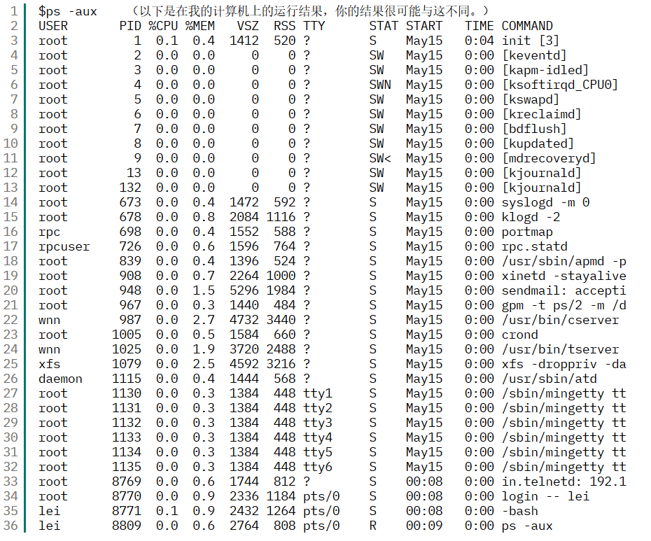
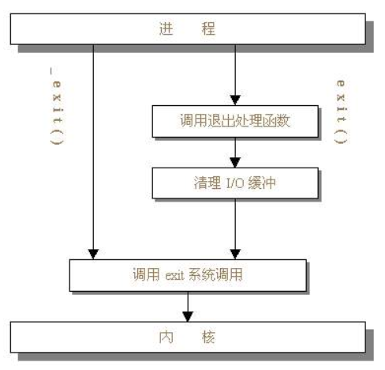

# 系统调用跟我学(2)

#### 进程管理相关的系统调用之一


## 关于进程的一些必要知识

先看一下进程在大学课本里的标准定义：“进程是可并发执行的程序在一个数据集合上的运行过程。”这个定义非常严谨，而且难懂，如果你没有一下子理解这句话，就不妨看看笔者自己的并不严谨的解释。我们大家都知道，硬盘上的一个可执行文件经常被称作程序，在Linux系统中，当一个程序开始执行后，在开始执行到执行完毕退出这段时间里，它在内存中的部分就被称作一个进程。

当然，这个解释并不完善，但好处是容易理解，在以下的文章中，我们将会对进程作一些更全面的认识。


## Linux进程简介

Linux是一个多任务的操作系统，也就是说，在同一个时间内，可以有多个进程同时执行。如果读者对计算机硬件体系有一定了解的话，会知道我们大家常用的单CPU计算机实际上在一个时间片断内只能执行一条指令，那么Linux是如何实现多进程同时执行的呢？原来Linux使用了一种称为“进程调度（process   scheduling）”的手段，首先，为每个进程指派一定的运行时间，这个时间通常很短，短到以毫秒为单位，然后依照某种规则，从众多进程中挑选一个投入运行，其他的进程暂时等待，当正在运行的那个进程时间耗尽，或执行完毕退出，或因某种原因暂停，Linux就会重新进行调度，挑选下一个进程投入运行。因为每个进程占用的时间片都很短，在我们使用者的角度来看，就好像多个进程同时运行一样了。

在Linux中，每个进程在创建时都会被分配一个数据结构，称为进程控制块（Process  Control  Block，简称PCB）。PCB中包含了很多重要的信息，供系统调度和进程本身执行使用，其中最重要的莫过于进程ID（process  ID）了，进程ID也被称作进程标识符，是一个非负的整数，在Linux操作系统中唯一地标志一个进程，在我们最常使用的I386架构（即PC使用的架构）上，一个非负的整数的变化范围是0-32767，这也是我们所有可能取到的进程ID。其实从进程ID的名字就可以看出，它就是进程的身份证号码，每个人的身份证号码都不会相同，每个进程的进程ID也不会相同。

一个或多个进程可以合起来构成一个进程组（process group），一个或多个进程组可以合起来构成一个会话（session）。这样我们就有了对进程进行批量操作的能力，比如通过向某个进程组发送信号来实现向该组中的每个进程发送信号。

最后，让我们通过ps命令亲眼看一看自己的系统中目前有多少进程在运行：



以上除标题外，每一行都代表一个进程。在各列中，PID一列代表了各进程的进程ID，COMMAND一列代表了进程的名称或在Shell中调用的命令行，对其他列的具体含义，我就不再作解释，有兴趣的读者可以去参考相关书籍。


## getpid

在2.4.4版内核中，getpid是第20号系统调用，其在Linux函数库中的原型是：

```c
#include<sys/types.h> /* 提供类型pid_t的定义 */
#include<unistd.h> /* 提供函数的定义 */
pid_t getpid(void);
```


getpid的作用很简单，就是返回当前进程的进程ID，请大家看以下的例子：

```c
/* getpid_test.c */
#include<unistd.h>
main()
{
    printf("The current process ID is %d\n",getpid());
}
```


细心的读者可能注意到了，这个程序的定义里并没有包含头文件sys/types.h，这是因为我们在程序中没有用到pid_t类型，pid_t类型即为进程ID的类型。事实上，在i386架构上（就是我们一般PC计算机的架构），pid_t类型是和int类型完全兼容的，我们可以用处理整形数的方法去处理pid_t类型的数据，比如，用"%d"把它打印出来。

编译并运行程序getpid_test.c：

```c
$gcc getpid_test.c -o getpid_test
$./getpid_test
The current process ID is 1980
（你自己的运行结果很可能与这个数字不一样，这是很正常的。）
```


再运行一遍：

```c
$./getpid_test
The current process ID is 1981
```


正如我们所见，尽管是同一个应用程序，每一次运行的时候，所分配的进程标识符都不相同。


## fork

在2.4.4版内核中，fork是第2号系统调用，其在Linux函数库中的原型是：

```c
#include<sys/types.h> /* 提供类型pid_t的定义 */
#include<unistd.h> /* 提供函数的定义 */
pid_t fork(void);
```


只看fork的名字，可能难得有几个人可以猜到它是做什么用的。fork系统调用的作用是复制一个进程。当一个进程调用它，完成后就出现两个几乎一模一样的进程，我们也由此得到了一个新进程。据说fork的名字就是来源于这个与叉子的形状颇有几分相似的工作流程。

在Linux中，创造新进程的方法只有一个，就是我们正在介绍的fork。其他一些库函数，如system()，看起来似乎它们也能创建新的进程，如果能看一下它们的源码就会明白，它们实际上也在内部调用了fork。包括我们在命令行下运行应用程序，新的进程也是由shell调用fork制造出来的。fork有一些很有意思的特征，下面就让我们通过一个小程序来对它有更多的了解。

```c
/* fork_test.c */
#include<sys/types.h>
#inlcude<unistd.h>
main()
{
    pid_t pid;
     
    /*此时仅有一个进程*/
    pid=fork();
    /*此时已经有两个进程在同时运行*/
    if(pid<0)
        printf("error in fork!");
    else if(pid==0)
        printf("I am the child process, my process ID is %d\n",getpid());
    else
        printf("I am the parent process, my process ID is %d\n",getpid());
}
```


编译并运行：

```c
$gcc fork_test.c -o fork_test
$./fork_test
I am the parent process, my process ID is 1991
I am the child process, my process ID is 1992
```


看这个程序的时候，头脑中必须首先了解一个概念：在语句pid=fork()之前，只有一个进程在执行这段代码，但在这条语句之后，就变成两个进程在执行了，这两个进程的代码部分完全相同，将要执行的下一条语句都是if(pid==0)……。

两个进程中，原先就存在的那个被称作“父进程”，新出现的那个被称作“子进程”。父子进程的区别除了进程标志符（process   ID）不同外，变量pid的值也不相同，pid存放的是fork的返回值。fork调用的一个奇妙之处就是它仅仅被调用一次，却能够返回两次，它可能有三种不同的返回值：

1. 在父进程中，fork返回新创建子进程的进程ID；
2. 在子进程中，fork返回0；
3. 如果出现错误，fork返回一个负值；

fork出错可能有两种原因：（1）当前的进程数已经达到了系统规定的上限，这时errno的值被设置为EAGAIN。（2）系统内存不足，这时errno的值被设置为ENOMEM。（关于errno的意义，请参考本系列的第一篇文章。）

fork系统调用出错的可能性很小，而且如果出错，一般都为第一种错误。如果出现第二种错误，说明系统已经没有可分配的内存，正处于崩溃的边缘，这种情况对Linux来说是很罕见的。

说到这里，聪明的读者可能已经完全看懂剩下的代码了，如果pid小于0，说明出现了错误；pid==0，就说明fork返回了0，也就说明当前进程是子进程，就去执行printf("I  am the child!")，否则（else），当前进程就是父进程，执行printf("I am the  parent!")。完美主义者会觉得这很冗余，因为两个进程里都各有一条它们永远执行不到的语句。不必过于为此耿耿于怀，毕竟很多年以前，UNIX的鼻祖们在当时内存小得无法想象的计算机上就是这样写程序的，以我们如今的“海量”内存，完全可以把这几个字节的顾虑抛到九霄云外。

说到这里，可能有些读者还有疑问：如果fork后子进程和父进程几乎完全一样，而系统中产生新进程唯一的方法就是fork，那岂不是系统中所有的进程都要一模一样吗？那我们要执行新的应用程序时候怎么办呢？从对Linux系统的经验中，我们知道这种问题并不存在。至于采用了什么方法，我们把这个问题留到后面具体讨论。


## exit

在2.4.4版内核中，exit是第1号调用，其在Linux函数库中的原型是：

```c
#include<stdlib.h>
void exit(int status);
```


不像fork那么难理解，从exit的名字就能看出，这个系统调用是用来终止一个进程的。无论在程序中的什么位置，只要执行到exit系统调用，进程就会停止剩下的所有操作，清除包括PCB在内的各种数据结构，并终止本进程的运行。请看下面的程序：

```c
/* exit_test1.c */
#include<stdlib.h>
main()
{
    printf("this process will exit!\n");
    exit(0);
    printf("never be displayed!\n");
}
```


编译后运行：

```c
$gcc exit_test1.c -o exit_test1
$./exit_test1
this process will exit!
```


我们可以看到，程序并没有打印后面的"never be displayed!\n"，因为在此之前，在执行到exit(0)时，进程就已经终止了。

exit系统调用带有一个整数类型的参数status，我们可以利用这个参数传递进程结束时的状态，比如说，该进程是正常结束的，还是出现某种意外而结束的，一般来说，0表示没有意外的正常结束；其他的数值表示出现了错误，进程非正常结束。我们在实际编程时，可以用wait系统调用接收子进程的返回值，从而针对不同的情况进行不同的处理。关于wait的详细情况，我们将在以后的篇幅中进行介绍。


## exit和_exit

作为系统调用而言，_exit和exit是一对孪生兄弟，它们究竟相似到什么程度，我们可以从Linux的源码中找到答案：

```c
#define __NR__exit __NR_exit		/* 摘自文件include/asm-i386/unistd.h第334行 */
```

“__NR_”是在Linux的源码中为每个系统调用加上的前缀，请注意第一个exit前有2条下划线，第二个exit前只有1条下划线。

这时随便一个懂得C语言并且头脑清醒的人都会说，exit和exit没有任何区别，但我们还要讲一下这两者之间的区别，这种区别主要体现在它们在函数库中的定义。exit在Linux函数库中的原型是：

```c
#include<unistd.h>
void _exit(int status);
```


和exit比较一下，exit()函数定义在stdlib.h中，而_exit()定义在unistd.h中，从名字上看，stdlib.h似乎比unistd.h高级一点，那么，它们之间到底有什么区别呢？让我们先来看流程图，通过下图，我们会对这两个系统调用的执行过程产生一个较为直观的认识。



从图中可以看出，exit()函数的作用最为简单：直接使进程停止运行，清除其使用的内存空间，并销毁其在内核中的各种数据结构；exit()函数则在这些基础上作了一些包装，在执行退出之前加了若干道工序，也是因为这个原因，有些人认为exit已经不能算是纯粹的系统调用。exit()函数与exit()函数最大的区别就在于exit()函数在调用exit系统调用之前要检查文件的打开情况，把文件缓冲区中的内容写回文件，就是图中的“清理I/O缓冲”一项。在Linux的标准函数库中，有一套称作“高级I/O”的函数，我们熟知的printf()、fopen()、fread()、fwrite()都在此列，它们也被称作“缓冲I/O（buffered   I/O）”，其特征是对应每一个打开的文件，在内存中都有一片缓冲区，每次读文件时，会多读出若干条记录，这样下次读文件时就可以直接从内存的缓冲区中读取，每次写文件的时候，也仅仅是写入内存中的缓冲区，等满足了一定的条件（达到一定数量，或遇到特定字符，如换行符\n和文件结束符EOF），再将缓冲区中的内容一次性写入文件，这样就大大增加了文件读写的速度，但也为我们编程带来了一点点麻烦。如果有一些数据，我们认为已经写入了文件，实际上因为没有满足特定的条件，它们还只是保存在缓冲区内，这时我们用_exit()函数直接将进程关闭，缓冲区中的数据就会丢失，反之，如果想保证数据的完整性，就一定要使用exit()函数。请看以下例程：

```c
/* exit2.c */
#include<stdlib.h>
main()
{
    printf("output begin\n");
    printf("content in buffer");
    exit(0);
}
```


编译并运行：

```c
$gcc exit2.c -o exit2
$./exit2
output begin
content in buffer
/* _exit1.c */
#include<unistd.h>
main()
{
    printf("output begin\n");
    printf("content in buffer");
    _exit(0);
}
```


编译并运行：

```c
$gcc _exit1.c -o _exit1
$./_exit1
output begin
```


在Linux中，标准输入和标准输出都是作为文件处理的，虽然是一类特殊的文件，但从程序员的角度来看，它们和硬盘上存储数据的普通文件并没有任何区别。与所有其他文件一样，它们在打开后也有自己的缓冲区。请读者结合前面的叙述，思考一下为什么这两个程序会得出不同的结果。相信如果您理解了我前面所讲的内容，会很容易的得出结论。


## 待续

在这篇文章中，我们对Linux的进程管理作了初步的了解，并在此基础上学习了getpid、fork、exit和_exit四个系统调用。在下一篇文章中，我们将学习与Linux进程管理相关的其他系统调用，并将作一些更深入的探讨。好，下回见。