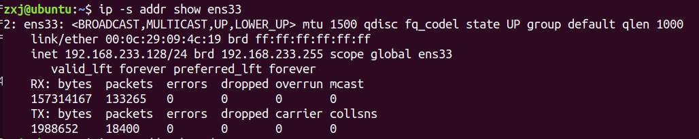
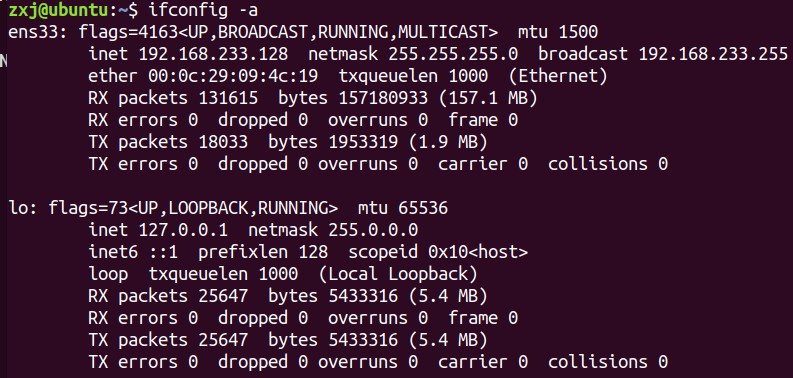
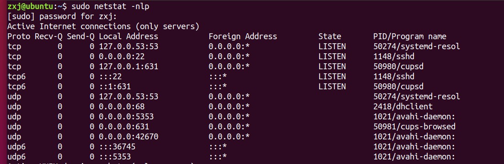
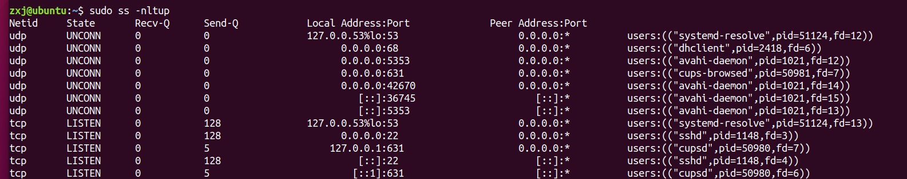
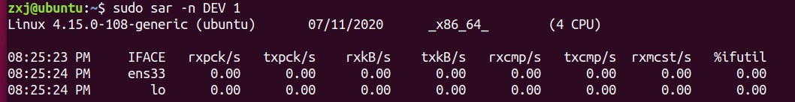
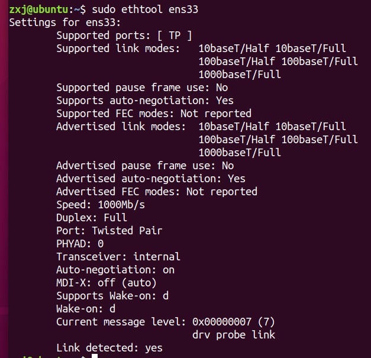
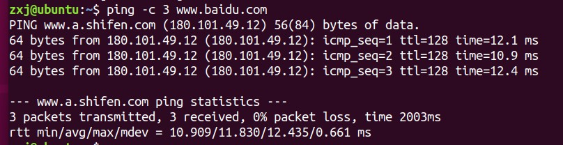
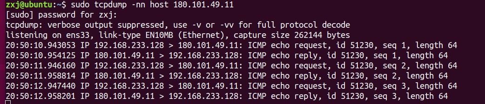
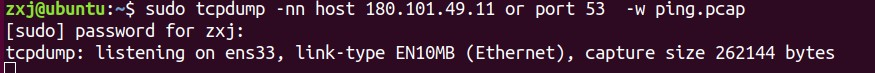
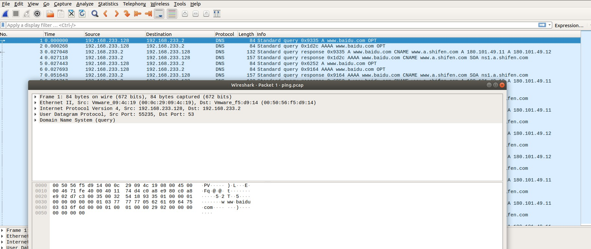

### 网络性能指标

学习能够评估网络的性能指标，这些指标很多，一般评价不同的协议栈有不同的指标评判。

* 带宽：用来评估网络链路中的最大传输速率。常用单位b/s（比特/秒）
* 吞吐量：用来评估单位时间内成功传输的数据量。常用单位b/s（比特/秒），B/s（字节/秒）。
* 网络使用率：吞吐量/带宽。吞吐量受带宽的限制。
* 延时：表示从网络中发出请求后，到远端响应的延迟时间。在不同的场景下，延时有不同的含义：
  * 在请求连接的时候（tcp握手），代表连接的延时。
  * 在普通的数据包的发送中，代表的是数据包来返的时间延时。
* PPS：Packet Per Second（包/秒），以数据包为单位，单位时间内的传输的数据包的速率。一般用在评估数据包的转发能力，常用在：硬件交换机中。
* 还有很多其他的网络指标：网络的可用性（网络能否正常通信）、并发连接数（tcp连接数量）、丢包率（丢包百分比）、重传率（重新传输的网络包比例）等也是常用的性能指标。

### 网络性能工具

说明：每个命令的语法和参数使用详情，请点击参考链接，或者自行man手册。

1. ip 用来显示或操纵Linux主机的路由、网络设备、策略路由和隧道，是Linux下较新的功能强大的网络配置工具。参考[ip](https://wangchujiang.com/linux-command/c/ip.html)

   实验结果：
   

2. ifconfig 用来显示和配置网络接口的状态。参考[ifconfig](https://www.runoob.com/linux/linux-comm-ifconfig.html)

   实验结果：
   
   说明：

  * mtu：最大的传输单元
  * inet：ipv4地址
  * netmask：子网的掩码
  * broadcast：广播地址
  * ether：mac地址
  * RX,TX行表示的是：接收和发送的数据包的个数（或者）字节数。
    * packets：包数
    * bytes：字节数
    * errors：表示发生错误的数据包数，比如校验错误、帧同步错误等
    * dropped：表示丢弃的数据包数，即数据包已经收到了 Ring Buffer，但因为内存不足等原因丢包
    * overruns：表示超限数据包数，即网络 I/O 速度过快，导致 Ring Buffer 中的数据包来不及处理（队列满）而导致的丢包
    * carrier：表示发生 carrirer 错误的数据包数，比如双工模式不匹配、物理电缆出现问题等
    * collisions：表示碰撞数据包数

3. netstat 用于显示各种网络相关信息，如网络连接，路由表，接口状态，masquerade连接，多播成员等等。参考[netstat](https://www.cnblogs.com/ggjucheng/archive/2012/01/08/2316661.HTML)

   实验结果：
   

  * Proto:各种相关的协议信息。
  * Recv-Q:接收队列
  * Send-Q:发送队列
  * Local Address:本地地址
  * Foreign Address:远端地址
  * State:套接字状态
  * PID/Program name:pid号和进程名字

说明：接收队列和发送队列在不同的套接字状态下，有不同的含义：

当套接字处于连接状态（Established）时，

* Recv-Q 表示套接字缓冲还没有被应用程序取走的字节数（即接收队列长度）。
* 而 Send-Q 表示还没有被远端主机确认的字节数（即发送队列长度）。

当套接字处于监听状态（Listening）时，

* Recv-Q 表示全连接队列的长度。
* 而 Send-Q 表示全连接队列的最大长度。
  	

所谓全连接，是指服务器收到了客户端的 ACK，完成了 TCP 三次握手，然后就会把这个连接挪到全连接队列中。这些全连接中的套接字，还需要被 accept() 系统调用取走，服务器才可以开始真正处理客户端的请求。与全连接队列相对应的，还有一个半连接队列。所谓半连接是指还没有完成 TCP 三次握手的连接，连接只进行了一半。服务器收到了客户端的 SYN 包后，就会把这个连接放到半连接队列中，然后再向客户端发送 SYN+ACK 包。

4. ss 可以用来获取socket统计信息，和netstat显示的内容类似。参考[ss](https://www.cnblogs.com/sparkdev/p/8421897.html)

   实验结果：

   

打印信息和netstat的结果类似。

5. sar 是目前linux上最为全面的系统性能分析工具之一，可以从多方面对系统的活动进行报告，对文件的读写情况、系统调用的使用状况、磁盘I/O、CPU的效率、内存的使用情况、进程活动及IPC有关的活动，同样也使用于网络中等。参考[sar](https://www.jianshu.com/p/91c1ae8cd5c8)

   实验结果：

   

* IFACE:网络接口
* rxpck/s 和 txpck/s 分别是接收和发送的 PPS，单位为包 / 秒。
* rxkB/s 和 txkB/s 分别是接收和发送的吞吐量，单位是 KB/ 秒。
* rxcmp/s 和 txcmp/s 分别是接收和发送的压缩数据包数，单位是包 / 秒。
* %ifutil :网络接口的使用率，即半双工模式下为 (rxkB/s+txkB/s)/Bandwidth，而全双工模式下为 max(rxkB/s, txkB/s)/Bandwidth。

6. ethtool 用于查询及设置网卡参数的命令参考[ethtool](https://blog.csdn.net/evenness/article/details/7519061)

   实验结果：

   

7. ping 用于判断两个主机之间的连通性和延时。参考[ping](https://blog.csdn.net/henni_719/article/details/62232781)

   实验结果：

   

   从上图我们可以看到www.baidu.com和www.a.shifen.com是同一个东西，它的IP地址180.101.49.12。icmp_seq:数据包的序列号、ttl:表示生存时间或者跳数、time一个数据包的往返延时。

8. tcpdump 用于数据包的抓取和分析。参考[tcpdump](https://www.cnblogs.com/ggjucheng/archive/2012/01/14/2322659.html)

   实验结果：

   

9. wireshark 和tcpdump类似，都是用于抓包和分析，wireshark带有图形界面。参考[wireshark](https://cizixs.com/2015/03/12/tcpdump-introduction/)使用教程[wireshark]([https://www.dell.com/community/%E5%85%A5%E9%97%A8%E7%BA%A7%E5%92%8C%E4%B8%AD%E7%AB%AF/%E5%A6%82%E6%9E%9C%E7%9C%8B%E4%BA%86%E8%BF%99%E4%B8%AA%E4%BD%A0%E8%BF%98%E6%98%AF%E4%B8%8D%E4%BC%9A%E7%94%A8Wireshark-%E9%82%A3%E5%B0%B1%E6%9D%A5%E6%89%BE%E6%88%91%E5%90%A7-8%E6%9C%886%E6%97%A5%E5%AE%8C%E7%BB%93/td-p/7007033](https://www.dell.com/community/入门级和中端/如果看了这个你还是不会用Wireshark-那就来找我吧-8月6日完结/td-p/7007033))

   实验结果：

   

   

   首先我们通过tcpdump可以将要过滤的数据包获取到，然后在通过图形界面wireshark对得到的数据包进行分析。