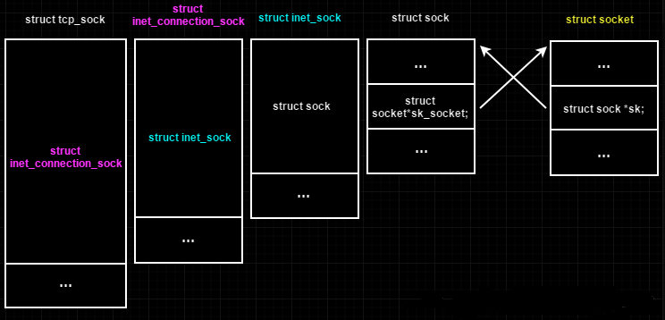

### 1. sock结构和tcp_sock结构之间的关系

在linux的内核网络的源码分析中，我们经常看见这样的内核函数使用。

首先，看个例子，如下所示。

```
struct sock *sk；
struct tcp_sock *tp = tcp_sk(sk);
```

```
static inline struct tcp_sock *tcp_sk(const struct sock *sk)
{
	return (struct tcp_sock *)sk;
}
```

通过上面的源码中可以看出，可以通过类型的强制转换，将struct sock结构转换成struct tcp_sock类型的结构。进行过强制转换的变量占用的内存地址空间，没有发生变化，只是类型发生的变化，这样我们就可以使用转换后的类型来操作结构体里面的成员，上面进行转换的目的就是这个。

当时，我在看到这个类型转换的时候，我就猜测，这个sock和tcp_sock结构之间肯定是包含的关系，即要么就是sock结构中第一个字段里面包含tcp_sock结构，要么就是相反，tcp_sock结构中第一个字段中包含sock结构。我当时是这么想的。然后，我就把这两个结构体打开。如下所示。

```
struct tcp_sock {
	/* inet_connection_sock has to be the first member of tcp_sock */
	struct inet_connection_sock	inet_conn;
	u16	tcp_header_len;	/* Bytes of tcp header to send		*/
	u16	gso_segs;	/* Max number of segs per GSO packet	*/
	...
	...
};
```


```
struct sock {
	/*
	 * Now struct inet_timewait_sock also uses sock_common, so please just
	 * don't add nothing before this first member (__sk_common) --acme
	 */
	struct sock_common	__sk_common;
#define sk_node			__sk_common.skc_node
#define sk_nulls_node		__sk_common.skc_nulls_node
#define sk_refcnt		__sk_common.skc_refcnt
#define sk_tx_queue_mapping	__sk_common.skc_tx_queue_mapping

#define sk_dontcopy_begin	__sk_common.skc_dontcopy_begin
#define sk_dontcopy_end		__sk_common.skc_dontcopy_end
#define sk_hash			__sk_common.skc_hash
#define sk_portpair		__sk_common.skc_portpair
#define sk_num			__sk_common.skc_num
#define sk_dport		__sk_common.skc_dport
#define sk_addrpair		__sk_common.skc_addrpair
#define sk_daddr		__sk_common.skc_daddr
#define sk_rcv_saddr		__sk_common.skc_rcv_saddr
#define sk_family		__sk_common.skc_family
#define sk_state		__sk_common.skc_state
#define sk_reuse		__sk_common.skc_reuse
#define sk_reuseport		__sk_common.skc_reuseport
#define sk_ipv6only		__sk_common.skc_ipv6only
#define sk_net_refcnt		__sk_common.skc_net_refcnt
#define sk_bound_dev_if		__sk_common.skc_bound_dev_if
#define sk_bind_node		__sk_common.skc_bind_node
#define sk_prot			__sk_common.skc_prot
#define sk_net			__sk_common.skc_net
#define sk_v6_daddr		__sk_common.skc_v6_daddr
#define sk_v6_rcv_saddr	__sk_common.skc_v6_rcv_saddr
#define sk_cookie		__sk_common.skc_cookie
#define sk_incoming_cpu		__sk_common.skc_incoming_cpu
#define sk_flags		__sk_common.skc_flags
#define sk_rxhash		__sk_common.skc_rxhash

	socket_lock_t		sk_lock;
	atomic_t		sk_drops;
	int			sk_rcvlowat;
	struct sk_buff_head	sk_error_queue;
	struct sk_buff_head	sk_receive_queue;
	/*
	 * The backlog queue is special, it is always used with
	 * the per-socket spinlock held and requires low latency
	 * access. Therefore we special case it's implementation.
	 * Note : rmem_alloc is in this structure to fill a hole
	 * on 64bit arches, not because its logically part of
	 * backlog.
	 */
	struct {
		atomic_t	rmem_alloc;
		int		len;
		struct sk_buff	*head;
		struct sk_buff	*tail;
	} sk_backlog;
#define sk_rmem_alloc sk_backlog.rmem_alloc
	...
	struct socket		*sk_socket;
	...
};
```

上面的两个结构体都很大，我只截取了部分字段。但是我为了验证我的猜想，我们只需要每个结构体的第一个字段就可以。当我们查看了两个结构体的第一个字段，发现并不是我们猜想的那样，要么sock结构中第一个字段包含tcp_sock结构，要么tcp_sock结构中第一个字段包含sock结构。比对过后，发现这个两个结构都不相互包含。那么进行类型强制转换过后，我们直接操作结构里面的数据成员，会发生数据的读取的错误，因为原有的成员的位置在新的结构体中成员的名字和位置都不同了。显然，这是不可能发生的。

那么，情况只能是，某个结构中第一个字段中，在这个字段中包含另一个结构体。我们也只能这么想，接下来我们验证这个想法。

在tcp_sock结构体中我们看到第一个字段是

```
	/* inet_connection_sock has to be the first member of tcp_sock */
	struct inet_connection_sock	inet_conn;
```

我们进入源码，查看相应的结构体。

```
struct inet_connection_sock {
	/* inet_sock has to be the first member! */
	struct inet_sock	  icsk_inet;
	struct request_sock_queue icsk_accept_queue;
	struct inet_bind_bucket	  *icsk_bind_hash;
	unsigned long		  icsk_timeout;
 	struct timer_list	  icsk_retransmit_timer;
 	struct timer_list	  icsk_delack_timer;
	__u32			  icsk_rto;
	__u32			  icsk_pmtu_cookie;
	const struct tcp_congestion_ops *icsk_ca_ops;
	const struct inet_connection_sock_af_ops *icsk_af_ops;
	const struct tcp_ulp_ops  *icsk_ulp_ops;
	void			  *icsk_ulp_data;
	unsigned int		  (*icsk_sync_mss)(struct sock *sk, u32 pmtu);
	__u8			  icsk_ca_state:6,
				  icsk_ca_setsockopt:1,
				  icsk_ca_dst_locked:1;
	__u8			  icsk_retransmits;
	__u8			  icsk_pending;
	__u8			  icsk_backoff;
	__u8			  icsk_syn_retries;
	__u8			  icsk_probes_out;
	__u16			  icsk_ext_hdr_len;
	struct {
		__u8		  pending;	 /* ACK is pending			   */
		__u8		  quick;	 /* Scheduled number of quick acks	   */
		__u8		  pingpong;	 /* The session is interactive		   */
		__u8		  blocked;	 /* Delayed ACK was blocked by socket lock */
		__u32		  ato;		 /* Predicted tick of soft clock	   */
		unsigned long	  timeout;	 /* Currently scheduled timeout		   */
		__u32		  lrcvtime;	 /* timestamp of last received data packet */
		__u16		  last_seg_size; /* Size of last incoming segment	   */
		__u16		  rcv_mss;	 /* MSS used for delayed ACK decisions	   */ 
	} icsk_ack;
	struct {
		int		  enabled;

		/* Range of MTUs to search */
		int		  search_high;
		int		  search_low;

		/* Information on the current probe. */
		int		  probe_size;

		u32		  probe_timestamp;
	} icsk_mtup;
	u32			  icsk_user_timeout;

	u64			  icsk_ca_priv[88 / sizeof(u64)];
#define ICSK_CA_PRIV_SIZE      (11 * sizeof(u64))
};
```

在这个inet_connection_sock结构中，看到的第一个字段是```struct inet_sock	icsk_inet;```还不是我们想要的sock结构体。没有办法，我们只能够不停的递归的展开，希望在这个结构体中第一个字段包含我们的sock结构体。

我再次进入到struct inet_sock结构中。源码如下。

```
struct inet_sock {
	/* sk and pinet6 has to be the first two members of inet_sock */
	struct sock		sk;
#if IS_ENABLED(CONFIG_IPV6)
	struct ipv6_pinfo	*pinet6;
#endif
	/* Socket demultiplex comparisons on incoming packets. */
#define inet_daddr		sk.__sk_common.skc_daddr
#define inet_rcv_saddr		sk.__sk_common.skc_rcv_saddr
#define inet_dport		sk.__sk_common.skc_dport
#define inet_num		sk.__sk_common.skc_num

	__be32			inet_saddr;
	__s16			uc_ttl;
	__u16			cmsg_flags;
	__be16			inet_sport;
	__u16			inet_id;

	struct ip_options_rcu __rcu	*inet_opt;
	int			rx_dst_ifindex;
	__u8			tos;
	__u8			min_ttl;
	__u8			mc_ttl;
	__u8			pmtudisc;
	__u8			recverr:1,
				is_icsk:1,
				freebind:1,
				hdrincl:1,
				mc_loop:1,
				transparent:1,
				mc_all:1,
				nodefrag:1;
	__u8			bind_address_no_port:1,
				defer_connect:1; /* Indicates that fastopen_connect is set
						  * and cookie exists so we defer connect
						  * until first data frame is written
						  */
	__u8			rcv_tos;
	__u8			convert_csum;
	int			uc_index;
	int			mc_index;
	__be32			mc_addr;
	struct ip_mc_socklist __rcu	*mc_list;
	struct inet_cork_full	cork;
};
```

看到这个结构体的源码，很是高兴，果不其然，这真是我们想看到的，在这个inet_sock结构中，包含的第一个字段正是我们的sock结构。

通过上面的分析，我们进行总结：tcp_sock和sock之间的关系。

tcp_sock结构体中包含的第一个字段inet_connection_sock结构。

inet_connection_sock结构体中包含的第一个字段是inet_sock结构。

inet_sock结构体中包含的第一个字段是sock结构。


### 2. sock结构和socket结构之间的关系

在sock结构中，我们也看到了一个字段是```struct socket		*sk_socket;```这个字段是个指针变量，指向socket结构体。

查看 socket结构体的源码信息。

```
struct socket {
	socket_state		state;

	short			type;

	unsigned long		flags;

	struct socket_wq __rcu	*wq;

	struct file		*file;
	struct sock		*sk;
	const struct proto_ops	*ops;
};
```

在socket结构体中，我们也看到一个成员字段```struct sock		*sk;```这个也是一个指针变量，指向 sock结构体。

通过上面发现，我们可以看出，sock和socket字段中都有相互指向对方的指针变量的字段。


### 3. 总结（sock结构、socket结构和tcp_sock结构三者之间的关系）

对于struct socket和struct sock，它们的区别在于，socket结构体是对应于用户态，是为应用层提供的统一结构，也就是所谓的general BSD socket。而sock结构体是对应于内核态，是socket在网络层的表示(network layer representation of sockets)。它们两者是一一对应的，在struct socket中有一个指针指向对应的struct sock。

最后用一张图大概描述一下这个几个结构体的关系。



