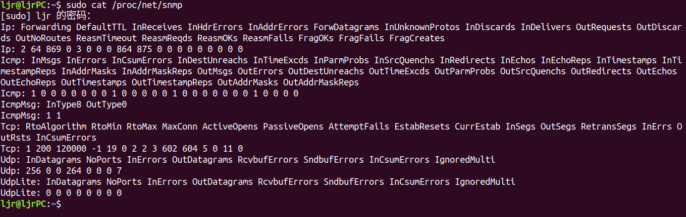
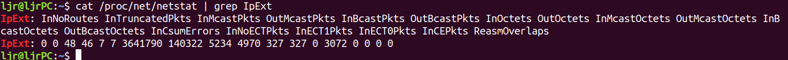
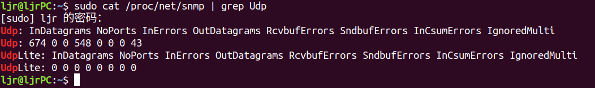
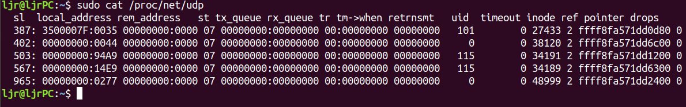

## 1. 前言
本文主要分析数据报从 IP 协议层进入协议栈，通过udp协议层，到达 socket，最终被用户程序读取的过程。在此过程中，介绍了 IP 协议层和 UDP 协议层中监测数据和网络调优的方法。
## 2. IP协议层
IP 层在函数 `inet_init` 中将自身注册到 `ptype_base` 哈希表。net/ipv4/af_inet.c:
```c
dev_add_pack(&ip_packet_type);
```
`struct packet_type` 的变量 `ip_packet_type` 定义在 net/ipv4/af_inet.c:
```c
static struct packet_type ip_packet_type __read_mostly = {
        .type = cpu_to_be16(ETH_P_IP),
        .func = ip_rcv,
};
```
`__netif_receive_skb_core` 会调用 `deliver_skb`， 后者会调用`.func` 方法(本文中就是 `ip_rcv`)。

### 2.1 ip_rcv
`ip_rcv` 方法的核心逻辑非常简单直接，此外就是一些数据合法性验证，统计计数器更新等。它在最后会以 netfilter 的方式调用 `ip_rcv_finish` 方法。这样做的目的是，任何 iptables 规则都能在 packet 刚进入 IP 层协议的时候被应用，在其他处理之前。我们可以在 `ip_rcv` 结束的时候看到交给 netfilter 的代码： net/ipv4/ip_input.c

```c
return NF_HOOK(NFPROTO_IPV4, NF_INET_PRE_ROUTING, skb, dev, NULL, ip_rcv_finish);
```

**netfilter and iptables**

这里简单介绍下 netfilter, iptables 和 conntrack。`NF_HOOK_THRESH` 会检查是否有 filter 被安装，并会适时地返回到 IP 协议层，避免过深的进入 netfilter 处理，以及在 netfilter 下面再做 hook 的 iptables 和 conntrack。netfilter 或 iptables 规则都是在软中断上下文中执行的，数量很多或规则很 复杂时会导致网络延迟。但如果确实需要一些规则的话，那这个性能损失似乎是无法避免的。

### 2.2 `ip_rcv_finish`
netfilter 完成对数据的处理之后，就会调用 `ip_rcv_finish` ，前提是 netfilter 没有丢掉这个包。`ip_rcv_finish` 开始的地方做了一个优化。为了能将包送到合适的目的地，需要一个路由子系统的 `dst_entry` 变量。为了获取这个变量，早期的代码调用了 `early_demux` 函数，从这个数据的目的端的高层协议中。`early_demux` 是一个优化项，通过检查相应的变量是否缓存在 socket 变量上，来路由这个包所需要的 `dst_entry` 变量。 net/ipv4/ip_input.c:
```c
if (sysctl_ip_early_demux && !skb_dst(skb) && skb->sk == NULL) {
	const struct net_protocol *ipprot;
	int protocol = iph->protocol;

	ipprot = rcu_dereference(inet_protos[protocol]);
	if (ipprot && ipprot->early_demux) {
		ipprot->early_demux(skb);
		/* must reload iph, skb->head might have changed */
		iph = ip_hdr(skb);
	}
}
```
可以看到，这个函数只有在 `sysctl_ip_early_demux` 为 true 的时候才有可能被执行。默认 `early_demux` 是打开的。下一节会介绍如何关闭它，以及为什么你可能会需要关闭它。

如果这个优化打开了，但是并没有命中缓存（例如，这是第一个包），这个包就会被送到内核的路由子系统，在那里将会计算出一个 `dst_entry` 并赋给相应的字段。

路由子系统完成工作后，会更新计数器，然后调用 `dst_input(skb)`，后者会进一步调用 `dst_entry` 变量中的 input 方法，这个方法是一个函数指针，有路由子系统初始化。例如 ，如果 packet 的最终目的地是本机（local system），路由子系统会将 `ip_local_deliver` 赋给 input。


### 调优: 打开或关闭 IP 协议的 early demux 选项

关闭 `early_demux` 优化：

```bash
$ sudo sysctl -w net.ipv4.ip_early_demux=0
```

默认是 1，即该功能默认是打开的。

添加这个 `sysctl` 开关的原因是，一些用户报告说，在某些场景下 `early_demux` 优化会导致 5% 左右的吞吐量下降。

### 2.3 `ip_local_deliver`

IP 协议层过程：

-  调用 `ip_rcv` 做一些初始的 bookkeeping
-  将包交给 netfilter 处理，同时还有一个回调函数，netfilter 处理完毕后会调用这个函数
-  处理结束的时候，调用 `ip_rcv_finish`，将数据包送到协议栈的更上层

`ip_local_deliver` 的逻辑与此类似：net/ipv4/ip_input.c

```c
/*
 *      Deliver IP Packets to the higher protocol layers.
 */
int ip_local_deliver(struct sk_buff *skb)
{
        /*
         *      Reassemble IP fragments.
         */

        if (ip_is_fragment(ip_hdr(skb))) {
                if (ip_defrag(skb, IP_DEFRAG_LOCAL_DELIVER))
                        return 0;
        }

        return NF_HOOK(NFPROTO_IPV4, NF_INET_LOCAL_IN, skb, skb->dev, NULL,
                       ip_local_deliver_finish);
}
```

只要 packet 没有在 netfilter 被 drop，就会调用 `ip_local_deliver_finish` 函数。

### 2.4 `ip_local_deliver_finish`

`ip_local_deliver_finish` 从数据包中读取协议，寻找注册在这个协议上的 `struct net_protocol` 变量，并调用该变量中的回调方法。这样将包送到协议栈的更上层。

### Monitoring: IP protocol layer statistics

读取`/proc/net/snmp` 获取详细的 IP 协议统计：





这个文件包含几个协议层的统计信息。先是 IP 层。

与这些列相关的，IP 层的统计类型都定义在include/uapi/linux/snmp.h：

```c
enum
{
  IPSTATS_MIB_NUM = 0,
/* frequently written fields in fast path, kept in same cache line */
  IPSTATS_MIB_INPKTS,     /* InReceives */
  IPSTATS_MIB_INOCTETS,     /* InOctets */
  IPSTATS_MIB_INDELIVERS,     /* InDelivers */
  IPSTATS_MIB_OUTFORWDATAGRAMS,   /* OutForwDatagrams */
  IPSTATS_MIB_OUTPKTS,      /* OutRequests */
  IPSTATS_MIB_OUTOCTETS,      /* OutOctets */

  /* ... */
```

读取`/proc/net/netstat` 获取更详细的 IP 层统计：





除了每列的命名都以 `IpExt` 开头之外，格式和`/proc/net/snmp` 类似。

一些有趣的统计：

- `InReceives`: The total number of IP packets that reached ip_rcv before any data integrity checks.
- `InHdrErrors`: Total number of IP packets with corrupted headers. The header was too short, too long, non-existent, had the wrong IP protocol version number, etc.
- `InAddrErrors`: Total number of IP packets where the host was unreachable.
- `ForwDatagrams`: Total number of IP packets that have been forwarded.
- `InUnknownProtos`: Total number of IP packets with unknown or unsupported protocol specified in the header.
- `InDiscards`: Total number of IP packets discarded due to memory allocation failure or checksum failure when packets are trimmed.
- `InDelivers`: Total number of IP packets successfully delivered to higher protocol layers. Keep in mind that those protocol layers may drop data even if the IP layer does not.
- `InCsumErrors`: Total number of IP Packets with checksum errors.

这些计数分别在 IP 层的不同地方被更新。由于代码一直在更新，重复计数或者计数错误的 bug 可能会引入。如果这些计数对你非常重要，强烈建议阅读内核的相应源码，确定它们是在哪里更新的，以及更新的对不对，是不是有 bug 等。


## 3. 高层协议注册

本文主要介绍 UDP 处理函数的注册过程，TCP 的注册过程与此一样，并且是在相同的时间注册的。

在 `net/ipv4/af_inet.c` 中定义了 UDP、TCP 和 ICMP 协议的回调函数相关的数据结构，IP 层处理完毕之后会调用相应的回调：net/ipv4/af_inet.c
```c
static const struct net_protocol tcp_protocol = {
        .early_demux    =       tcp_v4_early_demux,
        .handler        =       tcp_v4_rcv,
        .err_handler    =       tcp_v4_err,
        .no_policy      =       1,
        .netns_ok       =       1,
};

static const struct net_protocol udp_protocol = {
        .early_demux =  udp_v4_early_demux,
        .handler =      udp_rcv,
        .err_handler =  udp_err,
        .no_policy =    1,
        .netns_ok =     1,
};

static const struct net_protocol icmp_protocol = {
        .handler =      icmp_rcv,
        .err_handler =  icmp_err,
        .no_policy =    1,
        .netns_ok =     1,
};
```

这些变量在 `inet` 地址族初始化的时候被注册。 net/ipv4/af_inet.c:

```c
 /*
  *      Add all the base protocols.
  */

 if (inet_add_protocol(&icmp_protocol, IPPROTO_ICMP) < 0)
         pr_crit("%s: Cannot add ICMP protocol\n", __func__);
 if (inet_add_protocol(&udp_protocol, IPPROTO_UDP) < 0)
         pr_crit("%s: Cannot add UDP protocol\n", __func__);
 if (inet_add_protocol(&tcp_protocol, IPPROTO_TCP) < 0)
         pr_crit("%s: Cannot add TCP protocol\n", __func__);
```

接下来我们详细查看 UDP 协议。上面可以看到，UDP 的回调函数是 `udp_rcv`。这是从 IP 层进 入 UDP 层的入口。
## 4. UDP 协议层

UDP 协议层的实现见在net/ipv4/udp.c。
### 4.1 `udp_rcv`

这个函数只要一行，调用`__udp4_lib_rcv` 接收 UDP 报文。

### 4.2 `__udp4_lib_rcv`

`__udp4_lib_rcv` 首先对包数据进行合法性检查，获取 UDP 头、UDP 数据报长度、源地址、目标地址等信息。然后进行其他一些完整性检测和 checksum 验证。

根据前面 IP 层的内容，在送到更上面一层协议（这里是 UDP）之前，会将一个 `dst_entry` 关联到 `skb`。如果对应的 `dst_entry` 找到了，并且有对应的 socket，`__udp4_lib_rcv` 会将 packet 放到 `socket` 的接收队列：

```c
sk = skb_steal_sock(skb);
if (sk) {
	struct dst_entry *dst = skb_dst(skb);
	int ret;
	
	if (unlikely(sk->sk_rx_dst != dst))
		udp_sk_rx_dst_set(sk, dst);
	
	ret = udp_queue_rcv_skb(sk, skb);
	sock_put(sk);
	/* a return value > 0 means to resubmit the input, but
	 * it wants the return to be -protocol, or 0
	 */
	if (ret > 0)
		return -ret;
	return 0;
} else {
```

如果 `early_demux` 中没有关联 socket 信息，那此时会调用`__udp4_lib_lookup_skb` 查找对应的 socket。

以上两种情况，最后都会将 packet 放到 socket 的接收队列：

```c
ret = udp_queue_rcv_skb(sk, skb);
sock_put(sk);
```

如果 socket 没有找到，数据报(datagram)会被丢弃：

```c
/* No socket. Drop packet silently, if checksum is wrong */
if (udp_lib_checksum_complete(skb))
        goto csum_error;

UDP_INC_STATS_BH(net, UDP_MIB_NOPORTS, proto == IPPROTO_UDPLITE);
icmp_send(skb, ICMP_DEST_UNREACH, ICMP_PORT_UNREACH, 0);

/*
 * Hmm.  We got an UDP packet to a port to which we
 * don't wanna listen.  Ignore it.
 */
kfree_skb(skb);
return 0;
```

### 4.3 `udp_queue_rcv_skb`

这个函数的前面部分所做的工作：

1. 判断和这个数据报关联的 socket 是不是 encapsulation socket。如果是，将 packet 送到该层的处理函数
2. 判断这个数据报是不是 UDP-Lite 数据报，做一些完整性检测
3. 验证 UDP 数据报的校验和，如果校验失败，就丢弃

最后，我们来到了 socket 的接收队列逻辑，判断队列是不是满了，net/ipv4/udp.c：

```c
if (sk_rcvqueues_full(sk, skb, sk->sk_rcvbuf))
	goto drop;
```

### 4.4 `sk_rcvqueues_full`

定义如下：

```c
/*
 * Take into account size of receive queue and backlog queue
 * Do not take into account this skb truesize,
 * to allow even a single big packet to come.
 */
static inline bool sk_rcvqueues_full(const struct sock *sk, const struct sk_buff *skb,
                                     unsigned int limit)
{
        unsigned int qsize = sk->sk_backlog.len + atomic_read(&sk->sk_rmem_alloc);

        return qsize > limit;
}
```

Tuning these values is a bit tricky as there are many things that can be adjusted.

### 调优: Socket receive queue memory

上面看到，判断 socket 接收队列是否满了是和 `sk->sk_rcvbuf` 做比较。 这个值可以被两个 sysctl 参数控制：最大值和默认值：

```bash
$ sudo sysctl -w net.core.rmem_max=8388608

$ sudo sysctl -w net.core.rmem_default=8388608
```

可以在应用里调用 `setsockopt` 带上 `SO_RCVBUF` 来修改这个值(`sk->sk_rcvbuf`) ，能设置的最大值不能超过 `net.core.rmem_max`。

也可以 `setsockopt` 带上 `SO_RCVBUFFORCE` 来覆盖 `net.core.rmem_max`，但是执行应用的用户要有 `CAP_NET_ADMIN` 权限。

`skb_set_owner_r` 函数设置 UDP 数据包的 owner，并会更新计数器 `sk->sk_rmem_alloc`。`sk_add_backlog` 函数会更新 `sk->sk_backlog.len` 计数。

### 4.5 `udp_queue_rcv_skb`

判断 queue 未满之后，就会将数据报放到里面，net/ipv4/udp.c:

```c
bh_lock_sock(sk);
if (!sock_owned_by_user(sk))
	rc = __udp_queue_rcv_skb(sk, skb);
else if (sk_add_backlog(sk, skb, sk->sk_rcvbuf)) {
	bh_unlock_sock(sk);
	goto drop;
}
bh_unlock_sock(sk);

return rc;
```

第一步先判断有没有用户空间的程序正在这个 socket 上进行系统调用。如果没有，就可以调用`__udp_queue_rcv_skb` 将数据报放到接收队列；如果有，就调用 `sk_add_backlog` 将它放到 backlog 队列。

当用户空间程序释放在这个 socket 上的系统调用时（通过向内核调用 `release_sock`），这个数据报就从 backlog 移动到了接收队列。

### 4.7 `__udp_queue_rcv_skb`

这个函数调用 `sock_queue_rcv_skb` 将数据报送到 socket 接收队列；如果失败，更新统计计数并释放 skb。net/ipv4/udp.c:

```c
rc = sock_queue_rcv_skb(sk, skb);
if (rc < 0) {
	int is_udplite = IS_UDPLITE(sk);
	
	/* Note that an ENOMEM error is charged twice */
	if (rc == -ENOMEM)
		UDP_INC_STATS_BH(sock_net(sk), UDP_MIB_RCVBUFERRORS,is_udplite);
	
	UDP_INC_STATS_BH(sock_net(sk), UDP_MIB_INERRORS, is_udplite);
	kfree_skb(skb);
	trace_udp_fail_queue_rcv_skb(rc, sk);
	return -1;
}
```

### 4.8 Monitoring: UDP protocol layer statistics

以下文件可以获取非常有用的 UDP 统计：

```
/proc/net/snmp
/proc/net/udp
/proc/net/snmp
```

#### 监控 UDP 协议统计：`/proc/net/snmp`





Much like the detailed statistics found in this file for the IP protocol, you will need to read the protocol layer source to determine exactly when and where these values are incremented.


>- InDatagrams: Incremented when recvmsg was used by a userland program to read datagram. Also incremented when a UDP packet is encapsulated and sent back for processing.
>- NoPorts: Incremented when UDP packets arrive destined for a port where no program is listening.
>- InErrors: Incremented in several cases: no memory in the receive queue, when a bad checksum is seen, and if sk_add_backlog fails to add the datagram.
>- OutDatagrams: Incremented when a UDP packet is handed down without error to the IP protocol layer to be sent.
>- RcvbufErrors: Incremented when sock_queue_rcv_skb reports that no memory is available; this happens if sk->sk_rmem_alloc is greater than or equal to sk->sk_rcvbuf.
>- SndbufErrors: Incremented if the IP protocol layer reported an error when trying to send the packet and no error queue has been setup. Also incremented if no send queue space or kernel memory are available.
>- InCsumErrors: Incremented when a UDP checksum failure is detected. Note that in all cases I could find, InCsumErrors is incrememnted at the same time as InErrors. Thus, InErrors - InCsumErros should yield the count of memory related errors on the receive side.


#### 监控 UDP socket 统计：`/proc/net/udp`





The first line describes each of the fields in the lines following:

- `sl`: Kernel hash slot for the socket
- `local_address`: Hexadecimal local address of the socket and port number, separated by :.
- `rem_address`: Hexadecimal remote address of the socket and port number, separated by :.
- `st`: The state of the socket. Oddly enough, the UDP protocol layer seems to use some TCP socket states. In the example above, 7 is TCP_CLOSE.
- `tx_queue`: The amount of memory allocated in the kernel for outgoing UDP datagrams.
- `rx_queue`: The amount of memory allocated in the kernel for incoming UDP datagrams.
- `tr`, tm->when, retrnsmt: These fields are unused by the UDP protocol layer.
- `uid`: The effective user id of the user who created this socket.
- `timeout`: Unused by the UDP protocol layer.
- `inode`: The inode number corresponding to this socket. You can use this to help you determine which user process has this socket open. Check /proc/[pid]/fd, which will contain symlinks to socket[:inode].
- `ref`: The current reference count for the socket.
- `pointer`: The memory address in the kernel of the struct sock.
- `drops`: The number of datagram drops associated with this socket. Note that this does not include any drops related to sending datagrams (on corked UDP sockets or otherwise); this is only incremented in receive paths as of the kernel version examined by this blog post.

打印这些信息的代码见net/ipv4/udp.c。


## 5. 将数据放到 socket 队列

网络数据通过 `sock_queue_rcv` 进入 socket 的接收队列。这个函数在将数据报最终送到接收队列之前，会做几件事情：

- 检查 socket 已分配的内存，如果超过了 receive buffer 的大小，丢弃这个包并更新计数
-  应用 `sk_filter`，这允许 BPF（Berkeley Packet Filter）过滤器在 socket 上被应用
-  执行 `sk_rmem_scedule`，确保有足够大的 receive buffer 接收这个数据报
-  执行 `skb_set_owner_r`，这会计算数据报的长度并更新 `sk->sk_rmem_alloc` 计数
-  调用`__skb_queue_tail` 将数据加到队列尾端

最后，所有在这个 socket 上等待数据的进程都收到一个通知，通过 `sk_data_ready` 通知处理函数。

## 6. 总结

文章通过分析数据报从 IP 协议层进入协议栈，经过udp协议层，到达 socket，最终被用户程序读取的过程，分析了内核网络相关代码。了解这一过程，有助于我们更细粒度的进行数据监测和网络调优。

参考链接：

https://www.cnblogs.com/zmkeil/archive/2013/05/01/3053545.html

https://blog.packagecloud.io/eng/2016/06/22/monitoring-tuning-linux-networking-stack-receiving-data/

