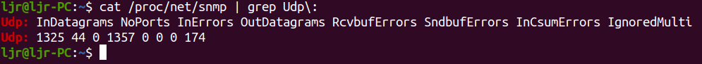
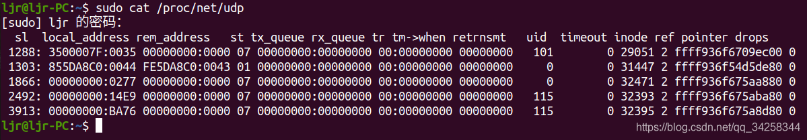

# 1. 前言
本文分享了Linux内核网络数据包发送在UDP协议层的处理，主要分析了`udp_sendmsg`和`udp_send_skb`函数，并分享了UDP层的数据统计和监控以及socket发送队列大小的调优。
# 2. `udp_sendmsg`

这个函数定义在 net/ipv4/udp.c，函数很长，分段来看。

## 2.1 UDP corking

在变量声明和基本错误检查之后，`udp_sendmsg` 所做的第一件事就是检查 socket 是否“ 塞住”了（corked）。 UDP corking 是一项优化技术，允许内核将多次数据累积成单个数据报发送。在用户程序中有两种方法可以启用此选项：

- 使用 `setsockopt` 系统调用设置 socket 的 `UDP_CORK` 选项
- 程序调用 `send`，`sendto` 或 `sendmsg` 时，带 `MSG_MORE` 参数

`udp_sendmsg` 代码检查 `up->pending` 以确定 socket 当前是否已被塞住(corked)，如果是， 则直接跳到 `do_append_data` 进行数据追加(append)。 

```c
int udp_sendmsg(struct kiocb *iocb, struct sock *sk, struct msghdr *msg,
                size_t len)
{

    /* variables and error checking ... */

  fl4 = &inet->cork.fl.u.ip4;
  if (up->pending) {
          /*
           * There are pending frames.
           * The socket lock must be held while it's corked.
           */
          lock_sock(sk);
          if (likely(up->pending)) {
                  if (unlikely(up->pending != AF_INET)) {
                          release_sock(sk);
                          return -EINVAL;
                  }
                  goto do_append_data;
          }
          release_sock(sk);
  }
```

## 2.2 获取目的 IP 地址和端口
接下来获取目的 IP 地址和端口，有两个可能的来源：

-  如果之前 socket 已经建立连接，那 socket 本身就存储了目标地址
-  地址通过辅助结构（`struct msghdr`）传入，正如我们在 `sendto` 的内核代码中看到的那样

具体逻辑：

```c
/*
 *      Get and verify the address.
 */
  if (msg->msg_name) {
          struct sockaddr_in *usin = (struct sockaddr_in *)msg->msg_name;
          if (msg->msg_namelen < sizeof(*usin))
                  return -EINVAL;
          if (usin->sin_family != AF_INET) {
                  if (usin->sin_family != AF_UNSPEC)
                          return -EAFNOSUPPORT;
          }

          daddr = usin->sin_addr.s_addr;
          dport = usin->sin_port;
          if (dport == 0)
                  return -EINVAL;
  } else {
          if (sk->sk_state != TCP_ESTABLISHED)
                  return -EDESTADDRREQ;
          daddr = inet->inet_daddr;
          dport = inet->inet_dport;
          /* Open fast path for connected socket.
             Route will not be used, if at least one option is set.
           */
          connected = 1;
  }
```

UDP 代码中出现了 `TCP_ESTABLISHED`！ UDP socket 的状态使用了 TCP 状态来描述。上面的代码显示了内核如何解析该变量以便设置 `daddr` 和 `dport`。

如果没有 `struct msghdr` 变量，内核函数到达 `udp_sendmsg` 函数时，会从 socket 本身检索目的地址和端口，并将 socket 标记为“已连接”。

## 2.3 Socket 发送：bookkeeping 和打时间戳

接下来，获取存储在 socket 上的源地址、设备索引（device index）和时间戳选项（例如`SOCK_TIMESTAMPING_TX_HARDWARE`, `SOCK_TIMESTAMPING_TX_SOFTWARE`, `SOCK_WIFI_STATUS`）：

```c
ipc.addr = inet->inet_saddr;

ipc.oif = sk->sk_bound_dev_if;

sock_tx_timestamp(sk, &ipc.tx_flags);
```

## 2.4 辅助消息（Ancillary messages）

除了发送或接收数据包之外，`sendmsg` 和 `recvmsg` 系统调用还允许用户设置或请求辅助数据。用户程序可以通过将请求信息组织成 `struct msghdr` 类型变量来利用此辅助数据。一些辅助数据类型记录在[IP man page](http://man7.org/linux/man-pages/man7/ip.7.html)中 。

辅助数据的一个常见例子是 `IP_PKTINFO`。对于 `sendmsg`，`IP_PKTINFO` 允许程序在发送数据时设置一个 `in_pktinfo` 变量。程序可以通过填写 `struct in_pktinfo` 变量中的字段来指定要在 packet 上使用的源地址。如果程序是监听多个 IP 地址的服务端程序，那这是一个很有用的选项。在这种情况下，服务端可能想使用客户端连接服务端的那个 IP 地址来回复客户端，`IP_PKTINFO` 非常适合这种场景。

`setsockopt` 可以在**socket 级别**设置发送包的 IP_TTL和 IP_TOS。而辅助消息允许在每个**数据包级别**设置 TTL 和 TOS 值。Linux 内核会使用一个数组将 TOS 转换为优先级，后者会影响数据包如何以及何时从 qdisc 中发送出去。

可以看到内核如何在 UDP socket 上处理 `sendmsg` 的辅助消息：

```c
if (msg->msg_controllen) {
        err = ip_cmsg_send(sock_net(sk), msg, &ipc,
                           sk->sk_family == AF_INET6);
        if (err)
                return err;
        if (ipc.opt)
                free = 1;
        connected = 0;
}
```

解析辅助消息的工作是由 `ip_cmsg_send` 完成的，定义在 net/ipv4/ip_sockglue.c 。传递一个未初始化的辅助数据，将会把这个 socket 标记为“未建立连接的”。
## 2.5 设置自定义 IP 选项

接下来，`sendmsg` 将检查用户是否通过辅助消息设置了的任何自定义 IP 选项。如果设置了 ，将使用这些自定义值；如果没有，那就使用 socket 中（已经在用）的参数：

```c
if (!ipc.opt) {
        struct ip_options_rcu *inet_opt;

        rcu_read_lock();
        inet_opt = rcu_dereference(inet->inet_opt);
        if (inet_opt) {
                memcpy(&opt_copy, inet_opt,
                       sizeof(*inet_opt) + inet_opt->opt.optlen);
                ipc.opt = &opt_copy.opt;
        }
        rcu_read_unlock();
}
```

接下来，该函数检查是否设置了源记录路由（source record route, SRR）IP 选项。 SRR 有两种类型：宽松源记录路由和严格源记录路由。 如果设置了此选项，则会记录第一跳地址并将其保存到 `faddr`，并将 socket 标记为“未连接”。 这将在后面用到：

```c
ipc.addr = faddr = daddr;

if (ipc.opt && ipc.opt->opt.srr) {
        if (!daddr)
                return -EINVAL;
        faddr = ipc.opt->opt.faddr;
        connected = 0;
}
```

处理完 SRR 选项后，将处理 TOS 选项，这可以从辅助消息中获取，或者从 socket 当前值中获取。 然后检查：

1. 是否（使用 `setsockopt`）在 socket 上设置了 `SO_DONTROUTE`，或
2. 是否（调用 `sendto` 或 `sendmsg` 时）指定了 `MSG_DONTROUTE` 标志，或
3. 是否已设置了 `is_strictroute`，表示需要严格的 SRR
任何一个为真，`tos` 字段的 `RTO_ONLINK` 位将置 1，并且 socket 被视为“未连接”：

```c
tos = get_rttos(&ipc, inet);
if (sock_flag(sk, SOCK_LOCALROUTE) ||
    (msg->msg_flags & MSG_DONTROUTE) ||
    (ipc.opt && ipc.opt->opt.is_strictroute)) {
        tos |= RTO_ONLINK;
        connected = 0;
}
```

## 2.6 多播或单播（Multicast or unicast）

接下来代码开始处理 multicast。这有点复杂，因为用户可以通过 `IP_PKTINFO` 辅助消息 来指定发送包的源地址或设备号，如前所述。

如果目标地址是多播地址：

1. 将多播设备（device）的索引（index）设置为发送（写）这个 packet 的设备索引，并且
2. packet 的源地址将设置为 multicast 源地址

如果目标地址不是一个组播地址，则发送 packet 的设备制定为 `inet->uc_index`（单播）， 除非用户使用 `IP_PKTINFO` 辅助消息覆盖了它。

```c
if (ipv4_is_multicast(daddr)) {
        if (!ipc.oif)
                ipc.oif = inet->mc_index;
        if (!saddr)
                saddr = inet->mc_addr;
        connected = 0;
} else if (!ipc.oif)
        ipc.oif = inet->uc_index;
```

## 2.7 路由

现在开始路由，UDP 层中处理路由的代码以**快速路径**（fast path）开始。 如果 socket 已连接，则直接尝试获取路由：

```c
if (connected)
        rt = (struct rtable *)sk_dst_check(sk, 0);
```

如果 socket 未连接，或者虽然已连接，但路由辅助函数 `sk_dst_check` 认定路由已过期，则代码将进入**慢速路径**（slow path）以生成一条路由记录。首先调用 `flowi4_init_output` 构造一个描述此 UDP 流的变量：

```c
if (rt == NULL) {
        struct net *net = sock_net(sk);

        fl4 = &fl4_stack;
        flowi4_init_output(fl4, ipc.oif, sk->sk_mark, tos,
                           RT_SCOPE_UNIVERSE, sk->sk_protocol,
                           inet_sk_flowi_flags(sk)|FLOWI_FLAG_CAN_SLEEP,
                           faddr, saddr, dport, inet->inet_sport);
```

然后，socket 及其 flow 实例会传递给安全子系统，这样 SELinux 或 SMACK 这样的系统就可以在 flow 实例上设置安全 ID。 接下来，`ip_route_output_flow` 将调用 IP 路由代码，创建一个路由实例：

```c
security_sk_classify_flow(sk, flowi4_to_flowi(fl4));
rt = ip_route_output_flow(net, fl4, sk);
```

如果创建路由实例失败，并且返回码是 `ENETUNREACH`, 则 `OUTNOROUTES` 计数器将会加 1。

```c
if (IS_ERR(rt)) {
  err = PTR_ERR(rt);
  rt = NULL;
  if (err == -ENETUNREACH)
    IP_INC_STATS(net, IPSTATS_MIB_OUTNOROUTES);
  goto out;
}
```

这些统计计数器所在的源文件、其他可用的计数器及其含义，将在下面的 UDP 监控部分分享。

接下来，如果是广播路由，但 socket 的 `SOCK_BROADCAST` 选项未设置，则处理过程终止。 如果 socket 被视为“已连接”，则路由实例将缓存到 socket 上：

```c
err = -EACCES;
if ((rt->rt_flags & RTCF_BROADCAST) &&
    !sock_flag(sk, SOCK_BROADCAST))
        goto out;
if (connected)
        sk_dst_set(sk, dst_clone(&rt->dst));
```

## 2.8 `MSG_CONFIRM`: 阻止 ARP 缓存过期

如果调用 `send`, `sendto` 或 `sendmsg` 的时候指定了 `MSG_CONFIRM` 参数，UDP 协议层将会如下处理：

```c
  if (msg->msg_flags&MSG_CONFIRM)
          goto do_confirm;
back_from_confirm:
```

该标志提示系统去确认一下 ARP 缓存条目是否仍然有效，防止其被垃圾回收。 `do_confirm` 标签位于此函数末尾处：

```c
do_confirm:
        dst_confirm(&rt->dst);
        if (!(msg->msg_flags&MSG_PROBE) || len)
                goto back_from_confirm;
        err = 0;
        goto out;
```

`dst_confirm` 函数只是在相应的缓存条目上设置一个标记位，稍后当查询邻居缓存并找到 条目时将检查该标志，我们后面一些会看到。此功能通常用于 UDP 网络应用程序，以减少不必要的 ARP 流量。此代码确认缓存条目然后跳回 `back_from_confirm` 标签。一旦 `do_confirm` 代码跳回到 `back_from_confirm`（或者之前就没有执行到 `do_confirm` ），代码接下来将处理 UDP cork 和 uncorked 情况。

## 2.9 uncorked UDP sockets 快速路径：准备待发送数据

如果不需要 corking，数据就可以封装到一个 `struct sk_buff` 实例中并传递给 `udp_send_skb`，离 IP 协议层更进了一步。这是通过调用 `ip_make_skb` 来完成的。

先前通过调用 `ip_route_output_flow` 生成的路由条目也会一起传进来， 它将保存到 skb 里。

```c
/* Lockless fast path for the non-corking case. */
if (!corkreq) {
        skb = ip_make_skb(sk, fl4, getfrag, msg->msg_iov, ulen,
                          sizeof(struct udphdr), &ipc, &rt,
                          msg->msg_flags);
        err = PTR_ERR(skb);
        if (!IS_ERR_OR_NULL(skb))
                err = udp_send_skb(skb, fl4);
        goto out;
}
```

`ip_make_skb` 函数将创建一个 skb，其中需要考虑到很多的事情，例如：

1. MTU
2. UDP corking（如果启用）
3. UDP Fragmentation Offloading（UFO）
4. Fragmentation（分片）：如果硬件不支持 UFO，但是要传输的数据大于 MTU，需要软件做分片

大多数网络设备驱动程序不支持 UFO，因为网络硬件本身不支持此功能。我们来看下这段代码，先看 corking 禁用的情况。

### 2.9.1 `ip_make_skb`

定义在net/ipv4/ip_output.c，这个函数有点复杂。

构建 skb 的时候，`ip_make_skb` 依赖的底层代码需要使用一个 corking 变量和一个 queue 变量 ，skb 将通过 queue 变量传入。如果 socket 未被 cork，则会传入一个假的 corking 变量和一个空队列。

现在来看看假 corking 变量和空队列是如何初始化的：

```c
struct sk_buff *ip_make_skb(struct sock *sk, /* more args */)
{
        struct inet_cork cork;
        struct sk_buff_head queue;
        int err;

        if (flags & MSG_PROBE)
                return NULL;

        __skb_queue_head_init(&queue);

        cork.flags = 0;
        cork.addr = 0;
        cork.opt = NULL;
        err = ip_setup_cork(sk, &cork, /* more args */);
        if (err)
                return ERR_PTR(err);
```

如上所示，cork 和 queue 都是在栈上分配的，`ip_make_skb` 根本不需要它。 `ip_setup_cork` 初始化 cork 变量。接下来，调用`__ip_append_data` 并传入 cork 和 queue 变 量：

```c
err = __ip_append_data(sk, fl4, &queue, &cork,
                       &current->task_frag, getfrag,
                       from, length, transhdrlen, flags);
```

我们将在后面看到这个函数是如何工作的，因为不管 socket 是否被 cork，最后都会执行它。

现在，我们只需要知道`__ip_append_data` 将创建一个 skb，向其追加数据，并将该 skb 添加 到传入的 queue 变量中。如果追加数据失败，则调用`__ip_flush_pending_frame` 丢弃数据 并向上返回错误（指针类型）：

```c
if (err) {
        __ip_flush_pending_frames(sk, &queue, &cork);
        return ERR_PTR(err);
}
```

最后，如果没有发生错误，`__ip_make_skb` 将 skb 出队，添加 IP 选项，并返回一个准备好传递给更底层发送的 skb：

```c
return __ip_make_skb(sk, fl4, &queue, &cork);
```

### 2.9.2 发送数据

如果没有错误，skb 就会交给 `udp_send_skb`，后者会继续将其传给下一层协议，IP 协议：

```c
err = PTR_ERR(skb);
if (!IS_ERR_OR_NULL(skb))
        err = udp_send_skb(skb, fl4);
goto out;
```

如果有错误，错误计数就会有相应增加。后面的“错误计数”部分会详细介绍。

## 2.10 没有被 cork 的数据时的慢路径

如果使用了 UDP corking，但之前没有数据被 cork，则慢路径开始：

1. 对 socket 加锁
2. 检查应用程序是否有 bug：已经被 cork 的 socket 是否再次被 cork
3. 设置该 UDP flow 的一些参数，为 corking 做准备
4. 将要发送的数据追加到现有数据

`udp_sendmsg` 代码继续向下看，就是这一逻辑：

```c
  lock_sock(sk);
  if (unlikely(up->pending)) {
          /* The socket is already corked while preparing it. */
          /* ... which is an evident application bug. --ANK */
          release_sock(sk);

          LIMIT_NETDEBUG(KERN_DEBUG pr_fmt("cork app bug 2\n"));
          err = -EINVAL;
          goto out;
  }
  /*
   *      Now cork the socket to pend data.
   */
  fl4 = &inet->cork.fl.u.ip4;
  fl4->daddr = daddr;
  fl4->saddr = saddr;
  fl4->fl4_dport = dport;
  fl4->fl4_sport = inet->inet_sport;
  up->pending = AF_INET;

do_append_data:
  up->len += ulen;
  err = ip_append_data(sk, fl4, getfrag, msg->msg_iov, ulen,
                       sizeof(struct udphdr), &ipc, &rt,
                       corkreq ? msg->msg_flags|MSG_MORE : msg->msg_flags);
```

### 2.10.1 `ip_append_data`

这个函数简单封装了`__ip_append_data`，在调用后者之前，做了两件重要的事情：

1. 检查是否从用户传入了 `MSG_PROBE` 标志。该标志表示用户不想真正发送数据，只是做路径探测（例如，确定PMTU）
2. 检查 socket 的发送队列是否为空。如果为空，意味着没有 cork 数据等待处理，因此调用 `ip_setup_cork` 来设置 corking

一旦处理了上述条件，就调用`__ip_append_data` 函数，该函数包含用于将数据处理成数据包的大量逻辑。

### 2.10.2 `__ip_append_data`

如果 socket 是 corked，则从 `ip_append_data` 调用此函数；如果 socket 未被 cork，则从 `ip_make_skb` 调用此函数。在任何一种情况下，函数都将分配一个新缓冲区来存储传入的数据，或者将数据附加到现有数据中。这种工作的方式围绕 socket 的发送队列。等待发送的现有数据（例如，如果 socket 被 cork） 将在队列中有一个对应条目，可以被追加数据。

这个函数很复杂，它执行很多计算以确定如何构造传递给下面的网络层的 skb。

该函数的重点包括：

1. 如果硬件支持，则处理 UDP Fragmentation Offload（UFO）。绝大多数网络硬件不支持 UFO。如果你的网卡驱动程序支持它，它将设置 `NETIF_F_UFO` 标记位
2. 处理支持分散/收集（ scatter/gather）IO 的网卡。许多 卡都支持此功能，并使用 `NETIF_F_SG` 标志进行通告。支持该特性的网卡可以处理数据 被分散到多个 buffer 的数据包;内核不需要花时间将多个缓冲区合并成一个缓冲区中。避 免这种额外的复制会提升性能，大多数网卡都支持此功能
3. 通过调用 `sock_wmalloc` 跟踪发送队列的大小。当分配新的 skb 时，skb 的大小由创建它 的 socket 计费（charge），并计入 socket 发送队列的已分配字节数。如果发送队列已经 没有足够的空间（超过计费限制），则 skb 并分配失败并返回错误。我们将在下面的调优部分中看到如何设置 socket 发送队列大小（txqueuelen）
4. 更新错误统计信息。此函数中的任何错误都会增加“discard”计数。我们将在下面的监控部分中看到如何读取此值

函数执行成功后返回 0，以及一个适用于网络设备传输的 skb。

- 在 unorked 情况下，持有 skb 的 queue 被作为参数传递给上面描述的`__ip_make_skb`，在那里 它被出队并通过 `udp_send_skb` 发送到更底层。

- 在 cork 的情况下，`__ip_append_data` 的返回值向上传递。数据位于发送队列中，直到 `udp_sendmsg` 确定是时候调用 `udp_push_pending_frames` 来完成 skb，后者会进一步调用 `udp_send_skb`。

### 2.10.3 Flushing corked sockets

现在，`udp_sendmsg` 会继续，检查`__ip_append_skb` 的返回值（错误码）：

```c
if (err)
        udp_flush_pending_frames(sk);
else if (!corkreq)
        err = udp_push_pending_frames(sk);
else if (unlikely(skb_queue_empty(&sk->sk_write_queue)))
        up->pending = 0;
release_sock(sk);
```

我们来看看每个情况：

1. 如果出现错误（错误为非零），则调用 `udp_flush_pending_frames`，这将取消 cork 并从 socket 的发送队列中删除所有数据
2. 如果在未指定 `MSG_MORE` 的情况下发送此数据，则调用 `udp_push_pending_frames`，它将数据传递到更下面的网络层
3. 如果发送队列为空，请将 socket 标记为不再 cork

如果追加操作完成并且有更多数据要进入 cork，则代码将做一些清理工作，并返回追加数据的长度：

```c
ip_rt_put(rt);
if (free)
        kfree(ipc.opt);
if (!err)
        return len;
```

这就是内核如何处理 corked UDP sockets 的。

## 2.11 Error accounting

如果：

1. non-corking 快速路径创建 skb 失败，或 `udp_send_skb` 返回错误，或
2. `ip_append_data` 无法将数据附加到 corked UDP socket，或
3. 当 `udp_push_pending_frames` 调用 `udp_send_skb` 发送 corked skb 时后者返回错误

仅当返回的错误是 `ENOBUFS`（内核无可用内存）或 socket 已设置 `SOCK_NOSPACE`（发送队列已满）时，`SNDBUFERRORS` 统计信息才会增加：

```c
/*
 * ENOBUFS = no kernel mem, SOCK_NOSPACE = no sndbuf space.  Reporting
 * ENOBUFS might not be good (it's not tunable per se), but otherwise
 * we don't have a good statistic (IpOutDiscards but it can be too many
 * things).  We could add another new stat but at least for now that
 * seems like overkill.
 */
if (err == -ENOBUFS || test_bit(SOCK_NOSPACE, &sk->sk_socket->flags)) {
        UDP_INC_STATS_USER(sock_net(sk),
                        UDP_MIB_SNDBUFERRORS, is_udplite);
}
return err;
```

我们接下来会在后面的数据监控里看到如何读取这些计数。


# 3. `udp_send_skb`

`udp_sendmsg` 通过调用 `udp_send_skb` 函数将 skb 送到下一网络层，在本文中是 IP 协议层。 这个函数做了一些重要的事情：

1. 向 skb 添加 UDP 头
2. 处理校验和：软件校验和，硬件校验和或无校验和（如果禁用）
3. 调用 `ip_send_skb` 将 skb 发送到 IP 协议层
4. 更新发送成功或失败的统计计数器

首先，创建 UDP 头：

```c
static int udp_send_skb(struct sk_buff *skb, struct flowi4 *fl4)
{
                /* useful variables ... */

        /*
         * Create a UDP header
         */
        uh = udp_hdr(skb);
        uh->source = inet->inet_sport;
        uh->dest = fl4->fl4_dport;
        uh->len = htons(len);
        uh->check = 0;
```

接下来，处理校验和。有几种情况：

1. 首先处理 UDP-Lite 校验和
2. 接下来，如果 socket 校验和选项被关闭（`setsockopt` 带 `SO_NO_CHECK` 参数），它将被标记为校 验和关闭
3. 接下来，如果硬件支持 UDP 校验和，则将调用 `udp4_hwcsum` 来设置它。请注意，如果数 据包是分段的，内核将在软件中生成校验和，可以在 udp4_hwcsum 的源代码中看到这一点
4. 最后，通过调用 `udp_csum` 生成软件校验和

```c
if (is_udplite)                                  /*     UDP-Lite      */
        csum = udplite_csum(skb);

else if (sk->sk_no_check == UDP_CSUM_NOXMIT) {   /* UDP csum disabled */

        skb->ip_summed = CHECKSUM_NONE;
        goto send;

} else if (skb->ip_summed == CHECKSUM_PARTIAL) { /* UDP hardware csum */

        udp4_hwcsum(skb, fl4->saddr, fl4->daddr);
        goto send;

} else
        csum = udp_csum(skb);
```

接下来，添加了伪头 ：

```c
uh->check = csum_tcpudp_magic(fl4->saddr, fl4->daddr, len,
                              sk->sk_protocol, csum);
if (uh->check == 0)
        uh->check = CSUM_MANGLED_0;
```

如果校验和为 0，则根据 RFC 768，校验为全 1（ transmitted as all ones (the equivalent in one’s complement arithmetic)）。最后，将 skb 传递给 IP 协议层并增加统计计数：

```c
send:
  err = ip_send_skb(sock_net(sk), skb);
  if (err) {
          if (err == -ENOBUFS && !inet->recverr) {
                  UDP_INC_STATS_USER(sock_net(sk),
                                     UDP_MIB_SNDBUFERRORS, is_udplite);
                  err = 0;
          }
  } else
          UDP_INC_STATS_USER(sock_net(sk),
                             UDP_MIB_OUTDATAGRAMS, is_udplite);
  return err;
```

如果 `ip_send_skb` 成功，将更新 `OUTDATAGRAMS` 统计。如果 IP 协议层报告错误，并且错误 是 `ENOBUFS`（内核缺少内存）而且错误 queue（`inet->recverr`）没有启用，则更新 `SNDBUFERRORS`。

接下来看看如何在 Linux 内核中监视和调优 UDP 协议层。


# 4. 监控：UDP 层统计

两个非常有用的获取 UDP 协议统计文件：

- `/proc/net/snmp`
- `/proc/net/udp`

## 4.1 /proc/net/snmp

监控 UDP 协议层统计：

```
cat /proc/net/snmp | grep Udp\:
```


要准确地理解这些计数，需要仔细地阅读内核代码。一些类型的错误计数并不是只出现在一种计数中，而可能是出现在多个计数中。

- `InDatagrams`: Incremented when recvmsg was used by a userland program to read datagram. Also incremented when a UDP packet is encapsulated and sent back for processing.
- `NoPorts`: Incremented when UDP packets arrive destined for a port where no program is listening.
- `InErrors`: Incremented in several cases: no memory in the receive queue, when a bad checksum is seen, and if sk_add_backlog fails to add the datagram.
- `OutDatagrams`: Incremented when a UDP packet is handed down without error to the IP protocol layer to be sent.
- `RcvbufErrors`: Incremented when sock_queue_rcv_skb reports that no memory is available; this happens if sk->sk_rmem_alloc is greater than or equal to sk->sk_rcvbuf.
- `SndbufErrors`: Incremented if the IP protocol layer reported an error when trying to send the packet and no error queue has been setup. Also incremented if no send queue space or kernel memory are available.
- `InCsumErrors`: Incremented when a UDP checksum failure is detected. Note that in all cases I could find, InCsumErrors is incremented at the same time as InErrors. Thus, InErrors - InCsumErros should yield the count of memory related errors on the receive side.

UDP 协议层发现的某些错误会出现在其他协议层的统计信息中。一个例子：路由错误 。 `udp_sendmsg` 发现的路由错误将导致 IP 协议层的 `OutNoRoutes` 统计增加。

## 4.2 /proc/net/udp

监控 UDP socket 统计：

```
cat /proc/net/udp
```


每一列的意思：

- `sl`: Kernel hash slot for the socket
- `local_address`: Hexadecimal local address of the socket and port number, separated by :.
- `rem_address`: Hexadecimal remote address of the socket and port number, separated by :.
- `st`: The state of the socket. Oddly enough, the UDP protocol layer seems to use some TCP socket states. In the example above, 7 is TCP_CLOSE.
- `tx_queue`: The amount of memory allocated in the kernel for outgoing UDP datagrams.
- `rx_queue`: The amount of memory allocated in the kernel for incoming UDP datagrams.
- `tr`, tm->when, retrnsmt: These fields are unused by the UDP protocol layer.
- `uid`: The effective user id of the user who created this socket.
- `timeout`: Unused by the UDP protocol layer.
- `inode`: The inode number corresponding to this socket. You can use this to help you determine which user process has this socket open. Check /proc/[pid]/fd, which will contain symlinks to socket[:inode].
- `ref`: The current reference count for the socket.
- `pointer`: The memory address in the kernel of the struct sock.
- `drops`: The number of datagram drops associated with this socket. Note that this does not include any drops related to sending datagrams (on corked UDP sockets or otherwise); this is only incremented in receive paths as of the kernel version examined by this blog post.

打印这些计数的代码在net/ipv4/udp.c。


# 5. 调优：socket 发送队列内存大小

发送队列（也叫“写队列”）的最大值可以通过设置 `net.core.wmem_max sysctl` 进行修改。

```
$ sudo sysctl -w net.core.wmem_max=8388608
```

`sk->sk_write_queue` 用 `net.core.wmem_default` 初始化， 这个值也可以调整。

调整初始发送 buffer 大小：

```
$ sudo sysctl -w net.core.wmem_default=8388608
```

也可以通过从应用程序调用 `setsockopt` 并传递 `SO_SNDBUF` 来设置 `sk->sk_write_queue` 。通过 `setsockopt` 设置的最大值是 `net.core.wmem_max`。

不过，可以通过 `setsockopt` 并传递 `SO_SNDBUFFORCE` 来覆盖 `net.core.wmem_max` 限制， 这需要 `CAP_NET_ADMIN` 权限。

每次调用`__ip_append_data` 分配 skb 时，`sk->sk_wmem_alloc` 都会递增。正如我们所看到 的，UDP 数据报传输速度很快，通常不会在发送队列中花费太多时间。

# 6. 总结
本文重点分析了数据包在传输层（UDP协议）的发送过程，并进行了监控和调优，后面数据包将到达 IP 协议层，下次再分享，感谢阅读。

Reference：https://blog.packagecloud.io/eng/2017/02/06/monitoring-tuning-linux-networking-stack-sending-data
