# 1. 前言

熟悉数据包的接收流程，有助于帮助我们明白在内核哪些地方可以监控和修改数据包，帮助我们明白什么情况下数据包可能会被丢弃等。本文先简单介绍数据包的收包流程，然后使用dropwatch工具收集并查看Linux内核网络中丢包的数量和位置，使用perf监控Linux内核网络丢弃的数据包。

# 2. 数据包收包过程

## 2.1 数据包收包宏观过程：

- 首先网络报文通过物理网线发送到网卡
- 网络驱动程序会把网络中的报文读出来放到 `ring buffer` 中，这个过程使用 DMA（Direct Memory Access）将数据包映射到内存中，且不需要 CPU 参与
- 内核从 `ring buffer` 中读取报文进行处理，执行 IP 和 TCP/UDP 层的逻辑，最后把报文放到应用程序的 `socket buffer` 中
- 应用程序从 socket buffer 中读取报文进行处理

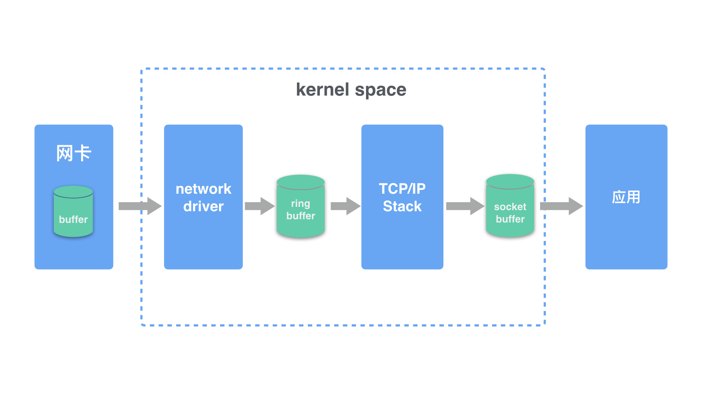

## 2.2 数据包收包较详细过程：

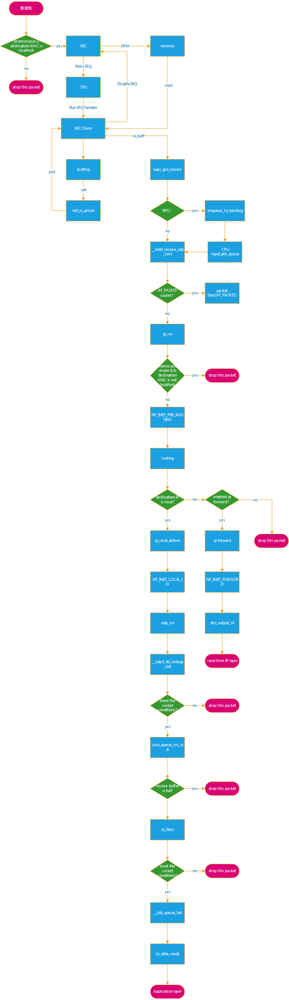

由以上可以看到，在Linux内核网络中，发生丢包的地方特别多，下面就使用两个工具来监控Linux内核网络中的丢包数据。

# 3. dropwatch工具

下面将安装并使用dropwatch工具，来收集并查看Linux内核网络中丢包的数量和位置。
## 3.1 安装dropwatch
```bash
sudo apt-get install -y libnl-3-dev libnl-genl-3-dev binutils-dev libreadline6-dev
```
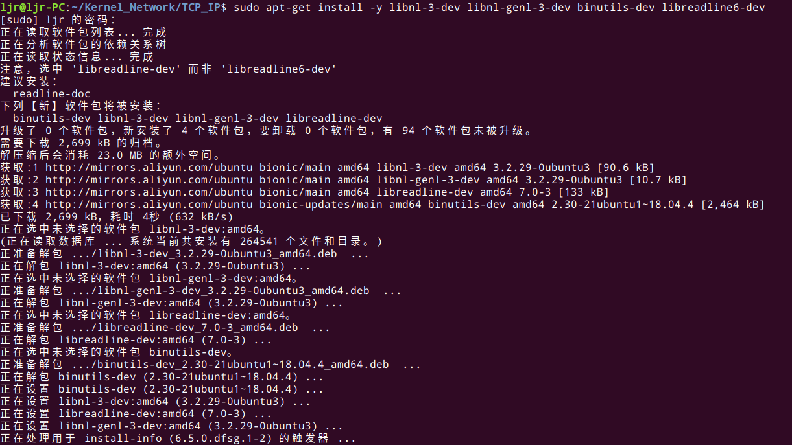

```bash
git clone https://github.com/pavel-odintsov/drop_watch.git
```
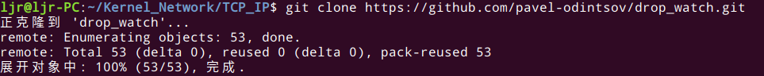

进入`/drop_watch/src`目录后执行`make`:

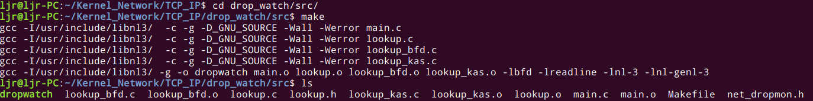

## 3.2 使用dropwatch
dropwatch安装完成后使用以下命令运行：
```bash
sudo ./dropwatch -l kas
```
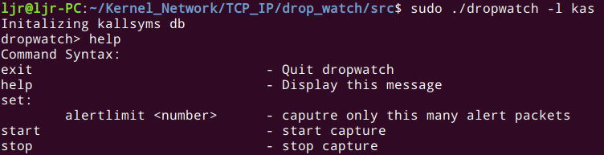

使用以下命令开始收集丢包信息：
```bash
start
```
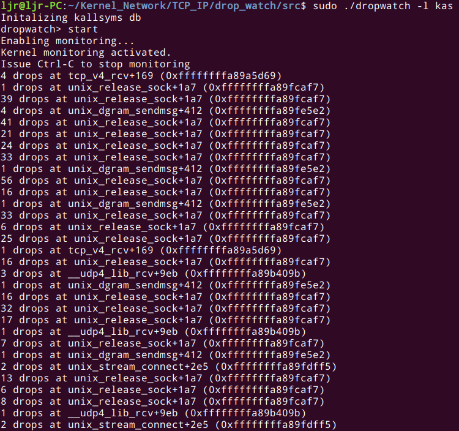

可以看到丢包的数量和丢包发生的位置都已经被收集并显示出来了。

# 4. perf

下面将使用perf监控Linux内核网络丢弃的数据包，如果还没有安装perf，请先按一下步骤安装：

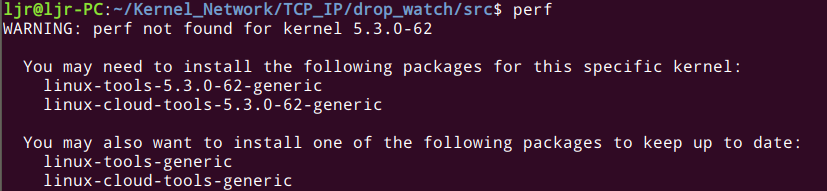

根据提示，安装所需的依赖，要注意的是，内核版本不同，安装命令略有差异：

```bash
sudo apt install linux-tools-5.3.0-62-generic
```
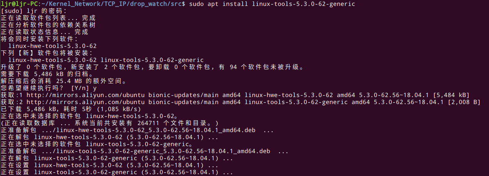

```bash
sudo apt install linux-cloud-tools-5.3.0-62-generic
```
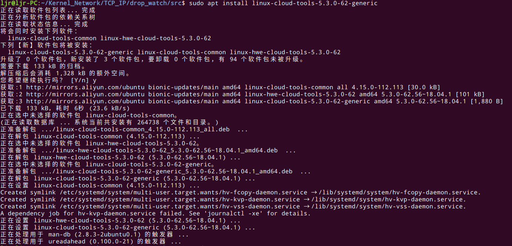

perf的用法帮助信息：

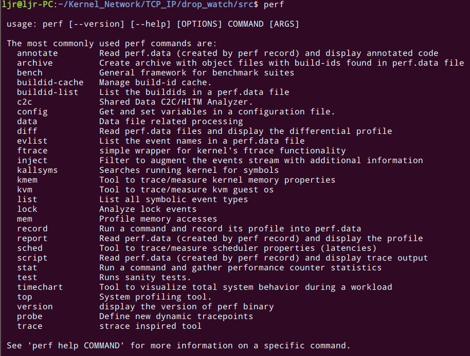

下面用perf监控丢弃的数据包，使用 perf 监视 kfree_skb 事件：

```bash
sudo perf record -g -a -e skb:kfree_skb
```
```bash
sudo perf script
```
结果如下：

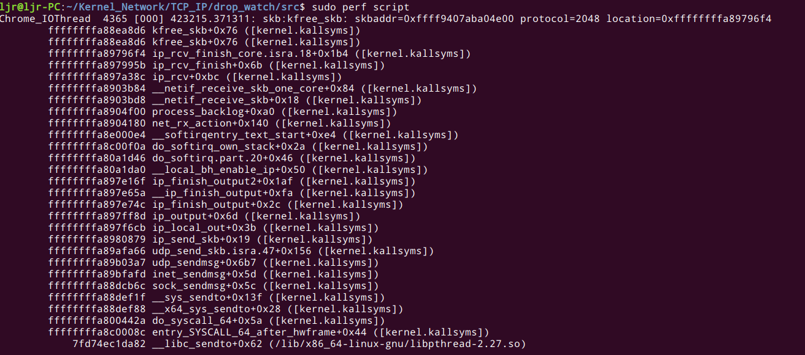

可以看到，使用 perf 监视 kfree_skb 事件，找到了数据包丢弃的地方。
