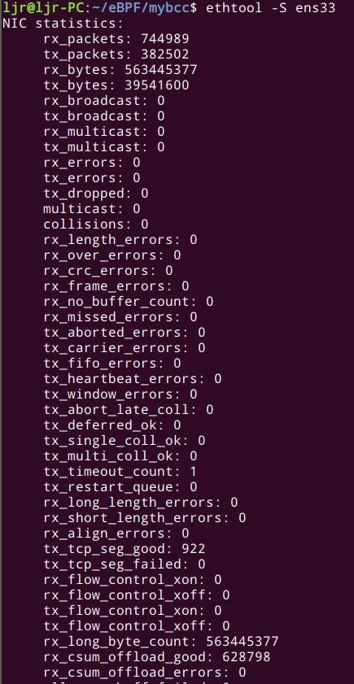
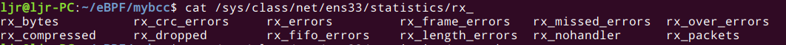
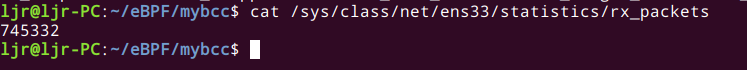
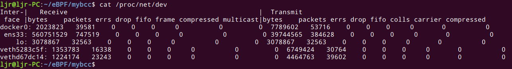

本文首先从宏观上介绍数据包的接收过程，然后详细介绍了Linux网络设备驱动的工作过程，最后介绍网卡监控与调优，包括网络数据包总数、丢包、错包数量的相关统计。
## 1. 接收数据包过程概述
 介绍数据包收包过程，有助于我们了解Linux内核网络设备在数据收包过程中的位置，下面从宏观的角度介绍数据包从被网卡接收到进入 socket 接收队列的整个过程：
 - 加载网卡驱动，初始化
 - 数据包从外部网络进入网卡
 - 网卡（通过DMA）将包拷贝到内核内存中的`ring buffer`
 - 产生硬件中断，通知系统收到了一个包
 - 驱动调用 NAPI ，如果轮询（poll）还没有开始，就开始轮询
 - `ksoftirqd`软中断调用 NAPI 的`poll`函数从`ring buffer`收包（poll 函数是网卡驱动在初始化阶段注册的；每个cpu上都运行着一个`ksoftirqd`进程，在系统启动期间就注册了）
 - `ring buffer`里面对应的内存区域解除映射（unmapped）
 - 如果 packet steering 功能打开，或者网卡有多队列，网卡收到的数据包会被分发到多个cpu
 - 数据包从队列进入协议层
 - 协议层处理数据包
 - 数据包从协议层进入相应 socket 的接收队列

## 2. 网络设备初始化
下面以常见的Intel I350 网卡的驱动 ibg 为例介绍它的工作过程：
### 2.1 初始化
驱动会使用`module_init`向内核注册一个初始化函数，当驱动被加载时，内核会调用这个函数。在`drivers/net/ethernet/intel/igb/igb_main.c`中初始化函数（igb_init_module）：
```c
/**
 *  igb_init_module - Driver Registration Routine
 *
 *  igb_init_module is the first routine called when the driver is
 *  loaded. All it does is register with the PCI subsystem.
 **/
static int __init igb_init_module(void)
{
  int ret;
  pr_info("%s - version %s\n", igb_driver_string, igb_driver_version);
  pr_info("%s\n", igb_copyright);

  /* ... */

  ret = pci_register_driver(&igb_driver);
  return ret;
}

module_init(igb_init_module);
```
初始化的大部分工作在`pci_register_driver`中完成。
### 2.2 PCI初始化
Intel I350 网卡是 `PCI express` 设备。 PCI 设备通过`PCI Configuration Space` 里面的寄存器识别自己。
>PCI express 总线是一种完全不同于过去PCI总线的一种全新总线规范，与PCI总线共享并行架构相比，PCI Express总线是一种点对点串行连接的设备连接方式，点对点意味着每一个PCI Express设备都拥有自己独立的数据连接，各个设备之间并发的数据传输互不影响，而对于过去PCI那种共享总线方式，PCI总线上只能有一个设备进行通信，一旦PCI总线上挂接的设备增多，每个设备的实际传输速率就会下降，性能得不到保证。PCI Express以点对点的方式处理通信，每个设备在要求传输数据的时候各自建立自己的传输通道，对于其他设备这个通道是封闭的，这样的操作保证了通道的专有性，避免其他设备的干扰。

当设备驱动编译时，`MODULE_DEVICE_TABLE` 宏（定义在 `include/module.h`） 会导出一个 PCI 设备 ID 列表（a table of PCI device IDs），驱动据此识别它可以控制的设备，内核也会依据这个列表对不同设备加载相应驱动。

igb 驱动的设备表和 PCI 设备 ID 分别见： `drivers/net/ethernet/intel/igb/igb_main.c` 和`drivers/net/ethernet/intel/igb/e1000_hw.h`。
```c
static DEFINE_PCI_DEVICE_TABLE(igb_pci_tbl) = {
  { PCI_VDEVICE(INTEL, E1000_DEV_ID_I354_BACKPLANE_1GBPS) },
  { PCI_VDEVICE(INTEL, E1000_DEV_ID_I354_SGMII) },
  { PCI_VDEVICE(INTEL, E1000_DEV_ID_I354_BACKPLANE_2_5GBPS) },
  { PCI_VDEVICE(INTEL, E1000_DEV_ID_I211_COPPER), board_82575 },
  { PCI_VDEVICE(INTEL, E1000_DEV_ID_I210_COPPER), board_82575 },
  { PCI_VDEVICE(INTEL, E1000_DEV_ID_I210_FIBER), board_82575 },
  { PCI_VDEVICE(INTEL, E1000_DEV_ID_I210_SERDES), board_82575 },
  { PCI_VDEVICE(INTEL, E1000_DEV_ID_I210_SGMII), board_82575 },
  { PCI_VDEVICE(INTEL, E1000_DEV_ID_I210_COPPER_FLASHLESS), board_82575 },
  { PCI_VDEVICE(INTEL, E1000_DEV_ID_I210_SERDES_FLASHLESS), board_82575 },
  /* ... */
};
MODULE_DEVICE_TABLE(pci, igb_pci_tbl);
```
前面提到，驱动初始化的时候会调用 `pci_register_driver`，这个函数会将该驱动的各种回调方法注册到一个 `struct pci_driver` 变量，`drivers/net/ethernet/intel/igb/igb_main.c`：
```c
static struct pci_driver igb_driver = {
  .name     = igb_driver_name,
  .id_table = igb_pci_tbl,
  .probe    = igb_probe,
  .remove   = igb_remove,
  /* ... */
};
```
### 2.3 网络设备初始化
通过 PCI ID 识别设备后，内核就会为它选择合适的驱动。每个 PCI 驱动注册了一个 probe() 方法，内核会对每个设备依次调用其驱动的 probe 方法，一旦找到一个合适的驱动，就不会再为这个设备尝试其他驱动。

很多驱动都需要大量代码来使得设备 ready，具体做的事情各有差异。典型的过程：

- 启用 PCI 设备
- 请求（requesting）内存范围和 IO 端口
- 设置 DMA 掩码
- 注册设备驱动支持的 ethtool 方法（后面介绍）
- 注册所需的 watchdog（例如，e1000e 有一个检测设备是否僵死的 watchdog）
- 其他和具体设备相关的事情，例如一些 workaround，或者特定硬件的非常规处理
- 创建、初始化和注册一个 struct net_device_ops 类型变量，这个变量包含了用于设备相关的回调函数，例如打开设备、发送数据到网络、设置 MAC 地址等
- 创建、初始化和注册一个更高层的 struct net_device 类型变量（一个变量就代表了 一个设备）

下面来看 igb 驱动的 `igb_probe` 包含哪些过程（drivers/net/ethernet/intel/igb/igb_main.c）：
```c
err = pci_enable_device_mem(pdev);
/* ... */
err = dma_set_mask_and_coherent(&pdev->dev, DMA_BIT_MASK(64));
/* ... */
err = pci_request_selected_regions(pdev, pci_select_bars(pdev,
           IORESOURCE_MEM),
           igb_driver_name);

pci_enable_pcie_error_reporting(pdev);

pci_set_master(pdev);
pci_save_state(pdev);
```
更详细的过程可以查看内核文档：
https://github.com/torvalds/linux/blob/v3.13/Documentation/PCI/pci.txt
## 3. 网络设备启动
`igb_probe` 做了很多重要的设备初始化工作。除了 PCI 相关的，还有如下一些通用网络功能和网络设备相关的工作：

- 注册 struct net_device_ops 变量
- 注册 ethtool 相关的方法
- 从网卡获取默认 MAC 地址
- 设置 net_device 特性标记
### 3.1 struct net_device_ops
网络设备相关的操作函数都注册到`struct net_device_ops`类型的变量中（drivers/net/ethernet/intel/igb/igb_main.c）:
```c
static const struct net_device_ops igb_netdev_ops = {
  .ndo_open               = igb_open,
  .ndo_stop               = igb_close,
  .ndo_start_xmit         = igb_xmit_frame,
  .ndo_get_stats64        = igb_get_stats64,
  .ndo_set_rx_mode        = igb_set_rx_mode,
  .ndo_set_mac_address    = igb_set_mac,
  .ndo_change_mtu         = igb_change_mtu,
  .ndo_do_ioctl           = igb_ioctl,
  /* ... */
```
这个变量会在 `igb_probe()`中赋给 `struct net_device` 中的 `netdev_ops` 字段：
```c
static int igb_probe(struct pci_dev *pdev, const struct pci_device_id *ent)
{
  ...
  netdev->netdev_ops = &igb_netdev_ops;
}
```
### 3.2 ethtool 函数注册
ethtool 是一个命令行工具，可以查看和修改网络设备的一些配置，常用于收集网卡统计数据。在 Ubuntu 上，可以 通过 `apt-get install ethtool` 安装，过会演示通过此工具监控网卡数据。

ethtool 通过 ioctl 和设备驱动通信。内核实现了一个通用 ethtool 接口，网卡驱动实现这些接口，就可以被 ethtool 调用。当 ethtool 发起一个系统调用之后，内核会找到对应操作的回调函数 。回调实现了各种简单或复杂的函数，简单的如改变一个 flag 值，复杂的包括调整网卡硬件如何运行。

相关实现见`drivers/net/ethernet/intel/igb/igb_ethtool.c`。

### 3.3 软中断
当一个数据帧通过 DMA 写到 RAM（内存）后，网卡是如何通知其他系统这个包可以被处理了呢？

传统的方式是，网卡会产生一个硬件中断（IRQ），通知数据包到了。有三种常见的硬中断类型：
- MSI-X
- MSI
- legacy IRQ

如果有大量的数据包到达，就会产生大量的硬件中断。CPU 忙于处理硬件中断的时候，可用于处理其他任务的时间就会减少。

NAPI（New API）是一种新的机制，可以减少产生的硬件中断的数量（但不能完全消除硬中断 ）。

### 3.4 NAPI
NAPI 接收数据包的方式和传统方式不同，它允许设备驱动注册一个 poll 方法，然后调用这个方法完成收包。

NAPI 的使用方式：

- 驱动打开 NAPI 功能，默认处于未工作状态（没有在收包）
- 数据包到达，网卡通过 DMA 写到内存
- 网卡触发一个硬中断，中断处理函数开始执行
- 软中断（softirq），唤醒 NAPI 子系统。这会触发在一个单独的线程里， 调用驱动注册的 poll 方法收包
- 驱动禁止网卡产生新的硬件中断，这样做是为了 NAPI 能够在收包的时候不会被新的中断打扰
- 一旦没有包需要收了，NAPI 关闭，网卡的硬中断重新开启
- 转步骤 2

和传统方式相比，NAPI 一次中断会接收多个包，因此可以减少硬件中断的数量。

poll 方法是通过调用 `netif_napi_add` 注册到 NAPI 的，同时还可以指定权重 weight，大部分驱动都 hardcode 为 64。

通常来说，驱动在初始化的时候注册 NAPI poll 方法。

### 3.5 igb 驱动的 NAPI 初始化
igb 驱动的初始化过程是一个很长的调用链：

- igb_probe -> igb_sw_init
- igb_sw_init -> igb_init_interrupt_scheme
- igb_init_interrupt_scheme -> igb_alloc_q_vectors
- igb_alloc_q_vectors -> igb_alloc_q_vector
- igb_alloc_q_vector -> netif_napi_add

从宏观角度来看，这个调用过程会做以下事情：

- 如果支持 MSI-X，调用 `pci_enable_msix` 打开它
- 计算和初始化一些配置，包括网卡收发队列的数量
- 调用 `igb_alloc_q_vector` 创建每个发送和接收队列
- `igb_alloc_q_vector` 会进一步调用 `netif_napi_add` 注册 poll 方法到 NAPI 变量

下面介绍 `igb_alloc_q_vector` 是如何注册 poll 方法和私有数据的（drivers/net/ethernet/intel/igb/igb_main.c）： 
```c
static int igb_alloc_q_vector(struct igb_adapter *adapter,
                              int v_count, int v_idx,
                              int txr_count, int txr_idx,
                              int rxr_count, int rxr_idx)
{
  /* ... */

  /* allocate q_vector and rings */
  q_vector = kzalloc(size, GFP_KERNEL);
  if (!q_vector)
          return -ENOMEM;

  /* initialize NAPI */
  netif_napi_add(adapter->netdev, &q_vector->napi, igb_poll, 64);

  /* ... */
```
`q_vector` 是新分配的队列，`igb_poll` 是 poll 方法，当它收包的时候，会通过这个接收队列找到关联的 NAPI 变量（q_vector->napi）。

## 4. 启用网卡(Bring A Network Device Up)
前面提到`structure net_device_ops` 变量，它包含网卡启用、发包、设置 mac 地址等回调函数（函数指针）。

当启用一个网卡时（例如，通过 ifconfig eth0 up），`net_device_ops` 的 `ndo_open` 方法会被调用。它通常会做以下事情：

- 分配 RX、TX 队列内存
- 打开 NAPI 功能
- 注册中断处理函数
- 打开（enable）硬中断
- 其他

igb 驱动中，这个方法对应的是 `igb_open` 函数。

### 4.1 准备从网络接收数据
目前大部分网卡都使用 DMA 将数据直接写到内存，接下来操作系统可以直接从里面读取。实现这一目的所使用的数据结构是 `ring buffer`（环形缓冲区）。

要实现这一功能，设备驱动必须和操作系统合作，预留（reserve）出一段内存来给网卡使用。预留成功后，网卡知道了这块内存的地址，接下来收到的数据包就会放到这里，进而被操作系统取走。

由于这块内存区域是有限的，如果数据包的速率非常快，单个 CPU 来不及取走这些包，新来的包就会被丢弃。这时候，`Receive Side Scaling`（RSS，接收端扩展）或者多队列（ multiqueue）一类的技术可能就会排上用场。

一些网卡有能力将接收到的数据包写到多个不同的内存区域，每个区域都是独立的接收队列。这样操作系统就可以利用多个 CPU（硬件层面）并行处理收到的数据包。只有部分网卡支持这个功能。

Intel I350 网卡支持多队列，我们可以在 igb 的驱动里看出来。igb 驱动启用的时候 ，最开始做的事情之一就是调用 `igb_setup_all_rx_resources` 函数。这个函数会对每个 RX 队列调用 `igb_setup_rx_resources`， 里面会管理 DMA 的内存。

**RX 队列的数量和大小可以通过 ethtool 进行配置，调整这两个参数会对收包或者丢包产生可见影响。**

网卡通过对 packet 头（例如源地址、目的地址、端口等）做哈希来决定将 packet 放到哪个 RX 队列。只有很少的网卡支持调整哈希算法。如果支持的话，可以根据算法将特定 的 flow 发到特定的队列，**甚至可以做到在硬件层面直接将某些包丢弃**。

一些网卡支持调整 RX 队列的权重，可以有意地将更多的流量发到指定的 queue。

### 4.2 Enable NAPI
前面介绍了驱动如何注册 NAPI poll 方法，但是，一般直到网卡被启用之后，NAPI 才被启用。

启用 NAPI 很简单，调用 `napi_enable` 函数就行，这个函数会设置 NAPI 变量（`struct napi_struct`）中一个表示是否启用的标志位。前面说到，NAPI 启用后并不是立即开始工作（而是等硬中断触发）。

对于 igb，驱动初始化或者通过 ethtool 修改 queue 数量或大小的时候，会启用每个 `q_vector` 的 NAPI 变量（ drivers/net/ethernet/intel/igb/igb_main.c）：
```c
for (i = 0; i < adapter->num_q_vectors; i++)
	napi_enable(&(adapter->q_vector[i]->napi));
```
### 4.3 注册中断处理函数
启用 NAPI 之后，下一步就是注册中断处理函数。设备有多种方式触发一个中断：

- MSI-X
- MSI
- legacy interrupts

设备驱动的实现也因此而异。驱动必须判断出设备支持哪种中断方式，然后注册相应的中断处理函数，这些函数在中断发生的时候会被执行。

一些驱动，例如 igb，会试图为每种中断类型注册一个中断处理函数，如果注册失败，就尝试下一种类型。

MSI-X 中断是比较推荐的方式，尤其是对于支持多队列的网卡。因为每个 RX 队列有独立的 MSI-X 中断，因此可以被不同的 CPU 处理（通过 irqbalance 方式，或者修改 `/proc/irq/IRQ_NUMBER/smp_affinity`）。处理中断的 CPU 也是随后处理这个包的 CPU。这样的话，从网卡硬件中断的层面就可以设置让收到的包被不同的 CPU 处理。

如果不支持 MSI-X，那 MSI 相比于传统中断方式仍然有一些优势，驱动仍然会优先考虑它。

在 igb 驱动中，函数 `igb_msix_ring`，`igb_intr_msi`，`igb_intr` 分别是 MSI-X，MSI 和传统中断方式的中断处理函数。

驱动是如何尝试各种中断类型的（ drivers/net/ethernet/intel/igb/igb_main.c）：
```c
static int igb_request_irq(struct igb_adapter *adapter)
{
  struct net_device *netdev = adapter->netdev;
  struct pci_dev *pdev = adapter->pdev;
  int err = 0;

  if (adapter->msix_entries) {
    err = igb_request_msix(adapter);
    if (!err)
      goto request_done;
    /* fall back to MSI */
    /* ... */
  }

  /* ... */

  if (adapter->flags & IGB_FLAG_HAS_MSI) {
    err = request_irq(pdev->irq, igb_intr_msi, 0,
          netdev->name, adapter);
    if (!err)
      goto request_done;

    /* fall back to legacy interrupts */
    /* ... */
  }

  err = request_irq(pdev->irq, igb_intr, IRQF_SHARED,
        netdev->name, adapter);

  if (err)
    dev_err(&pdev->dev, "Error %d getting interrupt\n", err);

request_done:
  return err;
}
```
这就是 igb 驱动注册中断处理函数的过程，这个函数在一个数据包到达网卡触发一个硬件中断时就会被执行。

### 4.4 Enable Interrupts
到这里，几乎所有的准备工作都就绪了。唯一剩下的就是打开硬中断，等待数据包进来。 打开硬中断的方式因硬件而异，igb 驱动是在 `__igb_open` 里调用辅助函数 `igb_irq_enable` 完成的。

中断通过写寄存器的方式打开：
```c
static void igb_irq_enable(struct igb_adapter *adapter)
{

  /* ... */
    wr32(E1000_IMS, IMS_ENABLE_MASK | E1000_IMS_DRSTA);
    wr32(E1000_IAM, IMS_ENABLE_MASK | E1000_IMS_DRSTA);
  /* ... */
}

```
现在，网卡已经启用了。驱动可能还会做一些额外的事情，例如启动定时器，工作队列（ work queue），或者其他硬件相关的设置。这些工作做完后，网卡就可以接收数据包了。
## 5. 网卡监控
监控网络设备有几种不同的方式，每种方式的监控粒度（granularity）和复杂度不同。我们先从最粗的粒度开始，逐步细化。
### 5.1 `ethtool -S`
`ethtool -S` 可以查看网卡统计信息（例如接收和发送的数据包总数，接收和发送的流量，丢弃的包数量，错误的数据包数量等）：



监控这些数据比较困难。因为用命令行获取很容易，但是以上字段并没有一个统一的标准。 不同的驱动，甚至同一驱动的不同版本可能字段都会有差异。

可以先粗略的查看 “drop”, “buffer”, “miss” 等字样。然后，在驱动的源码里找到对应的更新这些字段的地方，这可能是在软件层面更新的，也有可能是在硬件层面通过寄存器更新的。如果是通过硬件寄存器的方式，就得查看网卡的 data sheet（说明书），搞清楚这个寄存器代表什么。ethtoool 给出的这些字段名，有一些是有误导性的（misleading）。

### 5.2 `sysfs`
sysfs 也提供了统计信息，但相比于网卡层的统计，要更上层一些。

例如，可以获取的 ens33 的接收端数据包的类型有这些：



获取接收到的数据包的总数为：



不同类型的统计分别位于 `/sys/class/net/<NIC>/statistics/` 下面的不同文件，包括 `collisions`, `rx_dropped`,` rx_errors`, `rx_missed_errors` 等等。

要注意的是，每种类型代表什么意思，是由驱动来决定的，因此也是由驱动决定何时以及在哪里更新这些计数的。你可能会发现一些驱动将一些特定类型的错误归类为 drop，而另外一些驱动可能将它们归类为 miss。

这些值至关重要，因此需要查看对应的网卡驱动，搞清楚它们真正代表什么。

### 5.2 `/proc/net/dev`
`/proc/net/dev` 提供了更高一层的网卡统计。



这个文件里显示的统计只是 sysfs 里面的一个子集，但适合作为一个常规的统计参考。

如果对这些数据准确度要求特别高，那必须查看内核源码 、驱动源码和驱动手册，搞清楚每个字段真正代表什么意思，计数是如何以及何时被更新的。

Linux内核网络设备驱动先介绍到这里，关于网卡调优，下次再介绍。

参考链接：
https://blog.packagecloud.io/eng/2016/06/22/monitoring-tuning-linux-networking-stack-receiving-data/