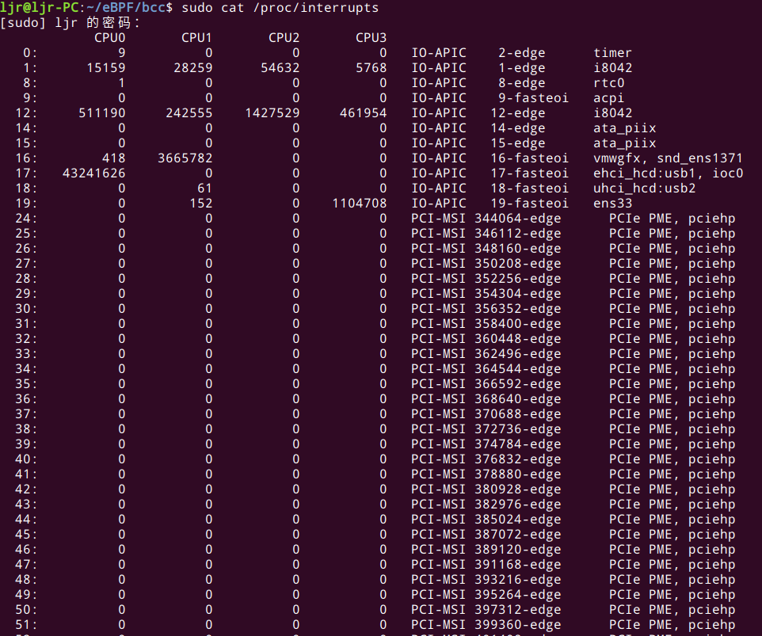
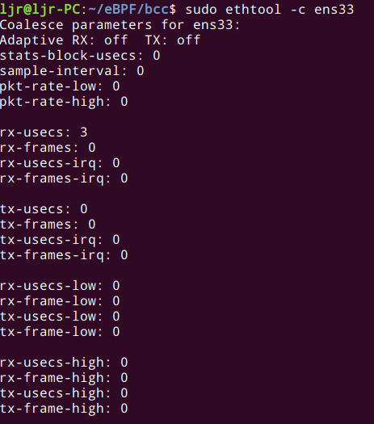

## 1. 前言
本文主要介绍Linux网络设备子系统的数据处理，从网络设备子系统的初始化开始，从硬中断到软中断，分别介绍了NAPI 和 `napi_schedule`、数据在网络设备子系统的监测和调优以及网络数据的处理。
## 2. 网络设备子系统初始化
网络设备（netdev）的初始化在`net_dev_init`。
### 2.1 `struct softnet_data`变量初始化
`net_dev_init`为每个 CPU 创建一个`struct softnet_data`变量。这些变量包含一些指向重要信息的指针：
- 需要注册到这个 CPU 的 NAPI 列表
- 数据处理 backlog
- 处理权重
- `receive offload` 变量列表
- `receive packet steering` 设置

### 2.2 SoftIRQ Handler 初始化
 `net_dev_init`分别为接收和发送数据注册了一个软中断处理函数。
```c
static int __init net_dev_init(void)
{
	/* ... */
	
	open_softirq(NET_TX_SOFTIRQ, net_tx_action);
	open_softirq(NET_RX_SOFTIRQ, net_rx_action);
	
	/* ... */
}
```
驱动的中断处理函数触发`net_rx_action`这个为`NET_RX_SOFTIRQ`软中断注册的中断处理函数。

## 3. 网络数据监测和调优
当数据到来时，如果RX队列有足够的描述符(discriptors)，数据包会通过 DMA 写到 RAM，然后设备发起中断。

### 3.1 中断处理函数
一般来说，中断处理函数应该尽可能的简单，将尽可能多的处理逻辑移出（到软中断），因为发起一个中断后，其他的中断就会被屏蔽。

以`/drivers/net/ethernet/intel/igb/igb_main.c`中MSI-X 中断处理函数的代码为例：
```c
static irqreturn_t igb_msix_ring(int irq, void *data)
{
	struct igb_q_vector *q_vector = data;
	
	/* Write the ITR value calculated from the previous interrupt. */
	igb_write_itr(q_vector);
	
	napi_schedule(&q_vector->napi);
	
	return IRQ_HANDLED;
}
```
这个中断处理函数非常简短，只做了 2 个很快的操作就返回了：

- 它调用 `igb_write_itr` 更新一个硬件寄存器。对这个例子，这个寄存器是记录硬件中断频率的。这个寄存器和一个叫 “Interrupt Throttling”（也叫 “Interrupt Coalescing”）的硬件特性相关，这个特性可以平滑传送到 CPU 的中断数量。
- 触发 `napi_schedule`，如果 NAPI 的处理循环还没开始的话，这会唤醒它。这个处理循环是在软中断中执行的，而不是硬中断。

### 3.2 NAPI 和 `napi_schedule`
接下来看从硬件中断中调用的 `napi_schedule` 是如何工作的。

NAPI 无需硬件中断通知就可以接收网络数据。NAPI 的轮询循环（poll loop）是受硬件中断触发而跑起来的。换句话说，NAPI 功能启用了 ，但是默认是没有工作的，直到第一个包到达的时候，网卡触发的一个硬件将它唤醒。后面会看到，也还有其他的情况，NAPI 功能也会被关闭，直到下一个硬中断再次将它唤起。

`napi_schedule` 只是一个简单的封装，内层调用 `__napi_schedule`，代码在`net/core/dev.c`中：
```c
/**
 * __napi_schedule - schedule for receive
 * @n: entry to schedule
 *
 * The entry's receive function will be scheduled to run
 */
void __napi_schedule(struct napi_struct *n)
{
	unsigned long flags;
	
	local_irq_save(flags);
	____napi_schedule(&__get_cpu_var(softnet_data), n);
	local_irq_restore(flags);
}
EXPORT_SYMBOL(__napi_schedule);
```
`__get_cpu_var` 用于获取属于这个 CPU 的 `structure softnet_data` 变量。

`__napi_schedule`代码在 `net/core/dev.c`中：
```c
/* Called with irq disabled */
static inline void ____napi_schedule(struct softnet_data *sd,
                                     struct napi_struct *napi)
{
	list_add_tail(&napi->poll_list, &sd->poll_list);
	__raise_softirq_irqoff(NET_RX_SOFTIRQ);
}
```
这段代码了做了两个重要的事情：

- 将（从驱动的中断函数中传来的）`napi_struct` 变量，添加到 `poll list`，后者 attach 到这个 CPU 上的 `softnet_data
- `__raise_softirq_irqoff` 触发一个 `NET_RX_SOFTIRQ` 类型软中断。这会触发执行 `net_rx_action`（如果没有正在执行），后者是网络设备初始化的时候注册的
接下来会看到，软中断处理函数 net_rx_action 会调用 NAPI 的 poll 函数来收包。

>到目前为止，我们从硬中断处理函数中转移到软中断处理函数的逻辑，都是使用的本 CPU 变量。驱动的硬中断处理函数做的事情很少，但软中断将会在和硬中断相同的 CPU 上执行。这就是为什么给每个 CPU 一个特定的硬中断非常重要：这个 CPU 不仅处理这个硬中断，而且通过 NAPI 处理接下来的软中断来收包。`Receive Packet Steering` 可以将软中断分给其他 CPU。

### 3.3 监测网络数据到达
由于某些驱动在 NAPI 运行时会关闭硬中断，因此只监控硬中断无法得到网络处理健康状况的全景视图，硬中断监控只是整个监控方案的重要组成部分。读取硬中断统计：



可以看到有多少包进来、硬件中断频率，RX 队列被哪个 CPU 处理等信息。这里只能看到硬中断数量，不能看出实际多少数据被接收或处理，因为一些驱动在 NAPI 收包时会关闭硬中断。 进一步，使用 `Interrupt Coalescing` 时也会影响这个统计。监控这个指标能判断出设置的 `Interrupt Coalescing` 是不是在工作。为了使监控更加完整，需要同时监控 `/proc/softirqs` 和 /proc。

### 3.4 数据接收调优
#### 中断合并（Interrupt coalescing）

中断合并会将多个中断事件放到一起，累积到一定阈值后才向 CPU 发起中断请求。这可以防止中断风暴，提升吞吐，降低 CPU 使用量，但延迟也变大；中断数量过多则相反。早期的 igb、e1000 版本，以及其他的都包含一个叫 `InterruptThrottleRate` 的参数， 最近的版本已经被 ethtool 可配置的参数取代。



ethtool 提供了用于中断合并相关的通用接口，但不是所有的设备都支持完整的配置，需要查看驱动文档或代码来确定哪些支持，哪些不支持。ethtool 的文档说：“ 驱动没有实现的接口将会被静默忽略”。

某些驱动支持一个有趣的特性：“自适应 RX/TX 硬中断合并”。这个特性一般是在硬件实现的 。驱动通常需要做一些额外的工作来告诉网卡需要打开这个特性。自适应 RX/TX 硬中断合并带来的效果是：带宽比较低时降低延迟，带宽比较高时提升吞吐。

用 ethtool -C 打开自适应 RX IRQ 合并：
```bash
$ sudo ethtool -C ens33 adaptive-rx on
```
还可以用 ethtool -C 更改其他配置。常用的包括：

- rx-usecs: How many usecs to delay an RX interrupt after a packet arrives.
- rx-frames: Maximum number of data frames to receive before an RX interrupt.
- rx-usecs-irq: How many usecs to delay an RX interrupt while an interrupt is being serviced by the host.
- rx-frames-irq: Maximum number of data frames to receive before an RX interrupt is generated while the system is servicing an interrupt.

硬件可能只支持以上列表的一个子集，具体请参考相应的驱动说明或源码。通常并没有一个很好的文档来说明这些选项，最全的文档很可能是头文件。每个选项的解释见 `include/uapi/linux/ethtool.h` 。

注意：虽然硬中断合并看起来是个不错的优化项，但需要网络栈的其他一些 部分做针对性调整。只合并硬中断很可能并不会带来多少收益。

#### 调整硬中断亲和性（IRQ affinities）
If your NIC supports RSS / multiqueue or if you are attempting to optimize for data locality, you may wish to use a specific set of CPUs for handling interrupts generated by your NIC.

Setting specific CPUs allows you to segment which CPUs will be used for processing which IRQs. These changes may affect how upper layers operate, as we’ve seen for the networking stack.

If you do decide to adjust your IRQ affinities, you should first check if you running the irqbalance daemon. This daemon tries to automatically balance IRQs to CPUs and it may overwrite your settings. If you are running irqbalance, you should either disable irqbalance or use the –banirq in conjunction with IRQBALANCE_BANNED_CPUS to let irqbalance know that it shouldn’t touch a set of IRQs and CPUs that you want to assign yourself.

Next, you should check the file /proc/interrupts for a list of the IRQ numbers for each network RX queue for your NIC.

Finally, you can adjust the which CPUs each of those IRQs will be handled by modifying /proc/irq/IRQ_NUMBER/smp_affinity for each IRQ number.

You simply write a hexadecimal bitmask to this file to instruct the kernel which CPUs it should use for handling the IRQ.

Example: Set the IRQ affinity for IRQ 8 to CPU 0
```bash
$ sudo bash -c 'echo 1 > /proc/irq/8/smp_affinity'
```
## 4. 网络数据处理
一旦软中断代码判断出有 softirq 处于 pending 状态，就会开始处理，执行 `net_rx_action`，网络数据处理就此开始。下面来看一下 `net_rx_action` 的循环部分，理解它是如何工作的，哪个部分可以调优， 哪个可以监控。
### 4.1 `net_rx_action` 处理循环
`net_rx_action` 从包所在的内存开始处理，包是被设备通过 DMA 直接送到内存的。 函数遍历本 CPU 队列的 NAPI 变量列表，依次出队并操作它，处理逻辑考虑任务量（work ）和执行时间两个因素：

- 跟踪记录工作量预算（work budget），预算可以调整
- 记录消耗的时间

`net/core/dev.c`中代码如下：
```c
while (!list_empty(&sd->poll_list)) {
    struct napi_struct *n;
    int work, weight;

    /* If softirq window is exhausted then punt.
     * Allow this to run for 2 jiffies since which will allow
     * an average latency of 1.5/HZ.
     */
    if (unlikely(budget <= 0 || time_after_eq(jiffies, time_limit)))
    goto softnet_break;
```
这里可以看到内核是如何防止处理数据包过程霸占整个 CPU 的，其中 budget 是该 CPU 的 所有 NAPI 变量的总预算。这也是多队列网卡应该精心调整 IRQ Affinity 的原因。处理硬中断的 CPU 接下来会处理相应的软中断，进而执行上面包含 budget 的这段逻辑。

多网卡多队列可能会出现这样的情况：多个 NAPI 变量注册到同一个 CPU 上。每个 CPU 上 的所有 NAPI 变量共享一份 budget。如果没有足够的 CPU 来分散网卡硬中断，可以考虑增加 `net_rx_action` 允许每个 CPU 处理更多包。增加 budget 可以增加 CPU 使用量（top 等命令看到的 sitime 或 si 部分），但可以减少延迟，因为数据处理更加及时。

>the CPU will still be bounded by a time limit of 2 jiffies, regardless of the assigned budget.

### 4.2 NAPI poll 函数及权重
网络设备驱动使用 `netif_napi_add` 注册 poll 方法，igb 驱动有如下代码：
```c
 /* initialize NAPI */
	netif_napi_add(adapter->netdev, &q_vector->napi, igb_poll, 64);
```
这注册了一个 NAPI 变量，hardcode 64 的权重。我们来看在 `net_rx_action` 处理循环中这个值是如何使用的(`net/core/dev.c`)：
```c
weight = n->weight;

work = 0;
if (test_bit(NAPI_STATE_SCHED, &n->state)) {
        work = n->poll(n, weight);
        trace_napi_poll(n);
}

WARN_ON_ONCE(work > weight);

budget -= work;
```
其中的 n 是 `struct napi` 的变量， poll 指向 `igb_poll`。poll() 返回处理的数据帧数量，budget 会减去这个值。

所以，假设驱动使用 weight 值 64（Linux 3.13.0 的所有驱动都是 hardcode 这个值） ，设置 budget 默认值 300，那系统将在如下条件之一停止数据处理：

- `igb_poll` 函数被调用了最多 5 次（如果没有数据需要处理，那次数就会很少）
- 时间经过了至少 2 个 jiffies
### 4.3 NAPI 和设备驱动的合约（contract）
NAPI 子系统和设备驱动之间的合约，最重要的一点是关闭 NAPI 的条件。具体如下：

- 如果驱动的 poll 方法用完了它的全部 weight（默认 hardcode 64），那它不要更改 NAPI 状态。接下来 `net_rx_action` loop 会做的。
- 如果驱动的 poll 方法没有用完全部 weight，那它必须关闭 NAPI。下次有硬件中断触发，驱动的硬件处理函数调用 `napi_schedule` 时，NAPI 会被重新打开。

接下来先看 `net_rx_action` 如何处理合约的第一部分，然后看 poll 方法如何处理第二部分。
### 4.4  Finishing the net_rx_action loop
`net_rx_action` 循环的最后一部分代码处理前面提到的 NAPI 合约的第一部分。 `net/core/dev.c`:
```c
/* Drivers must not modify the NAPI state if they
 * consume the entire weight.  In such cases this code
 * still "owns" the NAPI instance and therefore can
 * move the instance around on the list at-will.
 */
if (unlikely(work == weight)) {
  	if (unlikely(napi_disable_pending(n))) {
		local_irq_enable();
		napi_complete(n);
  		local_irq_disable();
  } else {
	if (n->gro_list) {
		/* flush too old packets
		 * If HZ < 1000, flush all packets.
		 */
		local_irq_enable();
		napi_gro_flush(n, HZ >= 1000);
		local_irq_disable();
    }
    	list_move_tail(&n->poll_list, &sd->poll_list);
  }
}
```
如果全部 work 都用完了，`net_rx_action` 会面临两种情况：

- 网络设备需要关闭（例如，用户敲了 ifconfig eth0 down 命令）
- 如果设备不需要关闭，那检查是否有 GRO列表。如果时钟 tick rate >= 1000，所有最近被更新的 GRO network flow 都会被 flush。将这个 NAPI 变量移 到 list 末尾，这个循环下次再进入时，处理的就是下一个 NAPI 变量

这就是包处理循环如何唤醒驱动注册的 poll 方法进行包处理的过程。接下来会看到， poll 方法会将网络数据发送到上层栈进行处理。

### 4.5 到达 limit 时退出循环
`net_rx_action` 达到下列条件之一退出循环：

- 这个 CPU 上注册的 poll 列表已经没有 NAPI 变量需要处理(`!list_empty(&sd->poll_list)`)
- 剩余的 budget <= 0
- 已经满足 2 个 jiffies 的时间限制

代码：
```c
/* If softirq window is exhausted then punt.
 * Allow this to run for 2 jiffies since which will allow
 * an average latency of 1.5/HZ.
 */
if (unlikely(budget <= 0 || time_after_eq(jiffies, time_limit)))
	goto softnet_break;
```
如果跟踪 `softnet_break`，会发现：`net/core/dev.c`
```c
softnet_break:
	sd->time_squeeze++;
	__raise_softirq_irqoff(NET_RX_SOFTIRQ);
	goto out;
```
- `softnet_data` 变量更新统计信息，软中断的 `NET_RX_SOFTIRQ` 被关闭。

- `time_squeeze` 字段记录的是满足如下条件的次数：`net_rx_action` 有很多 work 要做但是 budget 用完了，或者 work 还没做完但时间限制到了。这对理解网络处理的瓶颈至关重要 。关闭 `NET_RX_SOFTIRQ` 是为了释放 CPU 时间给其他任务用。这行代码是有意义的，因为只有我们有更多工作要做（还没做完）的时候才会执行到这里， 我们主动让出 CPU，不想独占太久。

- 执行到了 `out` 标签所在的代码。另外还有一种条件也会跳转到 `out` 标签：所有 NAPI 变量都处理完了，换言之，budget 数量大于网络包数量，所有驱动都已经关闭 NAPI ，没有什么事情需要 `net_rx_action` 做了。`out` 代码段在从 `net_rx_action` 返回之前做了一件重要的事情：调用 `net_rps_action_and_irq_enable`。`Receive Packet Steering` 功能打开时这个函数有重要作用：唤醒其他 CPU 处理网络包。

### 4.6 NAPI poll
驱动程序会分配一段内存用于 DMA，将数据包写到内存。就像这段内存是由驱动程序分配的一样，驱动程序也负责解绑（unmap）这些内存，读取数据，将数据送到网络栈 。

我们看下 igb 驱动如何实现这一过程，可以看到 igb_poll 代码比较简单：` drivers/net/ethernet/intel/igb/igb_main.c`
```c
/**
 *  igb_poll - NAPI Rx polling callback
 *  @napi: napi polling structure
 *  @budget: count of how many packets we should handle
 **/
static int igb_poll(struct napi_struct *napi, int budget)
{
        struct igb_q_vector *q_vector = container_of(napi,
                                                     struct igb_q_vector,
                                                     napi);
        bool clean_complete = true;

#ifdef CONFIG_IGB_DCA
        if (q_vector->adapter->flags & IGB_FLAG_DCA_ENABLED)
                igb_update_dca(q_vector);
#endif

        /* ... */

        if (q_vector->rx.ring)
                clean_complete &= igb_clean_rx_irq(q_vector, budget);

        /* If all work not completed, return budget and keep polling */
        if (!clean_complete)
                return budget;

        /* If not enough Rx work done, exit the polling mode */
        napi_complete(napi);
        igb_ring_irq_enable(q_vector);

        return 0;
}
```
几件有意思的事情：

- 如果内核 DCA（Direct Cache Access）功能打 开了，CPU 缓存是热的，对 RX ring 的访问会命中 CPU cache。
- 然后执行 `igb_clean_rx_irq`，这里做的事情非常多，我们后面看。
- 然后执行 `clean_complete`，判断是否仍然有 work 可以做。如果有，就返回 budget（这里是 hardcode 64）。在之前我们已经看到，`net_rx_action` 会将这个 NAPI 变量移动到 poll 列表的末尾。
- 如果所有 work 都已经完成，驱动通过调用 `napi_complete` 关闭 NAPI，并通过调用 `igb_ring_irq_enable` 重新进入可中断状态，下次中断到来的时候回重新打开 NAPI。

我们来看 `igb_clean_rx_irq` 如何将网络数据送到网络栈。`igb_clean_rx_irq` 方法是一个循环，每次处理一个包，直到 budget 用完，或者没有数据需要处理了。

做的几件重要事情：

- 分配额外的 buffer 用于接收数据，因为已经用过的 buffer 被 clean out 了。一次分配 `IGB_RX_BUFFER_WRITE `(16)个。
- 从 RX 队列取一个 buffer，保存到一个 skb 类型的变量中。
- 判断这个 buffer 是不是一个包的最后一个 buffer。如果是，继续处理；如果不是，继续从 buffer 列表中拿出下一个 buffer，加到 skb。当数据帧的大小比一个 buffer 大的时候， 会出现：
- 验证数据的 layout 和头信息是正确的。
- 更新 skb->len，表示这个包已经处理的字节数。
- 设置 skb 的 hash，checksum，timestamp，VLAN id， protocol 字段。hash， checksum，timestamp，VLAN ID 信息是硬件提供的，如果硬件报告 checksum error， csum_error 统计就会增加。如果 checksum 通过了，数据是 UDP 或者 TCP 数据，skb 就会被标记成 `CHECKSUM_UNNECESSARY`。
- 构建的 skb 经 `napi_gro_receive()`进入协议栈。
- 更新处理过的包的统计信息。
- 循环直至处理的包数量达到 budget。
- 循环结束的时候，这个函数设置收包的数量和字节数统计信息。

## 5. 总结
本文主要介绍Linux网络设备子系统的数据处理，通过了解这一过程，对网络数据提取和调优意义重大，接下来网络数据就要通过`netif_receive_skb`进入协议栈了，今天先介绍到这里，感谢阅读。

参考资料：

https://www.cnblogs.com/tureno/articles/6284517.html

https://blog.packagecloud.io/eng/2016/06/22/monitoring-tuning-linux-networking-stack-receiving-data/