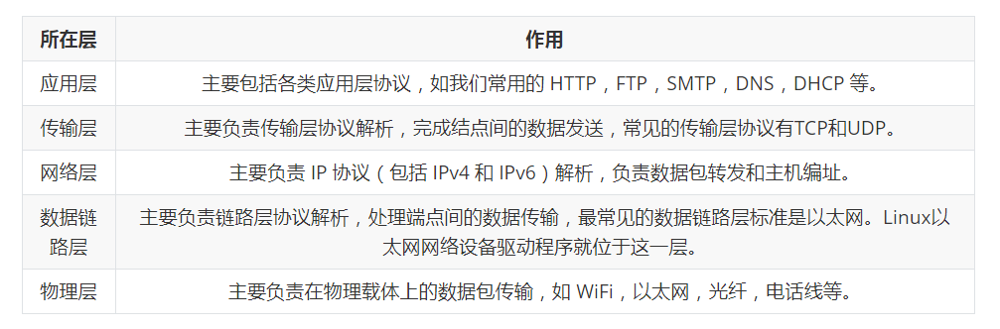
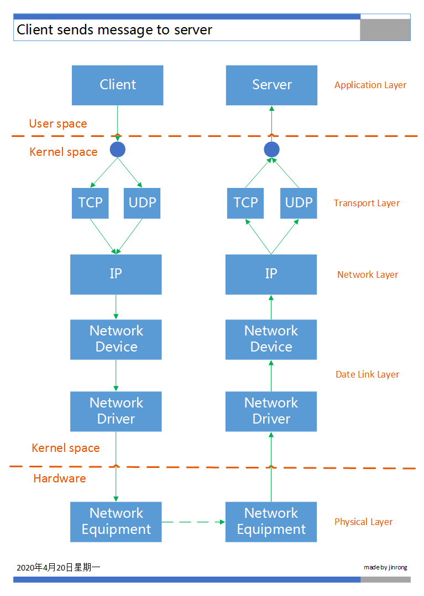

本文将从宏观上介绍Linux内核网络协议栈和网络设备驱动程序，介绍了两个很重要的结构（`net_device`和`sk_buff`），更深入更详细的内容将在以后的文章中介绍。

首先，我们需要了解网络分层模型。OSI 模型中将网络划分为七层，从下到上依次为：物理层（Physical）、数据链路层（Date Link）、网络层（Network）、传输层（Transport）、会话层（Session）、表示层（Presentation）和应用层（Application）。目前实际广泛使用的 TCP/IP 协议框架体系内，我们一般将网络划分为五层，从下到上依次为：物理层、数据链路层、网络层、传输层和应用层，下层协议对上层协议透明，即上层协议无需关注下层协议的实现逻辑和机制。TCP/IP 协议框架体系五层模型每层的作用如下表：



Linux内核网络协议栈涉及其中三层，分别为数据链路层、网络层和传输层，不涉及物理层，应用层的任务也是由用户空间程序来实现的。Linux内核网络协议栈的任务：

1、接收数据包时：Linux内核网络协议栈将接收到的数据包从网络设备驱动程序传递给网络层（通常为IPv4或IPv6）。接下来，如果数据包目的地为当前设备，Linux内核网络协议栈就将其传递给传输层（应用TCP或UDP协议侦听套接字）；如果数据包需要转发，就将其交还给数据链路层进行传输。

2、发送数据包时：Linux内核网络协议栈将本地生成的出站数据包，从传输层依次传递给网络层和数据链路层，再由网络设备驱动程序进行传输。



期间可能有如下情况：

- 根据协议规则（如IPsec规则或NAT规则），可能需要对数据包进行修改。
- 数据包可能被丢弃。
- 数据包可能导致设备发送错误消息。
- 可能会对数据包进行分段。
- 可能需要重组数据包。
- 需要计算数据包的校验和。

Linux内核网络设备驱动程序位于数据链路层，网络设备主要由`net_device`结构组织的，设备的参数决定数据包是否需要分段。`net_device`结构包含了如下设备参数（部分）：

> - 设备的IRQ号。
> - 设备的MTU，对以太网设备来说，通常为1500字节。
> - 设备的MAC地址。
> - 设备的名称，如`eth0`或`eth1`。
> - 设备的标志，如状态为up还是down。
> - 与设备相关联的组播地址清单。
> - `promiscuity`计数器，如果该值大于0，网络栈就不会丢弃那些目的地并非本地主机的数据包。tcpdump和wireshark等数据包分析程序（嗅探器）就是对其加以利用。嗅探器会在用户空间打开原始套接字，从而捕获此类发往别处的数据包。
> - 设备支持的功能，如GSO或GRO。
> - 网络设备回调函数的对象（`net_device_ops`），这个对象由函数指针组成，如用于打开和停止设备、开始传输、修改网络设备MTU等的函数。
> - `ethtool`回调函数对象，它支持通过运行命令行实用程序`ethtool`来获取有关设备的信息。
> - 发送队列和接收队列数（如果设备支持多个队列）。
> - 设备最后一次发送数据包的时间戳。
> - 设备最后一次接收数据包的时间戳。

`net_device`结构很庞大，一起来见识一下它的源码，此结构很重要，本文未进行删减，并予以注释：（include\linux\netdevice.h）

```c
struct net_device {
	/* 设备名称，如eth0 */
	char			name[IFNAMSIZ];
	/* 名称hash */
	struct hlist_node	name_hlist;
	char 			*ifalias;
	/*
	 *	I/O specific fields
	 *	FIXME: Merge these and struct ifmap into one
	 */
	/* 
		描述设备所用的共享内存，用于设备与内核沟通 
		其初始化和访问只会在设备驱动程序内进行
	*/
	unsigned long		mem_end;
	unsigned long		mem_start;

	/* 设备自有内存映射到I/O内存的起始地址 */
	unsigned long		base_addr;

	/*
		设备与内核对话的中断编号，此值可由多个设备共享
		驱动程序使用request_irq函数分配此变量，使用free_irq予以释放
	*/
	int			irq;

	/* 侦测网络状态的改变次数 */
	atomic_t		carrier_changes;

	/*
	 *	Some hardware also needs these fields (state,dev_list,
	 *	napi_list,unreg_list,close_list) but they are not
	 *	part of the usual set specified in Space.c.
	 */

	/* 
		网络队列子系统使用的一组标识
		由__LINK_STATE_xxx标识
	*/
	unsigned long		state;

	struct list_head	dev_list;
	struct list_head	napi_list;
	struct list_head	unreg_list;
	struct list_head	close_list;

	/* 当前设备所有协议的链表 */
	struct list_head	ptype_all;
	/* 当前设备特定协议的链表 */
	struct list_head	ptype_specific;

	struct {
		struct list_head upper;
		struct list_head lower;
	} adj_list;

	/* 
		用于存在其他一些设备功能
		可报告适配卡的功能，以便与CPU通信
		使用NETIF_F_XXX标识功能特性
	*/
	netdev_features_t	features;
	netdev_features_t	hw_features;
	netdev_features_t	wanted_features;
	netdev_features_t	vlan_features;
	netdev_features_t	hw_enc_features;
	netdev_features_t	mpls_features;
	netdev_features_t	gso_partial_features;

	/* 网络设备索引号 */
	int			ifindex;

	/* 设备组，默认都属于0组 */
	int			group;

	struct net_device_stats	stats;

	atomic_long_t		rx_dropped;
	atomic_long_t		tx_dropped;
	atomic_long_t		rx_nohandler;

#ifdef CONFIG_WIRELESS_EXT
	const struct iw_handler_def *wireless_handlers;
	struct iw_public_data	*wireless_data;
#endif
	/* 设备操作接口 */
	const struct net_device_ops *netdev_ops;
	/* ethtool操作接口 */
	const struct ethtool_ops *ethtool_ops;
#ifdef CONFIG_NET_SWITCHDEV
	const struct switchdev_ops *switchdev_ops;
#endif
#ifdef CONFIG_NET_L3_MASTER_DEV
	const struct l3mdev_ops	*l3mdev_ops;
#endif
#if IS_ENABLED(CONFIG_IPV6)
	const struct ndisc_ops *ndisc_ops;
#endif

#ifdef CONFIG_XFRM
	const struct xfrmdev_ops *xfrmdev_ops;
#endif

	/* 头部一些操作，如链路层缓存，校验等 */
	const struct header_ops *header_ops;

	/* 标识接口特性，IFF_XXX，如IFF_UP */
	unsigned int		flags;

	/* 
		用于存储用户空间不可见的标识
		由VLAN和Bridge虚拟设备使用
	*/
	unsigned int		priv_flags;

	/* 几乎不使用，为了兼容保留 */
	unsigned short		gflags;

	/* 结构对齐填充 */
	unsigned short		padded;

	/* 与interface group mib中的IfOperStatus相关 */
	unsigned char		operstate;
	unsigned char		link_mode;

	/* 
		接口使用的端口类型
	*/
	unsigned char		if_port;

	/*
		设备使用的DMA通道
		并非所有设备都可以用DMA，有些总线不支持DMA
	*/
	unsigned char		dma;

	/*
		最大传输单元，标识设备能处理帧的最大尺寸 
		Ethernet-1500
	*/
	unsigned int		mtu;
	/* 最小mtu，Ethernet-68 */
	unsigned int		min_mtu;
	/* 最大mut，Ethernet-65535 */
	unsigned int		max_mtu;

	/* 	设备所属类型
		ARP模块中，用type判断接口的硬件地址类型
		以太网接口为ARPHRD_ETHER 
	*/
	unsigned short		type;
	/* 
		设备头部长度
		Ethernet报头是ETH_HLEN=14字节
	*/
	unsigned short		hard_header_len;
	unsigned char		min_header_len;

	/* 必须的头部空间 */
	unsigned short		needed_headroom;
	unsigned short		needed_tailroom;

	/* Interface address info. */
	/* 硬件地址，通常在初始化过程中从硬件读取 */
	unsigned char		perm_addr[MAX_ADDR_LEN];
	unsigned char		addr_assign_type;
	/* 硬件地址长度 */
	unsigned char		addr_len;
	unsigned short		neigh_priv_len;
	unsigned short          dev_id;
	unsigned short          dev_port;
	spinlock_t		addr_list_lock;
	/* 设备名赋值类型，如NET_NAME_UNKNOWN */
	unsigned char		name_assign_type;
	bool			uc_promisc;
	struct netdev_hw_addr_list	uc;
	struct netdev_hw_addr_list	mc;
	struct netdev_hw_addr_list	dev_addrs;

#ifdef CONFIG_SYSFS
	struct kset		*queues_kset;
#endif
	/* 混杂模式开启数量 */
	unsigned int		promiscuity;

	/* 非零值时，设备监听所有多播地址 */
	unsigned int		allmulti;


	/* Protocol-specific pointers */
/* 特定协议的指针 */
#if IS_ENABLED(CONFIG_VLAN_8021Q)
	struct vlan_info __rcu	*vlan_info;
#endif
#if IS_ENABLED(CONFIG_NET_DSA)
	struct dsa_switch_tree	*dsa_ptr;
#endif
#if IS_ENABLED(CONFIG_TIPC)
	struct tipc_bearer __rcu *tipc_ptr;
#endif
	void 			*atalk_ptr;
	/* ip指向in_device结构 */	
	struct in_device __rcu	*ip_ptr;
	struct dn_dev __rcu     *dn_ptr;
	struct inet6_dev __rcu	*ip6_ptr;
	void			*ax25_ptr;
	struct wireless_dev	*ieee80211_ptr;
	struct wpan_dev		*ieee802154_ptr;
#if IS_ENABLED(CONFIG_MPLS_ROUTING)
	struct mpls_dev __rcu	*mpls_ptr;
#endif

/*
 * Cache lines mostly used on receive path (including eth_type_trans())
 */
	/* Interface address info used in eth_type_trans() */
	unsigned char		*dev_addr;

#ifdef CONFIG_SYSFS
	/* 接收队列 */
	struct netdev_rx_queue	*_rx;

	/* 接收队列数 */
	unsigned int		num_rx_queues;
	unsigned int		real_num_rx_queues;
#endif

	struct bpf_prog __rcu	*xdp_prog;
	unsigned long		gro_flush_timeout;

	/* 如网桥等的收包回调 */
	rx_handler_func_t __rcu	*rx_handler;
	/* 回调参数 */
	void __rcu		*rx_handler_data;

#ifdef CONFIG_NET_CLS_ACT
	struct tcf_proto __rcu  *ingress_cl_list;
#endif
	struct netdev_queue __rcu *ingress_queue;
#ifdef CONFIG_NETFILTER_INGRESS
	/* netfilter入口 */
	struct nf_hook_entry __rcu *nf_hooks_ingress;
#endif

	/* 链路层广播地址 */
	unsigned char		broadcast[MAX_ADDR_LEN];
#ifdef CONFIG_RFS_ACCEL
	struct cpu_rmap		*rx_cpu_rmap;
#endif
	/* 接口索引hash */
	struct hlist_node	index_hlist;

/*
 * Cache lines mostly used on transmit path
 */
 	/* 发送队列 */
	struct netdev_queue	*_tx ____cacheline_aligned_in_smp;
	/* 发送队列数 */
	unsigned int		num_tx_queues;
	unsigned int		real_num_tx_queues;
	/* 排队规则 */
	struct Qdisc		*qdisc;
#ifdef CONFIG_NET_SCHED
	DECLARE_HASHTABLE	(qdisc_hash, 4);
#endif
	/* 
		可在设备发送队列中排队的最大数据包数
	*/
	unsigned long		tx_queue_len;
	spinlock_t		tx_global_lock;

	/* 	网络层确定传输超时，
		调用驱动程序tx_timeout接口的最短时间 
	*/
	int			watchdog_timeo;

#ifdef CONFIG_XPS
	struct xps_dev_maps __rcu *xps_maps;
#endif
#ifdef CONFIG_NET_CLS_ACT
	struct tcf_proto __rcu  *egress_cl_list;
#endif

	/* These may be needed for future network-power-down code. */
	/* watchdog定时器 */
	struct timer_list	watchdog_timer;

	/* 引用计数 */
	int __percpu		*pcpu_refcnt;

	/* 	网络设备的注册和除名以两步进行，
		该字段用于处理第二步
	*/
	struct list_head	todo_list;

	struct list_head	link_watch_list;

	/* 设备的注册状态 */
	enum { NETREG_UNINITIALIZED=0,
	       NETREG_REGISTERED,	/* completed register_netdevice */
	       NETREG_UNREGISTERING,	/* called unregister_netdevice */
	       NETREG_UNREGISTERED,	/* completed unregister todo */
	       NETREG_RELEASED,		/* called free_netdev */
	       NETREG_DUMMY,		/* dummy device for NAPI poll */
	} reg_state:8;

	/* 设备要被释放标记 */
	bool dismantle;

	enum {
		RTNL_LINK_INITIALIZED,
		RTNL_LINK_INITIALIZING,
	} rtnl_link_state:16;

	bool needs_free_netdev;
	void (*priv_destructor)(struct net_device *dev);

#ifdef CONFIG_NETPOLL
	struct netpoll_info __rcu	*npinfo;
#endif

	possible_net_t			nd_net;

	/* mid-layer private */
	union {
		void					*ml_priv;
		struct pcpu_lstats __percpu		*lstats;
		struct pcpu_sw_netstats __percpu	*tstats;
		struct pcpu_dstats __percpu		*dstats;
		struct pcpu_vstats __percpu		*vstats;
	};

#if IS_ENABLED(CONFIG_GARP)
	struct garp_port __rcu	*garp_port;
#endif
#if IS_ENABLED(CONFIG_MRP)
	struct mrp_port __rcu	*mrp_port;
#endif

	struct device		dev;
	const struct attribute_group *sysfs_groups[4];
	const struct attribute_group *sysfs_rx_queue_group;

	const struct rtnl_link_ops *rtnl_link_ops;

	/* for setting kernel sock attribute on TCP connection setup */
#define GSO_MAX_SIZE		65536
	unsigned int		gso_max_size;
#define GSO_MAX_SEGS		65535
	u16			gso_max_segs;

#ifdef CONFIG_DCB
	const struct dcbnl_rtnl_ops *dcbnl_ops;
#endif
	u8			num_tc;
	struct netdev_tc_txq	tc_to_txq[TC_MAX_QUEUE];
	u8			prio_tc_map[TC_BITMASK + 1];

#if IS_ENABLED(CONFIG_FCOE)
	unsigned int		fcoe_ddp_xid;
#endif
#if IS_ENABLED(CONFIG_CGROUP_NET_PRIO)
	struct netprio_map __rcu *priomap;
#endif
	struct phy_device	*phydev;
	struct lock_class_key	*qdisc_tx_busylock;
	struct lock_class_key	*qdisc_running_key;
	bool			proto_down;
};
```

网络设备驱动程序的主要任务如下：

- 接收目的地为当前主机的数据包，并将其传递给网络层，之后再将其传递给传输层。
- 传输当前主机生成的外出数据包或转发当前主机收到的数据包。

数据包在内核网络中的动向有以下几个影响因素：

1. 路由子系统

   对于每个数据包，无论它是接收到的还是发送出去的，都需要在路由子系统中执行一次查找操作。根据路由子系统的查找结果，决定是否应对数据包进行转发以及该从哪个接口发送出去。

2. Netfilter子系统注册的回调函数

   Netfilter子系统在内核网络协议栈中的5个位置注册了回调函数。这些回调函数通常被称为Netfilter钩子。接收数据包的第一个Netfilter挂接点（hook point）为`NF_INET_PRE_ROUTING`。它位于路由查找执行位置之前。这种回调函数由宏`NF_HOOK()`调用。数据包被这样的回调函数处理后，其在网络栈中的后续旅程将取决于回调函数的结果（这种结果被称为`verdict`）。如果`verdict`为`NF_DROP`，则数据包将被丢弃；如果`verdict`为`NF_ACCEPT`，则数据包将照常继续传输。Netfilter钩子回调函数是使用`nf_register_hook()`函数或`nf_register_hooks()`函数注册的。Linux内核中的Netfilter子系统为用户空间包iptables提供了基础架构。

3. IPsec子系统

   在数据包与配置的IPsec策略匹配时，就可能影响到数据包的传输。IPsec提供了一种网络层安全解决方案。它使用ESP和AH协议。IPsec在IPv6中是强制执行的，而在IPv4中则是可选的。然而，包括Linux在内的大多数操作系统在IPv4中也实现了IPsec。IPsec有两种运行模式：传输模式和隧道模式。很多虚拟专网（VPN）解决方案都以IPsec为基础，虽然也有一些VPN解决方案不使用IPsec。

4. IPv4报头

   IPv4报头中的字段`ttl`的值，每经过一台转发设备，`ttl`字段的值减1。当它变成0时，将丢弃数据包，并发回一条ICMPv4“超时”消息，提示“已超过TTL计数”。这样做旨在避免数据包因某种错误而无休止地传输。另外，每当数据包得以成功转发时，`ttl`的值都会减1。此时必须重新计算IPv4报头的校验和。因为校验和取决于IPv4报头，而`ttl`是IPv4报头的一部分。在IPv6中，也有类似的情况。但IPv6报头中的跳数计数器名为`hop_limit`，而不是`ttl`。

要更好地理解数据包在内核中的行程，必须知道数据包在Linux内核中是如何表示的。`sk_buff`结构表示一个包含报头的数据包，我们一般称之为SKB（套接字缓冲区），它能够处理可变长数据，能够很容易地在数据区头尾部添加和移除数据，且尽量避免数据的复制。每一个SKB都在设备结构中标识发送报文的目的地或接收发送报文的来源地，通常每个报文使用一个SKB表示，SKB主要用于在网络驱动程序和应用程序之间传递、复制数据包。

- 当应用程序要发送一个数据包时，数据通过系统调用提交到内核中，系统会分配一个SKB来存储数据，然后往下层传递，在传递给网络驱动后才将其释放。
- 当网络设备接收到数据包后，同样要分配一个SKB来存储数据，然后往上传递，最终在数据复制到应用程序后才释放。

我们来见识一下内核中的`sk_buff`结构，此结构很重要，本文未进行删减，并予以注释：（include\linux\skbuff.h）

```c
struct sk_buff {
    union {
        struct {
            /* These two members must be first. */
            struct sk_buff        *next;
            struct sk_buff        *prev;

            /* 报文到达或者离开的时间戳 */
            union {
                ktime_t        tstamp;
                struct skb_mstamp skb_mstamp;
            };
        };
        /* 红黑树的节点，用在netem和tcp协议栈 */
        struct rb_node    rbnode; /* used in netem & tcp stack */
    };
    
    /* 
        指向缓冲区的套接字sock数据结构。当数据在本地产生或者正由本地进程接收时，
        该数据以及套接字相关信息会被传输层(tcp或者udp)以及用户应用程序使用
        当缓冲区只是被转发时(本地机器不是来源也不是目的地)，该指针为NULL
    */
    struct sock        *sk;

    union {
        /* 报文到达或者离开时的网络设备 */
        struct net_device    *dev;
        /* Some protocols might use this space to store information,
         * while device pointer would be NULL.
         * UDP receive path is one user.
         */
        unsigned long        dev_scratch;
    };
    /*
     * This is the control buffer. It is free to use for every
     * layer. Please put your private variables there. If you
     * want to keep them across layers you have to do a skb_clone()
     * first. This is owned by whoever has the skb queued ATM.
     */
    /*
        控制缓冲区，用于存储私有信息，每层协议自己维护并使用，
        并且只在本层有有效
    */
    char            cb[48] __aligned(8);

    /* 路由缓存，输入或者输出报文都要查询到目的路由缓存项，才能确定流向 */
    unsigned long        _skb_refdst;
    
    /* 
        当缓冲区被删除时，可以完成某些清理工作
        当缓冲区不属于一个套接字时，该函数通常不被初始化
        属于一个套接字时，通常设置为sock_rfree或sock_wfree
        sock_xxx函数用于更新套接字队列中所持有的内存
    */
    void            (*destructor)(struct sk_buff *skb);
#ifdef CONFIG_XFRM
    /* ipsec用于跟踪传输信息 */
    struct    sec_path    *sp;
#endif
#if defined(CONFIG_NF_CONNTRACK) || defined(CONFIG_NF_CONNTRACK_MODULE)
    /* 连接跟踪 */
    unsigned long         _nfct;
#endif
#if IS_ENABLED(CONFIG_BRIDGE_NETFILTER)
    /* 桥接帧的相关信息 */
    struct nf_bridge_info    *nf_bridge;
#endif
    /* 
        缓冲区的数据区块大小，该长度包括主缓冲区(head指针指向)的数据
        以及一些片段(fragment)的数据，当缓冲区从一个网络分层移动到下一个
        网络分层时，该值会发生变化，因为在协议栈中向上层移动时报头会被丢弃
        向下层移动时报头会添加，len也会把协议报头算在内，与"数据预留和对齐"操作
    */
    unsigned int        len,
    /* 片段(fragment)中的数据大小 */
                data_len;
    /* mac报头大小 */
    __u16            mac_len,
    /* 克隆skb时可写报文头部长度 */
                hdr_len;

    /* Following fields are _not_ copied in __copy_skb_header()
     * Note that queue_mapping is here mostly to fill a hole.
     */
    kmemcheck_bitfield_begin(flags1);
    /* 多设备的队列映射 */
    __u16            queue_mapping;

/* if you move cloned around you also must adapt those constants */
#ifdef __BIG_ENDIAN_BITFIELD
#define CLONED_MASK    (1 << 7)
#else
#define CLONED_MASK    1
#endif
#define CLONED_OFFSET()        offsetof(struct sk_buff, __cloned_offset)

    __u8            __cloned_offset[0];
    /* 表示该skb是另外一个skb的克隆 */
    __u8            cloned:1,
                /* 
                    payload是否被单独引用，不存在协议首部，如果被引用，则不能修改协议首部，
                    也不能通过skb->data来访问协议首部 
                */
                nohdr:1,
                /*
                    当前克隆状态
                    SKB_FCLONE_UNAVAILABLE-skb未被克隆
                    SKB_FCLONE_ORIG-在skbuff_fclone_cache分配的父skb，可以被克隆
                    SKB_FCLONE_CLONE-在skbuff_fclone_cache分配的子skb，从父skb克隆得到
                */
                fclone:2,
                peeked:1,
                /* 通过page_fragment_alloc分配内存 */
                head_frag:1,
                xmit_more:1,
                __unused:1; /* one bit hole */
    kmemcheck_bitfield_end(flags1);

    /* fields enclosed in headers_start/headers_end are copied
     * using a single memcpy() in __copy_skb_header()
     */
    /* private: */
    __u32            headers_start[0];
    /* public: */

/* if you move pkt_type around you also must adapt those constants */
#ifdef __BIG_ENDIAN_BITFIELD
#define PKT_TYPE_MAX    (7 << 5)
#else
#define PKT_TYPE_MAX    7
#endif
#define PKT_TYPE_OFFSET()    offsetof(struct sk_buff, __pkt_type_offset)

    __u8            __pkt_type_offset[0];
    /*
        此字段根据l2的目的地址进行划分
        PACKET_HOST-mac地址与接收设备mac地址相等，说明是发给该主机的
        PACKET_BROADCAST-mac地址是接收设备的广播地址
        PACKET_MULTICAST-mac地址接收改设备注册的多播地址之一
        PACKET_OTHERHOST-mac地址不属于接收设备的地址，启用转发则转发，否则丢弃
        PACKET_OUTGOING-数据包将被发出，用到这个标记的功能包括decnet，或者为每个
        网络tab都复制一份发出包的函数
        PACKET_LOOPBACK-数据包发往回环设备，有此标识，处理回环设备时，
        可以跳过一些真实设备所需的操作
        PACKET_USER-发送到用户空间，netlink使用
        PACKET_KERNEL-发送到内核空间，netlink使用
        PACKET_FASTROUTE-未使用
    */
    __u8            pkt_type:3;
    /* PFMEMALLOC内存分配标记 */
    __u8            pfmemalloc:1;
    __u8            ignore_df:1;

    __u8            nf_trace:1;
    /*
        CHECKSUM_NONE-硬件不支持，完全由软件执行校验和
        CHECKSUM_PARTIAL-由硬件来执行校验和
        CHECKSUM_UNNECESSARY-没必要执行校验和
        CHECKSUM_COMPLETE-已完成执行校验和
    */
    __u8            ip_summed:2;
    __u8            ooo_okay:1;
    __u8            l4_hash:1;
    __u8            sw_hash:1;
    __u8            wifi_acked_valid:1;
    __u8            wifi_acked:1;

    __u8            no_fcs:1;
    /* Indicates the inner headers are valid in the skbuff. */
    __u8            encapsulation:1;
    __u8            encap_hdr_csum:1;
    __u8            csum_valid:1;
    __u8            csum_complete_sw:1;
    __u8            csum_level:2;
    __u8            csum_bad:1;

    __u8            dst_pending_confirm:1;
#ifdef CONFIG_IPV6_NDISC_NODETYPE
    __u8            ndisc_nodetype:2;
#endif
    __u8            ipvs_property:1;
    __u8            inner_protocol_type:1;
    __u8            remcsum_offload:1;
#ifdef CONFIG_NET_SWITCHDEV
    __u8            offload_fwd_mark:1;
#endif
#ifdef CONFIG_NET_CLS_ACT
    __u8            tc_skip_classify:1;
    __u8            tc_at_ingress:1;
    __u8            tc_redirected:1;
    __u8            tc_from_ingress:1;
#endif

#ifdef CONFIG_NET_SCHED
    __u16            tc_index;    /* traffic control index */
#endif

    union {
        /* 校验和，必须包含csum_start和csum_offset */
        __wsum        csum;
        struct {
            /* 校验开始位置，相对于header */
            __u16    csum_start;
            /* 校验和存储位置，相对于csum_start */
            __u16    csum_offset;
        };
    };
    /* 
        正在被传输的数据包QoS等级
        数据包由本地产生，套接字会定义优先级的值
        数据包在被转发，则在调用ip_forward函数时，会根据
        ip头本身的ToS字段定义该值
    */
    __u32            priority;
    /* 数据包接收时的网络设备索引号 */
    int            skb_iif;
    /* 数据包的hash值 */
    __u32            hash;
    /* vlan封装协议 */
    __be16            vlan_proto;
    /* vlan标签控制信息 */
    __u16            vlan_tci;
#if defined(CONFIG_NET_RX_BUSY_POLL) || defined(CONFIG_XPS)
    union {
        unsigned int    napi_id;
        unsigned int    sender_cpu;
    };
#endif
#ifdef CONFIG_NETWORK_SECMARK
    __u32        secmark;
#endif

    union {
        __u32        mark;
        __u32        reserved_tailroom;
    };

    /* 封装的协议 */
    union {
        __be16        inner_protocol;
        __u8        inner_ipproto;
    };
    /* 封装的传输层头部相对于head的偏移 */
    __u16            inner_transport_header;
    /* 封装的网络层头部相对于head的偏移 */
    __u16            inner_network_header;
    /* 封装的链路层头部相对于head的偏移 */
    __u16            inner_mac_header;

    /* 
        l3层协议值
        如ETH_P_IP-ipv4报文
        ETH_P_ARP-arp报文等
    */
    __be16            protocol;
    /* 传输层头部相对于head的偏移 */
    __u16            transport_header;
    /* 网络层头部相对于head的偏移 */
    __u16            network_header;
    /* 链路层头部相对于head的偏移 */
    __u16            mac_header;

    /* private: */
    __u32            headers_end[0];
    /* public: */

    /* These elements must be at the end, see alloc_skb() for details.  */
    /* 实际数据的尾部 */
    sk_buff_data_t        tail;
    /* 缓冲区的尾部 */
    sk_buff_data_t        end;
    /* 缓冲区的头部 */
    unsigned char        *head,
    /* 实际数据的头部 */
                *data;
    /*
        缓冲区的总大小，包括skb本身和实际数据len大小，alloc_skb函数将
        该字段设置为len+sizeof(sk_buff)
        每当len值更新，该值也要对应更新
    */
    unsigned int        truesize;
    
    /* 
        引用计数，在使用该skb缓冲区的实例个数，当引用计数为0时，skb才能被释放
        skb_get()获取操作中会增加引用计数，kfree_skb释放过程中检查引用计数，
        引用计数为0时，才真正释放skb
        该计数器只计算sk_buff结构引用计数，缓冲区包含的实际数据由
        skb_shared_info->dataref字段记录
    */
    atomic_t        users;
};
```

使用SKB时必须遵循SKB API。例如将指针`skb->data`向前移动，必须使用函数`skb_pull_inline()`或`skb_pull()` ；要从SKB中取回传输层报头，必须调用函数`skb_transport_header()`；要取回网络层报头，必须调用函数`skb_network_header()`；要取回MAC报头，必须调用函数`skb_mac_header()`。这几个函数都只接受一个参数，那就是SKB。

从物理层收到数据包后，网络设备驱动程序会分配一个SKB，这是调用函数`netdev_alloc_skb()`完成的。在数据传输过程中，有时需要将数据包丢弃，就会通过调用函数`kfree_skb()`或`dev_kfree_skb()`来完成。这两个函数都只接受一个参数，就是一个指向SKB的指针。SKB的某些成员是由数据链路层决定的。例如，`pkt_type`是由函数`eth_type_trans()`根据目标以太网地址确定的。如果这个地址为组播地址，`pkt_type`将被设置为`PACKET_MULTICAST`；如果这个地址是广播地址，`pkt_type`将被设置为`PACKET_BROADCAST`；如果这个地址为当前主机的地址，`pkt_type`将被设置为`PACKET_HOST`。大多数以太网网络驱动程序都会在接收路径中调用函数`eth_type_trans()`。这个函数还根据以太网报头指定的以太类型`ethertype`设置SKB的`protocol`字段。函数`eth_type_trans()`还调用函数`skb_pull_inline()`，将SKB的指针`data`前移14（ETH_HLEN）个字节（以太网报头的长度）。这样做旨在让指针指向`skb->data`当前层的报头。当数据包位于网络设备驱动程序接收路径的数据链路层时，`skb->data`指向的是数据链路层（以太网）报头；调用函数`eth_type_trans()`后，数据包即将进入网络层，因此`skb->data`应指向网络层报头，而这个报头紧跟在以太网报头后面。

SKB包含数据包的报头（数据链路层、网络层、传输层）和有效载荷。在数据包沿网络协议栈传输的过程中，可能添加或删除报头。例如，对于由本地套接字生成并向外传输的IPv4数据包，网络层（IPv4）将在SKB中添加IPv4报头。每个SKB都有一个`dev`成员（一个`net_device`结构实例）。对于到来的数据包，这个成员表示接收它的网络设备；而对于外出的数据包，这个成员表示发送它的网络设备。

对于接收到的每个数据包，都应由相应的网络层协议处理程序进行处理。例如，IPv4数据包应由函数`ip_rcv()`进行处理，而IPv6数据包应由函数`ipv6_rcv()`进行处理。这些处理程序都是使用函数`dev_add_pack()`注册的。在函数`ip_rcv()`中，将执行大部分完整性检查。如果一切正常，将调用一个`NF_INET_PRE_ROUTING`钩子回调函数对数据包进行处理。接下来，如果数据包没有被这个钩子回调函数丢弃，将调用函数`ip_rcv_finish()`在路由选择子系统中进行查找。路由选择子系统查找操作将根据目的地创建一个缓存条目（`dst_entry`对象）。

所有内核开发过程都可以通过邮件列表获悉，那么我们学习Linux内核网络也可以通过邮件列表查询相关资料，另外在Linux内核源代码的`Documentation\networking`中，也有关于内核网络的详细资料，今天先介绍到这里。

> 代码注释参考：https://www.cnblogs.com/wanpengcoder/p/7529486.html
