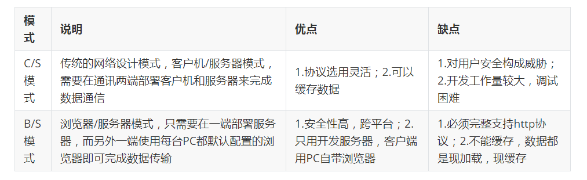
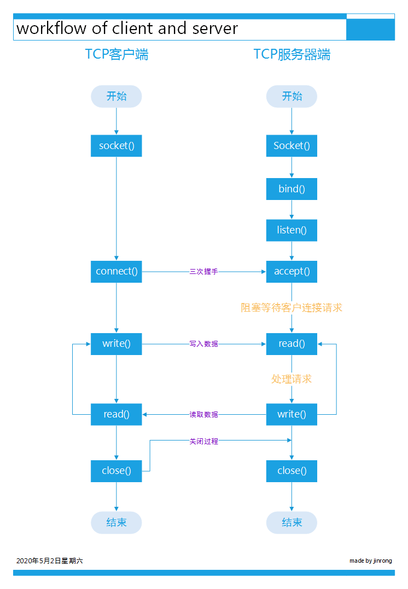

## 1.何谓socket套接字

维基百科给出了这样的解释：

>socket是一种操作系统提供的进程间通信机制。在操作系统中，通常会为应用程序提供一组应用程序接口（API），称为套接字接口（socket API）。应用程序可以通过套接字接口，来使用网络套接字，以进行数据交换。最早的套接字接口来自于4.2 BSD，因此现代常见的套接字接口大多源自Berkeley套接字（Berkeley sockets）标准。在套接字接口中，以IP地址及端口组成套接字地址（socket address）。远程的套接字地址，以及本地的套接字地址完成连线后，再加上使用的协议（protocol），这个五元组（five-element tuple），作为套接字对（socket pairs），之后就可以彼此交换数据。例如，在同一台计算机上，TCP协议与UDP协议可以同时使用相同的port而互不干扰。 操作系统根据套接字地址，可以决定应该将数据送达特定的行程或线程。这就像是电话系统中，以电话号码加上分机号码，来决定通话对象一般。

实际上它就是计算机之间进行通信的一种约定或一种方式。通过 socket 这种约定，一台计算机可以接收其他计算机的数据，也可以向其他计算机发送数据。socket 的典型应用就是 Web 服务器和浏览器：浏览器获取用户输入的URL，向服务器发起请求，服务器分析接收到的URL，将对应的网页内容返回给浏览器，浏览器再经过解析和渲染，就将文字、图片、视频等元素呈现给用户。

下面介绍几个常用概念：

**IP地址（IP Address）**

IP地址（Internet Protocol Address）是指互联网协议地址，它是IP协议提供的一种统一的地址格式，它为互联网上的每一个网络和每一台主机分配一个逻辑地址，以此来屏蔽物理地址的差异。正是有这样唯一的地址，就可以实现两台计算机点对点通信。我们的计算机并不知道 IP 地址对应的地理位置，当要通信时，只是将 IP 地址封装到要发送的数据包中，交给路由器去处理。路由器有非常智能和高效的算法，很快就会找到目标计算机，并将数据包传递给它，完成一次单向通信。

**端口（Port）**

有了 IP 地址，虽然可以找到目标计算机，但仍然不能进行通信。一台计算机可以同时提供多种网络服务，例如Web服务、FTP服务（文件传输服务）、SMTP服务（邮箱服务）等，仅有 IP 地址，计算机虽然可以正确接收到数据包，但是却不知道要将数据包交给哪个网络程序来处理，为了区分不同的网络程序，计算机会为每个网络程序分配一个独一无二的端口号（Port Number），例如，Web服务的端口号是 80，FTP 服务的端口号是 21，SMTP 服务的端口号是 25。端口（Port）是一个虚拟的、逻辑上的概念。可以将端口理解为一道门，数据通过这道门流入流出，每道门有不同的编号，就是端口号。

**协议（Protocol）**

协议（Protocol）就是网络通信的约定，通信的双方必须都遵守才能正常收发数据。协议有很多种，例如 TCP、UDP、IP 等，通信的双方必须使用同一协议才能通信。协议是一种规范，由计算机组织制定，规定了很多细节，例如，如何建立连接，如何相互识别等。协议仅仅是一种规范，必须由计算机软件来实现。所谓协议族（Protocol Family），就是一组协议（多个协议）的统称。最常用的是 TCP/IP 协议族，它包含了 TCP、IP、UDP、Telnet、FTP、SMTP 等上百个互为关联的协议，由于 TCP、IP 是两种常用的底层协议，所以把它们统称为 TCP/IP 协议族。

**数据传输方式**

计算机之间有很多数据传输方式，各有优缺点，常用的有两种：`SOCK_STREAM` 和 `SOCK_DGRAM`。

- `SOCK_STREAM` 表示面向连接的数据传输方式。数据可以准确无误地到达另一台计算机，如果损坏或丢失，可以重新发送，但效率相对较慢。常见的 http 协议就使用 `SOCK_STREAM` 传输数据，因为要确保数据的正确性，否则网页不能正常解析。

- `SOCK_DGRAM` 表示无连接的数据传输方式。计算机只管传输数据，不作数据校验，如果数据在传输中损坏，或者没有到达另一台计算机，是没有办法补救的。也就是说，数据错了就错了，无法重传。因为 `SOCK_DGRAM` 所做的校验工作少，所以效率比 `SOCK_STREAM` 高。

**IP地址和端口能够在互联网中定位到要通信的程序，协议和数据传输方式规定了如何传输数据，有了这些，两台计算机就可以通信了。**

套接字编程需要指定套接字的地址，先介绍一下以太网中套接字地址结构：
```c
/*  */
struct sockaddr_in {
	u8 sin_len;
	u8 sin_family;
	u16 sin_port;
	struct in_addr sin_addr;
	char sin_zero[8];
};
```
- sin_len：无符号字符类型，表示`sockaddr_in`结构的长度，为16。
- sin_family：无符号字符类型，通常设置为与 socket 函数的 domain 一致，例如 `AF_INET`。
- sin_port：无符号 short 类型，16位的端口号，网络字节序。
- sin_addr：struct in_addr 类型，其成员 s_addr 为无符号 32 位数，每8位表示 IP 地址的一个段，网络字节序，定义如下：
```c
struct in_addr {
	u32 s_addr;
};
```
- sin_zero：char 类型，保留。

## 2.TCP网络编程架构
网络应用编程设计模式及优缺点如下：



现在介绍 TCP网络C/S 模式编程框架，我们需要编写两个程序，一个是客户端，另一个是服务器端。它们的运作过程是服务器创建一个服务程序，等待客户端用户的连接，接收到用户的连接请求后，根据用户的请求进行处理；客户端根据目的服务器的地址和端口进行连接，向服务器发送请求并对服务器的响应进行数据处理。

TCP网络编程客户服务器运作流程图如下：




下面介绍相关函数：

### 2.1 socket函数

```c
// sys/socket.h
/* 使用协议__protocol在域__domain中创建一个__type类型的新套接字。 
   如果__protocol为零，则自动选择一个。 
   返回新套接字的文件描述符，或者返回-1表示错误。
*/
extern int socket (int __domain, int __type, int __protocol) __THROW;
```

- `__domain`：即family，`AF_INET`IPv4协议，`AF_INET6`IPv6协议；
- `__type`：`SOCK_STREAM`字节流套接字，`SOCK_DGRAM`数据报套接字，`SOCK_RAW`原始套接字；
- `__protocol`：`IPPROTO_TCP`TCP传输协议，`IPPROTO_UDP`UDP传输协议。

socket函数在成功时返回一个小的非负整数值，它与文件描述符类似，我们把它称为套接字描述符（socket descriptor），简称socketfd。

`AF_`前缀表示地址族，`PF_`前缀表示协议族 ，因为历史上曾想让一个协议族（PF）支持多个地址族（AF），用PF来创建套接字，用AF来创建套接字地址结构，然而就只是想想，没有实现。现在AF和PF的值是相等的。

```c
// bits/socket.h
/* Protocol families.  */
#define PF_INET     2   /* IP protocol family.  */
#define PF_INET6    10  /* IP version 6.  */
/* Address families.  */
#define AF_INET     PF_INET
#define AF_INET6    PF_INET6 
```

### 2.2 connect函数

```c
// sys/socket.h
#define __CONST_SOCKADDR_ARG   const struct sockaddr *
extern int connect (int __fd, __CONST_SOCKADDR_ARG __addr, socklen_t __len);
```

- `__fd`：socket函数返回的套接字描述符；
- `__addr`：指向套接字结构地址的指针；
- `__len`：该套接字的大小。

TCP客户用connect函数和TCP服务器建立连接。客户在调用connect函数前可以不调用bind函数，因为如果有需要，内核会确定本机IP地址，并选择一个临时端口作为源端口。

### 2.3 bind函数

```c
// sys/socket.h
/* 把一个本地协议地址赋值给一个套接字 */
#define __CONST_SOCKADDR_ARG   const struct sockaddr *
extern int bind (int __fd, __CONST_SOCKADDR_ARG __addr, socklen_t __len) __THROW;
```

- 对于IPv4来说，协议地址是32位的IPv4地址和16位的端口号组合。
- 对于IPv6来说，协议地址是128位的IPv6地址和16位的端口号组合。

绑定操作涉及3个对象：套接字，地址和端口。其中套接字是捆绑的主体，地址和端口是捆绑的客体。在套接字上绑定地址和端口表示：该地址和端口已经被套接字使用。

- 如果指定端口号为0，那么内核在bind被调用的时候选择一个临时端口。
- 如果指定IP地址是通配地址，那么内核将等到套接字已连接（TCP）或在套接字上发出数据报（UDP）时才选择一个本地IP地址。

对于IPv4来说，通配地址是0（`INADDR_ANY`），如果让内核帮套接字选择一个端口，那么必须注意，bind函数并不返回所选择的端口号。因为bind函数的_addr参数有const限定词，它无法返回所选的值。为了拿到内核选择的临时端口，必须调用`getsockname`函数来返回协议地址。

### 2.4 listen函数

```c
// sys/socket.h
extern int listen (int __fd, int __n) __THROW;
```

listen函数仅有TCP服务器调用，它做两件事：

1. 当socket函数创建一个套接字时，默认是主动套接字，listen函数将它变成被动套接字，指示内核应接受指向该套接字的连接请求。调用listen将导致套接字从`CLOSED`状态转换到`LISTEN`状态。
2. 第二个参数`__n`规定了内核应该为相应套接字排队的最大连接个数。内核为任意一个**监听套接字**维护两个队列，一个叫`未完成连接队列`，一个叫`已完成队列`。

- 未完成连接队列：每个处于三次握手中的TCP连接，套接字处于`SYN_RCVD`状态。
- 已完成连接队列：每个已完成三次握手的TCP连接，套接字处于`ESTABLISHED`状态。

这两个队列之和不能超过`__n`，否则就无法新建TCP连接，这就是SYN Flood攻击的原理。

### 2.5 accept函数

```c
// sys/socket.h
extern int accept (int __fd, __SOCKADDR_ARG __addr,socklen_t *__restrict __addr_len);
```

accept函数由TCP服务器调用，用于从`已完成连接队列`的队头返回下一个已完成连接。如果该队列为空，那么进程被投入睡眠。（默认套接字为阻塞方式）

参数`__addr`和`__addr_len`返回已连接的对端进程的协议地址，即返回客户端的协议地址。`__addr_len`是值-结果参数，返回内核存放在协议地址中实际的字节数。如果对客户端的协议地址不感兴趣，可以将指针置为NULL。

> 注意：
> 如果accept成功，返回值是又内核自动生成的全新描述符，称为已连接套接字。服务端与客户通信，将用这个套接字，服务完成后，这个套接字就被关闭。而参数__fd称为监听套接字， 一个服务仅仅创建一个监听套接字。

### 2.6 close函数

```c
// /usr/include/unistd.h
extern int close (int __fd);
```

close函数一般可以用来关闭套接字，并终止TCP连接。但是在并发服务器中，close函数仅仅将套接字描述符引用计数减1。所以并不能一定在TCP连接上发送FIN报文，如果想在TCP连接上发送FIN报文，可以用`shutdown`函数。


**本文先介绍到这里，下一篇文章将介绍socket在内核中的实现以及socket编程实例和数据捕获工具的使用。**

本文参考资料：

1.《UNIX网络编程卷1：套接字联网API（第3版）》

2.《Linux内核源代码情景分析》

