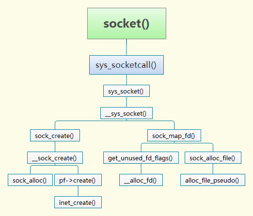

# Linux内核中socket函数的实现

本文将以socket函数为例，分析它在Linux4.19内核中的实现，先观此图，宏观上把握它在内核中的函数调用关系：




用户态程序调用socket函数，通过系统调用陷入内核。socket函数主要完成socket的创建，必要字段的初始化，关联传输控制块，绑定文件等任务，完成后返回socket绑定的文件描述符。用户态进入内核态是通过系统调用`sys_socket`实现，在内核中是通过`__sys_socket`函数实现其功能。

`SYSCALL_DEFINE3(socket, int, family, int, type, int, protocol)`最终会编译成`sys_socket`，`sys_socket`函数在`include\linux\syscalls.h`中的定义如下：

```c
/* net/socket.c */
asmlinkage long sys_socket(int, int, int);
```

`__sys_socket`函数主要工作如下：

1、`socket flags` 必要检查；
2、调用`sock_create()`，新建一个socket结构体及相关内容 ；
3、调用`sock_map_fd()`，新建一个struct file 并将file的`priv data`初始化为步骤2创建的socket，这样对文件的操作可以调用socket结构体定义的方法，并关联fd和file；
4、返回fd 。

`__sys_socket`函数在4.19内核中的原型如下：

```c
int __sys_socket(int family, int type, int protocol)
{
	int retval;
	struct socket *sock;
	int flags;

	/* Check the SOCK_* constants for consistency.  */
	BUILD_BUG_ON(SOCK_CLOEXEC != O_CLOEXEC);
	BUILD_BUG_ON((SOCK_MAX | SOCK_TYPE_MASK) != SOCK_TYPE_MASK);
	BUILD_BUG_ON(SOCK_CLOEXEC & SOCK_TYPE_MASK);
	BUILD_BUG_ON(SOCK_NONBLOCK & SOCK_TYPE_MASK);

	flags = type & ~SOCK_TYPE_MASK;
	if (flags & ~(SOCK_CLOEXEC | SOCK_NONBLOCK))
		return -EINVAL;
	type &= SOCK_TYPE_MASK;

	if (SOCK_NONBLOCK != O_NONBLOCK && (flags & SOCK_NONBLOCK))
		flags = (flags & ~SOCK_NONBLOCK) | O_NONBLOCK;

	retval = sock_create(family, type, protocol, &sock);
	if (retval < 0)
		return retval;

	return sock_map_fd(sock, flags & (O_CLOEXEC | O_NONBLOCK));
}

SYSCALL_DEFINE3(socket, int, family, int, type, int, protocol)
{
	return __sys_socket(family, type, protocol);
}
```

可以看到，除去一些参数合法性校验，socket函数主要由`sock_create`和`sock_map_fd`这两个函数完成，下面分别看这两个函数。

## 1. sock_create函数

`sock_create`函数主要由`__sock_create`函数来实现，主要工作为创建socket，并进行必要的初始化：

```c
int sock_create(int family, int type, int protocol, struct socket **res)
{
	return __sock_create(current->nsproxy->net_ns, family, type, protocol, res, 0);
}
EXPORT_SYMBOL(sock_create);
```

`__socket_create`函数主要工作如下：

1. domain域及协议合法性判断；   
2. 调用`sock_alloc()` 分配一个`struct socket`结构体和`inode`，并且标明inode是socket类型，这样对inode的操作最终可以调用socket操作；
3. 根据输入参数，查找`net_families`数组(该数组通过inet_init创建)，获得域(比如inet，unix)特定的socket创建函数；
4. 调用实际create函数，对于inet域是`inet_create()`。

```c
int __sock_create(struct net *net, int family, int type, int protocol,
			 struct socket **res, int kern)
{
	int err;
	struct socket *sock;
	const struct net_proto_family *pf;

	/*
	 *      Check protocol is in range
	 */
	if (family < 0 || family >= NPROTO)
		return -EAFNOSUPPORT;
	if (type < 0 || type >= SOCK_MAX)
		return -EINVAL;

	/* Compatibility.

	   This uglymoron is moved from INET layer to here to avoid
	   deadlock in module load.
	 */
	if (family == PF_INET && type == SOCK_PACKET) {
		pr_info_once("%s uses obsolete (PF_INET,SOCK_PACKET)\n",
			     current->comm);
		family = PF_PACKET;
	}

	err = security_socket_create(family, type, protocol, kern);
	if (err)
		return err;

	/*
	 *	Allocate the socket and allow the family to set things up. if
	 *	the protocol is 0, the family is instructed to select an appropriate
	 *	default.
	 */
	sock = sock_alloc();	/*创建struct socket结构体*/
	if (!sock) {
		net_warn_ratelimited("socket: no more sockets\n");
		return -ENFILE;	/* Not exactly a match, but its the
				   closest posix thing */
	}

	sock->type = type;	/*设置套接字类型*/

#ifdef CONFIG_MODULES
	/* Attempt to load a protocol module if the find failed.
	 *
	 * 12/09/1996 Marcin: But! this makes REALLY only sense, if the user
	 * requested real, full-featured networking support upon configuration.
	 * Otherwise module support will break!
	 */
	if (rcu_access_pointer(net_families[family]) == NULL)
		request_module("net-pf-%d", family);
#endif

	rcu_read_lock();
	pf = rcu_dereference(net_families[family]);	/*获取对应协议族的协议实例对象*/
	err = -EAFNOSUPPORT;
	if (!pf)
		goto out_release;

	/*
	 * We will call the ->create function, that possibly is in a loadable
	 * module, so we have to bump that loadable module refcnt first.
	 */
	if (!try_module_get(pf->owner))
		goto out_release;

	/* Now protected by module ref count */
	rcu_read_unlock();

	err = pf->create(net, sock, protocol, kern);
	if (err < 0)
		goto out_module_put;

	/*
	 * Now to bump the refcnt of the [loadable] module that owns this
	 * socket at sock_release time we decrement its refcnt.
	 */
	if (!try_module_get(sock->ops->owner))
		goto out_module_busy;

	/*
	 * Now that we're done with the ->create function, the [loadable]
	 * module can have its refcnt decremented
	 */
	module_put(pf->owner);
	err = security_socket_post_create(sock, family, type, protocol, kern);
	if (err)
		goto out_sock_release;
	*res = sock;

	return 0;

out_module_busy:
	err = -EAFNOSUPPORT;
out_module_put:
	sock->ops = NULL;
	module_put(pf->owner);
out_sock_release:
	sock_release(sock);
	return err;

out_release:
	rcu_read_unlock();
	goto out_sock_release;
}
EXPORT_SYMBOL(__sock_create);
```

### 1.1 sock_alloc函数

`sock_alloc`函数分配一个`struct socket_alloc`结构体，将sockfs相关属性填充在`socket_alloc`结构体的`vfs_inode`变量中，以限定后续对这个sock文件允许的操作。同时`sock_alloc`最终返回`socket_alloc`结构体的socket变量，用于后续操作：

```c
struct socket *sock_alloc(void)
{
	struct inode *inode;
	struct socket *sock;

    /*创建inode和socket*/
	inode = new_inode_pseudo(sock_mnt->mnt_sb);
	if (!inode)
		return NULL;

    /*返回创建的socket指针*/
	sock = SOCKET_I(inode);

    /*inode相关初始化*/
	inode->i_ino = get_next_ino();
	inode->i_mode = S_IFSOCK | S_IRWXUGO;
	inode->i_uid = current_fsuid();
	inode->i_gid = current_fsgid();
	inode->i_op = &sockfs_inode_ops;

	return sock;
}
EXPORT_SYMBOL(sock_alloc);
```

### 1.2 pf->create函数

pf由`net_families[]`数组获得，`net_families[]`数组定义如下：

```c
/*
 *	The protocol list. Each protocol is registered in here.
 */

static DEFINE_SPINLOCK(net_family_lock);
static const struct net_proto_family __rcu *net_families[NPROTO] __read_mostly;
```

`net_families[]`数组的初始化在`inet_init`函数：

```c
static const struct net_proto_family inet_family_ops = {
    .family = PF_INET,
    .create = inet_create,
    .owner  = THIS_MODULE,
};

static int __init inet_init(void)
{
...
    (void)sock_register(&inet_family_ops);
...
}

int sock_register(const struct net_proto_family *ops)
{
...
    rcu_assign_pointer(net_families[ops->family], ops);
...
}
```

`net_families[]`数组里存放的是各个协议族的信息，以family字段作为下标。此处我们针对TCP协议分析，因此我们family字段是`AF_INET`，`pf->create`函数将调用`inet_create`函数，该函数主要工作如下：

1. sock->state = SS_UNCONNECTED;	//socket 状态设置
2. 查找全局数组inetsw（在`inet_init`函数中初始化）中对应的协议操作集合，最重要的是`struct proto`和`struct proto_ops`，分别用于处理四层和socket相关的内容；
3. 调用`sk_alloc()`，分配一个`struct sock`，并将proto类型的指针指向第二步获得的内容。
4. `struct inet_sock` 是`struct sock`的超集，具体参见`include/net/inet_sock.h`中`inet_sock`的定义。初始化`inet_sock`，调用`sock_init_data`，形成socket和sock一一对应的关系，相互有指针指向对方。
5. 最后调用proto中注册的init函数，`err = sk->sk_prot->init(sk)`，如果对应于TCP，其函数指针指向`tcp_v4_init_sock`。

```c
static int inet_create(struct net *net, struct socket *sock, int protocol,
		       int kern)
{
	struct sock *sk;
	struct inet_protosw *answer;
	struct inet_sock *inet;
	struct proto *answer_prot;
	unsigned char answer_flags;
	int try_loading_module = 0;
	int err;

	if (protocol < 0 || protocol >= IPPROTO_MAX)
		return -EINVAL;

	sock->state = SS_UNCONNECTED;

	/* Look for the requested type/protocol pair. */
lookup_protocol:
	err = -ESOCKTNOSUPPORT;
	rcu_read_lock();
	list_for_each_entry_rcu(answer, &inetsw[sock->type], list) {

		err = 0;
		/* Check the non-wild match. */
		if (protocol == answer->protocol) {
			if (protocol != IPPROTO_IP)
				break;
		} else {
			/* Check for the two wild cases. */
			if (IPPROTO_IP == protocol) {
				protocol = answer->protocol;
				break;
			}
			if (IPPROTO_IP == answer->protocol)
				break;
		}
		err = -EPROTONOSUPPORT;
	}

	if (unlikely(err)) {
		if (try_loading_module < 2) {
			rcu_read_unlock();
			/*
			 * Be more specific, e.g. net-pf-2-proto-132-type-1
			 * (net-pf-PF_INET-proto-IPPROTO_SCTP-type-SOCK_STREAM)
			 */
			if (++try_loading_module == 1)
				request_module("net-pf-%d-proto-%d-type-%d",
					       PF_INET, protocol, sock->type);
			/*
			 * Fall back to generic, e.g. net-pf-2-proto-132
			 * (net-pf-PF_INET-proto-IPPROTO_SCTP)
			 */
			else
				request_module("net-pf-%d-proto-%d",
					       PF_INET, protocol);
			goto lookup_protocol;
		} else
			goto out_rcu_unlock;
	}

	err = -EPERM;
	if (sock->type == SOCK_RAW && !kern &&
	    !ns_capable(net->user_ns, CAP_NET_RAW))
		goto out_rcu_unlock;

	sock->ops = answer->ops;
	answer_prot = answer->prot;
	answer_flags = answer->flags;
	rcu_read_unlock();

	WARN_ON(!answer_prot->slab);

	err = -ENOBUFS;
	sk = sk_alloc(net, PF_INET, GFP_KERNEL, answer_prot, kern);
	if (!sk)
		goto out;

	err = 0;
	if (INET_PROTOSW_REUSE & answer_flags)
		sk->sk_reuse = SK_CAN_REUSE;

	inet = inet_sk(sk);
	inet->is_icsk = (INET_PROTOSW_ICSK & answer_flags) != 0;

	inet->nodefrag = 0;

	if (SOCK_RAW == sock->type) {
		inet->inet_num = protocol;
		if (IPPROTO_RAW == protocol)
			inet->hdrincl = 1;
	}

	if (net->ipv4.sysctl_ip_no_pmtu_disc)
		inet->pmtudisc = IP_PMTUDISC_DONT;
	else
		inet->pmtudisc = IP_PMTUDISC_WANT;

	inet->inet_id = 0;

	sock_init_data(sock, sk);

	sk->sk_destruct	   = inet_sock_destruct;
	sk->sk_protocol	   = protocol;
	sk->sk_backlog_rcv = sk->sk_prot->backlog_rcv;

	inet->uc_ttl	= -1;
	inet->mc_loop	= 1;
	inet->mc_ttl	= 1;
	inet->mc_all	= 1;
	inet->mc_index	= 0;
	inet->mc_list	= NULL;
	inet->rcv_tos	= 0;

	sk_refcnt_debug_inc(sk);

	if (inet->inet_num) {
		/* It assumes that any protocol which allows
		 * the user to assign a number at socket
		 * creation time automatically
		 * shares.
		 */
		inet->inet_sport = htons(inet->inet_num);
		/* Add to protocol hash chains. */
		err = sk->sk_prot->hash(sk);
		if (err) {
			sk_common_release(sk);
			goto out;
		}
	}

	if (sk->sk_prot->init) {
		err = sk->sk_prot->init(sk);
		if (err) {
			sk_common_release(sk);
			goto out;
		}
	}

	if (!kern) {
		err = BPF_CGROUP_RUN_PROG_INET_SOCK(sk);
		if (err) {
			sk_common_release(sk);
			goto out;
		}
	}
out:
	return err;
out_rcu_unlock:
	rcu_read_unlock();
	goto out;
}
```


## 2. sock_map_fd 函数

`sock_map_fd`函数负责分配文件，并与socket进行绑定，主要做两件事：

1. 调用`sock_alloc_file`，分配一个`struct file`，并将私有数据指针指向socket结构；
2. `fd_install` 对应文件描述符和file。

```c
static int sock_map_fd(struct socket *sock, int flags)
{
	struct file *newfile;
    /*分配文件描述符*/
	int fd = get_unused_fd_flags(flags);
	if (unlikely(fd < 0)) {
		sock_release(sock);
		return fd;
	}

    /*分配file对象*/
	newfile = sock_alloc_file(sock, flags, NULL);
	if (likely(!IS_ERR(newfile))) {
		fd_install(fd, newfile);
		return fd;
	}

	put_unused_fd(fd);
	return PTR_ERR(newfile);
}
```


本文先介绍到这里，下一篇文章将介绍socket网络编程实例和数据包捕获工具的使用。

