本文将编写一个简单的基于TCP协议的客户端和服务器端的实例，并使用wireshark工具捕获数据包。Wireshark是一款图形界面的网络嗅探器，支持多种平台，是网络流量分析的利器。

## 1.功能描述

- 客户端：连接服务器后从标准输入读取输入的字符串，发给服务器，并将从服务器接受到信息打印到标准输出。
- 服务器：接收到字符串后，发送接受到的总的字符串个数给客户端。

## 2.客户端

客户端程序执行流程如下：

- 建立套接字
- 初始化绑定网络地址
- 将套接字与网络地址绑定
- 设置侦听队列长度
- 接收客户端连接
- 收发数据
- 关闭套接字

客户端程序代码如下：

```c
/*客户端建立一个流式套接字，
  将服务器的地址和端口绑定到套接字描述符，
  连接服务器，进程处理，关闭连接
  */
#include <stdio.h>
#include <stdlib.h>
#include <strings.h>
#include <sys/types.h>
#include <sys/socket.h>
#include <unistd.h>
#include <netinet/in.h>
#include <arpa/inet.h>	/*inet_pton()*/

#define PORT 8888	/*侦听端口地址*/
void process_conn_client(int s); 

int main(int argc, char *argv[])
{
	int s;	/*定义socket描述符*/
	struct sockaddr_in server_addr;	/*服务器地址结构*/	
	int err;	/*返回值*/
	s = socket(AF_INET, SOCK_STREAM, 0);	/*建立一个流式套接字*/
	if(s < 0){	/*出错*/
		printf("socket error\n");
		return -1;
	}
	/*设置服务器地址*/
	bzero(&server_addr,sizeof(server_addr));	/*清零*/
	server_addr.sin_family = AF_INET;	/*协议族*/
	server_addr.sin_addr.s_addr = htonl(INADDR_ANY);	/*本地地址*/
	server_addr.sin_port = htons(PORT);	/*服务器地址*/
	/*将用户输入的字符串类型的IP转化为整型*/
	inet_pton(AF_INET, argv[1], &server_addr.sin_addr);
	/*连接服务器*/
	//connect(s, (struct socketaddr*)&server_addr, sizeof(struct socketaddr));
	connect(s, (struct sockaddr*)&server_addr, sizeof(struct sockaddr));
	process_conn_client(s);	/*客户端处理过程*/
	close(s);
}

/*客户端从标准输入读取数据到缓冲区buffer，
  发送到服务器，  从服务器读取服务器的响应，
  将数据发送到标准输出
  */
void process_conn_client(int s)
{
	ssize_t size = 0;
	char buffer[1024];	/*数据的缓冲区*/
	for(;;){	/*循环处理过程*/
		/*从标准输入读取数据到缓冲区buffer*/
		size = read(0, buffer, 1024);
		if(size > 0){	/*读到数据*/
			write(s, buffer, size);	/*发送给服务器*/
			size = read(s, buffer, 1024);	/*从服务器读取数据*/
			write(1, buffer, size);	/*写到标准输出*/
		}
	}
}
```

## 3.服务器端

服务器端执行流程如下：

- 建立一个流式套接字
- 将服务器的地址和端口绑定到套接字描述符
- 连接服务器
- 进程处理
- 关闭连接

服务器端程序代码如下：

```c
/*包含需要的头文件、定义侦听端口及侦听队列的长度*/
#include <stdio.h>
#include <stdlib.h>
#include <string.h>
#include <sys/types.h>
#include <sys/socket.h>
#include <unistd.h>
//#include <Linux/in.h>
#include <netinet/in.h>

#define PORT 8888	/*侦听端口地址*/
#define BACKLOG 2	/*侦听队列长度*/
int process_conn_server(int s);
int main(int argc, char *argv[])
{
	int ss,sc;	/*ss为服务器socket描述符，sc为客户端socket描述符*/
	struct sockaddr_in server_addr;	/*服务器地址结构*/
	struct sockaddr_in client_addr;	/*客户端地址结构*/
	int err;	/*返回值*/
	pid_t pid;
	/*建立一个AF_INET域的流式套接字*/
	ss = socket(AF_INET, SOCK_STREAM, 0);
	if(ss < 0){	/*出错*/
		printf("socket error\n");
		return -1;
	}
	/*设置服务器地址*/
	bzero(&server_addr, sizeof(server_addr));	/*清零*/
	server_addr.sin_family = AF_INET;	/*协议族*/
	server_addr.sin_addr.s_addr = htonl(INADDR_ANY);	/*本地地址*/
	server_addr.sin_port = htons((uint16_t)PORT);	/*服务器端口*/
	/*绑定地址结构到套接字描述符*/
	err = bind(ss, (struct sockaddr*)&server_addr, sizeof(server_addr));
	if(err < 0){	/*出错*/
		printf("bind error\n");
		return -1;
	}
	/*设置侦听队列长度为2*/
	err = listen(ss, BACKLOG);
	if(err < 0){
		printf("listen error\n");	/*出错*/
		return -1;
	}
	/*主循环过程*/
	for(;;){
		int addrlen = sizeof(struct sockaddr);
		sc = accept(ss, (struct sockaddr*)&client_addr, &addrlen);
		/*接受客户端连接*/
		if(sc < 0){	/*出错*/
			continue;	/*结束本次循环*/
		}
		/*建立一个新的进程处理到来的连接*/
		pid = fork();
		if(pid == 0){	/*子进程中*/
			close(ss);	/*在子进程中关闭服务器的侦听*/
			process_conn_server(sc);	/*处理连接*/
		}else{
			close(sc);	/*在父进程中关闭客户端的连接*/
		}
	}
}

/*服务器对客户端的处理*/
int process_conn_server(int s)
{
	ssize_t size = 0;
	char buffer[1024];	/*数据的缓冲区*/

	for(;;){	/*循环处理过程*/
		size = read(s, buffer, 1024);	/*从套接字中读取数据放到缓冲区buffer中*/
		if(size == 0){	/*没有数据*/
			return 0;
		}
		/* 构建响应字符，为接收到客户端字节的数量 */
		sprintf(buffer, "%ld bytes altogether\n", size);
		write(s, buffer, strlen(buffer)+1);	/*发给客户端*/
		printf("收到，处理并返回数据！\n");
	}
}
```

## 4.Makefile文件：

```makefile
all:client server       #all规则，它依赖于client和server规则

client:tcp_client.o     #client规则，生成客户端可执行程序
        gcc -o client tcp_client.o
server:tcp_server.o     #server规则，生成服务器端可执行文件
        gcc -o server tcp_server.o
clean:
        rm -f client server *.o
```

## 5.程序调试与结果

写好Makefile文件，在终端执行make命令，生成client和server两个可执行文件：

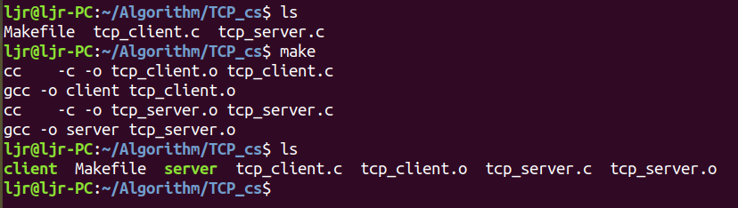

分别在两个终端运行server和client：

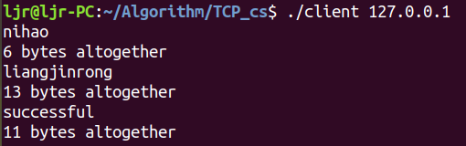

可以看到，客户端连接服务器后从标准输入读取输入的字符串，发给服务器。服务器接收到字符串后，发送接受到的总的字符串个数给客户端。客户端将从服务器接受到信息打印到标准输出。

## 6.wireshark捕获数据包
Wireshark是一款图形界面的网络嗅探器，支持多种平台，是网络流量分析的利器。它的创始人是Gerald Combs，前身是Ethereal，作为开源项目经过众多开发者的完善它已经成为使用量很大的安全工具之一。

### 6.1 安装和启动wireshark

安装倒也简单，直接使用如下命令安装：

```bash
sudo apt update
```

```bash
sudo apt install wireshark-qt
```
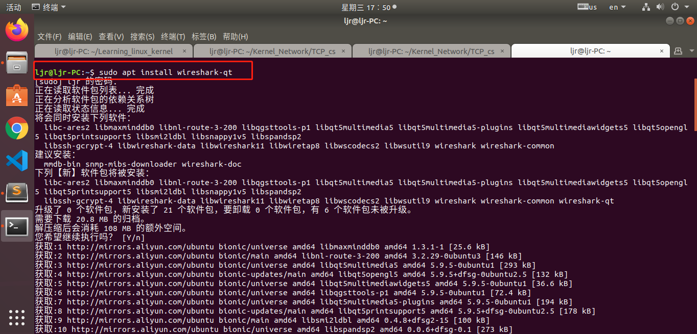


此时会弹出这个框子，我们选择“是”：


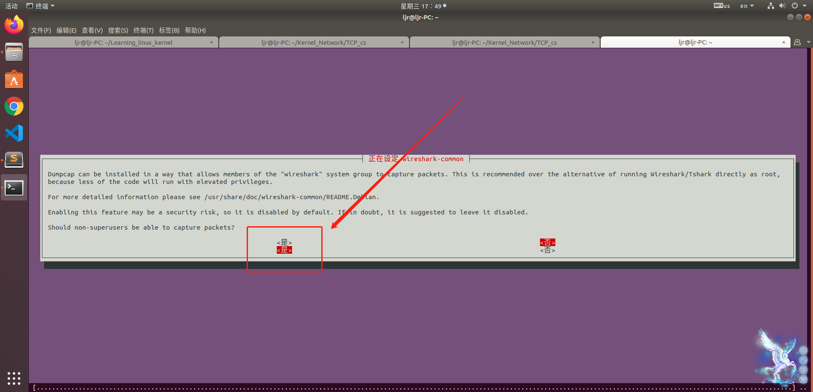


为了方便当前用户可以直接使用wireshark，我们需要把当前用户加入到wireshark组，方法为在wireshark组后面把当前用户名加上去保存退出，这样当前用户即可使用wireshark工具：

```bash
sudo vim /etc/group
```
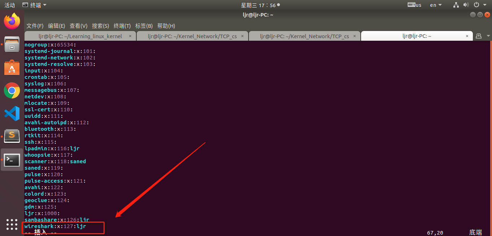


启动方法是在终端直接输入“sudo wireshark”：


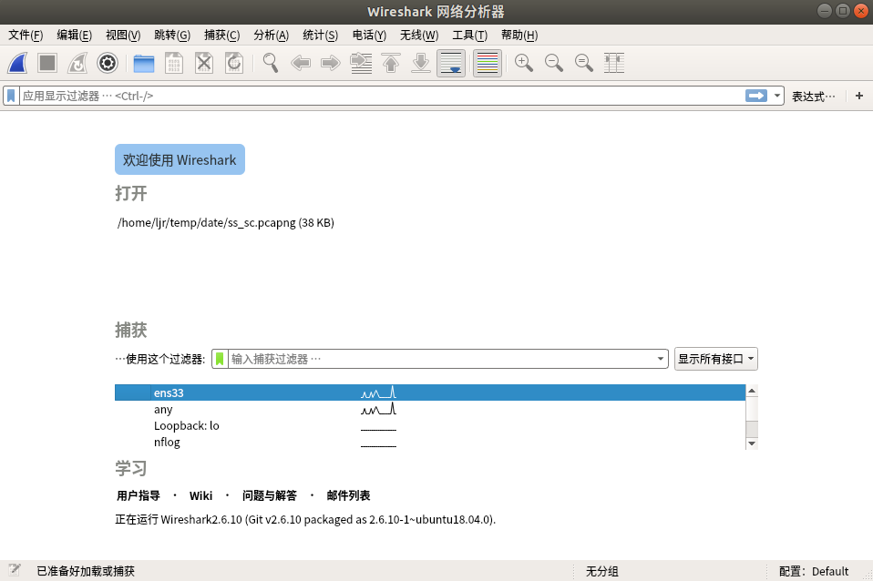

### 6.2 使用wireshark抓包
我在本地编写了一个 TCP 的 server 和 client，启动 server 和 client，由于本地的数据包是不经过网卡的，所以需要选择此项来进行抓包：

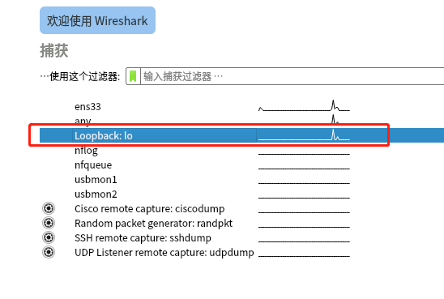


启动抓包，启动服务器端server和客户端client程序，客户端向服务器发送数据：


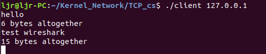


服务器收到并返回数据：


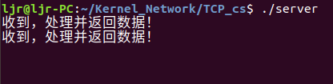

抓包结果如下：


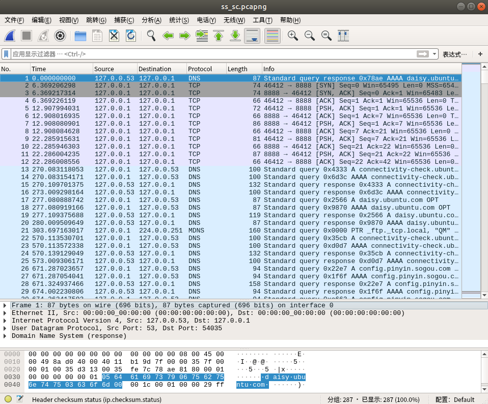


### 6.3 wireshark抓包分析

#### 6.3.1 包过滤

默认情况下，Wireshark会捕获大量的封包，我们不容易找到所需要的封包。这时就要用到wireshark过滤器。wireshark提供两种类型的过滤器，一种是捕获过滤器，一种是显示过滤器。

- 捕获过滤器：Capture（捕获）-->Options（选项）

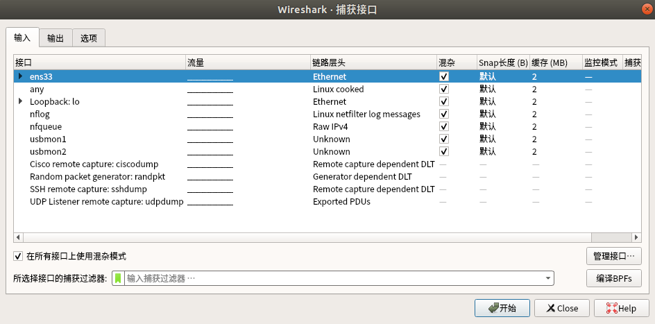

- 显示过滤器：输入过滤表达式并按下回车，例如只查看tcp协议8888端口的包：

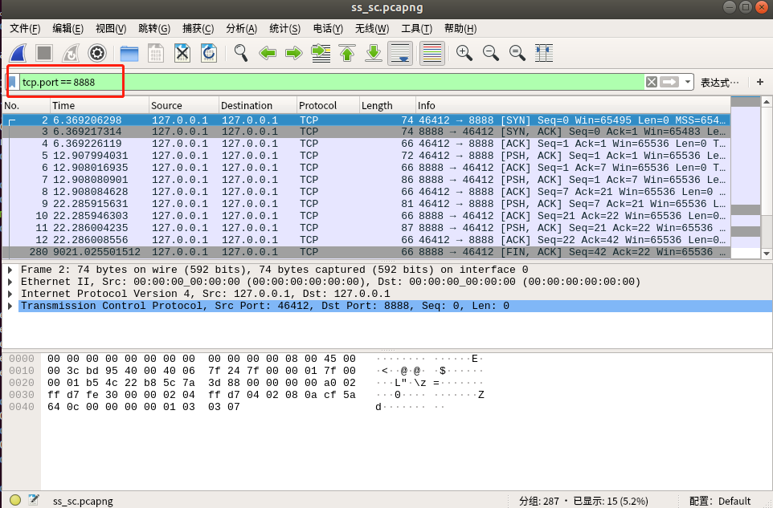

#### 6.3.2 分析功能

Wireshark有强大的统计分析功能，可以帮助分析人员快速统计出一些基本信息。点击Analyze（分析）-->Expert Info Composite（专家信息），就可以看到数据包的中的一些不同级别的信息统计，包含重传次数、链接建立次数、网络错误等，可以用在分析网络性能。

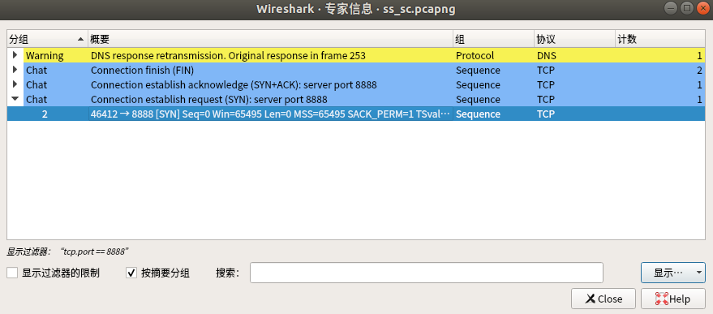

追踪流结果如下：

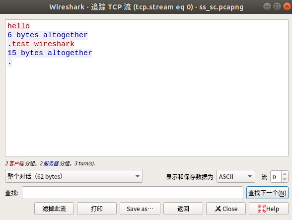


#### 6.3.3 统计数据

这部分功能可以统计分层信息、网络会话列表、网络端点列表、ip地址统计列表、应用层数据包信息等，还可以生成统计图表。


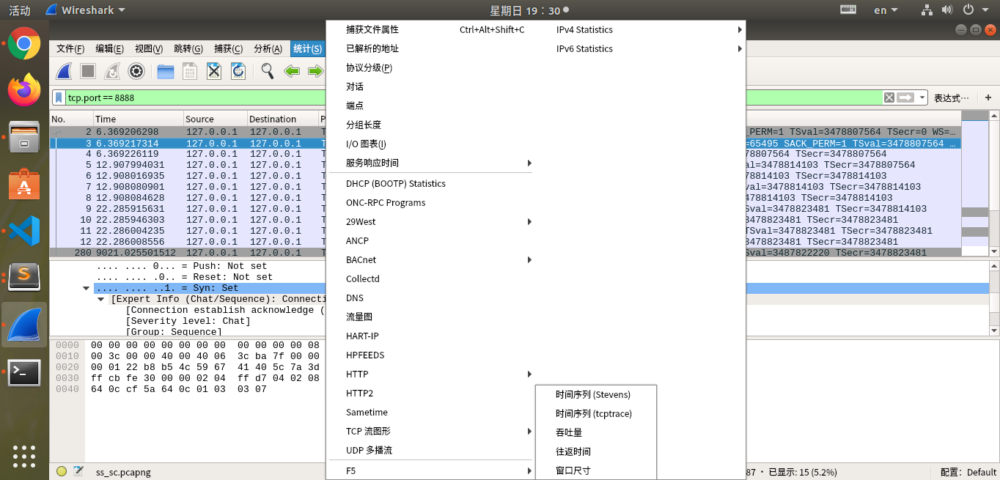


例如Statistics（统计）-->TCP Stream Graph（TCP流图形），可以生成一些统计图表：


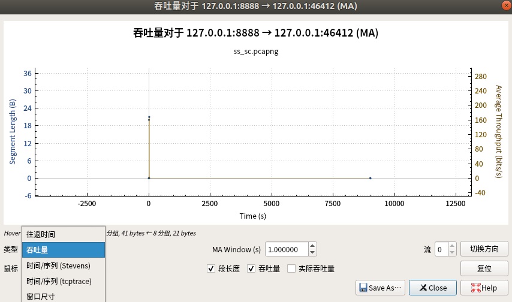

本文只是入门了解，其它功能和用法大家自己探索吧！