Linux网络命令较多，单纯的介绍网络命令的用法也没什么意思。本文将常见的网络命令进行分类，并画出思维导图，对每个分类的命令选择性的介绍其作用、常见选项和用法举例。BTW，不建议记住所有命令，了解一下有哪些分类，该分类下有哪些命令就好了，具体用到了再查。


# 1. 网络配置
## 1.1 ip
### 作用
ip命令用于配置网络，该命令很强大，强大到可以完全代替 ifconfig,netstat,route,arp 等。
### 常见选项

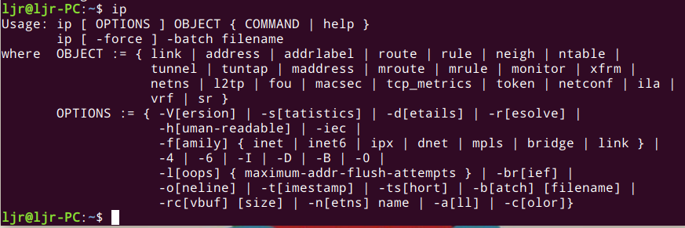


- 对象:所有对象的名称可以用完整或缩写形式书写，例如address可以缩写成addr或只是a。
>- link 网络设备
>- address 设备上的协议（IP或IPv6）地址
>- addrlabel 协议地址选择的标签配置
>- neighbour ARP或NDISC缓存条目
>- route 路由表条目
>- rule 路由策略数据库中的规则
>- maddress 组播地址
>- mroute 组播路由缓存条目
>- tunnel IP隧道
>- xfrm IPSec协议框架
- 选项
>- -V，-Version 显示指令版本信息
>- -s,-stats,statistics 输出详细信息
>- -r,-resolve 使用系统名称解析程序来打印DNS名称而不是主机地址
>- -h,-human,-human-readable 输出人类可读的统计信息和后缀
>- -f,-family FAMILY 指定要使用的协议族。协议族标识可以是inet、inet6、ipx、dnet或link之一。如果此选项不存在，则从其他参数中推测协议族。如果命令行的其余部分没有提供足够的信息来推测该族，则ip会退回到默认值，通常是inet或any。link是一个特殊的系列标识符，表示不涉及网络协议
>- -4 –family inet的快捷方式
>- -6 –family inet6的快捷方式
>- -0 –family link的快捷方式
>- -o,-oneline 将每条记录输出到一行，用’\’字符替换换行符

### 用法举例
- 设置 ip 地址和查看 ip 地址：

- 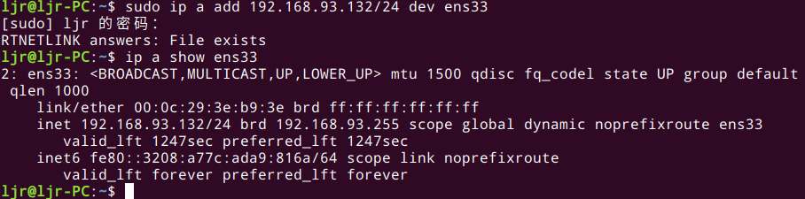


- 查看路由表

- 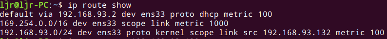


- 查看指定 ip 地址的路由包来源（本例中我输入的本机ip）：


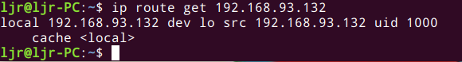


- 更改默认路由：
` sudo ip route add default via 默认路由`
- 显示网络统计数据：


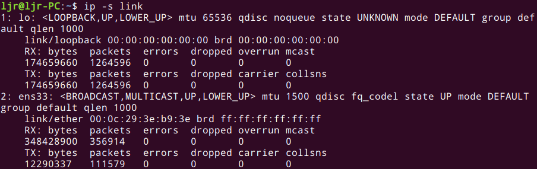


- 查看局域网设备MAC地址：
>地址解析协议（ARP）用于将一个IP地址转换成它对应的物理地址，也就是通常所说的MAC地址。
>

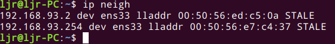


- 查看netlink消息：
>monitor选项允许查看网络设备的状态。比如，所在局域网的一台电脑根据它的状态可以被分类成REACHABLE或者STALE。
>

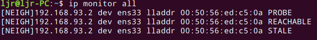


- 激活和停止网络设备：

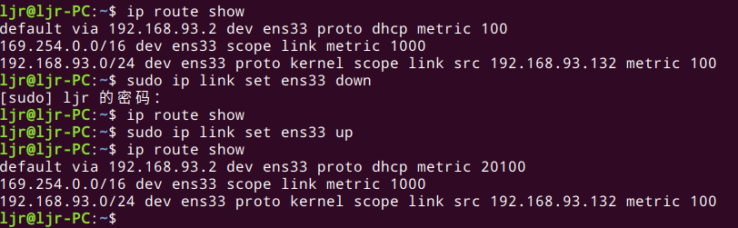

## 1.2 ifconfig
### 作用
ifconfig 是网卡配置工具（configure a network interface），可以用来查看网卡信息（IP地址，发送包数个数，接受包数，丢包数等）以及配置网卡（开启关闭网卡，修改网络mtu，修改IP地址等）。
### 常见选项

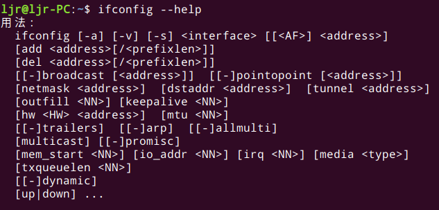

>- up 启动指定网络设备/网卡
>- down 关闭指定网络设备/网卡。该参数可以有效地阻止通过指定接口的IP信息流，如果想永久地关闭一个接口，我们还需要从核心路由表中将该接口的路由信息全部删除
>- arp 设置指定网卡是否支持ARP协议
>- -promisc 设置是否支持网卡的promiscuous模式，如果选择此参数，网卡将接收网络中发给它所有的数据包
>- -allmulti 设置是否支持多播模式，如果选择此参数，网卡将接收网络中所有的多播数据包
>- -a 显示全部接口信息
>-  -s 显示摘要信息（类似于 netstat -i）
>- add 给指定网卡配置IPv6地址
>- del 删除指定网卡的IPv6地址
>- <硬件地址> 配置网卡最大的传输单元
>- mtu<字节数> 设置网卡的最大传输单元 (bytes)
>- netmask<子网掩码> 设置网卡的子网掩码。掩码可以是有前缀0x的32位十六进制数，也可以是用点分开的4个十进制数。如果不打算将网络分成子网，可以不管这一选项；如果要使用子网，那么请记住，网络中每一个系统必须有相同子网掩码。
>- tunel 建立隧道
>- dstaddr 设定一个远端地址，建立点对点通信
>- -broadcast<地址> 为指定网卡设置广播协议
>- -pointtopoint<地址> 为网卡设置点对点通讯协议
>- multicast 为网卡设置组播标志
>- address 为网卡设置IPv4地址
>- txqueuelen<长度> 为网卡设置传输列队的长度
### 用法举例
- 查看网络接口状态


>- 第一行：ens33 表示第一块网卡，UP（代表网卡开启状态），RUNNING（代表网卡的网线被接上），MULTICAST（支持组播）MTU:1500（最大传输单元）：1500字节
>- 第二行：网卡的IP地址、子网掩码、广播地址（ 专门用于同时向网络中(通常指同一子网)所有工作站进行发送的一个地址）。此网卡的 IP地址是 `192.168.93.132`，子网掩码是`255.255.255.0`，广播地址是`192.168.93.255`
>- 第三行：IPv6地址
>- 第四行：ether表示网卡的物理地址，可以看到目前这个网卡的物理地址(MAC地址）是 `00:0c:29:3e:b9:3e`；txqueuelen 是传输缓区长度大小；连接类型是以太网
>- 第五~八行：接收、发送数据包情况统计
>- lo 是表示主机的回坏地址，这个一般是用来测试一个网络程序，但又不想让局域网或外网的用户能够查看，只能在此台主机上运行和查看所用的网络接口。比如把 HTTPD服务器的指定到回坏地址，在浏览器输入 127.0.0.1 就能看到你所架WEB网站了。但只是您能看得到，局域网的其它主机或用户无从知道。
第行：接收、发送数据包情况统计

- 关闭/开启网卡：
```
sudo ifconfig ens33 down
sudo ifconfig ens33 up
```
# 2. 连通性测试
## 2.1 ping
### 作用
用于网络连通性和网速测试。
### 常见参数

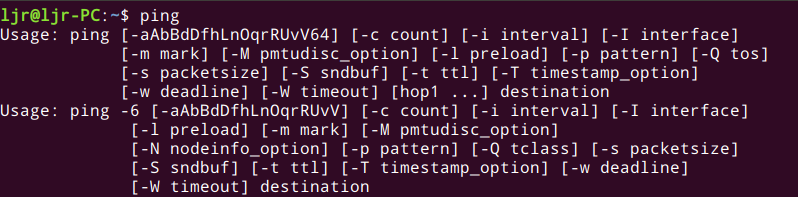

### 用法举例

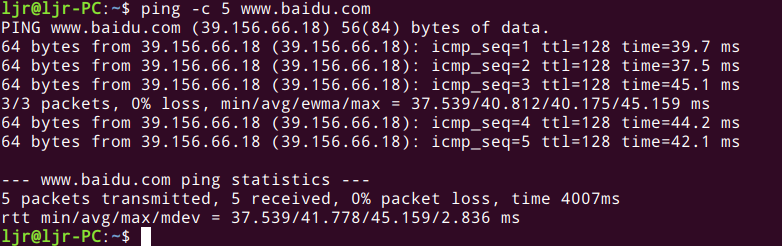

默认使用该命令会一直发送ICMP包直到用户手动中止，可以使用-c命令指定发送数据包的个数，使用-W指定最长等待时间，如果有多张网卡，还可以通过-I指定发送包的网卡。 在ping过程中按下ctrl+|会打印出当前的summary信息，统计当前发送包数量、接收数量、丢包率等。

## 2.2 traceroute
### 作用
traceroute 命令用来追踪网络数据包的路由途径。
### 常见选项
选项很多，用到时可以自行查看。

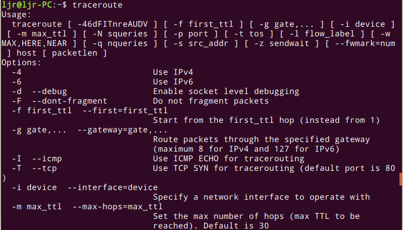

- 常用选项
>- -d 使用Socket层级的排错功能。
>- -f 设置第一个检测数据包的存活数值TTL的大小。
>- -F 设置勿离断位。
>- -g 设置来源路由网关，最多可设置8个。
>- -i 使用指定的网络界面送出数据包。
>- -I 使用ICMP回应取代UDP资料信息。
>- -m 设置检测数据包的最大存活数值TTL的大小。
>- -n 直接使用IP地址而非主机名称。
>- -p 设置UDP传输协议的通信端口。
>- -r 忽略普通的Routing Table，直接将数据包送到远端主机上。
>- -s 设置本地主机送出数据包的IP地址。
>- -t 设置检测数据包的TOS数值。
>- -v 详细显示指令的执行过程。
>- -w 设置等待远端主机回报的时间。
>- -x 开启或关闭数据包的正确性检验。
### 用法举例
本机连接到qq网站的数据包路由途径：

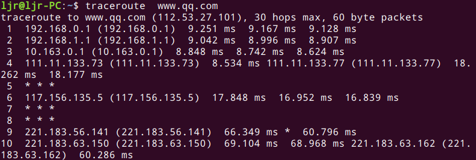

# 3. 网络连接
## 3.1 netstat
### 作用
查看当前建立的所有网络连接。
### 常见选项

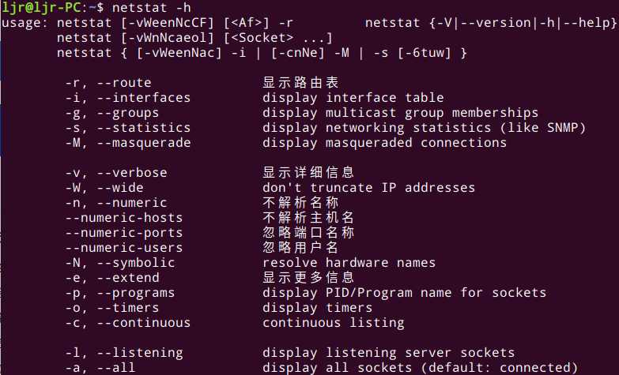

### 用法举例

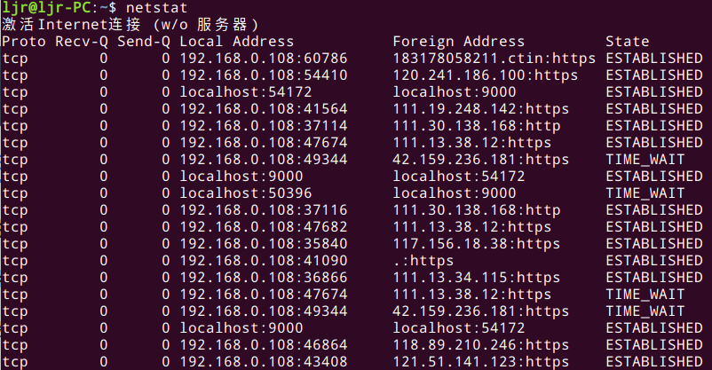

## 3.2 nc
### 作用
nc（netcat），功能强大的网络工具，可以作为网络应用的debug分析，创建不同类型的网络连接。功能很多，例如实现简单的聊天工具，模拟ssh登录远程主机，远程传输文件，端口扫描等。
### 常见选项

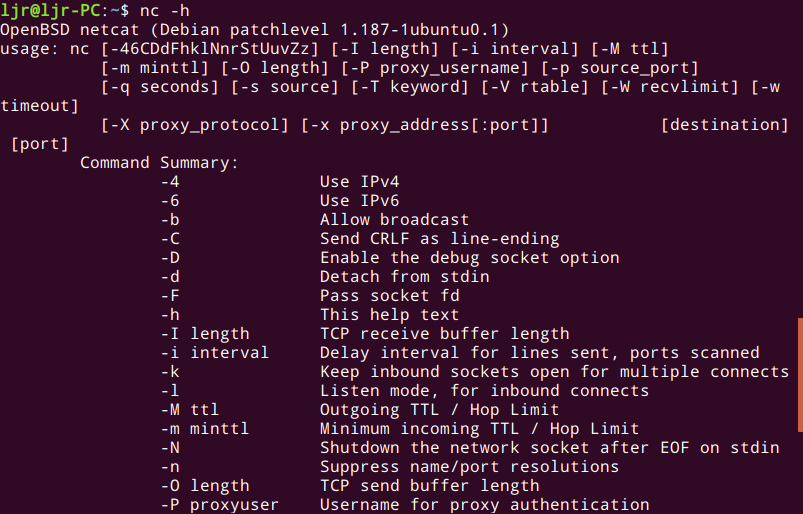

### 用法举例
扫描`192.168.0.1`的1~100端口：
```
nc -zv 192.168.0.1 1-100
```
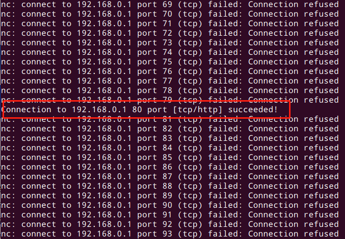

# 4. 流量统计
## iftop
### 作用
查看网络流量的工具（display bandwidth usage on an interface by host）。
### 常见选项

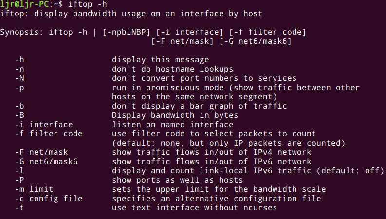

### 用法举例
直接使用`sudo iftop`命令：

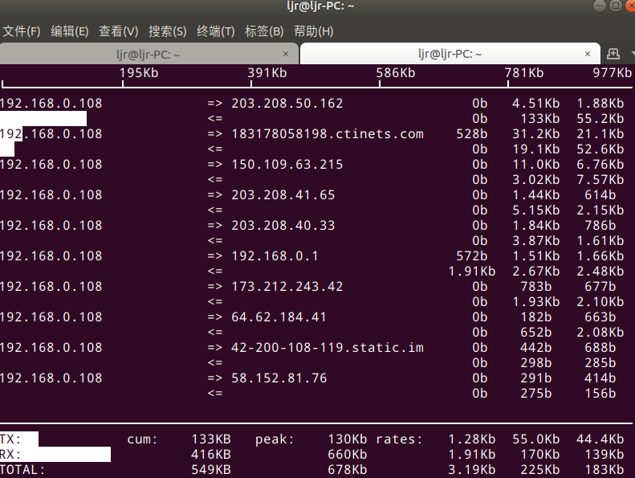

# 5. 交换与路由
## route
### 作用
route用于查看和修改路由表。
### 常见选项

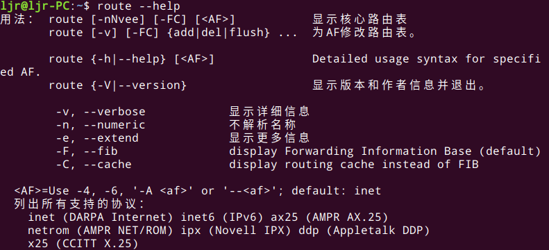

### 用法举例

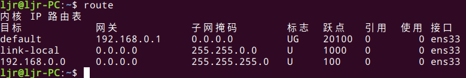

- 删除默认路由：
```
sudo route del default
```
- 增加默认路由，网关为A，网卡为B：
```
sudo route add default gw A dev B
```
# 6. 防火墙
## iptables
### 作用
强大的包过滤，处理工具，能够实现防火墙，NAT等功能。
### 常见选项

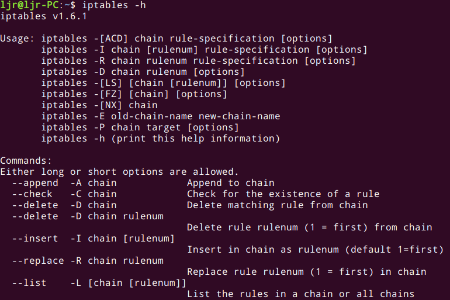

>-t<表>：指定要操纵的表；
-A：向规则链中添加条目；
-D：从规则链中删除条目；
-i：向规则链中插入条目；
-R：替换规则链中的条目；
-L：显示规则链中已有的条目；
-F：清楚规则链中已有的条目；
-Z：清空规则链中的数据包计算器和字节计数器；
-N：创建新的用户自定义规则链；
-P：定义规则链中的默认目标；
-h：显示帮助信息；
-p：指定要匹配的数据包协议类型；
-s：指定要匹配的数据包源ip地址；
-j<目标>：指定要跳转的目标；
-i<网络接口>：指定数据包进入本机的网络接口；
-o<网络接口>：指定数据包要离开本机所使用的网络接口。

### 用法举例
- iptables命令选项输入顺序：

>iptables -t 表名 <-A/I/D/R> 规则链名 [规则号] <-i/o 网卡名> -p 协议名 <-s 源IP/源子网> --sport 源端口 <-d 目标IP/目标子网> --dport 目标端口 -j 动作

- 表名包括：
>raw：高级功能，如：网址过滤。
mangle：数据包修改（QOS），用于实现服务质量。
net：地址转换，用于网关路由器。
filter：包过滤，用于防火墙规则。

- 规则链名包括：
>INPUT链：处理输入数据包。
OUTPUT链：处理输出数据包。
PORWARD链：处理转发数据包。
PREROUTING链：用于目标地址转换（DNAT）。
POSTOUTING链：用于源地址转换（SNAT）。

- 动作包括：

>accept：接收数据包。
DROP：丢弃数据包。
REDIRECT：重定向、映射、透明代理。
SNAT：源地址转换。
DNAT：目标地址转换。
MASQUERADE：IP伪装（NAT），用于ADSL。
LOG：日志记录。

- 查看已添加的iptables规则


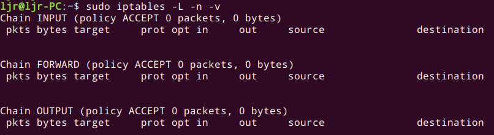

# 7. 域名
## host
### 作用
host命令是常用的分析域名查询工具，可以用来测试域名系统工作是否正常。
### 常见选项

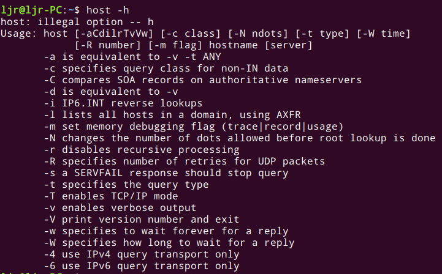

> -a：显示详细的DNS信息；
-c<类型>：指定查询类型，默认值为“IN“；
-C：查询指定主机的完整的SOA记录；
-r：在查询域名时，不使用递归的查询方式；
-t<类型>：指定查询的域名信息类型；
-v：显示指令执行的详细信息；
-w：如果域名服务器没有给出应答信息，则总是等待，直到域名服务器给出应答；
-W<时间>：指定域名查询的最长时间，如果在指定时间内域名服务器没有给出应答信息，则退出指令；
-4：使用IPv4；
-6：使用IPv6；
### 用法举例

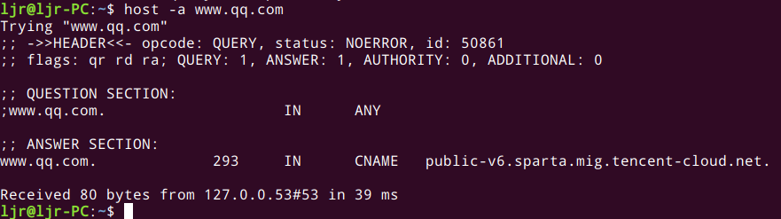

# 8. 抓包
## tcpdump
### 作用
tcpdump(dump traffic on a network)是一个命令行抓包工具，能抓任何协议的包（不仅仅是tcp）。
### 常见选项

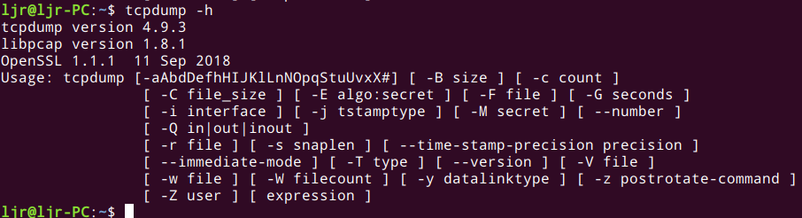

### 用法举例

抓取目标主机192.168.0.108（其实就是本机哈）通过端口80的包：

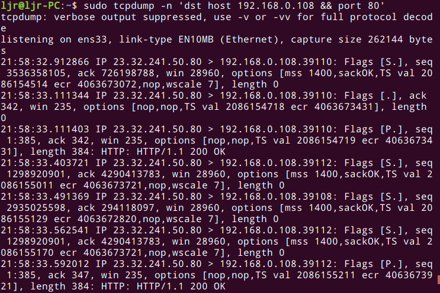

# 9. 网络传输
## 9.1 wget
### 作用
非交互网络下载工具。
### 常见选项
选项较多，可以用到时再查：

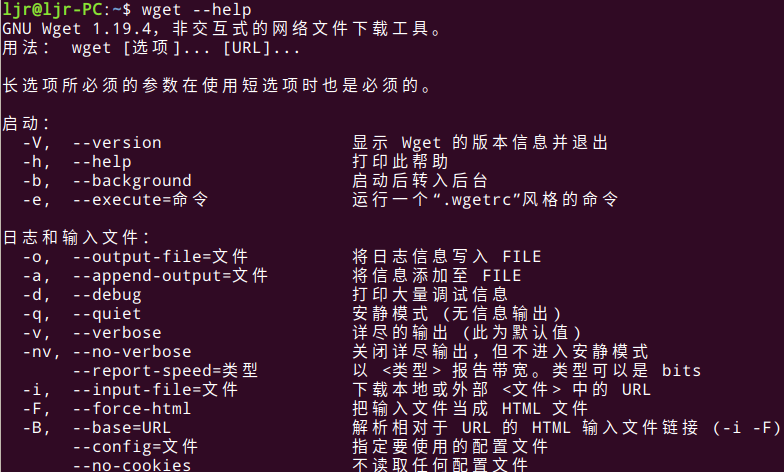

### 用法举例
- 最简单的方法就是加上文件url：
```
wget http://xxx/xxx/music.mp3
```
- 递归

使用-r可以递归下载的网页。默认递归深度为4，相当于爬虫，通过-l指定递归深度。

- 端点续传

默认不开启端点续传功能，传入-c参数后开启。

- 批量下载

可以吧多个URL写入文件，然后用-i指定下载文件列表：
```
wget -I download.txt
```
- 保存文件名

如果h不指定文件名，默认以最后一个符合/后面的字符作为保存文件名，手动-O指定保存文件名。

- 其他
>--limit-rate限制最大下载速度
 -b 后台下载
 -A 指定下载的文件格式

 - 镜像下载整个网站：
```
wget --mirror -p --convert-links -P baidu baidu.com
```
## 9.2 curl
### 作用
强大的URL传输工具，支持FILE, FTP, HTTP, HTTPS, IMAP, LDAP, POP3,RTMP, RTSP, SCP, SFTP, SMTP, SMTPS, TELNET以及TFTP等协议。 能模拟所有的浏览器的行为请求，例如refer，cookie，agent。也可以模拟表单数据。
### 常见选项
选项较多，用到时自己查：

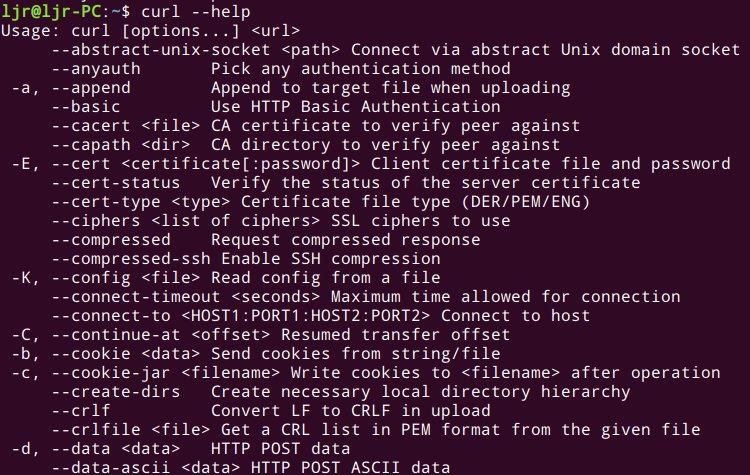

- 常用参数有：
>-i 显示头部信息
-I 只显示头部信息，不显示正文
-X 指定请求方法，比如GET、POST等
-d 发送数据
--form模拟表单，利用这个参数可以上传文件、模拟点击按钮等
-A 指定用户代理，比如Mozilla/4.0
-b 设置cookie
-c 指定cookie文件
-e 指定referer，有些网址必须从某个页面跳转过去
--header 设置请求的头部信息
--user 有些页面需要HTTP认证， 传递name:password认证

# 10. 总结
本文只介绍了常见的网络命令，主要来自net-tools和iproute2工具包，选项的截图并不完整，用到时请自查。若是随便看一下信息，传统工具就很好。但传统工具开销可能比较大且粒度太粗，其实市面上有很多开源工具，比如bcc，开销小，性能高，粒度够细，还能自定义获取内核信息。总之，看需求，用工具。

