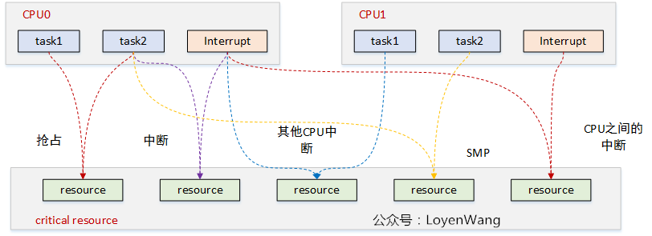
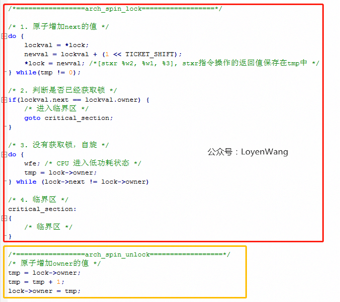
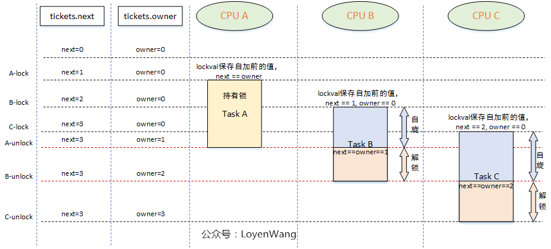
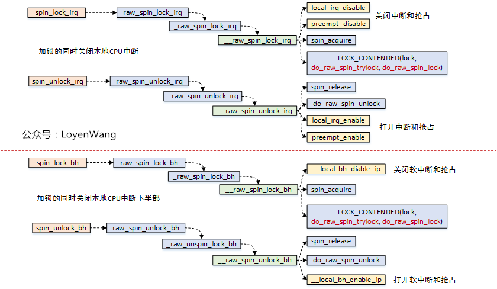
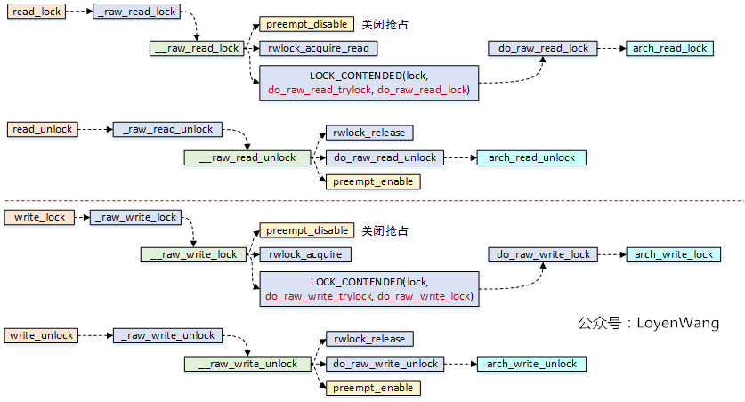
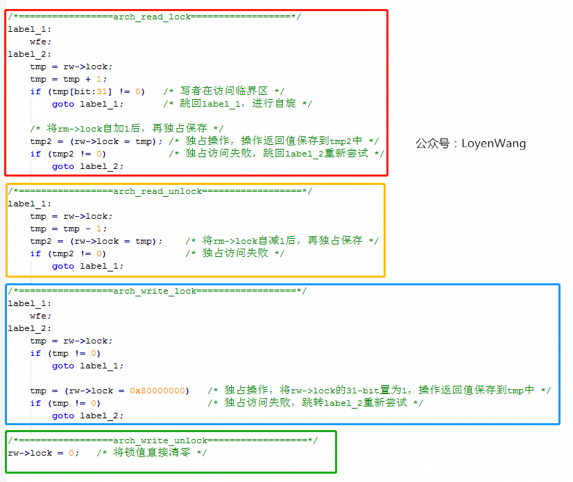
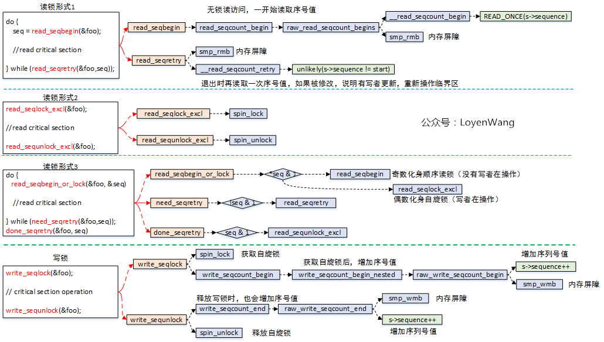

---

title: "linux spinlock/rwlock/seqlock原理剖析（基于ARM64）"
date: 2020-06-10T14:30:45+08:00
author: "作者：LoyenWang 编辑：梁金荣"
keywords: ["自旋锁"]
categories : ["内核同步"]
banner : "img/blogimg/spinlock.png"
summary : "spinlock就是大家熟知的自旋锁，它的特点是自旋锁保护的区域不允许睡眠，可以用在中断上下文中。自旋锁获取不到时，CPU会忙等待，并循环测试等待条件。自旋锁一般用于保护很短的临界区。本文将进一步揭开神秘的面纱。"

---

# 背景

- `Read the fucking source code!` --By 鲁迅
- `A picture is worth a thousand words.` --By 高尔基

说明：

1. Kernel版本：4.14
2. ARM64处理器，Contex-A53，双核
3. 使用工具：Source Insight 3.5， Visio

# 1. 概述

吹起并发机制研究的进攻号角了！

作为第一篇文章，应该提纲挈领的介绍下并发。
什么是并发，并发就是：你有两个儿子，同时抢一个玩具玩，你一巴掌打在你大儿子手上，小儿子拿到了玩具。
并发是指多个执行流访问同一个资源，并发引起竞态。

来张图吧：



图中每一种颜色代表一种竞态情况，主要归结为三类：

1. 进程与进程之间：单核上的抢占，多核上的SMP；
2. 进程与中断之间：中断又包含了上半部与下半部，中断总是能打断进程的执行流；
3. 中断与中断之间：外设的中断可以路由到不同的CPU上，它们之间也可能带来竞态；

目前内核中提供了很多机制来处理并发问题，`spinlock`就是其中一种。

`spinlock`，就是大家熟知的自旋锁，它的特点是自旋锁保护的区域不允许睡眠，可以用在中断上下文中。自旋锁获取不到时，CPU会忙等待，并循环测试等待条件。自旋锁一般用于保护很短的临界区。

下文将进一步揭开神秘的面纱。

# 2. spinlock原理分析

## 2.1 `spin_lock/spin_unlock`

先看一下函数调用流程：


- `spin_lock`操作中，关闭了抢占，也就是其他进程无法再来抢占当前进程了；
- `spin_lock`函数中，关键逻辑需要依赖于体系结构的实现，也就是`arch_spin_lock`函数；
- `spin_unlock`函数中，关键逻辑需要依赖于体系结构的实现，也就是`arch_spin_unlock`函数；

直接看`ARM64`中这个`arch_spin_lock/arch_spin_unlock`函数的实现吧：

```c
static inline void arch_spin_lock(arch_spinlock_t *lock)
{
	unsigned int tmp;
	arch_spinlock_t lockval, newval;

	asm volatile(
	/* Atomically increment the next ticket. */
	ARM64_LSE_ATOMIC_INSN(
	/* LL/SC */
"	prfm	pstl1strm, %3\n"
"1:	ldaxr	%w0, %3\n"
"	add	%w1, %w0, %w5\n"
"	stxr	%w2, %w1, %3\n"
"	cbnz	%w2, 1b\n",
	/* LSE atomics */
"	mov	%w2, %w5\n"
"	ldadda	%w2, %w0, %3\n"
	__nops(3)
	)

	/* Did we get the lock? */
"	eor	%w1, %w0, %w0, ror #16\n"
"	cbz	%w1, 3f\n"
	/*
	 * No: spin on the owner. Send a local event to avoid missing an
	 * unlock before the exclusive load.
	 */
"	sevl\n"
"2:	wfe\n"
"	ldaxrh	%w2, %4\n"
"	eor	%w1, %w2, %w0, lsr #16\n"
"	cbnz	%w1, 2b\n"
	/* We got the lock. Critical section starts here. */
"3:"
	: "=&r" (lockval), "=&r" (newval), "=&r" (tmp), "+Q" (*lock)
	: "Q" (lock->owner), "I" (1 << TICKET_SHIFT)
	: "memory");
}

static inline void arch_spin_unlock(arch_spinlock_t *lock)
{
	unsigned long tmp;

	asm volatile(ARM64_LSE_ATOMIC_INSN(
	/* LL/SC */
	"	ldrh	%w1, %0\n"
	"	add	%w1, %w1, #1\n"
	"	stlrh	%w1, %0",
	/* LSE atomics */
	"	mov	%w1, #1\n"
	"	staddlh	%w1, %0\n"
	__nops(1))
	: "=Q" (lock->owner), "=&r" (tmp)
	:
	: "memory");
}
```

> `spinlock`的核心思想是基于`tickets`的机制：
>
> 1. 每个锁的数据结构`arch_spinlock_t`中维护两个字段：`next`和`owner`，只有当`next`和`owner`相等时才能获取锁；
> 2. 每个进程在获取锁的时候，`next`值会增加，当进程在释放锁的时候`owner`值会增加；
> 3. 如果有多个进程在争抢锁的时候，看起来就像是一个排队系统，`FIFO ticket spinlock`；

上边的代码中，核心逻辑在于`asm volatile()`内联汇编中，有点迷糊吗？把核心逻辑翻译成C语言，类似于下边：



- `asm volatile`内联汇编中，有很多独占的操作指令，只有基于指令的独占操作，才能保证软件上的互斥，简单介绍如下：
  1. `ldaxr`：`Load-Acquire Exclusive Register derives an address from a base register value, loads a 32-bit word or 64-bit doubleword from memory, and writes it to a register`，从内存地址中读取值到寄存器中，独占访问；
  2. `stxr`：`Store Exclusive Register stores a 32-bit or a 64-bit doubleword from a register to memory if the PE has exclusive access to the memory address`，将寄存器中的值写入到内存中，并需要返回是否独占访问成功；
  3. `eor`：`Bitwise Exclusive OR`，执行独占的按位或操作；
  4. `ldadda`：`Atomic add on word or doubleword in memory atomically loads a 32-bit word or 64-bit doubleword from memory, adds the value held in a register to it, and stores the result back to memory`，原子的将内存中的数据进行加值处理，并将结果写回到内存中；
- 此外，还需要提醒一点的是，在`arch_spin_lock`中，当自旋等待时，会执行`WFE`指令，这条指令会让CPU处于低功耗的状态，其他CPU可以通过`SEV`指令来唤醒当前CPU。

如果说了这么多，你还是没有明白，那就再来一张图吧：



## 2.2 `spin_lock_irq/spin_lock_bh`

自旋锁还有另外两种形式，那就是在持有锁的时候，不仅仅关掉抢占，还会把本地的中断关掉，或者把下半部关掉（本质上是把软中断关掉）。
这种锁用来保护临界资源既会被进程访问，也会被中断访问的情况。

看一下调用流程图：



- 可以看到这两个函数中，实际锁的机制实现跟`spin_lock`是一样的；
- 额外提一句，`spin_lock_irq`还有一种变种形式`spin_lock_irqsave`，该函数会将当前处理器的硬件中断状态保存下来；

`__local_bh_disable_ip`是怎么实现的呢，貌似也没有看到关抢占？有必要前情回顾一下了，如果看过之前的文章的朋友，应该见过下边这张图片：


- `thread_info->preempt_count`值就维护了各种状态，针对该值的加减操作，就可以进行状态的控制；

# 3. rwlock读写锁

- 读写锁是自旋锁的一种变种，分为读锁和写锁，有以下特点：
  1. 可以多个读者同时进入临界区；
  2. 读者与写者互斥；
  3. 写者与写者互斥；

先看流程分析图：



看一下`arch_read_lock/arch_read_unlock/arch_write_lock/arch_write_unlock`源代码：

```c
static inline void arch_read_lock(arch_rwlock_t *rw)
{
	unsigned int tmp, tmp2;

	asm volatile(
	"	sevl\n"
	ARM64_LSE_ATOMIC_INSN(
	/* LL/SC */
	"1:	wfe\n"
	"2:	ldaxr	%w0, %2\n"
	"	add	%w0, %w0, #1\n"
	"	tbnz	%w0, #31, 1b\n"
	"	stxr	%w1, %w0, %2\n"
	"	cbnz	%w1, 2b\n"
	__nops(1),
	/* LSE atomics */
	"1:	wfe\n"
	"2:	ldxr	%w0, %2\n"
	"	adds	%w1, %w0, #1\n"
	"	tbnz	%w1, #31, 1b\n"
	"	casa	%w0, %w1, %2\n"
	"	sbc	%w0, %w1, %w0\n"
	"	cbnz	%w0, 2b")
	: "=&r" (tmp), "=&r" (tmp2), "+Q" (rw->lock)
	:
	: "cc", "memory");
}

static inline void arch_read_unlock(arch_rwlock_t *rw)
{
	unsigned int tmp, tmp2;

	asm volatile(ARM64_LSE_ATOMIC_INSN(
	/* LL/SC */
	"1:	ldxr	%w0, %2\n"
	"	sub	%w0, %w0, #1\n"
	"	stlxr	%w1, %w0, %2\n"
	"	cbnz	%w1, 1b",
	/* LSE atomics */
	"	movn	%w0, #0\n"
	"	staddl	%w0, %2\n"
	__nops(2))
	: "=&r" (tmp), "=&r" (tmp2), "+Q" (rw->lock)
	:
	: "memory");
}

static inline void arch_write_lock(arch_rwlock_t *rw)
{
	unsigned int tmp;

	asm volatile(ARM64_LSE_ATOMIC_INSN(
	/* LL/SC */
	"	sevl\n"
	"1:	wfe\n"
	"2:	ldaxr	%w0, %1\n"
	"	cbnz	%w0, 1b\n"
	"	stxr	%w0, %w2, %1\n"
	"	cbnz	%w0, 2b\n"
	__nops(1),
	/* LSE atomics */
	"1:	mov	%w0, wzr\n"
	"2:	casa	%w0, %w2, %1\n"
	"	cbz	%w0, 3f\n"
	"	ldxr	%w0, %1\n"
	"	cbz	%w0, 2b\n"
	"	wfe\n"
	"	b	1b\n"
	"3:")
	: "=&r" (tmp), "+Q" (rw->lock)
	: "r" (0x80000000)
	: "memory");
}

static inline void arch_write_unlock(arch_rwlock_t *rw)
{
	asm volatile(ARM64_LSE_ATOMIC_INSN(
	"	stlr	wzr, %0",
	"	swpl	wzr, wzr, %0")
	: "=Q" (rw->lock) :: "memory");
}
```

知道你们不爱看汇编代码，那么翻译成C语言的伪代码看看吧：



- 读写锁数据结构`arch_rwlock_t`中只维护了一个字段：`volatile unsigned int lock`，其中`bit[31]`用于写锁的标记，`bit[30:0]`用于读锁的统计；
- 读者在获取读锁的时候，高位`bit[31]`如果为1，表明正有写者在访问临界区，这时候会进入自旋的状态，如果没有写者访问，那么直接去自加`rw->lock`的值，从逻辑中可以看出，是支持多个读者同时访问的；
- 读者在释放锁的时候，直接将`rw->lock`自减1即可；
- 写者在获取锁的时候，判断`rw->lock`的值是否为0，这个条件显得更为苛刻，也就是只要有其他读者或者写者访问，那么都将进入自旋，没错，它确实很霸道，只能自己一个人持有；
- 写者在释放锁的时候，很简单，直接将`rw->lock`值清零即可；
- 缺点：由于读者的判断条件很苛刻，假设出现了接二连三的读者来访问临界区，那么`rw->lock`的值将一直不为0，也就是会把写者活活的气死，噢，是活活的饿死。

> 读写锁当然也有类似于自旋锁的关中断、关底半部的形式：`read_lock_irq/read_lock_bh/write_lock_irq/write_lock_bh`，原理都类似，不再赘述了。

# 4. seqlock顺序锁

- 顺序锁也区分读者与写者，它的优点是不会把写者给饿死。

来看一下流程图：



- 顺序锁的读锁有三种形式：
  1. 无加锁访问，读者在读临界区之前，先读取序列号，退出临界区操作后再读取序列号进行比较，如果发现不相等，说明被写者更新内容了，需要重新再读取临界区，所以这种情况下可能给读者带来的开销会大一些；
  2. 加锁访问，实际是`spin_lock/spin_unlock`，仅仅是接口包装了一下而已，因此对读和写都是互斥的；
  3. 在形式1和形式2中动态选择，如果有写者在写临界区，读者化身为自旋锁，没有写者在写临界区，则化身为顺序无锁访问；
- 顺序锁的写锁，只有一种形式，本质上是用自旋锁来保护临界区，然后再把序号值自加处理；
- 顺序锁也有一些局限的地方，比如采用读者的形式1的话，临界区中存在地址（指针）操作，如果写者把地址进行了修改，那就可能造成访问错误了；
- 说明一下流程图中的`smp_rmb/smp_wmb`，这两个函数是内存屏障操作，作用是告诉编译器内存中的值已经改变，之前对内存的缓存（缓存到寄存器）都需要抛弃，屏障之后的内存操作需要重新从内存`load`，而不能使用之前寄存器缓存的值，内存屏障就像是代码中一道不可逾越的屏障，屏障之前的`load/store`指令不能跑到屏障的后边，同理，后边的也不能跑到前边；
- 顺序锁也同样存在关中断和关下半部的形式，原理基本都是一致的，不再啰嗦了。

> 最近在项目中，遇到了RCU Stall的问题，下一个topic就先来看看RCU吧，其他的并发机制都会在路上，`Just keep growing and fuck everthing else`，收工！
>
> 欢迎关注公众号，不定期发布Linux内核机制探索文档。