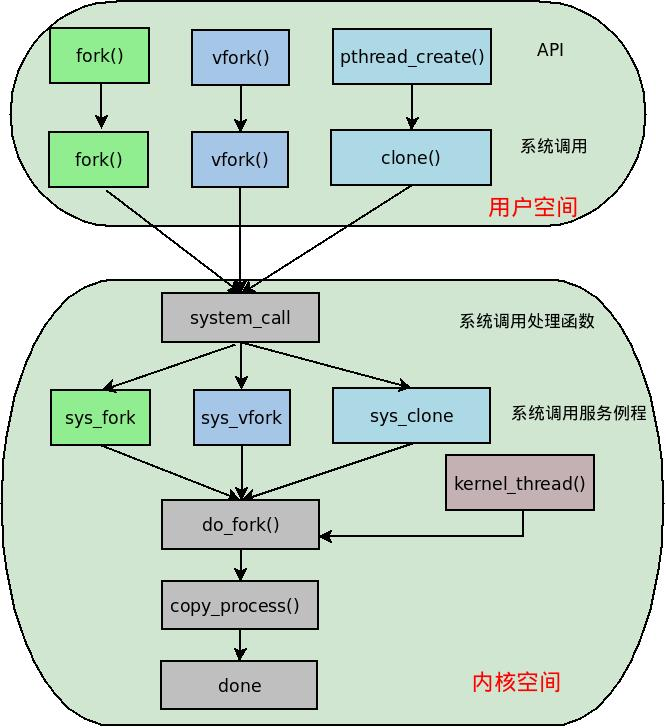

=======

# 线程的那些事儿

##### 1.线程

通过操作系统原理课，我们知道进程是系统资源分配的基本单位，线程是程序独立运行的基本单位。线程有时候也被称作小型进程，首先，这是因为多个线程之间是可以共享资源的；其次，多个线程之间的切换所花费的代价远远比进程低。

在用户态下，使用最广泛的线程操作接口即为POSIX线程接口，即pthread。通过这组接口可以进行线程的创建以及多线程之间的并发控制等。

##### 2.轻量级进程

如果内核要对线程进行调度，那么线程必须像进程那样在内核中对应一个数据结构。进程在内核中有相应的进程描述符，即task_struct结构。事实上，从Linux内核的角度而言，并不存在线程这个概念。内核对线程并没有设立特别的数据结构，而是与进程一样使用task_struct结构进行描述。也就是说线程在内核中也是以一个进程而存在的，只不过它比较特殊，它和同类的进程共享某些资源，比如进程地址空间，进程的信号，打开的文件等。我们将这类特殊的进程称之为轻量级进程（Light Weight Process）。

按照这种线程机制的理解，每个用户态的线程都和内核中的一个轻量级进程相对应。多个轻量级进程之间共享资源，从而体现了多线程之间资源共享的特性。同时这些轻量级进程跟普通进程一样由内核进行独立调度，从而实现了多个进程之间的并发执行。

##### 3.POSIX线程库的实现

用户线程和内核中轻量级进程的关联通常实在符合POSIX线程标准的线程库中完成的。支持轻量级进程的线程库有三个：LinuxThreads、NGPT（Next-Generation POSIX Threads）和NPTL（Native POSIX Thread Library）。由于LinuxThreads并不能完全兼容POSIX标准以及NGPT的放弃，目前Linux中所采用的线程库即为NPTL。

##### 4.线程组

POSIX标准规定在一个多线程的应用程序中，所有线程都必须具有相同的PID。从线程在内核中的实现可得知，每个线程其实都有自己的pid。为此，Linux引入了线程组的概念。在一个多线程的程序中，所有线程形成一个线程组。每一个线程通常是由主线程创建的，主线程即为调用pthread_create()的线程。因此该线程组中所有线程的pid即为主线程的pid。

对于线程组中的线程来说，其task_struct结构中的tpid字段保存该线程组中主线程的pid，而pid字段则保存每个轻量级进程的本身的pid。对于普通的进程而言，tgid和pid是相同的。事实上，getpid()系统调用中返回的是进程的tgid而不是pid。

##### 5.内核线程

上面所描述的都是用户态下的线程，而在内核中还有一种特殊的线程，称之为内核线程（Kernel Thread）。由于在内核中进程和线程不做区分，因此也可以将其称为内核进程。毫无疑问，内核线程在内核中也是通过task_struct结构来表示的。

内核线程和普通进程一样也是内核调度的实体，只不过他们有以下不同：

1).内核线程永远都运行在内核态，而不同进程既可以运行在用户态也可以运行在内核态。从另一个角度讲，内核线程只能之用大于PAGE_OFFSET（即3GB）的地址空间，而普通进程则可以使用整个4GB的地址空间。

2).内核线程只能调用内核函数，而普通进程必须通过系统调用才能使用内核函数。

<<<<<<< HEAD
**参考：**
=======
 **参考：**
>>>>>>> 69c6f203380e2a1d76a8ab1d9b165bec5c1a90dd

**1. 深入理解Linux内核 第三版**

# 进程在Linux内核中的角色扮演

在Linux内核中，内核将进程、线程和内核线程一视同仁，即内核使用唯一的数据结构task_struct来分别表示他们；内核使用相同的调度算法对这三者进行调度；并且内核也使用同一个函数do_fork()来分别创建这三种执行线程（thread of execution）。执行线程通常是指任何正在执行的代码实例，比如一个内核线程，一个中断处理程序或一个进入内核的进程。

这样处理无疑是简洁方便的，并且内核在统一处理这三者之余并没有失去他们本身所具有的特性。本文将结合进程、线程和内核线程的特性浅谈进程在内核中的角色扮演问题。

##### 1.进程描述符task_struct的多角色扮演

上述三种执行线程在内核中都使用统一的数据结构task_struct来表示。task_struct结构即所谓的进程描述符，它包含了与一个进程相关的所有信息。进程描述符中不仅包含了许多描述进程属性的字段，而且还有一系列指向其他数据结构的指针。下面将简单介绍进程描述符中几个比较特殊的字段，它们分别指向代表进程所拥有的资源的数据结构。

**mm字段**：指向mm_struct结构的指针，该类型用来描述进程整个的虚拟地址空间。

**fs字段**：指向fs_struct结构的指针，该类型用来描述进程所在文件系统的根目录和当前进程所在的目录信息。

**files字段**：指向files_struct结构的指针，该类型用来描述当前进程所打开文件的信息。

**signal字段**：指向signal_struct结构（信号描述符）的指针，该类型用来描述进程所能处理的信号。

对于普通进程来说，上述字段分别指向具体的数据结构以表示该进程所拥有的资源。

对应每个线程而言，内核通过轻量级进程与其进行关联。轻量级进程之所轻量，是因为它与其他进程共享上述所提及的进程资源。比如进程A创建了线程B，则B线程会在内核中对应一个轻量级进程。这个轻量级进程很自然的对应一个进程描述符，只不过B线程的进程描述符中的某些代表资源指针会和A进程中对应的字段指向同一个数据结构，这样就实现了多线程之间的资源共享。

由于内核线程只运行在内核态，并且只能由其他内核线程创建，所以内核线程并不需要和普通进程那样的独立地址空间。因此内核线程的进程描述符中的mm指针即为NULL。内核线程是否共享父内核线程的某些资源，则通过向内核线程创建函数kernel_thread()传递参数来决定。

通过上面的分析可以发现，内核中使用统一的进程描述符来表示进程、线程和内核线程，根据他们不同的特性，其进程描述符中某些代表资源的字段的指向会有所不同，以实现扮演不同角色。

##### 2.do_fork()的多角色扮演

进程、线程以及内核线程都有对应的创建函数，不过这三者所对应的创建函数最终在内核都是由do_fork()进行创建的，具体的调用关系图如下：

<<<<<<< HEAD
[]
=======

>>>>>>> 69c6f203380e2a1d76a8ab1d9b165bec5c1a90dd

从图中可以看出，内核中创建进程的核心函数即为看do_fork()，该函数的原型如下：

```c
long do_fork(unsigned long clone_flags,
	      unsigned long stack_start,
	      struct pt_regs *regs,
	      unsigned long stack_size,
	      int __user *parent_tidptr,
	      int __user *child_tidptr)
```

<<<<<<< HEAD
=======


>>>>>>> 69c6f203380e2a1d76a8ab1d9b165bec5c1a90dd
**stack_start**：子进程用户态堆栈的指针，该参数会被赋值给子进程的esp寄存器。

**regs**：指向通用寄存器值的指针，当进程从用户态切换到内核态时通用寄存器中的值会被保存到内核态堆栈中。

**stack_size**：未被使用，默认值为0。

**parent_tidptr**：该子进程的父进程用户态变量的地址，仅当CLONE_PARENT_SETTID被设置时有效。

**child_tidptr**：该子进程用户态变量的地址，仅当CLONE_CHILD_SETTID被设置时有效。

既然进程、线程和内核线程在内核中都是通过do_fork()完成创建的，那么do_fork()是如何体现其功能的多样性？其实，clone_flags参数在这里起到了关键作用，通过选取不同的标志，从而保证了do_fork()函数实现多角色——创建进程、线程和内核线程——功能的实现。clone_flags参数可取的标志很多，下面只介绍几个与本文相关的标志。

**CLONE_VIM**：子进程共享父进程内存描述符和所有的页表。

**CLONE_FS**：子进程共享父进程所在文件系统的根目录和当前工作目录。

**CLONE_FILES**：子进程共享父进程打开的文件。

**CLONE_SIGHAND**：子进程共享父进程的信号处理程序、阻塞信号和挂起的信号。使用该标志必须同时设置CLONE_VM标志。

如果创建子进程时设置了上述标志，那么子进程会共享这些标志所代表的父进程资源。

##### 2.1 进程的创建

在用户态程序中，可以通过fork()、vfork()和clone()三个接口函数创建进程，这三个函数在库中分别对应同名的系统调用。系统调用函数通过128号软中断进入内核后，会调用相应的系统调用服务例程。这三个函数对应的服务历程分别是sys_fork()、sys_vfork()和sys_clone()。

```c
int sys_fork(struct pt_regs *regs)
{
	return do_fork(SIGCHLD, regs->sp, regs, 0, NULL, NULL);
}

int sys_vfork(struct pt_regs *regs)
{
	return do_fork(CLONE_VFORK | CLONE_VM | SIGCHLD, regs->sp, regs, 0,
		       NULL, NULL);
}

long
sys_clone(unsigned long clone_flags, unsigned long newsp,
	  void __user *parent_tid, void __user *child_tid, struct pt_regs *regs)
{
	if (!newsp)
		newsp = regs->sp;
	return do_fork(clone_flags, newsp, regs, 0, parent_tid, child_tid);
}
<<<<<<< HEAD
```

=======

```


>>>>>>> 69c6f203380e2a1d76a8ab1d9b165bec5c1a90dd
**fork()**：由于do_fork()中clone_flags参数除了子进程结束时返回给父进程的SIGCHLD信号外并无其他特性标志，因此由fork()创建的进程不会共享父进程的任何资源。子进程会完全复制父进程的资源，也就是说父子进程相对独立。不过由于写时复制技术（Copy On Write，COW）的引入，子进程可以只读父进程的物理页，只有当两者之一去写某个物理页时，内核此时才会将这个页的内容拷贝到一个新的物理页，并把这个新的物理页分配给正在写的进程。

**vfork()**：do_fork()中的clone_flags使用了CLONE_VFORK和CLONE_VM两个标志。CLONE_VFORK标志使得子进程先于父进程执行，父进程会阻塞到子进程结束或执行新的程序。CLONE_VM标志使得子进程共享父进程的内存地址空间（父进程的页表项除外）。在COW技术引入之前，vfork()适用子进程形成后立马执行execv()的情形。因此，vfork()现如今已经没有特别的使用之处，因为写实复制技术完全可以取代它创建进程时所带来的高效性。

**clone()**：clone通常用于创建轻量级进程。通过传递不同的标志可以对父子进程之间数据的共享和复制作精确的控制，一般flags的取值为CLONE_VM|CLONE_FS|CLONE_FILES|CLONE_SIGHAND。由上述标志可以看到，轻量级进程通常共享父进程的内存地址空间、父进程所在文件系统的根目录以及工作目录信息、父进程当前打开的文件以及父进程所拥有的信号处理函数。

##### 2.2 线程的创建

每个线程在内核中对应一个轻量级进程，两者的关联是通过线程库完成的。因此通过pthread_create()创建的线程最终在内核中是通过clone()完成创建的，而clone()最终调用do_fork()。

##### 2.3 内核线程的创建

一个新内核线程的创建是通过在现有的内核线程中使用kernel_thread()而创建的，其本质也是向do_fork()提供特定的flags标志而创建的。

<<<<<<< HEAD
​```c
int kernel_thread(int (*fn)(void *), void *arg, unsigned long flags) { 
	struct pt_regs regs;  	
	return do_fork(flags | CLONE_VM | CLONE_UNTRACED, 0, &regs, 0, NULL, NULL);
} 
=======


```

```

```

```

​```C
`int kernel_thread(int (*fn)(void *), void *arg, unsigned long flags) { 	struct pt_regs regs;  	memset(&regs, 0, sizeof(regs));  	regs.si = (unsigned long) fn; 	regs.di = (unsigned long) arg;  #ifdef CONFIG_X86_32 	regs.ds = __USER_DS; 	regs.es = __USER_DS; 	regs.fs = __KERNEL_PERCPU; 	regs.gs = __KERNEL_STACK_CANARY; #else 	regs.ss = __KERNEL_DS; #endif  	regs.orig_ax = -1; 	regs.ip = (unsigned long) kernel_thread_helper; 	regs.cs = __KERNEL_CS | get_kernel_rpl(); 	regs.flags = X86_EFLAGS_IF | 0x2;  	/* Ok, create the new process.. */ 	return do_fork(flags | CLONE_VM | CLONE_UNTRACED, 0, &regs, 0, NULL, NULL); } `
>>>>>>> 69c6f203380e2a1d76a8ab1d9b165bec5c1a90dd
```

从上面的组合的flag可以看出，新的内核线程至少会共享父内核线程的内存地址空间。这样做其实是为了避免赋值调用线程的页表，因为内核线程无论如何都不会访问用户地址空间。CLONE_UNTRACED标志保证内核线程不会被任何进程所跟踪。

##### 3.进程的调度

由于进程、线程和内核线程使用统一数据结构来表示，因此内核对这三者并不作区分，也不会为其中某一个设立单独的调度算法。内核将这三者一视同仁，进行统一的调度。

**参考资料：**

**1. 深入理解Linux内核**

**2. Linux内核设计与实现**

<<<<<<< HEAD
# 线程那些事儿(2)-实践

=======


# 线程那些事儿(2)-实践


>>>>>>> 69c6f203380e2a1d76a8ab1d9b165bec5c1a90dd
在多线程程序中，一个新的线程通常由一个进程调用phtread_create()函数而诞生的。新线程创建后，通常将这个进程称为主线程。你也许会有所迷惑：一个进程怎么会编程线程？此刻有几个线程，几个进程？

其实通过[上文](http://edsionte.com/techblog/archives/3223)对线程、轻量级进程以及线程组之间关系的理解后，这个问题似乎也不难回答。我们可以将所有的进程都看作一个线程组，只不过普通进程的线程组只包含它自己一个线程，它不能与其他线程共享资源，只能独享自己的资源（而成为进程）。

如果你还对上述的描述有所疑惑，那么通过下面的实验结果可以理解的更加深刻。下述的程序就是一个普通的线程创建，只不过主线程和子线程增加了延时以方便我们查看实验结果。

```c
int *thread(void* arg)  

 {  

     pthread_t newthid;  

     newthid = pthread_self();//get the current thread's id  

     printf("this a new thread and thread ID is=%lu\n", newthid);  

     sleep(500);  

     return NULL;  

 }  

 int main()  

 {  

    pthread_t thid;  
    printf("main thread,ID is %lu\n", pthread_self());//get the main thread's id  

     if (pthread_create(&thid, NULL, (void *)thread, NULL) != 0) {  

         printf("thread creation failed\n");  

         exit(1);  

     }  

     printf("my Id is %lu, new thread ID is %lu\n", pthread_self(), thid);  

     sleep(1000);  

     return 0;  

 } 
```

我们带开一个终端（称为终端1）运行上述程序，再另一个终端（称为终端2）里使用ps -eLf命令查看系统当前的线程信息。

<<<<<<< HEAD
```
=======
​```c
>>>>>>> 69c6f203380e2a1d76a8ab1d9b165bec5c1a90dd
1 UID        PID  PPID   LWP  C NLWP STIME TTY          TIME CMD  

2 edsionte  2210  2208  2210  0    1 09:10 pts/0    00:00:00 bash  

3 edsionte  2429  2210  2429  0    2 09:52 pts/0    00:00:00 ./createthread  

4 edsionte  2429  2210  2430  0    2 09:52 pts/0    00:00:00 ./createthread  

5 edsionte  2431  2208  2431  5    1 09:52 pts/1    00:00:00 bash  

6 edsionte  2449  2431  2449  0    1 09:52 pts/1    00:00:00 ps -eLf 
```

请注意上述信息中三类ID信息：PID，PPID和LWP。LWP是轻量级进程的pid，NLWP为线程组中线程的个数。下面对上述的实验结果作以解释。

**1.运行实验程序的终端对应的pid为2210；**

**2.我们的实验程序产生了两个线程，其pid都是2429。这说明这两个线程是并列关系，它们属于同一个线程组，该线程组的pid为2429。**

**3.实验程序产生的两个线程的PPID均为2210，再次说明这两个线程之间没有父子关系，他们的父亲均为终端1对应的进程。**

**4.每个线程都与一个轻量级进程关联，因此两个线程的LWP不同，分别为2429和2430。**

**5.这两个线程形成一个线程组，因此他们对应的NLWP为2。**

**6.通过pid，ppid和LWP的分配情况可以看到，内核对于进程和轻量级进程的id分配是统一管理的，这源于他们使用相同的数据结构task_struct。**

<<<<<<< HEAD
上述分析基本上用实验结果诠释了进程、线程和轻量级进程之间的关系。

=======
上述分析基本上用实验结果诠释了进程、线程和轻量级进程之间的关系。
>>>>>>> 69c6f203380e2a1d76a8ab1d9b165bec5c1a90dd
