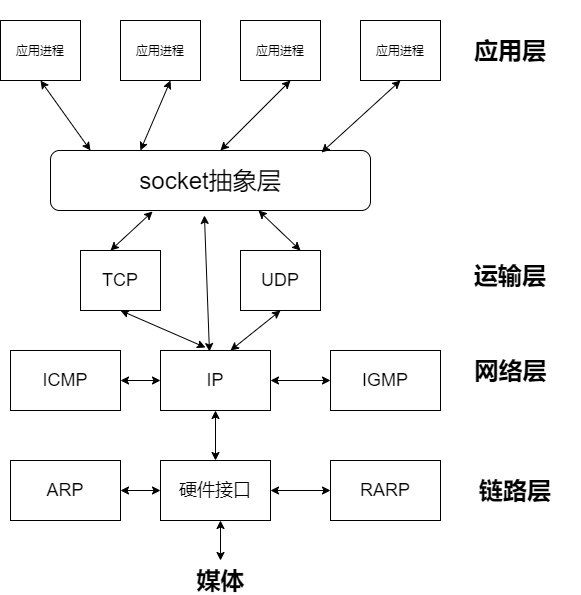
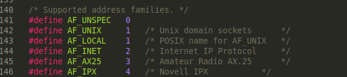
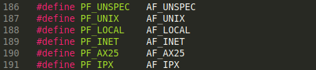

# 前言

所谓套接字(Socket)，就是对网络中不同主机上的应用进程之间进行双向通信的端点的抽象。一个套接字就是网络上进程通信的一端，提供了应用层进程利用网络协议交换数据的机制。从所处的地位来讲，套接字上联应用进程，下联网络协议栈，是应用程序通过网络协议进行通信的接口，是应用程序与网络协议根进行交互的接口。

# 1. 基本概念

## 1.1  Linux 中的 socket 是什么

socket 的原意是“插座”，在计算机通信领域，socket 被翻译为“套接字”，它是计算机之间进行通信的一种约定或一种方式。通过 socket 这种约定，一台计算机可以接收其他计算机的数据，也可以向其他计算机发送数据。我们把插头插到插座上就能从电网获得电力供应，同样，为了与远程计算机进行数据传输，需要连接到因特网，而 socket 就是用来连接到因特网的工具。


socket 的典型应用就是 Web 服务器和浏览器：浏览器获取用户输入的 URL，向服务器发起请求，服务器分析接收到的 URL，将对应的网页内容返回给浏览器，浏览器再经过解析和渲染，就将文字、图片、视频等元素呈现给用户。

Linux 系统中，为了统一对各种硬件的操作，简化接口，不同的硬件设备也都被看成一个文件。对这些文件的操作，等同于对磁盘上普通文件的操作。(通俗地说：Linux 中的一切都是文件！)

为了表示和区分已经打开的文件，Linux 会给每个文件分配一个 ID，这个 ID 就是一个整数，被称为文件描述符（File Descriptor）。例如：

- 通常用 0 来表示标准输入文件（stdin），它对应的硬件设备就是键盘；
- 通常用 1 来表示标准输出文件（stdout），它对应的硬件设备就是显示器。
  Linux 程序在执行任何形式的 I/O 操作时，都是在读取或者写入一个文件描述符。一个文件描述符只是一个和打开的文件相关联的整数，它的背后可能是一个硬盘上的普通文件、FIFO、管道、终端、键盘、显示器，甚至是一个网络连接。

我们可以通过 socket() 函数来创建一个网络连接，或者说打开一个网络文件，socket() 的返回值就是文件描述符。有了文件描述符，我们就可以使用普通的文件操作函数来传输数据了，例如：

- 用 read() 读取从远程计算机传来的数据；

- 用 write() 向远程计算机写入数据。

  只要用 socket() 创建了连接，剩下的就是文件操作了。

  **举个对比栗子：**

  **文件是如何进行读写的：**

  - **文件信息==>open()==>write/read**

  **socket套接字是如何进行数据传输的**

  - **数据==>socket()==>write/read/accetp/connect/setsocketopt等等....**

    **所以对于用户来说，socket就是一个打开的文件**

## 1.2 网络之间的通信 

网络层的“**ip地址**”可以唯一标识网络中的主机，而传输层的“**协议+端口**”可以唯一标识主机中的应用程序（进程）。这样利用三元组（ip地址，协议，端口）就可以标识网络的进程了，网络中的进程通信就可以利用这个标志与其它进程进行交互。下图可以看出socket在tcp/ip协议族中的地位。



## 1.3 套接字主要类型

### 1.3.1 流格式套接字（SOCK_STREAM）

流格式套接字（Stream Sockets）也叫“面向连接的套接字”，在代码中使用 SOCK_STREAM 表示。

SOCK_STREAM 是一种可靠的、双向的通信数据流，数据可以准确无误地到达另一台计算机，如果损坏或丢失，可以重新发送。

SOCK_STREAM 有以下几个特征：

- 数据在传输过程中不会消失；

- 数据是按照顺序传输的；

- 数据的发送和接收不是同步的。
  可以将 SOCK_STREAM 比喻成一条传送带，只要传送带本身没有问题（不会断网），就能保证数据不丢失；同时，较晚传送的数据不会先到达，较早传送的数据不会晚到达，这就保证了数据是按照顺序传递的。

  流格式套接字实际应用场景：浏览器所使用的 http 协议就基于面向连接的套接字，因为必须要确保数据准确无误，否则加载的 HTML 将无法解析。

  ## 1.3.2 数据报格式套接字（SOCK_DGRAM）

计算机只管传输数据，不作数据校验，如果数据在传输中损坏，或者没有到达另一台计算机，是没有办法补救的。也就是说，数据错了就错了，无法重传。因为数据报套接字所做的校验工作少，所以在传输效率方面比流格式套接字要高。总之，数据报套接字是一种不可靠的、不按顺序传递的、以追求速度为目的的套接字。

# 2. 初识Socket()函数

## 2.1 socket()原型


参数：

1、**domian** ——指定协议族

*为什么要指定协议族：*因为要使用的通信协议一定属于某个协议族，所以不指定协议族，就不能指定某个具体的协议；例如我们想使用TCP协议,TCP属于TCP/IP协议族中的子协议，所以必须先通过domian指定TCP/IP协议族，不过TCP/IP协议族有两个版本，分别是IPV4与IPV6，目前大多使用的还是IPV4。

**domian可设置的宏值**

AF_UNIX, AF_LOCAL，AF_INET ， AF_INET6 ，AF_IPX  ，AF_NETLINK，  AF_ATMPVC ，AF_APPLETALK  ，AF_PACKET，AF_UNSPEC （**常用的有 AF_INET 和 AF_INET6**。AF_INET 表示 IPv4 地址，例如 127.0.0.1；AF_INET6 表示 IPv6 地址，例如 1030::C9B4:FF12:48AA:1A2B。）

*AF*:全拼为address family，表示地址家族的意思，由于每个网络协议族的ip地址格式完全不同，因此在指定时需要做区分，所以这些AF_***宏就是用于说明所使用的是什么协议的ip地址。

其实区分不同协议族应该使用PF_UNIX, AF_LOCAL，PF_INET ， PF_INET6 ，PF_IPX  ，PF_NETLINK，  PF_ATMPVC ，PF_APPLETALK  ，PF_PACKET，PF_UNSPEC，PF就是protocol family的意思“协议家族”。

PF _与AF _不同的只是前缀，不过他们代表的值都是相等的，比如AF_UNSPEC=PF_UNSPEC，所以给domain指定AF__与指定PF_完全是一样的。

AF_用于区分不同协议族的ip地址格式，而PF_则用于区分不同的协议族，但是每个协议族的IP格式就一种，所以协议族与自己的IP格式其实是一对一的，因此如果你知道使用的是什么ip地址格式，其实你也就知道了使用的是什么协议族，所以使用AF_也可以用于区分不同的协议族。不过为了更加**正规**一点，所以区分不同协议族的宏还是**被命名为了PF**_只不过它的值就是AF的值。





2、**type**——套接字类型

type 为数据传输方式/套接字类型，常用的有 SOCK_STREAM（流格式套接字/面向连接的套接字） 和 SOCK_DGRAM（数据报套接字/无连接的套接字），经在1.3进行了介绍。

3、 **protocol** ——传输协议

常用的有 IPPROTO_TCP 和 IPPTOTO_UDP，分别表示 TCP 传输协议和 UDP 传输协议。

## 2.2 调用socket()——案例

```c
int tcp_socket = socket(AF_INET, SOCK_STREAM, IPPROTO_TCP);  //IPPROTO_TCP表示TCP协议
```

这种套接字称为 **TCP 套接字**。

如果使用 SOCK_DGRAM 传输方式，那么满足这两个条件的协议只有 UDP，因此可以这样来调用 socket() 函数：

```c
int udp_socket = socket(AF_INET, SOCK_DGRAM, IPPROTO_UDP);  //IPPROTO_UDP表示UDP协议
```

这种套接字称为 **UDP 套接字**。

一般情况下有了 AF和 type 两个参数就可以创建套接字了，操作系统会自动推演出协议类型，除非遇到这样的情况：有两种不同的协议支持同一种地址类型和数据传输类型。

上面两种情况都只有一种协议满足条件，**可以将 protocol 的值设为 0**，系统会自动推演出应该使用什么协议，如下所示：

```c
int tcp_socket = socket(AF_INET, SOCK_STREAM, 0);  //创建TCP套接字
int udp_socket = socket(AF_INET, SOCK_DGRAM, 0);  //创建UDP套接字
```

# 3. Struct socket分析

每个socket数据结构都有一个sock数据结构成员，sock是对socket的扩充，两者一一对应，socket->sk指向对应的sock，sock->socket 指向对应的socket；socket和sock是同一事物的两个侧面，**为什么不把两个数据结构合并成一个呢？**

**这是因为socket是inode结构中的一部分，即把inode结构内部的一个union用作socket结构。由于插口操作的特殊性，这个数据结构中需要有大量的结构成分，如果把这些成分全部放到socket结构中，则inode结构中的这个union就会变得很大，从而inode结构也会变得很大，而对于其他文件系统这个union是不需要这么大的，所以会造成巨大浪费，系统中使用inode结构的数量要远远超过使用socket的数量，故解决的办法就是把插口分成两部分，把与文件系统关系密切的放在socket结构中，把与通信关系密切的放在另一个单独结构sock中.**

用户使用socket系统调用编写应用程序时，通过一个数字来表示一个socket，所有的操作都在该数字上进行，这个数字称为套接字描述符。在系统调用 的实现函数里，这个数字就会被映射成一个表示socket的结构体，该结构体保存了该socket的所有属性和数据。在内核的协议实现中，关于表示 socket的结构体，是一个比较复杂的东西，下面一一介绍我们调用socket系统调用创建的各种不同类型的socket，开始创建的都是它，到后面，各种不同类型的socket在它的基础上进行 各种扩展。struct socket是在虚拟文件系统上被创建出来的，可以把它看成一个文件，是可以被安全地扩展的。

struct socket定义在**include/linux/net.h**中，socket结构体非常重要，其内容如下：

```c
struct socket {
	socket_state		state;       /* 套接字所用的流类型*/

	kmemcheck_bitfield_begin(type);
	short			type;            //套接字所处状态
	kmemcheck_bitfield_end(type);

	unsigned long		flags;       //标识字段

	struct socket_wq __rcu	*wq;     //包含了等待该套接字的进程队列
 
	struct file		*file;          //指向了和套接字相关联的file 结构
	struct sock		*sk;
	const struct proto_ops	*ops; // socket结构的操作集，此结构的域大部分是函数指针，socket操作函数集：bind, connect, accept等
};
```

 **state**用于表示socket所处的状态，是一个枚举变量，其类型定义如下： 

```c
typedef enum {

  SS_FREE = 0,      //该socket还未分配 

  SS_UNCONNECTED,     //未连向任何socket 

  SS_CONNECTING,     //正在连接过程中 

  SS_CONNECTED,      //已连向一个socket 

  SS_DISCONNECTING    //正在断开连接的过程中 

}socket_state; 
```

**struct proto_ops** 是协议相关的一组操作集，里面包含了几乎所有的协议操作函数，所以 socket 描述符可以发起各类操作函数，源码部分截图如下


**总结：**socket结构体中定义了socket的基本状态，类型，标志，等待队列，文件指针，操作函数集等

# 4. 创建socket的部分系统调用

## 4.1 应用层调用socket 函数

 为了执行网络I/O，一个进程必须做的第一件事就是调用socket函数，指定期望的通信协议类型。返回一个与socket关联的fd。

## 4.2 sys_socketcall系统调用

sys_socketcall几乎是用户进程socket所以操作函数的入口

在用户进程中，socket(int domain, int type, int protocol) 函数用于创建socket并返回一个与socket关联的fd，该函数实际执行的是系统调用 sys_socketcall，sys_socketcall几乎是用户进程socket所有操作函数的入口。

`asmlinkage long sys_socketcall(int call, unsigned long __user *args);`

## 4.2.1 SYSCALL_DEFINE2部分注释

sys_socketcall 实际调用的是 SYSCALL_DEFINE2：

/** SYSCALL_DEFINE2 (net/socket.c)*/

```c
SYSCALL_DEFINE2(socketcall, int, call, unsigned long __user *, args)
{
    unsigned long a[AUDITSC_ARGS];
    unsigned long a0, a1;
    int err;
    unsigned int len;
    // 省略...
    a0 = a[0];
    a1 = a[1];

    switch (call) {
    case SYS_SOCKET:
        // 与 socket(int domain, int type, int protocol) 对应，创建socket
        err = sys_socket(a0, a1, a[2]);  
        break;
    case SYS_BIND:
        err = sys_bind(a0, (struct sockaddr user *)a1, a[2]); 
        break;
    case SYS_CONNECT:
        err = sys_connect(a0, (struct sockaddr user *)a1, a[2]);
        break;

// 省略...
}

```

### 4.2.2 总结

SYSCALL_DEFINE2 函数中，通过判断call指令，来统一处理 socket 相关函数的事务

## 4.3 SYSCALL_DEFINE3

对于socket(…)函数，实际处理是在 sys_socket 中，也是一个系统调用，对应的是 SYSCALL_DEFINE3(socket, int, family, int, type, int, protocol),SYSCALL_DEFINE3 中调用 sock_create 创建 socket 结构，使用 sock_map_fd 将socket 结构映射为文件描述符并返回。

## 4.3.1 SYSCALL_DEFINE3部分注释

/** SYSCALL_DEFINE3 net/socket.c*/

```c
SYSCALL_DEFINE3(socket, int, family, int, type, int, protocol)
{
    int retval;
    struct socket *sock;
    int flags;
    // SOCK_TYPE_MASK: 0xF； SOCK_STREAM等socket类型位于type字段的低4位
    // 将flag设置为除socket基本类型之外的值
    flags = type & ~SOCK_TYPE_MASK;

    // 如果flags中有除SOCK_CLOEXEC或者SOCK_NONBLOCK之外的其他参数，则返回EINVAL
    if (flags & ~(SOCK_CLOEXEC | SOCK_NONBLOCK))
        return -EINVAL;
    
    // 取type中的后4位，即sock_type，socket基本类型定义
    type &= SOCK_TYPE_MASK;
    
    // 如果设置了SOCK_NONBLOCK，则不论SOCK_NONBLOCK定义是否与O_NONBLOCK相同，
    // 均将flags中的SOCK_NONBLOCK复位，将O_NONBLOCK置位
    if (SOCK_NONBLOCK != O_NONBLOCK && (flags & SOCK_NONBLOCK))
        flags = (flags & ~SOCK_NONBLOCK) | O_NONBLOCK;
    
    // 创建socket结构
    retval = sock_create(family, type, protocol, &sock);
    if (retval < 0)
        goto out;
    
    if (retval == 0)
        sockev_notify(SOCKEV_SOCKET, sock);
    
    // 将socket结构映射为文件描述符retval并返回
    retval = sock_map_fd(sock, flags & (O_CLOEXEC | O_NONBLOCK));
    if (retval < 0)
        goto out_release;

out:
    return retval;
out_release:
    sock_release(sock);
    return retval;
}
```

## 4.3.2 sock_create分析：

sock_create 实际调用的是_ sock_create，socket_create 检查了地址族协议和socket类型，同时，调用 security_socket_create 检查创建socket的权限（如：创建不同类型不同地址族socket的SELinux权限也会不同）

/** __sock_create (net/socket.c)*/

```c
int __sock_create(struct net *net, int family, int type, int protocol,
             struct socket **res, int kern)
{
    int err;
    struct socket *sock;
    const struct net_proto_family *pf;

    // 检查是否是支持的地址族，即检查协议
    if (family < 0 || family >= NPROTO)
        return -EAFNOSUPPORT;
    // 检查是否是支持的socket类型
    if (type < 0 || type >= SOCK_MAX)
        return -EINVAL;
    
    // 省略...
    
    // 检查权限，并考虑协议集、类型、协议，以及 socket 是在内核中创建还是在用户空间中创建
    err = security_socket_create(family, type, protocol, kern);
    if (err)
        return err;
    
    // 分配socket结构，这其中创建了socket和关联的inode 
    sock = sock_alloc();
    if (!sock) {
        net_warn_ratelimited("socket: no more sockets\n");
        return -ENFILE; /* Not exactly a match, but its the
                   closest posix thing */
    }
    sock->type = type;
    // 省略...

}
```

sock_alloc函数：通过_ sock_create函数，分配和初始化了 socket 和与相关的inode，并通过 socket_alloc 结构体将两者关联。

/** sock_alloc (net/socket.c)*/

```c
static struct socket *sock_alloc(void)
{
    struct inode *inode;
    struct socket *sock;

    // 在已挂载的sockfs文件系统的super_block上分配一个inode
    inode = new_inode_pseudo(sock_mnt->mnt_sb);
    if (!inode)
        return NULL;
    
    // 获取inode对应socket_alloc中的socket结构指针
    sock = SOCKET_I(inode);
    
    inode->i_ino = get_next_ino();
    inode->i_mode = S_IFSOCK | S_IRWXUGO;
    inode->i_uid = current_fsuid();
    inode->i_gid = current_fsgid();
    
    // 将inode的操作函数指针指向 sockfs_inode_ops 函数地址
    inode->i_op = &sockfs_inode_ops;
    
    this_cpu_add(sockets_in_use, 1);
    return sock;

}
```

## 4.3.3 sock_map_fd分析

从进程的文件描述符表中分配一个空闲的文件描述符；创建一个新的文件，并将该文件与socket 互相绑定在一起；将创建的新文件指针存放到该进程的已打开文件列表中，其索引为刚分配的fd。

/** sock_alloc_file (net/socket.c)*/

```c
struct file *sock_alloc_file(struct socket *sock, int flags, const char *dname)
{
    struct qstr name = { .name = "" };
    struct path path;
    struct file *file;

    // 省略..
    
    // 初始化文件路径path，其目录项的父目录项为超级块对应的根目录
    path.dentry = d_alloc_pseudo(sock_mnt->mnt_sb, &name);
    if (unlikely(!path.dentry))
        return ERR_PTR(-ENOMEM);
    // 设置path的装载点为sock_mnt
    path.mnt = mntget(sock_mnt);
    
    // 将socket对应的inode设置到path目录项dentry的d_inode中
    // SOCK_INODE 与 SOCKET_I 原理一致，这里用于获取sock在socket_alloc结构中对应的inode
    d_instantiate(path.dentry, SOCK_INODE(sock));
    
    // 分配file结构并初始化，file的f_path为path，file的f_inode为path->dentry的d_inode
    // 设置file的操作集为socket_file_ops
    file = alloc_file(&path, FMODE_READ | FMODE_WRITE,
          &socket_file_ops);
    // 省略..
    
    // 关联socket和新创建的file
    sock->file = file;
    file->f_flags = O_RDWR | (flags & O_NONBLOCK);
    file->private_data = sock;
    return file;

}
```

# 5. 小结

socket创建流程的详细步骤解读，参考：https://www.cnblogs.com/feng9exe/p/7001248.html；如下：

socket创建过程虽然多涉及到网络内核相关的知识，但是socket的创建和文件系统的关联性极大；本文只是基础认识和一个大体的框架,对今后学习相关内容做基础铺垫。

